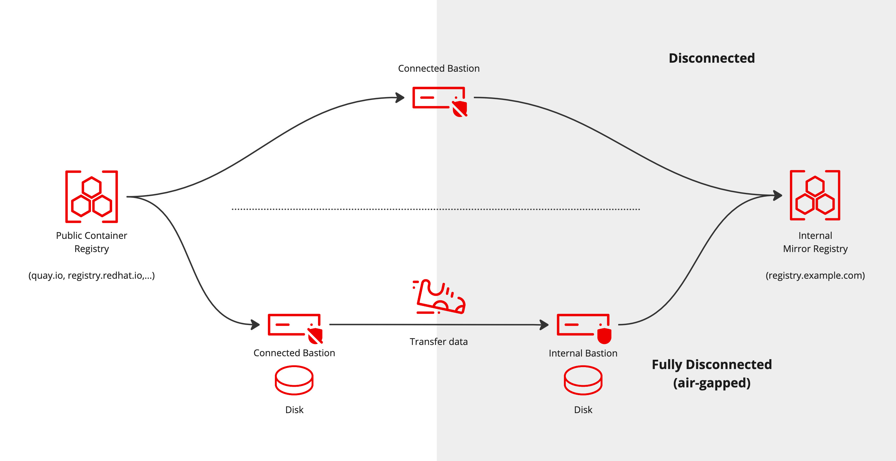
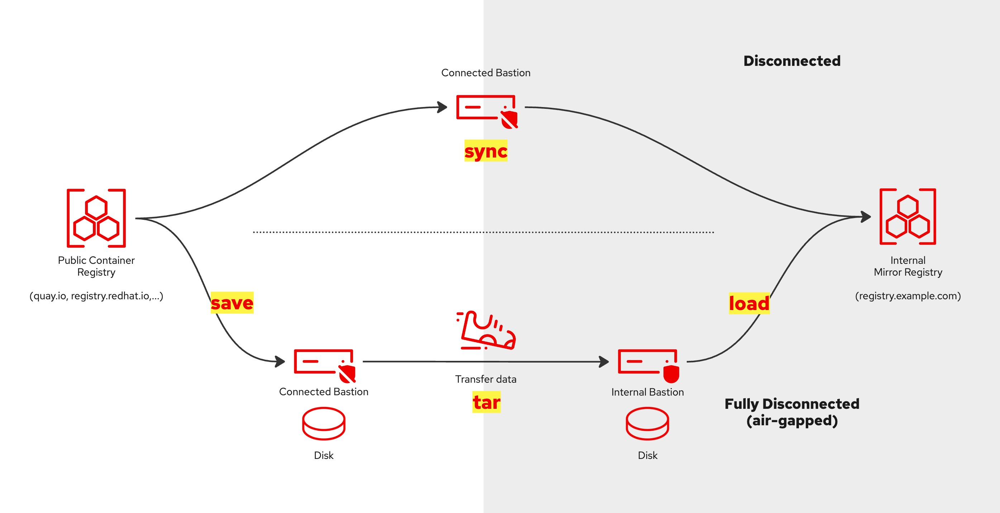
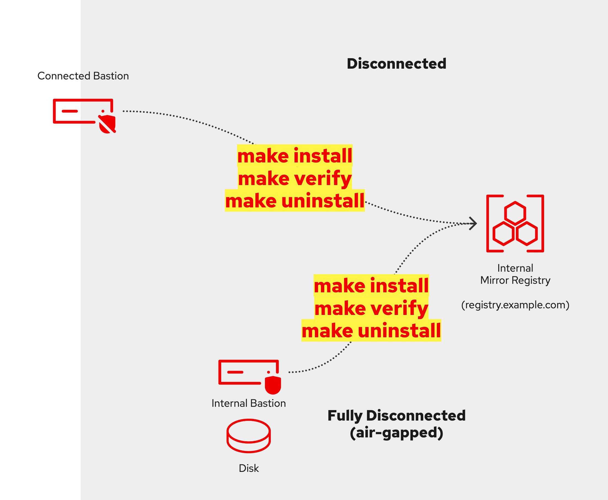
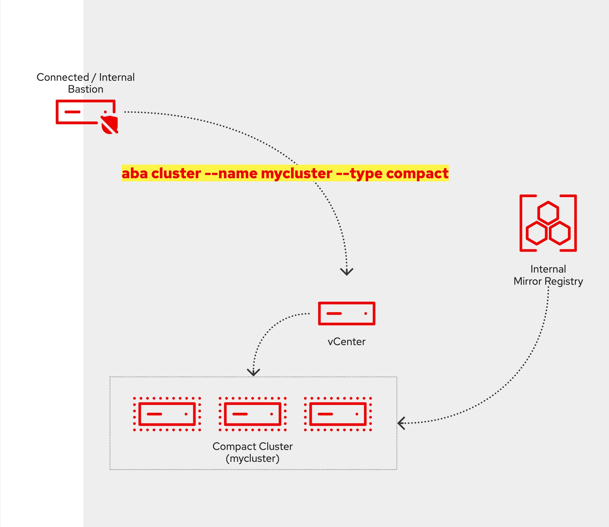
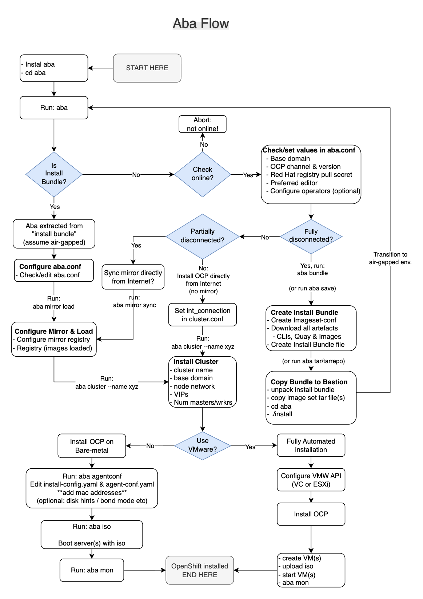

# Aba makes it easier to install your first OpenShift cluster in your air-gapped environment.

Easily install an OpenShift cluster - "Cluster Zero" - into a fully or partially disconnected environment, either onto bare-metal or VMware (vSphere/ESXi).
Because Aba is based on the [Agent-based installer](https://www.redhat.com/en/blog/meet-the-new-agent-based-openshift-installer-1) there is no need to configure a load balancer, a bootstrap node or even require DHCP.

>> **For Red Hatters, it is now possible to download ready made, up-to-date and tested Aba install bundles from: https://drive.google.com/drive/u/0/folders/1sO7_G3f8cU1Y7oeUwTib8_sqn8FM_LZQ**

## Who should use Aba?

Use Aba to quickly set up OpenShift in an air-gapped environment while letting it handle the heavy lifting for you.

1. [Aba Overview](#aba-overview)
1. [About installing OpenShift in a Disconnected Network](#about-installing-openshift-in-a-disconnected-network)
1. [Prerequisites](#prerequisites)
   1. [Fully Disconnected (Air-Gapped) Prerequisites](#fully-disconnected-air-gapped-prerequisites)
   1. [Partially Disconnected Prerequisites](#partially-disconnected-prerequisites)
   1. [Common Requirements for Both Environments](#common-requirements-for-both-environments)
1. [Start here](#start-here)
   1. [Partially disconnected Scenario](#partially-disconnected-scenario)
   1. [Fully disconnected (air-gapped) Scenario](#fully-disconnected-air-gapped-scenario)
1. [Installing OpenShift](#installing-openshift)
1. [Creating an install bundle with everything you need to install OpenShift in an fully disconnected (air-gapped) network](#Creating-a-bundle-archive-with-everything-you-need-to-install-OpenShift-in-a-fully-disconnected-air-gapped-network)
1. [Aba Flow Chart](#aba-flow-chart)
1. [About configuration files](#configuration-files)
1. [Customizing the Agent-based config files](#customizing-the-agent-based-config-files)
1. [Day 2 Operations](#day-2-operations)
1. [Feature Backlog and Ideas](#feature-backlog-and-ideas)
1. [Miscellaneous](#miscellaneous)
1. [Advanced](#advanced)
1. [Frequently Asked Questions (FAQ)](#frequently-asked-questions-faq)


<!-- [Download Demo Video](./images/aba-bundle-demo-v5-low.mp4) -->
[Download Demo Video](https://github.com/sjbylo/aba/raw/refs/heads/main/images/aba-bundle-demo-v5-low.mp4)


## Aba Overview

Aba helps you with the following and more:

1. Helps install your first OpenShift cluster, e.g. SNO (1-node), Compact (3-nodes), Standard (5+nodes).
1. Installs the Quay mirror registry appliance for you or makes use of your existing container registry.
1. Uses the registry's credentials and other inputs to generate the Agent-based configuration files.
1. Triggers the generation of the agent-based boot ISO.
1. Configures NTP during installation to prevent time synchronization issues caused by nodes with incorrect date and time settings
1. Optionally, creates the required VMs in ESXi or vSphere.
1. Monitors the installation progress.
1. Allows for adding more images (e.g. Operators) when synchronizing the mirror registry (day 1 or 2 operation).
1. Configures the OperatorHub integration with the mirror registry.
1. Can create an "archive bundle" containing all the files needed to complete a fully air-gapped installation.
1. Executes several workarounds, if needed, for some typical issues with disconnected environments.
1. Now works with oc-mirror v1 or v2!
1. Installs and integrates OpenShift Update Service (OSUS) to make upgrades a single-click.
1. Helps configure OpenShift with your NTP servers.
1. Enables graceful cluster shutdown and startup.
1. Allows for the modification of generated configuration files (image set & agent based), if more control is required. 

All commands and actions in Aba are *idempotent*.  If you hit a snag, fix it and try again should always be the right way forward!

<!--
## Quick Start Guide for the Impatient:

Run the following command to clone the Aba repository (https://github.com/sjbylo/aba.git) and install the aba command:

```
bash -c "$(gitrepo=sjbylo/aba; gitbranch=main; curl -fsSL https://raw.githubusercontent.com/$gitrepo/refs/heads/$gitbranch/install)"
```

Run Aba:

```
cd aba         # Change into Aba's top-level directory to run all commands
aba            # Let Aba guide you through the installation process
```
-->


## About installing OpenShift in a Disconnected Network




The diagram above illustrates two scenarios for installing OpenShift in a disconnected network environment.

- **Top Section**: The *Disconnected Scenario* (partial network access, e.g. via a proxy).
- **Bottom Section**: The *Fully Disconnected (Air-Gapped) Scenario* (data transfer only through physical means, such as "sneaker net" into a private data center).

Each scenario includes two main network zones:

- **Connected Network**: Located on the left side of the diagram, where external resources are accessible.
- **Private Network**: Located on the right side of the diagram, isolated from direct internet access.

Bastion Requirements

- **Connected Bastion**: Can be a workstation or virtual machine (VM) running on a laptop, configured with RHEL 8/9 or Fedora.
- **Internal Bastion**: Must be running RHEL 8/9 to support OpenShift installation in the private network.

These configurations ensure that each network zone meets OpenShift’s requirements for disconnected or fully air-gapped installations.


[Back to top](#who-should-use-aba)


## Prerequisites

### Fully Disconnected (Air-Gapped) Prerequisites

In a fully disconnected environment, where no internet access is available, two bastions are required: one connected to the internet and the other on the private network.

- **Connected Bastion or Workstation**
   - An x86 RHEL 8/9 or Fedora (e.g. VM) with internet access, typically on a laptop.
   - Clone or download this Git repository (https://github.com/sjbylo/aba.git) to any location in your home directory.
   - Download and store the Red Hat registry pull secret to `~/.pull-secret.json` (a pull secret can be downloaded from https://console.redhat.com/openshift/install/pull-secret).
   - Install required RPMs listed in `templates/rpms-external.txt` (or, if dnf is configured, let Aba use dnf to install the packages).
   - Run `sudo dnf update` to ensure all packages are up to date (optional).
   - Password-less sudo root access is recommended.
   - Aba has also been tested with root user.

- **Internal Bastion**
   - A RHEL 8/9 VM or host within your private, air-gapped network.
   - Install required RPMs as listed in `templates/rpms-internal.txt` (or, if dnf is configured, let Aba use dnf to install the packages).
   - Password-less sudo root access is recommended.
   - Aba has also been tested with root user.

### Partially Disconnected Prerequisites

In a partially disconnected environment, the internal network has limited or proxy-based internet access, allowing data synchronization directly.

- **Bastion**
   - A single RHEL 8/9 VM with internet access and connectivity to the private network.
   - Download and copy this Git repository to any location in your home directory on the bastion.
   - Download and store your Red Hat registry pull secret at `~/.pull-secret.json` (a pull secret can be downloaded from https://console.redhat.com/openshift/install/pull-secret).
   - Install required RPMs from `templates/rpms-internal.txt` (or, if dnf is configured, let Aba use dnf to install the packages).
   - Run `sudo dnf update` to ensure all packages are up to date (optional).
   - Password-less sudo root access is recommended.
   - Aba has also been tested with root user.

### Common Requirements for Both Environments

- **Registry Storage**
   - Minimum of 30 GB is required for OpenShift base images only, with additional Operators requiring more (500 GB or more is recommended).

- **Network Configuration**
   - **DNS**: Configure the following DNS A records which match the intended cluster name and base domain ('ocp1' and 'example.com' are just examples!):
      - **OpenShift API**: `api.ocp1.example.com` pointing to a free IP in the private subnet.
      - **OpenShift Ingress**: `*.apps.ocp1.example.com` (wildcard A record) pointing to a free IP in the private subnet.
      - **Mirror Registry**: `registry.example.com` pointing to the IP address of your internal mirror registry (or where Aba should install it).
      - *Note*: For Single Node OpenShift (SNO), configure both OpenShift API and Ingress records to point to the same IP.
   - **NTP**: An NTP server is recommended to ensure time synchronization across all nodes, as OpenShift requires synchronized clocks for installation and proper operation.

- **Platform**
   - **VMware vCenter or ESXi API Access (optional)**: Ensure sufficient privileges for OpenShift installation. Refer to [vCenter account privileges](https://docs.openshift.com/container-platform/4.17/installing/installing_vsphere/ipi/ipi-vsphere-installation-reqs.html#installation-vsphere-installer-infra-requirements_ipi-vsphere-installation-reqs) for specific permissions, in the [OpenShift documentation](https://docs.openshift.com/container-platform/latest).
   - For bare-metal installations, manually boot the nodes using the generated ISO file.

- **Registry**
   - If using an existing registry, add its credentials (pull secret and root CA) in the `mirror/regcreds` directory:
      - `mirror/regcreds/pull-secret-mirror.json`
      - `mirror/regcreds/rootCA.pem`

After configuring these prerequisites, run `aba` to start the OpenShift installation process.

Note: that Aba also works in connected environments without a private mirror registry, e.g. by accessing public container registries via a proxy.  To do this, configure the proxy values in `cluster.conf`.


[Back to top](#who-should-use-aba)


## Start here

Installing Aba:

### Method 1: Install Aba in one command

```
bash -c "$(gitrepo=sjbylo/aba; gitbranch=main; curl -fsSL https://raw.githubusercontent.com/$gitrepo/refs/heads/$gitbranch/install)"
```

```
cd aba
aba          # Let Aba guide you through the installation process
```

### Method 2: Install Aba using 'git clone'

```
git clone https://github.com/sjbylo/aba.git
cd aba
./install
aba          # Let Aba guide you through the installation process
```
- clones the repository, installs `aba` and configures some high-level settings, e.g. OpenShift target version, your domain name, machine network CIDR etc (if known).
- If needed, add any required operators to the `aba.conf` file by setting 'op_sets' and/or 'ops' values.
- helps you decide the method of deployment and how you should proceed.

Note that 'aba' will create the `aba.conf` file which contains some values that you *must change*, e.g. your preferred platform, your domain name, your network address (if known) and any operators you will require etc.

Now, continue with either 'Disconnected scenario' or 'Fully disconnected (air-gapped) scenario' below.

<!--
```
aba mirror
```
- configures and connects to your existing container registry OR installs a fresh quay appliance registry.

```
aba sync
```
- copies the required images directly to the mirror registry (for partially disconnected environments, e.g. via a proxy).
- Fully disconnected (air-gapped) environments are also supported with `aba save` and `aba load` (see below).

```
aba cluster --name mycluster --type sno [--starting-ip <ip>] [--api-vip <ip>] [--ingress-vip <ip>]
```
- creates a directory `mycluster` and the file `mycluser/cluster.conf`.
- Edit/verify the `mycluster/cluster.conf` file.
- Note that any topology of OpenShift is supported, e.g. sno (1), compact (3), standard (3+n).

```
cd mycluster
aba
```
- creates the Agent-based config files, generates the Agent-based iso file, creates and boots the VMs (if using VMware).
- monitors the installation progress.

```
aba day2
```
- configures OpenShift to access the internal registry ready to install from the Operators Hub.

```
aba help
```
- shows what other commands are available.

-->


[Back to top](#who-should-use-aba)


### Partically disconnected Scenario

In this scenario, the connected bastion has access to both the Internet and the private subnet (but not necessarily at the same time).




```
aba sync
```
This command will:
  - trigger `aba mirror` (to configure the mirror registry), if needed.
    - for an existing registry, check the connection is available and working (be sure to set up your registry credentials in `mirror/regcreds/` first! See above for more).
    - or, installs Quay registry on the connected bastion (or remote host) and copies the generated pull secret and certificate into the `mirror/regcreds` directory for later use.
  - pull images from the Internet and store them in the registry.

```
aba download
```
  - *Optionally* download the CLI binaries into the aba/cli dir.  Note: This is only required if you intend to sever the Internet connection before installing OpenShift.

Now continue with "Installing OpenShift" below.

Note that the above 'disconnected scenario' can be repeated, for example to download and install Operators as a day 2 operation or to upgrade OpenShift, by updating the `sync/imageset-sync.yaml` file and running `aba sync/day2` again.


[Back to top](#who-should-use-aba)

### Fully disconnected (air-gapped) Scenario

**Please note that it is now recommended to use the above `aba bundle` command to initiate a fully air-gapped installation which will complete the below for you.**

>> **For Red Hatters, it is now possible to download ready made, up-to-date and tested Aba install bundles from: https://drive.google.com/drive/u/0/folders/1sO7_G3f8cU1Y7oeUwTib8_sqn8FM_LZQ**

In this scenario, your connected workstation has access to the Internet but no access to the private network.
You also require a bastion in a private subnet.

```
aba save
```

- pulls the images from the Internet and saves them into the local directory "mirror/save". Make sure there is enough disk space (30+ GB or much more for Operators)!

Then, using one of `aba inc/tar/tarrepo` (incremental/full or separate copies), copy the whole aba/ repository (including templates, scripts, images, CLIs and other install files) to your internal bastion (in your private network) via a portable storage device, e.g. a thumb drive.

Example:

```
# On the connected workstation:
# Mount your thumb drive and:

aba inc                                          # Write tar archive to /tmp
or
aba inc out=/dev/path/to/thumb-drive/aba.tgz     # Write archive 'aba.tgz' to the device
                                                  # mounted at /dev/path/to/thumb-drive
or
aba inc out=- | ssh user@host "cat > aba.tgz"    # Archive and write to internal host (if possible).

# Copy the file 'aba.tgz' to your bastion via your portable storage device.

# Then, on the bastion run:
tar xvf aba.tgz                                   # Extract the tar file. Ensure file timestamps are
                                                  # kept the same as on the connected workstation.
cd aba
./install
aba
```

For such cases where it is not possible to write directly to a portable storage device, e.g. due to restrictions or access is not possible, an alternative command can be used.

Example:

```
aba tarrepo out=/dev/path/to/drive/aba.tgz
```
- Write archive `aba.tgz` to the device mounted at /dev/path/to/drive, EXCEPT for the `seq#` tar files under save/
- The `seq#` tar file(s) in the "mirror/save" directory and the repository tarball `aba.tgz` can be copied separately to a storage device, e.g. USB stick, S3 or other.

Copy the "aba.tgz" file to the bastion and unpack the archive. Note the directory "aba/mirror/save".
Copy or move the "seq" tar file(s), as is, from the "mirror/save" directory to the  bastion, into the "mirror/save" directory on the bastion.

```
sudo dnf install make -y     # If dnf does not work in the private environment (i.e. no Satalite),
                             # ensure all required RPMs are pre-installed, e.g. from a DVD drive at the time of installation.
aba load
```
- will (if required) install Quay (from the bundle archive) and then load the images into Quay.
- Required RPMs:
  - Note that the bastion will need to install RPMs from a suitable repository (for Aba testing purposes it's possible to configure `dnf` to use a proxy).
  - If RPMs cannot be installed with "sudo dnf install", then ensure the RPMs are pre-installed, e.g. from a DVD at the time of RHEL installation.
  - If rpms are not readily available in your private network, the command `aba rpms` can help by downloading the required rpms, which can then be copied to the bastion and installed with `dnf localinstall rpms/*.rpm`.  Note this will only work if your external bastion and internal bastions are running the exact same version of RHEL (at least, that was the experience when testing!).

Now continue with "Installing OpenShift" below.

Note that the above 'air-gapped workflow' can be repeated in the *exact same way*, for example to incrementally install Operators or download new versions of images to upgrade OpenShift.

For example, by:
- editing the `save/imageset-save.yaml` file on the connected workstation to add more images or to fetch the latest images
- running `aba save`
- running `aba inc` (or aba tar or aba tarrepo) to create an install bundle (see above)
- unpacking the tar archive on the bastion
- running `aba load` to load the images into the internal registry.

Note that generated 'image sets' are sequential and must be pushed to the target mirror registry in order. You can derive the sequence number from the file name of the generated image set archive file in the mirror/save directory.




[Back to top](#who-should-use-aba)


## Installing OpenShift




```
cd aba
aba cluster --name mycluster [--type sno|compact|standard] [--step xyz] [--starting-ip <ip>] [--api-vip <ip>] [--ingress-vip <ip>]
```
- creates and initializes a directory `mycluster` (you should name the directory with the same name of your cluster),
- prompts you to run `aba` inside the directory. The most useful 'steps' are 'agentconf', 'iso' and 'mon'.

<!--
- Note, *all* advanced preset parameters in the 'shortcuts.conf' configuration file must be completed for the "--type" option to take affect.
-->

Once the nodes have booted from the iso the following command should be run to monitor the progress of the installation. For example:

```
cd <cluster dir>     # e.g. cd mycluster
aba mon
```

<!--Get help with `aba -h`.-->

After OpenShift has been installed you will see the following output:

```
INFO Install complete!
INFO To access the cluster as the system:admin user when using 'oc', run
INFO     export KUBECONFIG=/home/steve/aba/compact/iso-agent-based/auth/kubeconfig
INFO Access the OpenShift web-console here: https://console-openshift-console.apps.compact.example.com
INFO Login to the console with user: "kubeadmin", and password: "XXYZZ-XXYZZ-XXYZZ-XXYZZ"

The cluster has been successfully installed.
Run '. <(aba shell)' to access the cluster using the kubeconfig file (x509 cert), or
Run '. <(aba login)' to log into the cluster using the 'kubeadmin' password.
Run 'aba help' for more options.

```
You can get access to the cluster using one of the commands:

```
. <(aba shell)
oc whoami
```
- provides access via the kubeconfig file.

```
. <(aba login)
oc whoami
```
- provides access via "oc login".


You can run commands against the cluster, e.g. to show the installation progress:

```
watch aba --cmd "get co"
```

If you want to create the agent-based config files, e.g. to make changes to `install-config.yaml` and `agent-config.yaml`, use:

```
cd mycluster
aba agentconf
# then, if needed,  manually edit the 'agent-config.yaml' file to set the appropriate mac addresses matching your bare-metal nodes, change drive and net interface hints etc.
```

If you want to create the agent-based iso file, e.g. to boot bare-metal nodes, use:

```
cd mycluster
aba iso
# boot the bare-metal node(s) with the generated ISO file.
# This can be done using a USB stick or via the server's remote management interfaces (BMC etc).
aba mon
```

If OpenShift fails to install, see the [Troubleshooting](Troubleshooting.md) readme.

Other examples of commands (aba <command>):

cd mycluster     # change to the directory with the agent-based install files, using `mycluster` as an example.

| Target | Description |
| :----- | :---------- |
| `aba day2`        | Integrate the private mirror into OpenShift. |
| `aba ls`          | Show list of VMs and their state. |
| `aba startup`     | Gracefully start up a cluster |
| `aba shutdown`    | Gracefully shut down (or hibernate) a cluster. `aba shutdown --wait` wait for power-off |
| `aba start`       | Power on all VMs |
| `aba stop`        | Gracefully shut down all VMs (guest shutdown only!) |
| `aba poweroff `   | Power off all VMs immediately |
| `aba kill`        | Same as `poweroff` |
| `aba create`      | Create all VMs  |
| `aba refresh`     | Delete, re-create and boot the VMs causing the cluster to be re-installed. |
| `aba delete`      | Delete all the VMs  |
| `aba login`       | Display the `oc login` command for the cluster.  Use: . <(aba login)  |
| `aba shell`       | Display the command to access the cluster using the kubeconfig file.  Use: . <(aba shell) |
| `aba help`        | Help is available in all Makefiles (in `aba/Makefile`,  `aba/mirror/Makefile`,  `aba/cli/Makefile` and `aba/<mycluster>/Makefile`)  |


[Back to top](#who-should-use-aba)

## Creating an install bundle with everything you need to install OpenShift in a fully disconnected (air-gapped) network

Do you need to download a set of images and CLI tools to install OpenShift into a fully disconnected (air-gapped) network?

Here is how you can use Aba to create a `bundle archive` to do that!

Store your pull secret in this file:

```
~/.pull-secret.json
```

Run these commands on a RHEL 8/9 or Fedora VM:

```
git clone https://github.com/sjbylo/aba.git
cd aba
./install
```

Connect a large USB media stick (or other device) to your VM and write the `bundle archive` to it:

Set the version oc OpenShift you want to install:
```
v=4.17.16
```

Note: It is recommended to run `aba bundle` on a fresh install of Aba or use the --force flag to overwrite any pre-existing files under aba/mirror/save. 

Create the bundle archive with this single command:
```
aba bundle \
    --pull-secret "~/.pull-secret.json" \
    --channel stable \
    --version $v \
    --op-sets ocp odf \
    --ops web-terminal devworkspace-operator \
    --base-domain example.com \
    --machine-network 10.0.0.0/20 \
    --dns 10.0.1.8 \
    --ntp 10.0.1.8 ntp.example.com \
    --platform bm \
    --force \
    --out - | split -b 10G - /path/to/your/large/portable/media/ocp_mycluster_${v}_
```

- This will output several 10GB archive files named ocp_mycluster_4.17.16_aa|ab|ac... etc.
- Depending on the channel chosen, the OpenShift version can be set to the most recent 'previous' point version (using '--version p').
- If needed, --op-sets refers to predefined sets of operators, as defined in the files `templates/operator-set-*`.
- If needed, add individual operators after "--ops".
- If known, values --domain, --machine-network, --dns and --ntp should be set (otherwise these values must be set in aba.conf on the internal bastion).
- Set the target --platform, either `bm` (bare-metal) or `vmw` (vSphere or ESXi). 
- Once the `aba bundle` command completes be sure there were no errors and verify the files are complete, e.g. with the command: `cat ocp_mycluster_4.17.16_* | tar tvf -`.
- Generate checksums for the files, e.g. `cksum ocp_mycluster_4.17.16_*`.  It is important that the files are not damaged or incomplete in any way!
- Warning: --force will overwrite any image set files already under aba/mirror/save!


Copy the files to your RHEL 8/9 internal bastion within the private internal network.

Verify the files are intact by comparing the checksum values with the original files:

```
cksum ocp_mycluster_4.17.16_*
```

Extract the bundle archive:

```
cat /path/to/ocp_mycluster_4.17.16_* | tar xvf -
cd aba
./install
aba         # Run aba and follow the instructions
```

Note: You will find the large image set tar file under `aba/mirror/save`.

You can now install the Quay mirror registry to localhost and then load it with images using the following command (see below for more details):

```
aba mirror -H registry.example.com load --retry 3
```

To install OpenShift run the following command and follow the instructions (see below for more details):

```
aba cluster --name mycluster --type compact [--starting-ip <ip>] [--api-vip <ip>] [--ingress-vip <ip>]
```

[Back to top](#who-should-use-aba)

## Aba Flow Chart

This chart explains the flow of Aba and how Aba works, showing the main choices: air-gapped, partially disconnected, connected and installation on VMW or bare-metal. 



[Back to top](#who-should-use-aba)

## About configuration files

| Config file | Description |
| :---------- | :---------- |
| `aba/aba.conf`                    | the 'global' config, used to set the target version of OpenShift, your domain name, private network address, DNS IP etc |
| `aba/mirror/mirror.conf`          | describes your private/internal mirror registry (either existing or to-be-installed)  |
| `aba/`cluster-name`/cluster.conf` | describes how to build an OpenShift cluster, e.g. number/size of master and worker nodes, ingress IPs, bonding etc |
| `aba/vmware.conf`                 | vCenter/ESXi access configuration using `govc` CLI (optional) |


[Back to top](#who-should-use-aba)

## Customizing the Agent-based config files

- Once a cluster config directory has been created (e.g. `compact`) and Agent-based configuration has been created, changes can be made to the `install-config.yaml` and `agent-config.yaml` files if needed. `aba` can be run again to re-create the ISO and the VMs etc (if required).  Aba should see the changes and try to preserve and use them.  Simple changes to the files, e.g. IP/Mac address changes, default route changes, adding disk hints etc work fine.

The workflow could look like this:
```
aba cluster --name mycluser --step agentconf       # Create the cluster dir and Makefile & generate the initial agent config files.
cd mycluster
# Now manually edit the generated `install-config.yaml` and `agent-config.yaml` files (where needed, e.g. bare-metal mac addresses) and
# start cluster installation:
aba
```

The following script can be used to extract the cluster config from the agent-config yaml files. This script can be run to check that the correct information can be extracted to create the VMs (if required).

Example:

```
cd sno
scripts/cluster-config.sh        # example execution to show the cluster configuration extracted from the Agend-based config files.
```

As an example, edit agent-config.yaml to include the following to direct agent-based installer to install RHCOS onto the 2nd disk, e.g. /dev/sdb:

```
    rootDeviceHints:
      deviceName: /dev/sdb
```

or, adding vSphere integration into `install-config.yaml` (works from the OpenShift Console on day 2, with v4.14 and below) - Note, this is completed automatically now if you are deploying on vSphere or ESXi.

```
platform:
  vsphere:
    apiVIP: "10.0.1.216"
    ingressVIP: "10.0.1.226"

```

Check `cluster-config.sh` is able to parse all the data it needs to create the agent config files (and the VMs, if needed):

```
scripts/cluster-config.sh        # example execution to show the cluster configuration extracted from the agend-based files.
```

Run aba again to rebuild the agent-based ISO. You should boot the bare-metal servers with the iso file, e.g.:

```
aba
...
aba iso
...
aba mon
```

[Back to top](#who-should-use-aba)


## Day 2 Operations

Once your OpenShift cluster is installed using Aba, there are several recommended "Day 2" tasks to finalize configuration and ensure cluster health.

Start with:
```
aba info
```
This displays access information for your cluster, including OpenShift Console URL, kubeadmin credentials, and next-step guidance.

### 1. Connect OperatorHub to Internal Mirror Registry

```
aba day2
```
Configures OpenShift to use your internal mirror registry for OperatorHub, ensuring it works even in disconnected environments.

### 2. Synchronize NTP Across Cluster Nodes

```
aba day2-ntp
```
Ensures all nodes are connected to NTP servers. Time drift can cause OpenShift installation or operation to fail.

### 3. Enable OpenShift Update Service (OSUS)

```
aba day2-osus
```
Configures OpenShift to receive updates via your internal mirror. Useful for enabling controlled cluster upgrades in disconnected setups.

**NOTE:** The `cincinnati-operator` must be available in the mirror for OSUS to work.

### 4. Login and Verify Cluster State

#### Option A: Use kubeadmin credentials
```
aba login
```
- Logs into OpenShift using the `oc` CLI.

Alternatively, you can try
```
. <(aba login)
```
This just means the output of `aba login` gets executed in the shell as if you typed the command yourself.

#### Option B: Use kubeconfig export
```
. <(aba shell)
```
- Sets the `KUBECONFIG` environment variable.
- To confirm cluster status and operator health, you can now run:
```
oc whoami
watch -n 5 oc get co
```


[Back to top](#who-should-use-aba)


## Feature Backlog and Ideas

- Configure ACM (if installed) to be ready to install clusters from the mirror registry.

- Configure htpasswd login, add users, disable kubeadmin.

- Use PXE boot as alternative to ISO upload.

- Enable aba to work in a container (this has been partially implemented, see below)

- ~~Assist in adding OpenShift Update Service (OSUS) to the cluster.~~

- ~~Support bonding and vlan.~~

- ~~Make it easier to integrate with vSphere, including storage.~~

- ~~Disable public OperatorHub and configure the internal registry to serve images.~~

- ~~Make it easier to populate the imageset config file with current values, i.e. download the values from the latest catalog and insert them into the image set archive file.~~


[Back to top](#who-should-use-aba)


## Miscellaneous

- oc-mirror v2 is now also supported by aba . To change oc-mirror's default cache location (~/.oc-mirror), export the OC_MIRROR_CACHE environment variable to a path with sufficient disk space, e.g.:

```
export OC_MIRROR_CACHE=/path/to/big-drive
```

- By default, aba sets the cache location (OC_MIRROR_CACHE) and temporary directory (TMPDIR) under the path defined by reg_root in mirror/mirror.conf. You can override these locations by exporting the environment variables, as shown above.

- You can list the dependent images of operators using this script: scripts/listopdeps.sh 4.18 odf-operator

- If you want to install workers with different CPU/MEM sizes (which can be used to install Operators, e.g. Ceph, ODF, ACM etc, on infra nodes), change the VM resources (CPU/RAM) as needed after OpenShift is installed (if using VMs).

- Govc is used to create and manage VMs on ESXi or vSphere.
  - https://github.com/vmware/govmomi/tree/main/govc

Be sure to set the correct (govc) values to access vCenter in the `vmware.conf` file.  Note that ESXi is also supported.

Aba uses `make` to define and process all dependencies.  Due to this, Aba will usually know what to do next, so just run `aba` again.

Why `make` was chosen to build Aba?

The UNIX/Linux command "make" is a utility for automating tasks based on rules specified in a Makefile. It enhances efficiency by managing dependencies,
facilitating streamlined processes. Widely applied beyond software development, "make" proves versatile in system management, ensuring organized
execution of diverse tasks through predefined rules!

- How to clean up and remove aba

Run on the internal bastion:
```
cd aba
aba uninstall    # uninstall the registry (if needed)
cd ..
rm -rf aba
sudo rm $(which aba)
```

Run on the external bastion or laptop:

```
rm -rf aba
sudo rm $(which aba)
# re-install aba
bash -c "$(gitrepo=sjbylo/aba; gitbranch=main; curl -fsSL https://raw.githubusercontent.com/$gitrepo/refs/heads/$gitbranch/install)"
cd aba
./install
aba
```

[Back to top](#who-should-use-aba)


## Advanced

- **Aba now runs in a containerized environment (partial support):**
  - Tested on Mac M1 (`arm64`) with successful results.
  - You can run Aba in a container, for example:
    ```bash
    docker run -it --rm --name centos9 quay.io/centos/centos:stream9
    ```
  - Aba can:
    - Connect to an existing remote registry (installation of a new registry (from) inside the container is not yet supported).
    - Access public registries over the Internet (directly or through a proxy).
    - Generate an `arm64` ISO image suitable for OpenShift installation on `arm64` systems.

- **Tested Use Case:**
  - ISO generated from within the container was successfully used to install OpenShift on an M1 Mac using VMware Fusion.


<!--
### You need more control with your mirror registry folders?

You can gain more control over the mirror registry folders and the storage locations for different types of images by following these instructions.

Create an image set archive file for the OpenShift release images:

```
aba save \
    --channel stable \
    --version latest \
    --op-sets \
    --ops \
    --base-domain example.com \
    --machine-network 10.0.0.0/20 \
    --dns 10.0.1.8 \
    --ntp 10.0.1.8 ntp.example.com \
    --platform bm
```
- Removes any operators defined in aba.conf (--op-sets and --ops).
- Saves only release images into a single image set archive file under `aba/mirror/save`.
- Note: options --base-domain, --machine-network, --dns, --ntp, --platform are optional and *should be used* if the values are already known for the internal env.

Copy the image set archive file containing the OpenShift release images to your internal bastion (into aba/mirror/save).

Load (diskToMirror) the operator images to your mirror registry using your desired path:
```
aba load --reg-path ocp4/openshift4
```

Next create an image set archive file for the required operators:
```
aba save \
    --op-sets ocp odf ocpv acm \
    --ops web-terminal
```
- Saves operator images from pre-defined sets of operators (e.g. ocp odf ocpv acm) and individual operators (e.g. web-terminal) to a 2nd image set archive file under `aba/mirror/save`.

Copy the image set archive file containing the operator images to your internal bastion (into aba/mirror/save).

Ensure your mirror registry has been configured.  If not already, run `aba mirror` on your internal bastion to set up your mirror registry.

Verify access to your mirror registry:

```
cd mirror
aba verify
```

Load (diskToMirror) the images to your mirror registry using your desired path:
```
aba load --reg-path ocp4/operators
```
-->


### Cluster presets are used mainly to automate the testing of Aba.

```
aba sno
```
- This will create a directory `sno` and then install SNO OpenShift using the Agent-based installer (note, *all* preset parameters in `shortcut.conf` must be completed for this to work).  If you are using VMware the VMs will be created for you.
- Be sure to go through *all* the values in `aba/vmware.conf` and `sno/cluster.conf`.
- Be sure your DNS entries have been set up in advance. See above on Prerequisites.
- Aba will show you the installation progress.  To troubleshoot cluster installation, run `aba ssh` to log into the rendezvous node. If there are any issues - e.g. incorrect DNS records - fix them and try again.  All commands and actions in Aba are idempotent.  If you hit a problem, fix it and try again should always be the right way forward!

```
aba compact    # for a 3 node cluster topology (note, *all* parameters in 'aba.conf' must be completed for this to work).
aba standard   # for a 3+2 topology (note, *all* parameters in 'aba.conf' must be completed for this to work).
```
- Run this to create a compact cluster (works in a similar way to the above).

### To install aba from the dev branch run the following:

```
bash -c "$(gitrepo=sjbylo/aba; gitbranch=dev; curl -fsSL https://raw.githubusercontent.com/$gitrepo/refs/heads/$gitbranch/install)" -- dev
```

[Back to top](#who-should-use-aba)


## Frequently Asked Questions (FAQ)

**Q: Does Aba know what packages to install beforehand?**  

**Yes.** Aba uses predefined package lists depending on whether you're in a connected or air-gapped environment:
- External bastion: `templates/rpms-external.txt`
- Internal bastion: `templates/rpms-internal.txt`  

You can let Aba install them automatically (if `dnf` is configured) or install them manually using the package lists.

---

**Q: Can Aba run inside a container?**  

**Preferably, run Aba in a RHEL 8 or 9 VM.** Aba has been officially tested on x86 RHEL 8/9 systems (VM or physical). However, there are no hard limitations that prevent you from experimenting with containerized execution. Just be aware of storage, permission, and tool compatibility caveats. For example, installing Quay or managing certain system-level dependencies might not work.

---

**Q: Does Aba support ARM?**

**Yes.** Aba is developed and validated for x86_64 architecture, but running on ARM is also supported. You can have a RHEL ARM or CentOs Stream Instance as the bastion.

---

**Q: How much disk space do I need when using Aba?**  

**Minimum:** 30GB for OpenShift base images only.  
**Recommended:** 500GB–1TB if you plan to include Operators, additional CLI tools, or create full bundle archives.

---

**Q: Can I install Operators from community catalogs (outside Red Hat)?**  

**Not directly.** Aba currently supports Red Hat’s official catalog via `oc-mirror`. If you want Operators from external/community catalogs:
- You will need to manually fetch and mirror those images
- Update `imageset-save.yaml` or `imageset-sync.yaml` with correct image references

**NOTE:** *This is an advanced scenario and may break compatibility if the catalogs are not OCI-compliant.*

---

**Q: Where are cluster types (SNO, compact, standard) configured?**  

These are set during cluster creation using:
```
aba cluster --name mycluster --type sno|compact|standard
```
The following parameters and values in cluster.conf are used to set the cluster topology:
1. num_masters
2. num_workers


[Back to top](#who-should-use-aba)
