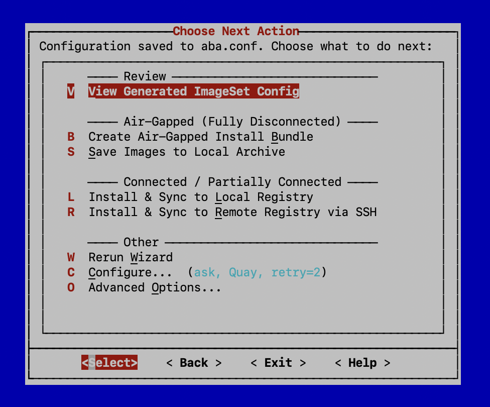
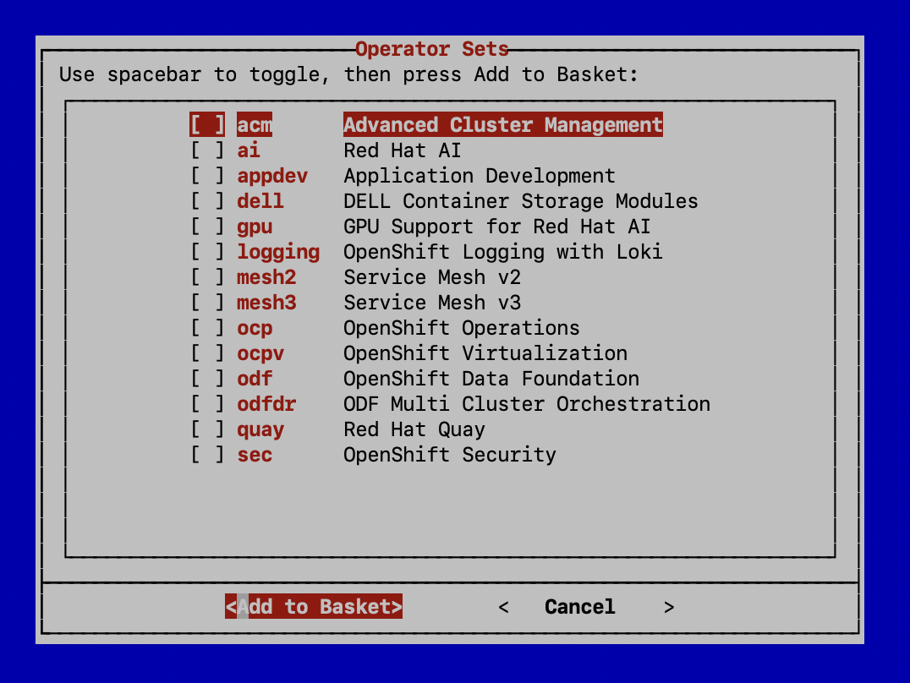
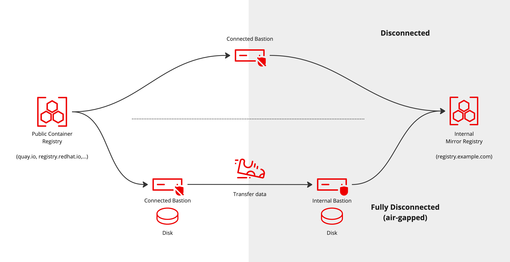
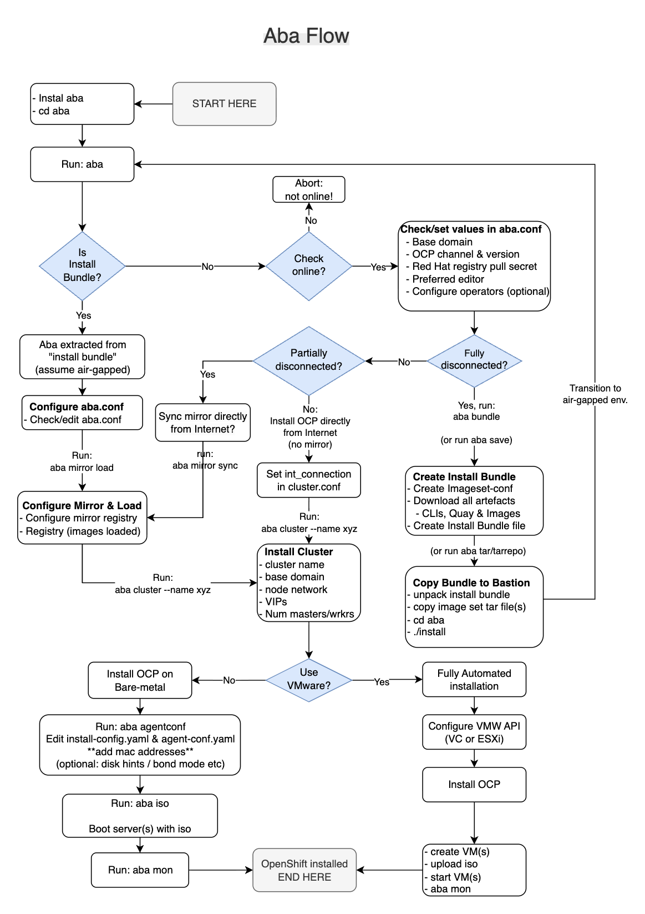
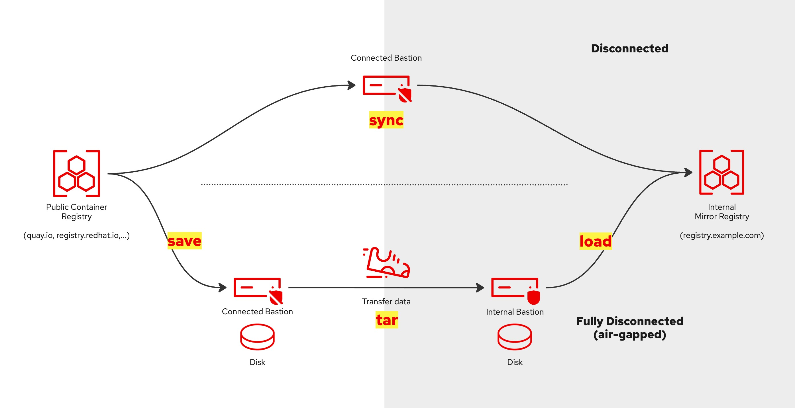
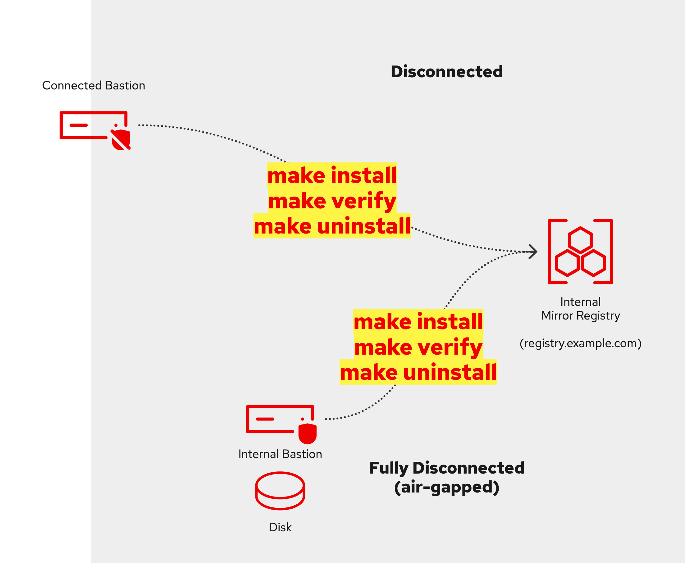
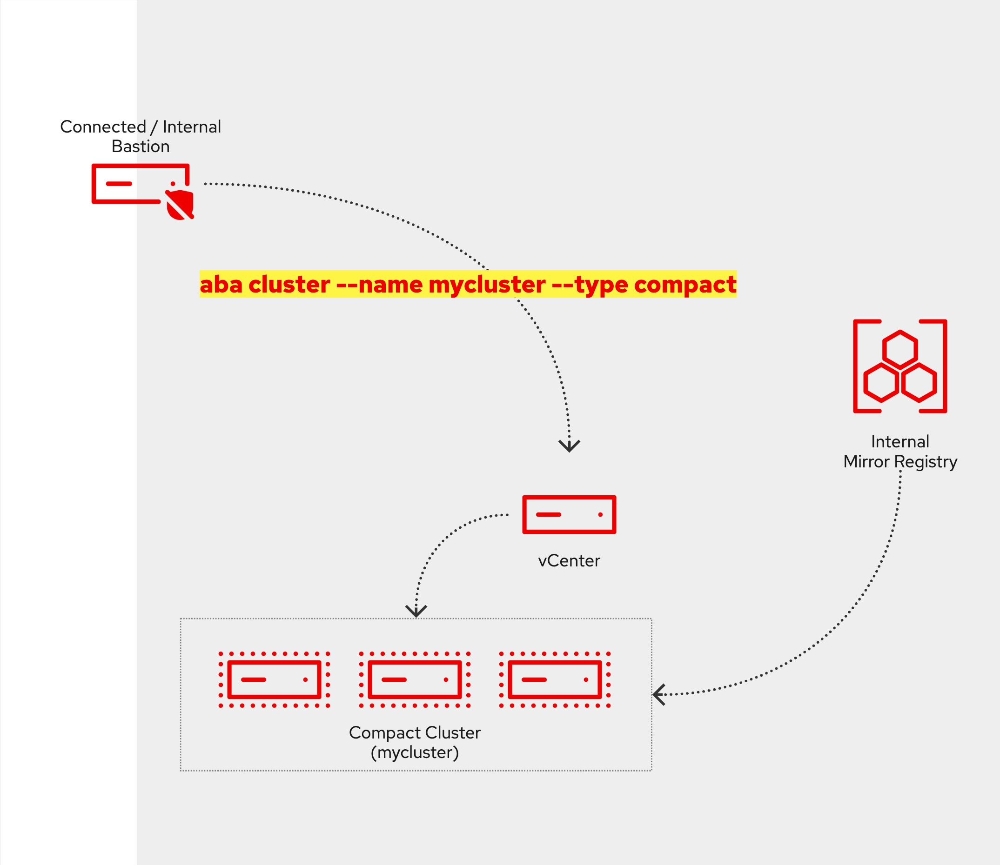

<!--
  IMPORTANT: This file contains HTML anchors (<a id="...">) that serve as stable
  permalink targets for external articles. Do NOT remove or rename them — doing so
  will break inbound links. Each anchor has an inline "this is a perma-link" comment
  explaining its source.

  Sources that link here:
    - Red Hat Developers blog (Oct 2025):
      https://developers.redhat.com/articles/2025/10/14/simplify-openshift-installation-air-gapped-environments
      Links to: #day-2-operations, #common-prerequisites-for-both-environments,
      #existing-registry-prerequisites, #internal-bastion-prerequisites
    - Bundle maker README_FIRST.md (located in the install bundle archives under
      the top-level directory, e.g. aba/README_FIRST.md):
      Links to: #downloading-an-install-bundle, #creating-a-custom-install-bundle

  Other anchors (#partially-disconnected-scenario, #fully-disconnected-air-gapped-scenario,
  #installing-openshift, #how-to-customize-the-agent-based-configuration-files,
  #enable-openshift-update-service-osus, #advanced-use, #frequently-asked-questions-faq)
  are kept for backward compatibility with any shared or bookmarked URLs.
-->

# ABA — Install OpenShift in Disconnected Environments <!-- omit in toc -->

Quickly install an OpenShift cluster into a fully or partially disconnected environment, on bare-metal, VMware (vSphere/ESXi), or KVM (libvirt).
ABA integrates several [Red Hat preferred methods and tools](https://docs.redhat.com/en/documentation/openshift_container_platform/latest/html/disconnected_environments/about-disconnected-environments#preferred-methods_about-disconnected-environments) into a single workflow.
It simplifies image mirroring for disconnected environments and provides the essential Day-2 capabilities needed to make an air-gapped OpenShift environment fully usable.

Because ABA is based on the [Agent-based installer](https://www.redhat.com/en/blog/meet-the-new-agent-based-openshift-installer-1), no load balancer, bootstrap node, or DHCP is required.

> **Download ready-made ABA install bundles from: [https://red.ht/disco-easy](https://red.ht/disco-easy) (requires Google account)**

<div align="center">
&nbsp;&nbsp;
<br><sub>The ABA TUI — a guided wizard for the complete OpenShift installation workflow (<code>abatui</code>)</sub>
</div>

# Quick Start

```bash
bash -c "$(gitrepo=sjbylo/aba; gitbranch=main; curl -fsSL https://raw.githubusercontent.com/$gitrepo/refs/heads/$gitbranch/install)"
cd aba
aba          # Interactive mode — ABA guides you through the entire workflow
```

Or use the TUI wizard for a guided experience: `abatui`

That's it. ABA will prompt you for your OpenShift version, operators, registry type, and deployment scenario.

> **Prerequisites:** RHEL 8/9 or Fedora, root or passwordless sudo, Internet access, and a Red Hat pull secret at `~/.pull-secret.json` ([download here](https://console.redhat.com/openshift/install/pull-secret)). See the full [Prerequisites](#prerequisites) section for details.

**Contents** <!-- omit in toc -->

- [Quick Start](#quick-start)
- [What ABA Does](#what-aba-does)
- [Install Bundles](#install-bundles)
- [Install ABA](#install-aba)
- [Partially Disconnected Installation](#partially-disconnected-installation)
- [Air-Gapped Installation](#air-gapped-installation)
  - [Custom Bundles](#custom-bundles)
  - [Light Bundles](#light-bundles-when-disk-space-or-portable-media-is-limited)
- [Installing a Cluster](#installing-a-cluster)
  - [Pre-flight Validation](#pre-flight-validation)
  - [Customizing Install Configuration](#customizing-install-configuration)
  - [Embedding Custom Manifests (Day-0)](#embedding-custom-manifests-day-0)
- [Day-2 Operations](#day-2-operations)
  - [Login and Verify Cluster State](#login-and-verify-cluster-state)
  - [Adding Operators to the Mirror Registry](#adding-operators-to-the-mirror-registry)
  - [Connect OperatorHub to Internal Mirror Registry](#connect-operatorhub-to-internal-mirror-registry)
  - [Custom Manifests for Day-2](#custom-manifests-for-day-2)
  - [Synchronize NTP Across Cluster Nodes](#synchronize-ntp-across-cluster-nodes)
  - [Cluster Updates (OSUS)](#cluster-updates-osus)
  - [Cluster Shutdown & Startup](#cluster-shutdown--startup)
- [Prerequisites](#prerequisites)
  - [Common Requirements](#common-requirements)
  - [Air-Gapped Prerequisites](#air-gapped-prerequisites)
  - [Partially Disconnected Prerequisites](#partially-disconnected-prerequisites)
  - [Connected Installation (No Mirror)](#connected-installation-no-mirror)
- [Command Reference](#command-reference)
- [Advanced Topics](#advanced-topics)
  - [Named Mirror Directories (Enclaves)](#named-mirror-directories-enclaves)
  - [Supported Architectures](#supported-architectures)
  - [Running ABA in a Container](#running-aba-in-a-container)
  - [Sigstore Signature Handling](#sigstore-signature-handling)
  - [Prompt Control](#prompt-control)
  - [User Configuration](#user-configuration)
  - [How Make Drives ABA](#how-make-drives-aba)
  - [Externalized State (`~/.aba/`)](#externalized-state-aba)
  - [Installing RPMs](#installing-rpms)
  - [Pre-release Versions (RC / EC)](#pre-release-versions-rc--ec)
  - [Installing from the Dev Branch](#installing-from-the-dev-branch)
  - [Uninstalling ABA](#uninstalling-aba)
- [FAQ](#faq)
  - [Setup and Platform](#setup-and-platform)
  - [Configuration](#configuration)
  - [Troubleshooting](#troubleshooting)
- [Feature Backlog and Ideas](#feature-backlog-and-ideas)
- [License](#license)

[Back to top](#quick-start)

# What ABA Does

**Getting Started**

- [Interactive TUI wizard](#install-aba) for guided setup, or full CLI for scripting and automation
- Supports fully [air-gapped](#air-gapped-installation), [partially disconnected](#partially-disconnected-installation), and [direct Internet install](#connected-installation-no-mirror)
- [Multiple architectures](#supported-architectures): x86_64, ARM, s390x, ppc64le
- Automatically downloads and installs matching versions of required tools (`oc`, `oc-mirror`, `openshift-install`) and RPM packages

**Mirror Registry**

- Installs Quay or Docker registry locally or remotely, or connects to an existing registry
- Handles pull secret merging and registry certificate trust automatically
- Works with oc-mirror v2; incremental image and Operator loading (day-1/day-2)
- [Named mirror directories](#named-mirror-directories-enclaves) for multiple enclaves

**Cluster Installation**

- SNO (1-node), Compact (3-nodes), Standard (3 masters + workers)
- Generates ImageSetConfiguration and Agent-based Installer config from your settings
- [Bonds, VLANs](#q-can-bonds-andor-vlan-be-configured-on-my-nodes), static IPs, and proxy support
- Bare-metal is the default; optional automated VM creation on [VMware vSphere](#common-requirements) or KVM/libvirt
- [Pre-flight validation](#pre-flight-validation) before ISO generation — checks DNS/NTP reachability and IP conflicts
- ["Install bundle"](#custom-bundles) for fully disconnected transfers

**Day-2 Operations**

- Cluster [OperatorHub integration](#connect-operatorhub-to-internal-mirror-registry) with the mirror registry
- [NTP configuration](#synchronize-ntp-across-cluster-nodes) during install and day-2
- [OpenShift Update Service (OSUS)](#cluster-updates-osus) for single-click upgrades
- [Custom Kubernetes manifests](#custom-manifests-for-day-2) applied during day-2
- Graceful cluster shutdown and startup

**Advanced**

- [Custom config files](#customizing-install-configuration) (ImageSetConfiguration, agent-based config)
- [Custom manifests embedded in the boot ISO](#embedding-custom-manifests-day-0) (e.g. MachineConfig)
- Automatic handling of disconnected-environment pitfalls (catalog sources, release signatures)
- Full cluster lifecycle management: install, configure, delete VMs and clean up

All ABA commands are designed to be idempotent. If something goes wrong, fix it and run the command again.

## How It Works

<div align="center">

</div>

Two scenarios for installing OpenShift in a disconnected environment:

- **Top**: The *Partially Disconnected* scenario (limited network access, e.g. via a proxy).
- **Bottom**: The *Fully Disconnected (Air-Gapped)* scenario (data transfer only through physical means, such as "[sneaker net](https://en.wikipedia.org/wiki/Sneakernet)").

Each scenario has two network zones: a **Connected Network** (left side, Internet access) and a **Private Network** (right side, isolated).

**Linux OS Requirements:**

- **Workstation**: RHEL 8 or 9, CentOS Stream 8 or 9, or Fedora.
- **Bastion**: RHEL 8 or 9 for disconnected OpenShift installation.

## Choose Your Path

> **Which scenario matches your environment?**
>
>
> |       | Scenario                                                           | Your environment                                                                                | Next step                                                |
> | ----- | ------------------------------------------------------------------ | ----------------------------------------------------------------------------------------------- | -------------------------------------------------------- |
> | **A** | **[Air-Gapped Installation](#air-gapped-installation)**            | No network between connected and disconnected sides. Data moves via USB, S3, or physical media. | Save images to disk, create a bundle, transfer it        |
> | **B** | **[Partially Disconnected](#partially-disconnected-installation)** | Bastion can reach both the Internet (or proxy) and the private network.                         | Sync images directly to the mirror registry              |
> | **C** | **[Connected (no mirror)](#connected-installation-no-mirror)**     | Cluster nodes can pull images from the Internet directly or via a proxy.                        | Set `int_connection=direct` or `proxy` in `cluster.conf` |
>
>
> **Not sure?** Run `aba` (CLI) or `abatui` (guided wizard) — both walk you through the decision.
>
> Already have a ready-made bundle? Start at **[Install Bundles](#install-bundles)**.

### ABA Workflow Diagram

This chart shows the complete flow — fully disconnected, partially disconnected, connected, and platform choices (bare-metal, VMware, KVM). Running `aba` (interactive mode) follows this workflow. See also: [interactive Mermaid version](docs/aba-flow.md).

<div align="center">

</div>

#### Demo: Air-Gapped Bundle Workflow


[Download Demo Video](https://github.com/sjbylo/aba/raw/refs/heads/main/images/aba-bundle-demo-v5-low.mp4)

[Back to top](#quick-start)

<!-- perma-link: bundle README_FIRST.md -->
<a id="downloading-an-install-bundle"></a>
<!-- this is a perma-link from the bundle maker README_FIRST.md file -->

# Install Bundles

An ABA `Install Bundle` is a single archive containing everything required to install OpenShift in an air-gapped environment for a specific use case. 
It includes platform and operator images, matching OpenShift CLI installation tools, registry configuration for Quay and Docker, and automation to set up a mirror registry and generate the configuration files needed for installation — tested, repeatable, and ready to use.

Download the latest Install Bundles from: [https://red.ht/disco-easy](https://red.ht/disco-easy)

If these bundles don't suit your needs, [let us know](https://github.com/sjbylo/aba/issues/new) your requirements — including the use case and which images or operators are needed. Alternatively, join the [Slack Channel](https://red.ht/slack-forum-aba).

You can also [create your own bundle](#custom-bundles).
<!-- this is a perma-link from the bundle maker README_FIRST.md file --> 

[Back to top](#quick-start)

# Install ABA

> ABA requires root access, either directly or via passwordless sudo. See [How to configure passwordless sudo](#q-how-to-configure-passwordless-sudo).

> **Upgrading:** When upgrading ABA to a new version, backward compatibility is not guaranteed. It is recommended to start with a fresh clone rather than updating in-place.

### Prerequisites

- RHEL 8/9, CentOS Stream 8/9, or Fedora (see [Supported Architectures](#supported-architectures))
- Root access or passwordless sudo
- Internet access (for download)
- Red Hat pull secret saved to `~/.pull-secret.json` ([download here](https://console.redhat.com/openshift/install/pull-secret))

## Method 1: Single command

```
bash -c "$(gitrepo=sjbylo/aba; gitbranch=main; curl -fsSL https://raw.githubusercontent.com/$gitrepo/refs/heads/$gitbranch/install)"
```

```
cd aba
aba          # Interactive mode — ABA guides you through the workflow
```

## Method 2: Git clone

**For production use, install from a specific release version:**

<!-- note that the below versions (vX.Y.Z) are updated at release time -->
```bash
wget https://github.com/sjbylo/aba/archive/refs/tags/v1.1.1.tar.gz
tar xzf v1.1.1.tar.gz
cd aba-1.1.1
./install
aba
```

Or clone a specific release tag:

```bash
git clone --branch v1.1.1 https://github.com/sjbylo/aba.git
cd aba
./install
aba
```

**For development or testing, install from the main or dev branch:**

```bash
git clone -b main https://github.com/sjbylo/aba.git
cd aba
./install
aba
```

- See all available releases at: [https://github.com/sjbylo/aba/releases](https://github.com/sjbylo/aba/releases)
- Check your installed version: `aba version`
- Show available OpenShift versions: `aba ocp-versions`
- Show available operator sets: `aba show-op-sets` (includes `ocp`, `odf`, `virt`, `ai`, `mesh3`, and more)

Running `aba` creates the `aba.conf` file. Review and update values such as your preferred platform, base domain, network address, and required operators. If needed, add operators by setting `op_sets=` and/or `ops=` in `aba.conf`.

**TUI (Text User Interface):** For a guided wizard experience:

```bash
abatui             # Interactive wizard — auto-detects mode
abatui --direct    # Force direct-from-internet mode
abatui --disco     # Force fully disconnected mode
abatui --conno     # Force partially disconnected mode
```

The `abatui` command is installed to your `$PATH` alongside `aba` and can be run from any directory within the ABA repository.

The TUI covers the complete workflow: mode selection (partially disconnected, fully disconnected, or direct), channel/version/platform wizard, operator selection, mirror installation (local or remote Quay/Docker), image sync/save/load, bundle creation, cluster installation (multi-page wizard for name, type, platform, networking, interfaces, VM resources), Day-2 operations, and cluster lifecycle management (delete, monitor, shell).

Navigate using `Tab`, `Enter`, arrow keys, `Space` (to toggle selections), and `Escape` (to go back or quit). Menu items have single-key shortcuts shown as highlighted letters.

Requires `dialog` package (`dnf install dialog`). Internet access is needed for connected modes; fully disconnected mode works offline with a bundle.

Now, continue with [Partially Disconnected Installation](#partially-disconnected-installation), [Air-Gapped Installation](#air-gapped-installation), or [Connected Installation (No Mirror)](#connected-installation-no-mirror) below.

[Back to top](#quick-start)

<!-- perma-link: backward compatibility -->
<a id="partially-disconnected-scenario"></a>

# Partially Disconnected Installation

In this scenario, the connected bastion has access to both the Internet and the internal subnet (but not necessarily at the same time).

<div align="center">

</div>

> **Before you begin:** Ensure you have met the [Partially Disconnected Prerequisites](#partially-disconnected-prerequisites) and the [Common Requirements](#common-requirements). If using an existing registry, [register it first](#using-an-existing-registry).

Copy images from the Red Hat registry to your *internal mirror registry*:

```
aba -d mirror sync
```

This command:

  - triggers `aba -d mirror install` (to configure or install the mirror registry).
  - for an existing registry, checks that the connection is available and working.
  - or, installs *Mirror Registry for Red Hat OpenShift* (Quay) or Docker Registry on the local bastion. For remote host installation, see [Load images to a remote host](#load-images-to-a-remote-host).
  - pulls images from the Internet and stores them in the registry.

```
aba -d cli download
```

- *Optionally* download the CLI binaries into `aba/cli`. Only needed if you plan to disconnect from the Internet before installing OpenShift.

**Tip:** The TUI wizard can also configure and execute registry sync operations interactively: `abatui`

Now continue with [Installing a Cluster](#installing-a-cluster) below.

[Back to top](#quick-start)

<!-- perma-link: backward compatibility -->
<a id="fully-disconnected-air-gapped-scenario"></a>

# Air-Gapped Installation

**It is recommended to use the `aba bundle` [command](#custom-bundles) to create an *install bundle* for a fully air-gapped installation.** It automatically completes the steps below (`aba -d mirror save` and `aba tar`). If you cannot use `aba bundle`, follow the manual steps below.

> **Download ready-made ABA install bundles from: [https://red.ht/disco-easy](https://red.ht/disco-easy) (requires Google account)**

> **Before you begin:** Ensure your *connected workstation* and your *internal bastion* are correctly configured. See the [Air-Gapped Prerequisites](#air-gapped-prerequisites) and the [Common Requirements](#common-requirements).

To download and save the platform and any operator images to disk, run:

```
aba -d mirror save
```

- Pulls the images from the Internet and saves them into `aba/mirror/data/mirror_000001.tar`. Make sure there is [enough disk space](#q-how-much-disk-space-do-i-need-when-using-aba)!

Then, create the *install bundle* using `aba tar`. This copies the entire `aba/` repository (including templates, scripts, images, CLIs, and other install files) into a single archive. Transfer the bundle to your disconnected bastion via a portable storage device or other method.

> You must use `aba tar` to create the *install bundle*. Do not copy the repository yourself — some files and directories must be excluded.

Example — on the *connected workstation*, mount your thumb drive and run:

```
aba tar --out /path/to/large/media-drive/my_bundle   # Write archive 'my_bundle.tar' to device
```

Transfer the bundle file (e.g. `my_bundle.tar`) to your *internal bastion*, then run:

```
tar xvf my_bundle.tar        # Preserve file timestamps
cd aba
./install
aba                           # Starts the disconnected workflow
```

Running `aba` detects the install bundle, verifies that the image-set archive file(s) are present under `mirror/data/`, and walks you through the disconnected installation — including registry setup, image loading, and cluster creation.

### Load the images from disk into the mirror registry on the local bastion

```
aba -d mirror load -H registry.example.com --retry 3
```

- `--retry 3` retries the image load up to 3 times on transient failures.
- The `-H` flag sets the registry FQDN (in this case, `registry.example.com` resolves to the local bastion).
- Uses the install bundle to:
  - check if the mirror registry is already installed and accessible. If not, installs it.
  - install *Mirror Registry for Red Hat OpenShift* (Quay) or Docker Registry onto the local bastion and load the images.
  - verify the FQDN `registry.example.com` is resolvable *and* reachable via SSH.

> Tip: If you experience issues pushing images into Quay, consider using the Docker Registry instead — set `reg_vendor=docker` in `mirror.conf` or select Docker in the TUI. See the [FAQ](#q-pushing-images-to-the-quay-mirror-eg-aba-loadsync-often-fails-even-after-re-trying-several-times-what-can-i-do) for details.

### Load images to a remote host

```
aba -d mirror load -H registry.example.com -k ~/.ssh/id_rsa
```

- `-k ~/.ssh/id_rsa` specifies the private SSH key used to connect to the remote host for registry installation and image loading.
- Installs Quay or Docker Registry onto the remote host `registry.example.com` and loads the images.

After loading, verify connectivity: `aba -d mirror verify`

Now continue with [Installing a Cluster](#installing-a-cluster) below.

<div align="center">

</div>

[Back to top](#quick-start)

<!-- perma-link: bundle README_FIRST.md -->
<!-- perma-link: bundle README_FIRST.md -->
<a id="creating-a-custom-install-bundle"></a>

## Custom Bundles

You can create an install bundle with everything you need to install OpenShift in a fully disconnected (air-gapped) environment.

> **Download ready-made install bundles from: [https://red.ht/disco-easy](https://red.ht/disco-easy) (requires Google account)**

**Tip:** You can also use the TUI wizard to configure and create an install bundle interactively: `abatui`

#### Prerequisites

- ABA installed on a connected RHEL 8/9 or Fedora host (see [Install ABA](#install-aba))
- Red Hat pull secret saved to `~/.pull-secret.json`
- Sufficient disk space (500 GB+ recommended for operators) — see [disk space FAQ](#q-how-much-disk-space-do-i-need-when-using-aba)
- Portable storage device mounted (USB drive, external disk, etc.)

Connect a large USB media stick (or other device) to your VM and write the `install bundle` to it:

> It is recommended to run `aba bundle` on a fresh install of ABA or use the --force flag to overwrite any existing image-set files under aba/mirror/data.

Create the install bundle with a single command, for example:

```
aba bundle \
    --pull-secret "~/.pull-secret.json" \
    --channel stable \
    --version latest \
    --op-sets ocp odf virt \
    --ops web-terminal devworkspace-operator \
    --base-domain example.com \
    --machine-network 10.0.0.0/20 \
    --dns 10.0.1.8 \
    --ntp 10.0.1.8 ntp.example.com \
    --platform bm \
    --force \
    --out - | split -b 10G - /path/to/your/large/portable/media/ocp_mycluster_
```

- This generates several 10 GB archive files named `ocp_mycluster_4.22.1_aa|ab|ac...` etc.
- The OpenShift version can be set to the most recent previous point version (`--version p`) or to the latest (`--version l`).
- `--op-sets` refers to predefined sets of operators (run `aba show-op-sets` to list them). Create your own operator set file in `aba/templates/` if needed.
- `--ops` adds individual operators.
- *If known*, set `--base-domain`, `--machine-network`, `--dns` and `--ntp` (otherwise, set them in `aba.conf` after unpacking the bundle).
- Set `--platform`: `bm` (bare-metal), `vmw` (vSphere/ESXi), or `kvm` (KVM/libvirt).
- Warning: `--force` overwrites any existing image-set files under `aba/mirror/data`.
- See `aba bundle --help` for more.

After the bundle is created, verify the files:

```
cat ocp_mycluster_4.22.1_* | tar tvf -
cksum ocp_mycluster_4.22.1_* | tee CHECKSUM.txt
```

Copy the files to your RHEL 8/9 bastion in the disconnected environment. Verify integrity:

```
cksum ocp_mycluster_4.22.1_*
```

If valid, extract and install:

```
cat /path/to/ocp_mycluster_4.22.1_* | tar xvf -
cd aba
./install
aba         # Follow the instructions
```

The image-set archive file(s) are located under the `mirror/data/` directory inside the expanded ABA repository (e.g. `aba/mirror/data/mirror_000001.tar`). Install the mirror registry and load images:

```
aba -d mirror -H registry.example.com load --retry 3
```

To install OpenShift:

```
aba cluster \
    --name mycluster \
    --type compact \
    [--starting-ip <ip>] \
    [--api-vip <ip>] \
    [--ingress-vip <ip>]
```

Run `aba cluster --help` or see the [Installing a Cluster](#installing-a-cluster) section for more details.

## Light Bundles (When Disk Space or Portable Media Is Limited)

Use light bundles when the standard `aba bundle` is impractical — typically because:

- **Disk space is limited:** The standard bundle writes a full copy of the image-set archives alongside the ABA repository. On partitions that also hold the repo, this can double storage requirements (20–200+ GB depending on selected operators).
- **No portable media available:** On cloud instances or remote VMs there is no physical USB drive to write to. Instead, transfer the bundle and image archives separately — for example via S3, `scp`, or a shared filesystem.

In both cases, `--light` creates a small bundle containing only the repository, CLIs, and configuration, while the large image-set archive file(s) are kept separately.

#### Prerequisites

- Same prerequisites as [Custom Bundles](#custom-bundles), **except** portable storage is unavailable or disk space is constrained
- Sufficient temporary space on local disk to hold the light bundle and/or image-set archives before transfer

### Using `aba bundle --light`

Use `aba bundle --light` to create a *light install bundle* that **excludes** the large image-set archive file(s).

```
aba bundle --light \
    --channel stable \
    --version l \
    --platform vmw \
    --out $HOME/temp/dir/my_bundle
```

The image-set archive file(s) remain under `aba/mirror/data/` and must be transferred separately.
See `aba bundle --help` for all available options.

### Using manual steps (for full flexibility)

This approach gives you full control — for example, you can generate and then edit the ImageSetConfiguration file to add specific operator versions or individual images before saving.

```
aba -d mirror imagesetconf                            # 1. Generate ImageSetConfiguration
# ... edit mirror/data/imageset-config.yaml as needed ...
aba -d mirror save                                    # 2. Pull and save images to aba/mirror/data/
aba tarrepo --out $HOME/temp/dir/aba.tar              # 3. Create bundle excluding image-set archives
```

### Transferring to the disconnected environment

Copy both the light bundle and the image-set archive file(s) separately to the *internal bastion* — via S3, USB, or other method.

On the *internal bastion*:

```
tar xvf aba.tar
mv /path/to/mirror_000001.tar aba/mirror/data/
cd aba
./install
aba
```

Then continue from the [Load the images from disk into the mirror registry](#load-the-images-from-disk-into-the-mirror-registry-on-the-local-bastion) step above.

[Back to top](#quick-start)

<!-- perma-link: backward compatibility -->
<a id="installing-openshift"></a>

# Installing a Cluster

<div align="center">

</div>

> **Before you begin** (choose one):
>
> - **Disconnected / partially disconnected:** Mirror registry installed and images loaded (`aba -d mirror sync` or `aba -d mirror load` completed).
> - **Connected (no mirror):** See [Connected Installation](#connected-installation-no-mirror) for the streamlined path.
>
> **All modes:** DNS A records created for API (`api.<cluster>.<domain>`) and Ingress (`*.apps.<cluster>.<domain>`) — see [Network Configuration](#network-configuration).

```
cd aba
aba cluster \
    --name mycluster \
    [--type sno|compact|standard] \
    [--step <step>] \
    [--starting-ip <ip>] \
    [--api-vip <ip>] \
    [--ingress-vip <ip>]
```

- Creates a directory `mycluster` with a `cluster.conf` file and prompts you to run `aba` inside it.
- Useful `--step` values: `agentconf`, `iso`, `mon`.
- Review `cluster.conf` to configure the cluster name, base domain, API and Ingress VIPs, Internet connection mode, port names, bonding, and VLAN settings etc.
- For VMware/KVM: use `--data-disk-gb <size>` to add a thin-provisioned data disk to each VM.
- If `domain`, `machine_network`, `dns_servers`, `next_hop_address`, or `ntp_servers` are empty in `aba.conf`, ABA auto-detects them from the host network.

ABA guides you through the installation — generating agent-based configuration files, then the ISO, then monitoring installation:

```
cd mycluster
aba mon              # Monitor installation progress
```

For bare-metal (`platform=bm`, the default), ABA generates the configuration and ISO — you boot your servers and monitor installation.
For VMware or KVM, installation is fully automated (VM creation, ISO attach, and boot).

After OpenShift installs, access the cluster:

```
. <(aba shell)       # Set KUBECONFIG
oc whoami
```

or:

```
. <(aba login)       # Log in via oc login
oc whoami
```

Example output on successful install:

```
INFO Install complete!
INFO To access the cluster as the system:admin user when using 'oc', run
INFO     export KUBECONFIG=/home/steve/aba/mycluster/iso-agent-based/auth/kubeconfig
INFO Access the OpenShift web-console here: https://console-openshift-console.apps.mycluster.example.com
INFO Login to the console with user: "kubeadmin", and password: "XXYZZ-XXYZZ-XXYZZ-XXYZZ"
Run '. <(aba shell)' to access the cluster using the kubeconfig file, or
Run '. <(aba login)' to log into the cluster using the 'kubeadmin' password.
Run 'aba day2' to connect this cluster's OperatorHub to your mirror registry.
Run 'aba day2-osus' to configure the OpenShift Update Service.
Run 'aba day2-ntp' to configure NTP on this cluster.
```

If OpenShift fails to install, see the [Troubleshooting](Troubleshooting.md) readme.

**vSphere-specific:** See [vSphere Preflight Validation](Troubleshooting.md#vsphere-preflight-validation) for how to read vSphere preflight output and how to grant the required vCenter privileges.

## Pre-flight Validation

Before generating the ISO, ABA automatically runs pre-flight checks:


| Check            | What it does                                                 |
| ---------------- | ------------------------------------------------------------ |
| **DNS**          | Verifies each DNS server in `dns_servers` is reachable       |
| **NTP**          | Verifies each NTP server in `ntp_servers` is reachable       |
| **IP conflicts** | Checks that planned node IPs and VIPs are not already in use |


- **Warnings** (e.g. one DNS server down) are reported but do not block installation.
- **Errors** (e.g. all DNS servers down, or IP conflicts) abort before ISO generation.

ABA also validates DNS records for the API and Apps ingress endpoints and verifies the release image exists in the mirror registry.

#### Controlling validation with `verify_conf`

If the bastion is on a different network than the cluster nodes, network checks will fail.
Use `verify_conf` in `aba.conf`:


| Value           | Config validation | Network checks       |
| --------------- | ----------------- | -------------------- |
| `all` (default) | Yes               | Yes                  |
| `conf`          | Yes               | Skipped with warning |
| `off`           | Skipped           | Skipped              |


```
aba --verify conf    # Config only, skip network checks
aba --verify off     # Skip all validation
```

Use `aba -D iso` for debug output.

<!-- perma-link: backward compatibility -->
<a id="how-to-customize-the-agent-based-configuration-files"></a>

## Customizing Install Configuration

### Configuration Files


| Config file                  | Description                                                                                   |
| ---------------------------- | --------------------------------------------------------------------------------------------- |
| `aba/aba.conf`               | Global settings: OpenShift channel/version, base domain, machine network, DNS, NTP, operators |
| `aba/mirror/mirror.conf`     | Mirror registry settings. Can override `ops` and `op_sets` from `aba.conf` per mirror.        |
| `aba/<cluster>/cluster.conf` | Cluster topology, node sizes, IPs, bonding, VLAN, `int_connection`                            |
| `aba/vmware.conf`            | Optional vCenter/ESXi configuration for `govc` CLI                                            |
| `aba/kvm.conf`               | Optional KVM/libvirt hypervisor configuration (connection URI, storage pool, bridge)          |


> **ABA treats config files as the single source of truth.** Values like base domain, machine network, DNS servers, and registry host are properties of your *environment* — they rarely change once set. Config files are the natural home for these stable settings: set them once, and every subsequent `aba` command reads them automatically.
>
> Most CLI flags (e.g. `--base-domain`, `--dns`, `--platform`, `--reg-host`) simply **write their values into the appropriate config file**. You can always achieve the same result by editing the file directly. This design also means:
> - **Bundle portability** — config files travel inside the install bundle, so the disconnected bastion gets the exact settings without re-typing flags.
> - **Idempotency** — re-run any command without remembering which flags you used last time. Instead of `aba --channel stable --version 4.19 --platform bm --base-domain example.com --dns 10.0.1.1 --op-sets ocp -d mirror sync`, you run that once to set up, then every subsequent invocation is just `aba -d mirror sync`.
> - **Multiple entry points** — both `aba` CLI and raw `make` targets read the same config files.
> - **Auditability** — `cat aba.conf` shows the main settings at a glance. Some runtime state (credentials, markers, `~/.aba/config` overrides) lives elsewhere, but the core environment configuration is always in these files.
>
> A few flags are **runtime-only** (per-invocation choices that do not modify any config file):
> `-d` (directory), `-D` (debug), `-y` (suppress prompts for this run), `--light`, `--retry`, `--force`, `--out`, `--step`, `--cmd`, `--help`, and the upgrade flags (`--to`, `--dry-run`, `--skip-day2`).

> **Tip — Per-mirror operator override:** Set `op_sets=` and/or `ops=` in `mirror.conf` to override global values for that specific mirror. Useful for different operators per team or enclave.

### Modifying Agent-based Configuration

If you modify `install-config.yaml` or `agent-config.yaml`, ABA detects and preserves your changes for future runs. Common updates such as IP/MAC changes, default routes, or root device hints all work fine.

Typical workflow:

```
aba cluster \
    --name mycluster \
    --type compact \
    --starting-ip 10.0.1.100 \
    --step agentconf
cd mycluster
# Edit install-config.yaml and/or agent-config.yaml as needed
aba install
```

Example — direct agent-based installer to install on the 2nd disk:

```
    rootDeviceHints:
      deviceName: /dev/sdb
```

## Embedding Custom Manifests (Day-0)

You can embed custom Kubernetes manifests directly into the agent-based ISO. These are applied during cluster bootstrap, before Day-2 operations.

**Supported directories:** `openshift/` and `manifests/` — both are checked automatically during ISO generation.

#### Hello World Example

```bash
cd mycluster
mkdir -p openshift

cat > openshift/hello-world.yaml <<'EOF'
apiVersion: v1
kind: ConfigMap
metadata:
  name: bootstrap-config
  namespace: openshift-config
data:
  message: "Hello from Day-0 custom manifests"
EOF

aba iso                    # Regenerate the ISO with embedded manifests
```

After installing the cluster and waiting for it to come up, verify the manifest was applied:

```bash
. <(aba shell)
oc get configmap bootstrap-config -n openshift-config
```

#### Notes

- Both `.yaml` and `.yml` extensions are supported
- Files are applied in alphabetical order during cluster bootstrap
- Empty directories are silently skipped
- Use `aba -D iso` for debug output showing which manifests were embedded
- **Important**: Day-0 manifests are applied before the mirror registry is integrated with OpenShift. Resources referencing mirrored images may not work until `aba day2` connects OperatorHub to the mirror.

[Back to top](#quick-start)

<!-- perma-link: Red Hat Developers blog, Oct 2025 -->
<a id="day-2-operations"></a>
<!-- this is a perma-link from ABA blog, Oct 2025 -->

# Day-2 Operations

> **Before you begin:** OpenShift cluster installed and running. Cluster access available (`aba login` or `aba shell` working). Mirror registry accessible from the cluster network. `aba day2` must be run from the host that has `oc-mirror`'s output directory (`mirror/data/working-dir/`) — see [FAQ: Why does aba day2 need the working-dir?](#q-why-does-aba-day2-need-the-working-dir).

Once your OpenShift cluster is installed, there are several recommended Day-2 tasks.

Start with:

```
aba info
```

- Displays access information: Console URL, kubeadmin credentials, and next-step guidance.

## Login and Verify Cluster State

### Option A: Use kubeadmin credentials

```
. <(aba login)
oc whoami
```

### Option B: Use kubeconfig export

```
. <(aba shell)
oc whoami
oc get co
```

## Adding Operators to the Mirror Registry

ABA mirrors Operators alongside the OpenShift platform images. Operators are configured in `aba.conf` (or overridden per mirror in `mirror.conf`) using two variables:

| Variable | Purpose | Example |
| -------- | ------- | ------- |
| `op_sets` | Predefined sets of related operators | `op_sets=ocp,odf,virt` |
| `ops` | Individual operator package names | `ops=web-terminal,devworkspace-operator` |

**Step-by-step:**

1. **List available operator sets:**

```
aba show-op-sets
```

2. **Add operators to `aba.conf`:**

```bash
# Predefined sets (recommended starting point)
op_sets=ocp

# Individual operators (comma-separated, no spaces)
ops=web-terminal,devworkspace-operator
```

You can use `op_sets`, `ops`, or both together.

3. **Mirror the operator images:**

For partially disconnected (direct sync):
```
aba -d mirror sync
```

For fully disconnected (save to disk, transfer, load):
```
aba -d mirror save    # on the connected workstation
# Transfer mirror/data/imageset-config.yaml, mirror/data/.imageset-config-digest.yaml, and mirror/data/mirror_*.tar to the bastion
aba -d mirror load    # on the internal bastion
```

4. **Apply to the cluster:**

```
aba -d <cluster> day2
```

This connects OperatorHub to your mirror and applies the CatalogSource files generated by `oc-mirror`.

> **Finding operator names for `ops=`:**
> - **Quickest:** Browse `catalogs/redhat-operator-index-v4.21` (or the version matching your OCP release). These shipped indexes are available immediately on a fresh clone — no download wait. Three-column format: package name, display name, channel. Use the first column (package name) for `ops=`.
> - **Grep example:** `grep -i kafka catalogs/redhat-operator-index-v4.21` finds all Kafka-related operators.
> - **Live indexes:** `.index/redhat-operator-index-v4.21` is downloaded in the background for freshness — identical format, updated automatically.
> - **Full catalog YAML:** `mirror/imageset-config-redhat-operator-catalog-v4.21.yaml` lists every operator with its channels — useful for advanced `imageset-config.yaml` edits.
> - **Online:** Search the Red Hat [Ecosystem Catalog](https://catalog.redhat.com/software/operators/search). Use the *package name* (e.g. `odf-operator`, not the display name).

> **Per-mirror override:** Set `op_sets=` and/or `ops=` in a mirror's `mirror.conf` to use different operators per enclave. See [Named Mirror Directories](#named-mirror-directories-enclaves).

[Back to top](#quick-start)

## Connect OperatorHub to Internal Mirror Registry

```
aba day2
```

Configures OpenShift to use your *internal mirror registry* as the source for OperatorHub content.

**Important:** Re-run this command whenever new Operators are added or updated in your mirror registry — for example, after running `aba -d mirror load` or `aba -d mirror sync` again.

> **First time?** If you haven't mirrored any operators yet, see [Adding Operators to the Mirror Registry](#adding-operators-to-the-mirror-registry) first.

## Custom Manifests for Day-2

You can automatically apply your own Kubernetes manifests during `aba day2` by placing them in the `day2-custom-manifests/` directory within your cluster folder.

```bash
cd <cluster-name>
mkdir day2-custom-manifests

cat > day2-custom-manifests/my-resource.yaml <<EOF
apiVersion: v1
kind: ConfigMap
metadata:
  name: my-custom-config
  namespace: default
data:
  message: "Hello from custom manifest"
EOF
```

Or organize into subdirectories for dependency control:

```bash
mkdir -p day2-custom-manifests/00-namespaces
mkdir -p day2-custom-manifests/01-gitea

cat > day2-custom-manifests/00-namespaces/gitea-ns.yaml <<EOF
apiVersion: v1
kind: Namespace
metadata:
  name: gitea
EOF

cat > day2-custom-manifests/01-gitea/deployment.yaml <<EOF
apiVersion: apps/v1
kind: Deployment
metadata:
  name: gitea
  namespace: gitea
spec:
  replicas: 1
  selector:
    matchLabels:
      app: gitea
  template:
    metadata:
      labels:
        app: gitea
    spec:
      containers:
      - name: gitea
        image: registry.example.com:8443/gitea/gitea:latest
EOF
```

Run `aba day2` as normal — manifests are applied after oc-mirror resources (IDMS, ITMS, CatalogSources, signatures).

#### Notes

- The `day2-custom-manifests/` directory is optional
- Files are discovered recursively and applied in alphabetical order by full path
- Use directory naming prefixes (e.g. `00-namespaces/`, `01-app/`) to control order
- Empty files are skipped with a warning
- If a manifest fails to apply, day2 continues with the remaining files
- Manifests are applied **after** the mirror registry is configured, so they can reference mirrored images

## Synchronize NTP Across Cluster Nodes

```
aba day2-ntp
```

- Ensures all nodes are connected to NTP servers. Time drift can cause installation or operation failures.

<!-- perma-link: backward compatibility -->
<a id="enable-openshift-update-service-osus"></a>

## Cluster Updates (OSUS)

#### Prerequisites

- `cincinnati-operator` included in the mirror
- `aba day2` already run (OperatorHub connected to mirror)

```
aba day2-osus
```

- Configures OpenShift to receive updates via your *internal mirror*. Enables controlled cluster upgrades from the OpenShift Console in disconnected environments.

### Updating a cluster in a fully disconnected environment

> **Important — channel must cover both versions:**
> The OpenShift channel configured in `aba.conf` (`ocp_channel`) must contain both your *current* cluster version and the *target* upgrade version in its upgrade graph.
> - **Z-stream** (e.g. 4.21.4 → 4.21.20): the `stable` channel for that minor version covers this automatically.
> - **Cross-minor** (e.g. 4.21.x → 4.22.1): set `ocp_channel=stable` (or `fast`), which includes upgrade paths from the previous minor version.
> - **Pre-release** (e.g. → 4.23.0-ec.2): use `ocp_channel=candidate`.
>
> If the channel does not include the current version as a valid starting point, the upgrade path will not be available — even if the target version's images are mirrored.

#### Using `--target-version`

1. On the *connected workstation*, set the target version and save the upgrade images:

```bash
aba -d mirror --target-version 4.22.1 save
```

This automatically configures the ImageSetConfiguration with `shortestPath`, `minVersion` (current) and `maxVersion` (target), then mirrors the required release images.

2. Copy to the *internal bastion*: `aba/mirror/data/imageset-config.yaml`, `aba/mirror/data/.imageset-config-digest.yaml`, and `aba/mirror/data/mirror_000001.tar`.
3. On the bastion: `aba -d mirror load`
4. Integrate new mirrored content with the cluster: `aba -d <cluster name> day2`
5. Upgrade the cluster:

```bash
aba -d <cluster name> upgrade --dry-run        # List available versions in the mirror
aba -d <cluster name> upgrade                  # Upgrade to latest z-stream in mirror (e.g. 4.21.4 → 4.21.20)
aba -d <cluster name> upgrade --to 4.22.1      # Upgrade to a specific version (e.g. cross-minor)
```

Or upgrade OpenShift via the Console or CLI in the usual way.

#### Manual method


1. Edit `aba/aba.conf` on the *connected workstation* to add operators/operator sets, then run `aba -d mirror save`.
  - Or, manually edit `aba/mirror/data/imageset-config.yaml` to add images or newer platform versions. To mirror for upgrades, adjust `min` and `max` versions manually — ABA does not manage these.
2. Copy to the *internal bastion*: `aba/mirror/data/imageset-config.yaml`, `aba/mirror/data/.imageset-config-digest.yaml`, and `aba/mirror/data/mirror_000001.tar`.
3. On the bastion: `aba -d mirror load`
4. Integrate new mirrored content (operators, release images) with the cluster: `aba -d <cluster name> day2`
5. Add operators or upgrade OpenShift via the Console or CLI in the usual way.

### Updating a cluster in a partially disconnected environment

> **Important — channel must cover both versions:**
> The channel in `aba.conf` must contain both your current cluster version and the target version in its upgrade graph. See the note in [Updating a cluster in a fully disconnected environment](#updating-a-cluster-in-a-fully-disconnected-environment) for details.

#### Using `--target-version`

1. On the *connected bastion*, set the target version and sync directly to the registry:

```bash
aba -d mirror --target-version 4.22.1 sync
```

2. Integrate new mirrored content with the cluster: `aba -d <cluster name> day2`
3. Upgrade the cluster:

```bash
aba -d <cluster name> upgrade --dry-run        # List available versions in the mirror
aba -d <cluster name> upgrade                  # Upgrade to latest z-stream in mirror (e.g. 4.21.4 → 4.21.20)
aba -d <cluster name> upgrade --to 4.22.1      # Upgrade to a specific version (e.g. cross-minor)
```

Or upgrade OpenShift via the Console or CLI in the usual way.

#### Manual method

1. Edit `aba/mirror/data/imageset-config.yaml` on the *connected bastion*.
2. Run: `aba -d mirror sync`
3. Integrate new mirrored content (operators, release images) with the cluster: `aba -d <cluster name> day2`
4. Add operators or upgrade OpenShift via the Console or CLI in the usual way.

[Back to top](#quick-start)

## Cluster Shutdown & Startup

### Graceful Shutdown

```bash
aba shutdown          # Cordon, drain, and shut down all nodes
aba shutdown --wait   # Same, but wait until all VMs are powered off
```

- Cordons all nodes (marks them unschedulable)
- Drains all pods from worker nodes
- Shuts down every node via SSH (falls back to `oc debug` if SSH is unavailable)
- Shows certificate expiry warnings — never leave a cluster shut down beyond the certificate renewal window
- With `--wait`: polls VMware/KVM until all VMs are powered off (bare-metal skips this)

### Startup

```bash
aba startup           # Power on VMs, uncordon nodes, approve CSRs, wait for Ready
```

- Powers on all cluster VMs (bare-metal: prompts you to power on servers manually)
- Waits for the cluster API to become reachable
- Uncordons all nodes and approves any pending CSRs
- Waits for all nodes to reach `Ready` state and all cluster operators to become available

### Rescue (Lost kubeconfig / Forgotten Password)

```bash
aba rescue
```

Use `aba rescue` when you have **lost the kubeconfig** or **forgotten the kubeadmin password** and cannot access the cluster through normal means. It works by:

1. SSHing into the first control-plane node (rendezvous IP) using the cluster SSH key
2. Using the node's local recovery kubeconfig (`localhost-recovery.kubeconfig`)
3. Uncordoning any nodes that are `SchedulingDisabled`
4. Approving any pending CSRs

After rescue completes, the cluster should be operational again. You can then retrieve credentials from `~/.aba/clusters/<name>/` or regenerate them.

### VM-Level Power Commands

These commands control VMs directly without performing any OpenShift-level drain or cordon:

| Command | Description |
|---------|-------------|
| `aba start` | Power on all cluster VMs |
| `aba stop` | Guest shutdown (VMware Tools / QEMU agent) — no drain |
| `aba poweroff` / `aba kill` | Immediate power off — no drain, no guest shutdown |

> **Tip:** Prefer `aba shutdown` / `aba startup` for routine maintenance. Use `aba stop`/`aba start` only when you need quick VM-level power cycling without the full graceful workflow.

[Back to top](#quick-start)

# Prerequisites

<!-- perma-link: Red Hat Developers blog, Oct 2025 -->
<a id="common-prerequisites-for-both-environments"></a>
<!-- this is a perma-link from ABA blog, Oct 2025 -->

## Common Requirements

#### Root Access

- ABA runs as a normal (non-root) user and only invokes `sudo` for system-level operations (e.g. installing RPMs, configuring firewall rules, managing libvirt VMs). Alternatively, ABA can run entirely as root if preferred.
- Passwordless sudo is required for non-root operation. See [How to configure passwordless sudo](#q-how-to-configure-passwordless-sudo).

#### Registry Storage

- Registry images are stored by default under your home directory. Use `data_dir=` in `mirror.conf` to change this.
- Minimum 30 GB for platform release images. 500 GB+ recommended when including Operators.
- The bastion running `oc-mirror` needs additional disk space for its cache and working directory (`mirror/data/`).

#### Network Configuration

- **DNS**: Configure the following A records matching your cluster name and base domain:
  - `api.<cluster>.<domain>` pointing to a free IP address
  - `*.apps.<cluster>.<domain>` (wildcard) pointing to a free IP address
  - For SNO: both records point to the *same IP address*
  - `registry.example.com` pointing to your mirror registry host
- **Registry Connectivity**: Cluster nodes must have network access to the mirror registry on its configured port (default 8443).
- **mDNS (Multicast DNS)**: The agent-based installer requires mDNS (UDP port 5353) to be allowed between cluster nodes. Ensure firewalls and switch ACLs do not block multicast traffic on the cluster network. See [this blog post](https://www.redhat.com/en/blog/fully-automated-openshift-deployments-with-vmware-vsphere) for details.
- **NTP**: An NTP server is required for time synchronization across all nodes.

#### Target Platform

- **Bare-metal**: Set `platform=bm` in `aba.conf` and manually boot nodes using the generated ISO.
  To assign specific MAC addresses to nodes (matching your DHCP reservations or physical NICs), create a `macs.conf` file in the cluster directory:
  ```
  cat > mycluster/macs.conf <<EOF
  00:50:56:20:ab:01
  00:50:56:20:ab:02
  00:50:56:20:ab:03
  EOF
  ```
  ABA extracts MAC addresses from this file and writes them into `agent-config.yaml`.
  Provide one MAC per node per network port (e.g., 3 masters × 1 port = 3 MACs; with port bonding, 3 masters × 2 ports = 6 MACs).
  MACs are assigned top-to-bottom, grouped by host — for example, with 2 bonded ports per node, the first 2 MACs go to host 1, the next 2 to host 2, and so on.
  The file format is flexible — MACs can appear anywhere on each line (surrounding text is ignored).
  Without `macs.conf` (the default), MACs are generated from the `mac_prefix` template in `cluster.conf`.
- **VMware**: Ensure sufficient [vCenter privileges](https://docs.redhat.com/en/documentation/openshift_container_platform/latest/html/installing_on_vmware_vsphere/installer-provisioned-infrastructure#installation-vsphere-installer-infra-requirements_ipi-vsphere-installation-reqs). ABA uses [govc](https://github.com/vmware/govmomi/tree/main/govc) to create and manage VMs. Run `aba vmw` for interactive vCenter/ESXi configuration, or edit `vmware.conf` directly. See the [OpenShift documentation](https://docs.openshift.com/container-platform/latest).
- **KVM/libvirt**: Passwordless SSH from the bastion to the KVM host is required. Run `aba kvm` for interactive configuration, or edit `kvm.conf` directly to set the connection URI, storage pool, and bridge network.

<!-- perma-link: Red Hat Developers blog, Oct 2025 -->
<a id="existing-registry-prerequisites"></a>
<!-- this is a perma-link from ABA blog, Oct 2025 -->

#### Using an Existing Registry

   If you're using an existing registry, register it with ABA:
   ```
   aba -d mirror register --reg-host registry.example.com --pull-secret-mirror /path/to/pull-secret.json --ca-cert /path/to/rootCA.pem
   ```

   If the registry uses a non-default port:
   ```
   aba -d mirror register --reg-host registry.example.com --reg-port 5000 --pull-secret-mirror /path/to/ps.json --ca-cert /path/to/ca.pem
   ```

   Verify the connection: `aba -d mirror verify`

   After verification, proceed with `aba -d mirror load` or `aba -d mirror sync`.

   To deregister (removes local credentials only): `aba -d mirror unregister`

   Other useful commands: `aba -d mirror password` (regenerate pull secret), `aba -d mirror tidy` (clean stale metadata).

#### Example Credentials for an Existing Mirror Registry

   - `~/.aba/mirror/mirror/pull-secret-mirror.json`
      ```
      {
        "auths": {
          "registry.example.com:8443": {
            "auth": "aW5pdDpwNHNzdzByZA=="
          }
        }
      }
      ```
   - `~/.aba/mirror/mirror/rootCA.pem`
      ```
      -----BEGIN CERTIFICATE-----
      MIID5TCCAs2gAwIBAgIUH2G9oqba4oaGXagGL+nNe9mukyIwDQYJKoZIhvcNAQEL
      ...
      y8ohEyYwjm1acZDwgezz88bku+c4RHp7HOgb6r6zsvrYfuH3tKykDak=
      -----END CERTIFICATE-----
      ```

## Air-Gapped Prerequisites

To install OpenShift in a fully disconnected environment, you need one connected workstation and one disconnected bastion.

#### Connected Workstation

- RHEL 8/9 or Fedora with Internet access. See [Supported Architectures](#supported-architectures).
- Root access or passwordless sudo (see [Common Requirements](#common-requirements)).
- [Install ABA](#install-aba).
- Red Hat pull secret saved to `~/.pull-secret.json` ([download here](https://console.redhat.com/openshift/install/pull-secret)).
- Install RPMs listed in `aba/templates/rpms-external.txt`, or let ABA use dnf. See [Installing RPMs](#installing-rpms).

<!-- perma-link: Red Hat Developers blog, Oct 2025 -->
<a id="internal-bastion-prerequisites"></a>
<!-- this is a perma-link from ABA blog, Oct 2025 -->

#### Internal Bastion

- RHEL 8 or 9 within the disconnected environment.
- Root access or passwordless sudo (see [Common Requirements](#common-requirements)).
- Install RPMs listed in `aba/templates/rpms-internal.txt`. See [Installing RPMs](#installing-rpms).
- For Quay or Docker on the Internal Bastion: passwordless SSH from the bastion to itself.
- For Quay or Docker on a remote host: passwordless SSH from the Internal Bastion to that host.

After configuring these prerequisites, run `aba` to start the workflow.

## Partially Disconnected Prerequisites

In a *partially disconnected environment*, the *connected bastion* has limited (or proxy-based) Internet access.

> **Proxy note:** If the bastion reaches the Internet through a proxy, you can either export the standard proxy environment variables (`http_proxy`, `https_proxy`, `no_proxy`) in your shell before running ABA, or set them in `cluster.conf`. Either way, set `int_connection=proxy` in `cluster.conf` — this tells ABA to configure the [Cluster-wide Proxy](https://docs.redhat.com/en/documentation/openshift_container_platform/4.17/html/networking/configuring-a-cluster-wide-proxy) so cluster nodes route traffic through the proxy. CLI tools on the bastion (`oc-mirror`, `oc`, `curl`, etc.) inherit proxy settings from the shell environment.

#### Connected Bastion

- RHEL 8 or 9 with access to both the Internet and the disconnected environment.
- Root access or passwordless sudo (see [Common Requirements](#common-requirements)).
- [Install ABA](#install-aba).
- Red Hat pull secret saved to `~/.pull-secret.json` ([download here](https://console.redhat.com/openshift/install/pull-secret)).
- Install RPMs listed in `aba/templates/rpms-external.txt`, or let ABA use dnf. See [Installing RPMs](#installing-rpms).
- For Quay or Docker locally: passwordless SSH from the bastion to itself.
- For Quay or Docker on a remote host: passwordless SSH from the bastion to that host.

After configuring these prerequisites, run `aba` to start the workflow.

## Connected Installation (No Mirror)

In a connected environment, cluster nodes pull images directly from the Internet (or via an HTTP proxy). No mirror registry is needed.

> **No external portals required.** Unlike hosted installer services, ABA runs entirely on your infrastructure. No network details, credentials, or configuration need to be entered into any external system or web portal.

#### Prerequisites

- ABA [installed](#install-aba) and `aba.conf` configured (OpenShift version, base domain, machine network, etc.)
- Cluster nodes can reach the Internet directly or via a proxy
- DNS A records created for API (`api.<cluster>.<domain>`) and Ingress (`*.apps.<cluster>.<domain>`) -- see [Network Configuration](#network-configuration)
- See [Common Requirements](#common-requirements)

#### Steps

1. Create the cluster directory:

```
cd aba
aba cluster --name mycluster [--type sno|compact|standard] [--starting-ip <ip>]
```

1. Edit `mycluster/cluster.conf` and set the connection type:

```
int_connection=direct      # Nodes pull from the Internet directly (no proxy needed)
```

or, if your nodes require a proxy:

```
int_connection=proxy       # Nodes pull via your HTTP proxy
http_proxy=http://proxy.example.com:3128
https_proxy=http://proxy.example.com:3128
no_proxy=.example.com,.lan,10.0.0.0/8
```

If `http_proxy`/`https_proxy`/`no_proxy` are not set in `cluster.conf`, ABA uses the corresponding environment variables from the bastion host, where you run the `aba` or `abatui` commands.

> **proxy vs direct:** Use `proxy` when cluster nodes cannot reach public registries (`quay.io`, `registry.redhat.io`) without an HTTP proxy. Use `direct` only when nodes have unrestricted internet access. In both modes, no mirror registry is required — images are pulled from public Red Hat registries.

2. Install the cluster:

```
cd mycluster
aba install
```

For bare-metal, ABA generates the ISO for you to boot your servers. For VMware/KVM, installation is fully automated.

3. Access the cluster:

```
. <(aba shell)
oc whoami
```

See [Installing a Cluster](#installing-a-cluster) for the full list of flags, customization options, and Day 2 operations.

[Back to top](#quick-start)

# Command Reference

### Mirror Registry Commands


| Command                    | Description                                                   |
| -------------------------- | ------------------------------------------------------------- |
| `aba -d mirror install`    | Install Quay or Docker registry (locally or remotely)         |
| `aba -d mirror sync`       | Copy images from the Internet into the mirror (mirror2mirror) |
| `aba -d mirror save`       | Copy images from the Internet to disk (mirror2disk)           |
| `aba -d mirror load`       | Copy images from disk to the mirror (disk2mirror)             |
| `aba -d mirror verify`     | Verify mirror registry connection                             |
| `aba -d mirror register`   | Register an existing registry                                 |
| `aba -d mirror unregister` | Deregister a registry (removes local creds only)              |
| `aba -d mirror password`   | Regenerate pull secret for existing registry                  |
| `aba -d mirror tidy`       | Clean up stale metadata from a previous run                   |
| `aba -d mirror uninstall`  | Uninstall the registry                                        |


### Cluster Commands


| Command                         | Description                                                   |
| ------------------------------- | ------------------------------------------------------------- |
| `aba cluster --name <name> --type <sno\|compact\|standard>` | Create cluster directory and configure |
| `aba info`                      | Display kubeadmin password and cluster information            |
| `aba login`                     | Display `oc login` command. Use: `. <(aba login)`             |
| `aba shell`                     | Display kubeconfig export. Use: `. <(aba shell)`              |
| `aba day2`                      | Integrate mirror into OpenShift (IDMS, catalogs, signatures)  |
| `aba day2-ntp`                  | Configure cluster NTP                                         |
| `aba day2-osus`                 | Configure OpenShift Update Service                            |
| `aba upgrade [--to <ver>]`      | Upgrade cluster via local mirror. Auto-detects latest z-stream if `--to` omitted. `--dry-run` lists versions. |
| `aba shutdown`                  | Gracefully shut down a cluster. `--wait` waits for power-off. |
| `aba startup`                   | Gracefully start up a cluster                                 |
| `aba rescue`                    | Recover a cluster (uncordon nodes, approve pending CSRs)      |
| `aba run --cmd "oc get nodes"`  | Run an arbitrary `oc` command (default: `oc get co`)          |
| `aba ssh`                       | SSH to the rendezvous node                                    |
| `aba mon`                       | Monitor cluster installation                                  |


### VM Commands (VMware / KVM)


| Command        | Description                                              |
| -------------- | -------------------------------------------------------- |
| `aba ls`       | List cluster VMs and their state                         |
| `aba create`   | Create cluster VMs. Use `--start` to also power them on. |
| `aba start`    | Power on all cluster VMs                                 |
| `aba stop`     | Guest shutdown VMs (no OpenShift drain/cordon)           |
| `aba poweroff` | Power off VMs immediately                                |
| `aba kill`     | Same as `poweroff`                                       |
| `aba refresh`  | Delete, re-create, and start VMs (reinstalls cluster)    |
| `aba upload`   | Re-upload the agent ISO without recreating VMs           |
| `aba delete`   | Delete all cluster VMs                                   |


### Bundle Commands


| Command              | Description                                                |
| -------------------- | ---------------------------------------------------------- |
| `aba bundle`         | Create an install bundle archive. See `aba bundle --help`. |
| `aba bundle --light` | Create a light bundle (excludes image-set archives)        |
| `aba tar`            | Create an install bundle from the current repo             |
| `aba tarrepo`        | Create a bundle excluding image-set archives               |


### Other Commands


| Command               | Description                                                        |
| --------------------- | ------------------------------------------------------------------ |
| `aba`                 | Interactive mode — guides you through the workflow                 |
| `abatui`              | TUI wizard — full guided workflow (`--direct`, `--disco`, `--conno`) |
| `aba ocp-versions`    | Show a table of latest OpenShift versions per channel              |
| `aba show-op-sets`    | List available operator sets and their descriptions                |
| `aba -d cli download` | Download all required CLI tools                                    |
| `aba -d cli install`  | Download and install CLI binaries to `~/bin`                       |
| `aba clean`           | Remove generated files, preserving configuration                   |
| `aba reset --force`   | Full reset — returns directory to unpacked state (**destructive**) |
| `aba --help`          | Show help and available options                                    |


[Back to top](#quick-start)

<!-- perma-link: backward compatibility -->
<a id="advanced-use"></a>

# Advanced Topics

## Named Mirror Directories (Enclaves)

ABA supports named mirror directories for managing multiple independent registries — useful for serving different enclaves, teams, or use-cases from a single bastion host.

**Create a named mirror:**

```bash
aba mirror --name mymirror
```

This creates a `mymirror/` directory with a fresh `mirror.conf`. Edit it to set registry host, port, vendor, etc.

**One-liner with options:**

```bash
aba mirror --name mymirror --vendor docker --reg-port 5000
```

**Use the named mirror:**

```bash
aba -d mymirror install     # Install the registry
aba -d mymirror sync        # Sync images
aba -d mymirror verify      # Verify registry access
aba -d mymirror uninstall   # Uninstall the registry
```

**Register an existing external registry as a named mirror:**

```bash
aba mirror --name enclave1
aba -d enclave1 register \
    --reg-host registry.enclave1.example.com \
    --pull-secret-mirror /path/to/ps.json \
    --ca-cert /path/to/ca.pem
aba -d enclave1 verify
```

**Create a cluster that uses the named mirror:**

```bash
aba cluster \
    -n mycluster \
    --type sno \
    --mirror-name enclave1 \
    --starting-ip 10.0.1.50
```

The `--mirror-name` flag sets `mirror_name=enclave1` in `cluster.conf`. Each named mirror has its own `mirror.conf` and credentials stored in `~/.aba/mirror/mymirror/`.

You can also override `ops` and `op_sets` in each mirror's `mirror.conf` to use different operators per mirror.

## Externalized State (`~/.aba/`)

ABA stores the installed state of mirrors and clusters externally in `~/.aba/`, separate from the working directories.
This means:

- **Clusters survive directory deletion.** If you delete a cluster directory (e.g. `rm -rf sno/`), ABA can recreate it from the saved state and still delete the VMs: `aba --dir sno delete`.
- **Config drift is detected.** If you edit `cluster.conf` after install (e.g. change `base_domain`), ABA warns you and uses the installed values.
- **Auth files are safe.** `kubeconfig` and `kubeadmin-password` are stored in `~/.aba/clusters/<name>/` (mode 700).

**What's stored:**

| Location | Contents |
|---|---|
| `~/.aba/clusters/<name>/` | `state.sh`, `kubeconfig`, `kubeadmin-password`, `backup/` (config snapshots) |
| `~/.aba/mirror/<name>/` | `state.sh`, `rootCA.pem`, `pull-secret-mirror.json`, `backup/` (config snapshots) |

**Note:** `aba reset` does **not** delete `~/.aba/` — externalized state is preserved across resets.
Convenience symlinks (`clusterstate`, `regcreds`) in the working directory point to the external state for easy browsing.

## Supported Architectures

ABA supports the following architectures, automatically detecting the host and downloading the correct OpenShift binaries:


| Architecture     | `uname -m` | Status                                              |
| ---------------- | ---------- | --------------------------------------------------- |
| Intel/AMD        | `x86_64`   | Fully tested                                        |
| ARM              | `aarch64`  | Mirror sync, ISO creation and SNO install on Mac M1 |
| IBM Z (System Z) | `s390x`    | Mirror sync and ISO creation, tested                |
| IBM Power        | `ppc64le`  | Supported and working                               |


**Notes on s390x and ppc64le:**

- Only `platform: none` is supported. ABA automatically selects this for non-SNO deployments.
- For compact and standard clusters, you must provide an external load balancer for API and Ingress VIPs.

**Notes on arm64:**

- Tested on Mac M1 with arm64 VMware Fusion VMs. The generated ISO was used to complete OpenShift installation in a second arm64 VM on the same private network.

## Running ABA in a Container

```
podman run -it --rm --name centos9 quay.io/centos/centos:stream9
bash-5.1# bash -c "$(gitrepo=sjbylo/aba; gitbranch=main; curl -fsSL https://raw.githubusercontent.com/$gitrepo/refs/heads/$gitbranch/install)"
bash-5.1# cd aba
bash-5.1# aba
```

Tested on Mac M1 (`arm64`). Caveats: installing *Mirror Registry for Red Hat OpenShift* (Quay) on a remote host from inside the container may not work on arm64.

**Tested use case:** An ISO generated from within the arm64 container successfully installed OpenShift on an M1 Mac using VMware Fusion.

## Sigstore Signature Handling

ABA installs a per-user [registries.d](https://github.com/containers/image/blob/main/docs/containers-registries.d.5.md) configuration at `~/.config/containers/registries.d/aba-sigstore.yaml` that controls sigstore OCI signature fetching during mirroring.

By default, sigstore is **enabled** for OpenShift release images (`quay.io/openshift-release-dev`) and Red Hat images (`registry.redhat.io`), and **disabled** for everything else (to avoid failures from unsigned operator images).

> **Note:** Starting with OpenShift 4.21, image signatures are verified for Red Hat images via `ClusterImagePolicy`.
> ABA ensures Red Hat signatures are mirrored alongside images so verification works in disconnected environments.
> See [RFE-336](https://redhat.atlassian.net/browse/RFE-336) for background.
> To disable signature verification, see [How to disable container image signature verification](https://access.redhat.com/solutions/7047477).

To customise, edit `~/.config/containers/registries.d/aba-sigstore.yaml`.
For full details, see [containers-registries.d(5)](https://github.com/containers/image/blob/main/docs/containers-registries.d.5.md) and the [Red Hat container signing documentation](https://docs.redhat.com/en/documentation/red_hat_enterprise_linux/8/html/building_running_and_managing_containers/assembly_signing-container-images_building-running-and-managing-containers).

## Prompt Control

ABA prompts the user for confirmation at key steps. These flags control that behavior:


| Flag                    | Effect                                                         |
| ----------------------- | -------------------------------------------------------------- |
| `-y`                    | Accept defaults for this invocation only                       |
| `-Y`, `--yes-permanent` | Accept defaults permanently (writes `ask=false` to `aba.conf`) |
| `--ask`, `-a`           | Re-enable prompts permanently                                  |
| `--noask`               | Disable prompts permanently                                    |
| `--interactive`         | Force interactive mode for this invocation                     |


For CI/CD or scripted usage, use `-y` or `-Y` to avoid interactive prompts. **Use with caution** — some default answers are destructive (e.g. overwriting existing configuration or deleting resources).

## User Configuration

ABA creates a user-level configuration file at `~/.aba/config` during installation. Settings here apply system-wide for the current user. Values are commented out by default.


| Setting                          | Default      | Description                                                                                             |
| -------------------------------- | ------------ | ------------------------------------------------------------------------------------------------------- |
| `CATALOG_INDEX_DOWNLOAD_TIMEOUT` | `20m`        | Timeout for catalog index downloads                                                                     |
| `CATALOG_CACHE_TTL`              | `12h`        | Cache TTL for downloaded catalog indexes                                                                |
| `CATALOG_MAX_PARALLEL`           | `3`          | Concurrent catalog downloads (max 3)                                                                    |
| `OC_MIRROR_IMAGE_TIMEOUT`        | `30m`        | Per-image timeout for `oc-mirror`                                                                       |
| `OC_MIRROR_PARALLEL_IMAGES`      | `8`          | Concurrent images during mirroring                                                                      |
| `OC_MIRROR_SINCE`                | `2020-01-01` | Date for `--since` during save (ensures self-contained archives)                                        |
| `OC_MIRROR_FLAGS`                | *(empty)*    | Extra flags for every `oc-mirror` invocation                                                            |
| `OC_MIRROR_PIN_CATALOGS`         | `1`          | Pin catalogs by digest (workaround for [OCPBUGS-81712](https://issues.redhat.com/browse/OCPBUGS-81712)) |


**Environment variables** (export in `~/.bashrc` or shell):


| Variable            | Default     | Description                                     |
| ------------------- | ----------- | ----------------------------------------------- |
| `ABA_CACHE_TTL`     | `100m`      | Cache TTL for release and Cincinnati graph data |
| `ABA_INSTALL_IFACE` | *(auto)*    | Override network interface for auto-detection   |
| `PLAIN_OUTPUT`      | *(unset)*   | Disable color output (for CI/CD)                |
| `OC_MIRROR_CACHE`   | *(derived)* | Override oc-mirror cache location               |
| `TMPDIR`            | *(derived)* | Override temp directory for oc-mirror           |


To change cache and temp directories, set `data_dir` in `mirror.conf`. To override independently, export `OC_MIRROR_CACHE` and/or `TMPDIR`.

**oc-mirror cache and TMPDIR:** By default, ABA sets these under the `data_dir` path in `mirror.conf` (e.g. `data_dir=/mnt/large/disk` puts cache at `/mnt/large/disk/.oc-mirror/.cache`).

## How Make Drives ABA

ABA uses `make` to define and process all dependencies. Because of this, ABA usually knows what to do next — just run `aba` again after making changes or fixing issues.

`make` tracks file dependencies and only re-runs steps when inputs change, a natural fit for ABA's multi-stage workflow (configure, mirror, install).

## Installing RPMs

- The *bastion* must be able to install required RPM packages.
- If RPMs cannot be installed using `sudo dnf install ...`, ensure they are pre-installed.
- For disconnected RPM transfer: `aba -d rpms download` on the *connected workstation*, then copy to bastion and install with `dnf localinstall rpms/*.rpm`.
**Note:** This works only if the workstation and bastion are running the **exact same RHEL version**.

## Installing from the Dev Branch

```
bash -c "$(gitrepo=sjbylo/aba; gitbranch=dev; curl -fsSL https://raw.githubusercontent.com/$gitrepo/refs/heads/$gitbranch/install)" -- dev
```

## Pre-release Versions (RC / EC)

ABA supports installing OpenShift Release Candidates (RC) and Engineering Candidates (EC) for testing purposes:

```bash
aba --channel candidate --version 4.22.0-rc.1
aba --channel candidate --version 4.23.0-ec.3
```

Or set directly in `aba.conf`:

```
ocp_channel=candidate
ocp_version=4.22.0-rc.1
```

- Pre-release format: `X.Y.Z-rc.N` (release candidate) or `X.Y.Z-ec.N` (engineering candidate). The suffix must be lowercase.
- Use the `candidate` channel for pre-release versions.
- ABA shows a warning: `Pre-release version '…' — not for production use.`
- EC versions automatically download CLI tools from the `ocp-dev-preview/` CDN path.
- Pre-release versions follow the same workflow as GA versions — no special steps required.

## Uninstalling ABA

Run on the disconnected bastion:

```
cd aba
aba -d mirror uninstall    # Uninstall the registry if installed by ABA
aba -d mirror unregister   # Or, deregister an existing registry (removes creds only)
cd ..
rm -rf aba
sudo rm -f "$(which aba)" "$(which abatui 2>/dev/null)"
rm -rf ~/.aba              # Remove externalized state (kubeconfigs, cache, runner state, logs)
```

Run on the workstation or laptop:

```
rm -rf aba
sudo rm -f "$(which aba)" "$(which abatui 2>/dev/null)"
rm -rf ~/.aba              # Remove externalized state
```

> **Warning:** `~/.aba/` contains externalized cluster state (kubeconfigs, passwords, registry credentials), runner locks, cache, and logs. Back up `~/.aba/clusters/` before removing — you will need the kubeconfig and kubeadmin password to access any running clusters. It survives `aba reset` and must be removed separately for a full uninstall.

To re-install ABA, see [Install ABA](#install-aba).

[Back to top](#quick-start)

<!-- perma-link: backward compatibility -->
<a id="frequently-asked-questions-faq"></a>

# FAQ

### Setup and Platform

## Q: Does ABA know what RPM packages to install?

**Yes.** ABA uses predefined package lists:

- *Connected workstation*: `aba/templates/rpms-external.txt`
- *Disconnected bastion*: `aba/templates/rpms-internal.txt`

---

## Q: Does ABA support ARM, s390x, or ppc64le?

**Yes.** ABA supports x86_64, aarch64 (ARM), s390x (IBM Z), and ppc64le (IBM Power). ABA automatically detects the host architecture. For ARM, use an existing registry or the Docker registry (no official Quay installer). For s390x/ppc64le, ABA uses `platform: none` for non-SNO clusters — you need an external load balancer.

---

## Q: How do I run ABA on LinuxONE Community Cloud?

The [LinuxONE Community Cloud](https://github.com/linuxone-community-cloud/technical-resources) ships with iptables rules that only allow SSH by default. You must manually open the registry port:

```bash
sudo iptables -I INPUT 1 -p tcp --dport 8443 -j ACCEPT
sudo nft flush chain ip raw PREROUTING
sudo nft flush chain ip raw OUTPUT
sudo iptables -P FORWARD ACCEPT && sudo iptables -F FORWARD
sudo bash -c "iptables-save > /etc/sysconfig/iptables.save"
```

See `scripts/reg-install-docker.sh` and `scripts/reg-install.sh` for details.

---

## Q: Can ABA run inside a container?

**Preferably, run ABA on an x86 or ARM RHEL 8/9 host.** ABA has been tested in a container (see [Running ABA in a Container](#running-aba-in-a-container)), but be aware of storage, permission, and tool compatibility caveats.

---

## Q: Can I use ABA to install OpenShift on User Provisioned Infrastructure (UPI)?

**Partially, yes.** ABA can set up the registry and generate `install-config.yaml` for UPI. With additional configuration, Day-2 operations also work for UPI.

---

### Configuration

## Q: Can I install a pre-release (RC or EC) version of OpenShift?

**Yes.** Use `--channel candidate --version X.Y.Z-rc.N` (or `-ec.N`). See [Pre-release Versions (RC / EC)](#pre-release-versions-rc--ec) in Advanced Topics for details.

---

## Q: Can bonds and/or VLAN be configured on my nodes?

**Yes.** Configure bonds and/or VLAN in `cluster.conf`. If you list more than one network interface in `ports` (comma-separated), ABA creates a bond. If you provide a `vlan` tag, ABA configures VLAN. Both can be used together.

---

## Q: How can I determine the network interface names of my bare-metal servers?

Boot your servers using the Red Hat CoreOS live DVD and check `ip a`.

---

## Q: How much disk space do I need when using ABA?

Running out of disk space is the most common issue!

**Minimum:** 30 GB for OpenShift base images only.
**Recommended:** 500 GB -- 1 TB if including Operators, CLI tools, or full install bundles.

Note that `oc-mirror` maintains its own image cache (by default under `~/.oc-mirror/.cache/`). This cache can grow to the same size as the image-set archives themselves, so plan for approximately double the image data when estimating disk requirements.

---

## Q: Can I install Operators from community catalogs?

**Yes.** ABA supports three Red Hat operator catalogs: redhat-operator, certified-operator, and community-operator.

---

## Q: What is a CatalogSource and why does `aba day2` warn about missing CatalogSource files?

A **CatalogSource** is an OpenShift resource that tells OperatorHub where to find the operator catalog index image in your mirror registry. Without it, OperatorHub cannot discover or install mirrored operators.

`oc-mirror` generates CatalogSource files (named `cs-*-index*.yaml`) automatically when it mirrors operator images. If you see `aba day2` warn about missing CatalogSource files, it means your `imageset-config.yaml` includes operators but the CatalogSource files were not generated — typically because `aba -d mirror sync` or `aba -d mirror save`/`aba -d mirror load` has not yet been run with operators configured.

**To fix:** Follow the steps in [Adding Operators to the Mirror Registry](#adding-operators-to-the-mirror-registry), then re-run `aba day2`.

If your mirror was populated with only platform release images (no operators), this warning does not appear.

---

## Q: Where are cluster types (SNO, compact, standard) configured?

Set during cluster creation:

```
aba cluster --name mycluster --type sno|compact|standard
```

In `cluster.conf`: `num_masters` and `num_workers` define the topology.

---

## Q: How to configure passwordless sudo?

```
echo "$(whoami) ALL=(root) NOPASSWD:ALL" | sudo tee -a /etc/sudoers.d/$(whoami)
```

Or as root:

```
echo "username ALL=(root) NOPASSWD:ALL" > /etc/sudoers.d/username
```

---

## Q: Is there a discussion forum?

Post to [GitHub Discussions](https://github.com/sjbylo/aba/discussions).
Post issues to [GitHub Issues](https://github.com/sjbylo/aba/issues).
Join the Red Hat [Slack Channel](https://red.ht/slack-forum-aba).

---

## Q: Can ABA be used to manage the full lifecycle of the oc-mirror image configuration (image-config.yaml)?

ABA helps jumpstart installations by generating day-zero image-set configurations. For ongoing maintenance and lifecycle management, try the [oc-mirror Web App](https://github.com/yakovbeder/oc-mirror-web-app/).

---

## Q: Why does `aba day2` need the working-dir?

`aba day2` applies IDMS/ITMS, CatalogSources, and signatures generated by `oc-mirror` during `sync`, `save`, or `load`. These artifacts live in `mirror/data/working-dir/`.

In standard workflows, the host running `oc-mirror` is the same host running `aba day2`, so the directory is already present. If the mirror was set up from a different host, copy `mirror/data/working-dir/` to the host running `aba day2`.

---

### Troubleshooting

## Q: Pushing images to the Quay mirror (e.g. aba load/sync) often fails, even after re-trying several times! What can I do?

Docker Registry is supported by ABA as a lighter alternative (note: Red Hat does not officially support Docker Registry for OpenShift mirroring):

```
aba -d mirror uninstall                        # Uninstall Quay
aba -d mirror install --vendor docker          # Install Docker Registry
aba -d mirror verify                           # Verify, then use as usual
```

To uninstall: `aba -d mirror uninstall`

Note: The Quay mirror registry is supported by Red Hat but the Docker Registry is not.

---

## Q: `aba -d mirror load` fails with "network is unreachable" in an air-gapped environment

Known `oc-mirror v2` issue where load incorrectly contacts the source registry. ABA has implemented a permanent workaround by using manifests instead of tags for image references, which avoids the network lookup entirely.

**Manual workaround** (if you still encounter this with older ABA versions):

```
aba -d mirror clean                            # Clear oc-mirror working state
aba -d mirror load                             # Retry
```

`clean` removes stale state (`data/working-dir/`) while preserving saved images and configuration.

---

## Q: My bastion is on a different network than the cluster nodes. Pre-flight checks fail — what can I do?

Set `verify_conf=conf` to validate only configuration files:

```
aba --verify conf
```

Or edit `aba.conf`: `verify_conf=conf`

See [Controlling validation with verify_conf](#controlling-validation-with-verify_conf) for details.

---

## Q: I accidentally uninstalled my mirror registry, how can I recover?

1. Re-install Quay and push the same set and version of images.
2. Verify: `aba -d mirror verify`
3. Start the cluster. Check `oc whoami`.
4. Delete old config:
  ```
   oc delete cm registry-config -n openshift-config
   oc delete catalogsource redhat-operators -n openshift-marketplace
  ```
5. Re-create cluster.conf: `rm -rf sno; aba cluster -n sno -t sno -i 10.0.1.202 -s cluster.conf`
6. Run: `aba -d sno day2`
7. Wait 2-3 minutes and check OperatorHub in the Console.

---

## Q: I see the error *load pubkey "/home/joe/.ssh/quay_installer": Invalid key length* when installing Quay/loading images, what can I do?

Delete and re-create the key:

```
rm -f $HOME/.ssh/quay_installer*
ssh-keygen -t ed25519 -f $HOME/.ssh/quay_installer -N ''
cat $HOME/.ssh/quay_installer.pub >> $HOME/.ssh/authorized_keys
```

[Back to top](#quick-start)

---

## Q: How do I get a trace log for debugging?

Every `aba` invocation logs full output to `~/.aba/logs/trace.log` (last 5 rotated as `trace.log.0` … `trace.log.4`). When requesting help, attach the relevant trace file — but **review and redact sensitive data first** (kubeadmin passwords, registry credentials).

---

[Back to top](#quick-start)

# Feature Backlog and Ideas

We need help! Here are some ideas for new features and enhancements.

- ~~Support libvirt (as well as vSphere).~~
- Generally improve the user experience (UX) of ABA.
- Offer PXE boot as alternative to ISO.
- Prompt user to run `aba day2` (or run it automatically), after (new) operators have been pushed to the registry.
- Configure htpasswd login, add users, disable kubeadmin.
- Enable aba to work in a container (this has been partially verified/implemented, see below).
- Keep platform and operator image types separate in the registry and not all under the same path.
- Using oc-mirror v2, fetch all operator dependencies automatically.
- Configure ACM (if installed) to be ready to install clusters from the mirror registry (HostInv).
- ~~Finish full testing for arm64, partial testing complete.~~
- ~~Added ability to use the Docker Registry instead of Quay — now first-class with remote install, CLI, and TUI support.~~
- ~~Auto-refresh the Operator Catalogs (indexes) after they become stale (e.g. after 1 day).~~
- ~~Named mirror directories for managing multiple enclaves (`aba mirror --name mymirror`).~~
- ~~`aba register`/`unregister` for externally-managed registries.~~
- ~~Graceful cluster shutdown retry logic with per-node failure reporting.~~
- Improve `day2.sh` screen output and UX (clearer step headers, less noise).
- Warn when registry data directory already contains data from a previous installation.
- ~~Enable any number of ports for interface bonding, using `ports` value instead of `port0` and `port1` values in `cluster.conf`.~~
- ~~Support all three operator catalogs (indexes), e.g. "certified-operator" & "community-operator" and not just "redhat-operator".~~
- ~~Allow to specify the path to a large data volume (and not only the top dir of the Quay registry). Store all large files/cache there.~~
- ~~Assist in adding OpenShift Update Service (OSUS) to the cluster.~~
- ~~Support bonding and vlan.~~
- ~~Make it easier to integrate with vSphere, including storage.~~
- ~~Disable public OperatorHub and configure the internal registry to serve images.~~
- ~~Make it easier to populate the imageset config file with current values, i.e. download the values from the latest catalog and insert them into the image-set archive file.~~

[Back to top](#quick-start)

---

> Looking for the previous README? See [README_OLD.md](README_OLD.md).

# License

ABA is open source software licensed under the [Apache License 2.0](LICENSE).
