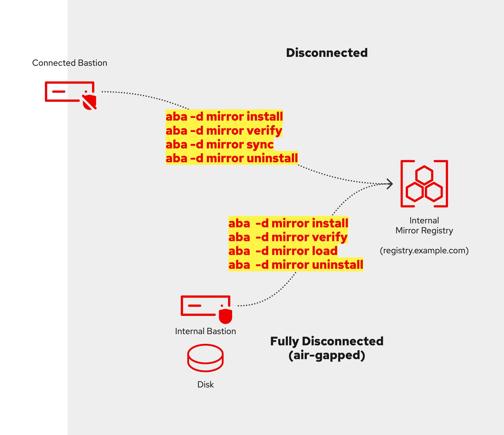

# Aba makes it easier to install OpenShift in a disconnected (air-gapped) environment. <!-- omit in toc -->

>> **A bug has been fixed in the `aba bundle` command causing the error: `directory ... aba/tar does not exist!`**

Quickly install an OpenShift cluster into a fully or partially disconnected environment, either onto bare-metal or VMware (vSphere/ESXi).
Aba integrates several standard Red Hat tools into a single workflow, simplifying image mirroring for disconnected environments and providing the essential Day-2 capabilities needed to make an air-gapped OpenShift environment fully usable.

Because Aba is based on the [Agent-based installer](https://www.redhat.com/en/blog/meet-the-new-agent-based-openshift-installer-1) there is no need to configure a load balancer, a bootstrap node or even require DHCP.

>> **Download curated, ready-made, up-to-date, and tested Aba install bundles — including all images required for fixed use-cases — from: https://red.ht/disco-easy (requires Google account)**

# Who should use Aba?<!-- omit in toc -->

Use Aba to quickly set up OpenShift in a disconnected environment while letting it handle the heavy lifting for you.

**Content**
<!-- This TOC is auto-generated by VS Code whenever a heading is added and the file saved-->

- [Aba Overview](#aba-overview)
- [About Installing OpenShift in a Disconnected Environment](#about-installing-openshift-in-a-disconnected-environment)
- [Prerequisites](#prerequisites)
  - [Common Prerequisites for Both Environments](#common-prerequisites-for-both-environments)
  - [Fully Disconnected (Air-Gapped) Prerequisites](#fully-disconnected-air-gapped-prerequisites)
  - [Partially Disconnected Prerequisites](#partially-disconnected-prerequisites)
  - [Fully Connected Prerequisites](#fully-connected-prerequisites)
- [Downloading an Install Bundle](#downloading-an-install-bundle)
- [Aba OpenShift Installation Workflow Diagram](#aba-openshift-installation-workflow-diagram)
- [Install Aba](#install-aba)
  - [Method 1: Single command](#method-1-single-command)
  - [Method 2: Git clone](#method-2-git-clone)
- [Partially Disconnected Scenario](#partially-disconnected-scenario)
- [Fully disconnected (air-gapped) Scenario](#fully-disconnected-air-gapped-scenario)
- [Installing OpenShift](#installing-openshift)
- [Creating a Custom Install Bundle](#creating-a-custom-install-bundle)
- [How to Customize the Agent-based Configuration Files](#how-to-customize-the-agent-based-configuration-files)
- [Day 2 Operations](#day-2-operations)
  - [Login and Verify Cluster State](#login-and-verify-cluster-state)
  - [Connect OperatorHub to Internal Mirror Registry](#connect-operatorhub-to-internal-mirror-registry)
  - [Synchronize NTP Across Cluster Nodes](#synchronize-ntp-across-cluster-nodes)
  - [Enable OpenShift Update Service (OSUS)](#enable-openshift-update-service-osus)
- [Advanced Use](#advanced-use)
  - [Running Aba in a container](#running-aba-in-a-container)
  - [Creating an Install bundle on a restricted VM or Laptop](#creating-an-install-bundle-on-a-restricted-vm-or-laptop)
  - [To install aba from the dev branch run the following:](#to-install-aba-from-the-dev-branch-run-the-following)
  - [Installing RPMS](#installing-rpms)
- [Feature Backlog and Ideas](#feature-backlog-and-ideas)
- [Miscellaneous](#miscellaneous)
- [Frequently Asked Questions (FAQ)](#frequently-asked-questions-faq)
  - [Q: Does Aba know what RPM packages to install?](#q-does-aba-know-what-rpm-packages-to-install)
  - [Q: Can bonds and/or vlan be configured on my nodes?](#q-can-bonds-andor-vlan-be-configured-on-my-nodes)
  - [Q: How can I determine the network interface names of my bare-metal servers?](#q-how-can-i-determine-the-network-interface-names-of-my-bare-metal-servers)
  - [Q: Can Aba run inside a container?](#q-can-aba-run-inside-a-container)
  - [Q: Does Aba support ARM?](#q-does-aba-support-arm)
  - [Q: How much disk space do I need when using Aba?](#q-how-much-disk-space-do-i-need-when-using-aba)
  - [Q: Can I install Operators from community catalogs?](#q-can-i-install-operators-from-community-catalogs)
  - [Q: Where are cluster types (SNO, compact, standard) configured?](#q-where-are-cluster-types-sno-compact-standard-configured)
  - [Q: How to configure passwordless sudo?](#q-how-to-configure-passwordless-sudo)
  - [Q: Can I use Aba to install user provisioned infrastructure (UPI)?](#q-can-i-use-aba-to-install-user-provisioned-infrastructure-upi)
  - [Q: Pushing images to the Quay mirror (e.g. aba load/sync) often fails, even after re-trying several times! What can I do?](#q-pushing-images-to-the-quay-mirror-eg-aba-loadsync-often-fails-even-after-re-trying-several-times-what-can-i-do)
  - [Q: Is there a discussion forum?](#q-is-there-a-discussion-forum)
  - [Q: I accidentally uninstalled my mirror registry, how can I recover?](#q-i-accidentally-uninstalled-my-mirror-registry-how-can-i-recover)
  - [Q: I see the error `load pubkey "/home/joe/.ssh/quay_installer": Invalid key length` when installing Quay/loading images, what can I do?](#q-i-see-the-error-load-pubkey-homejoesshquay_installer-invalid-key-length-when-installing-quayloading-images-what-can-i-do)
- [License](#license)


<!-- [Download Demo Video](./images/aba-bundle-demo-v5-low.mp4) -->
[Download Demo Video](https://github.com/sjbylo/aba/raw/refs/heads/main/images/aba-bundle-demo-v5-low.mp4)


# Aba Overview

Aba helps you with the following and more:

1. Helps install your first OpenShift cluster, e.g. SNO (1-node), Compact (3-nodes), Standard (5+nodes).
1. Installs the `Mirror Registry for Red Hat OpenShift` (Quay) or Docker Registry for you or makes use of your existing container registry.
1. Uses the registry's credentials and other inputs to generate the Agent-based configuration files.
1. Triggers the generation of the agent-based boot ISO.
1. Configures NTP during installation to prevent time synchronization issues caused by nodes with incorrect date and time settings
1. Optionally, creates the required VMs in ESXi or vSphere.
1. Monitors the installation progress.
1. Allows for adding more images (e.g. Operators) when synchronizing the mirror registry (day 1 or 2 operation).
1. Configures the OperatorHub integration with the mirror registry.
1. Can create an "install bundle" containing all the files needed to complete a fully disconnected installation.
1. Executes several workarounds, if needed, for some typical issues with disconnected environments.
1. Works with oc-mirror v2 (v1 support has been removed)!
1. Installs and integrates OpenShift Update Service (OSUS) to make upgrades a single-click.
1. Helps configure OpenShift with your NTP servers.
1. Enables graceful cluster shutdown and startup.
1. Allows for the modification of generated configuration files (image-set & agent based), if more control is required. 

All Aba commands and actions are idempotent. If something goes wrong, fix it and run the command again — Aba will always try to do the right thing.


# About Installing OpenShift in a Disconnected Environment


The diagram above illustrates two scenarios for installing OpenShift in a disconnected environment.

- **Top Section**: The *Disconnected Scenario* (partial network access, e.g. via a proxy).
- **Bottom Section**: The *Fully Disconnected (Air-Gapped) Scenario* (data transfer only through physical means, such as "[sneaker net](https://en.wikipedia.org/wiki/Sneakernet)" into a fully disconnected environment).

Each scenario includes two main network zones:

- **Connected Network**: Located on the left side of the diagram, where external resources are accessible.
- **Private Network**: Located on the right side of the diagram, isolated from direct Internet access.

Linux OS Requirements

- **Workstation**: Use RHEL 8 or 9, Centos Stream 8 or 9 or Fedora for your connected `bastion` or `workstation`.
- **Bastion**: Must be running RHEL 8 or 9 to support OpenShift installation in a disconnected environment.

These configurations ensure that each network zone meets OpenShift’s requirements for _partially disconnected_ or _fully disconnected_ installations.


[Back to top](#who-should-use-aba)


# Prerequisites

## Common Prerequisites for Both Environments
<!-- this is a perma-link from Aba blog, Oct 2025 -->

#### Registry Storage
   - Registry images are stored by default under your home directory. Use the `data_dir=` value in `aba/mirror/mirror.conf` to change this. 
   - A minimum of 30 GB is required for OpenShift platform release images alone. Additional Operators will require significantly more space — 500 GB or more is recommended.

#### Network Configuration
   - **DNS**: Configure the following DNS A records which match the intended cluster name and base domain ('ocp1' and 'example.com' in the below example):
      - **OpenShift API**: `api.ocp1.example.com` pointing to a free IP address in the internal subnet where OpenShift will be installed.
      - **OpenShift Ingress**: `*.apps.ocp1.example.com` (wildcard A record) pointing to a free IP address in the internal subnet.
         - *Note*: For Single Node OpenShift (SNO), configure both OpenShift API and Ingress records to point to the *same IP address*.
      - **Mirror Registry**: `registry.example.com` pointing to the IP address of your _internal mirror registry_ (or where Aba should install it).

   - **NTP**: An NTP server is required to ensure time synchronization across all nodes, as OpenShift requires synchronized clocks for installation and proper operation.

#### Target Platform 
   - For bare-metal installations, you will set `platform=bm` in `aba.conf` and manually boot the nodes using the generated ISO file.
   - **VMware vCenter or ESXi API Access (optional)**: Ensure sufficient privileges for OpenShift installation. Refer to [vCenter account privileges](https://docs.redhat.com/en/documentation/openshift_container_platform/4.19/html/installing_on_vmware_vsphere/installer-provisioned-infrastructure#installation-vsphere-installer-infra-requirements_ipi-vsphere-installation-reqs) for specific permissions, in the [OpenShift documentation](https://docs.openshift.com/container-platform/latest).

#### Existing Registry Prerequisites
<!-- this is a perma-link from Aba blog, Oct 2025 -->

   - If you're using an existing registry, place its credentials (pull secret and root CA) in the `aba/mirror/regcreds` directory. Here is an example:
      - `aba/mirror/regcreds/pull-secret-mirror.json`
      - `aba/mirror/regcreds/rootCA.pem`
   - Once the files are in place, run the following command to verify the connection to your existing mirror registry:
     ```
     aba -d mirror verify
     ```
   - After the connection has been verified, proceed with pushing images into your registry with `aba -d mirror load` or `aba -d mirror sync`.

For more, see the [Example Credentials](#example-credentials-for-an-existing-mirror-registry).


## Fully Disconnected (Air-Gapped) Prerequisites

To install OpenShift in a fully disconnected (air-gapped) environment, one workstation or laptop that is connected to the Internet and one disconnected bastion are required. From now on, we will refer to these as _connected workstation_ and _internal bastion_ or just _bastion_.

#### Connected Workstation Prerequisites
   - An x86 RHEL 8 or 9 or Fedora (e.g. VM) with Internet access, typically on a laptop.
   - Aba requires root access, either directly or via passwordless sudo.
   - To install Aba refer to these [instructions](#install-aba).
   - Download and store the Red Hat registry pull secret to `~/.pull-secret.json`.
      - A pull secret can be downloaded from https://console.redhat.com/openshift/install/pull-secret.
   - Install required RPMs listed in the file `aba/templates/rpms-external.txt` for external facing bastions.
      - Or, if dnf is configured, let Aba use dnf to install the packages.
   - Optionally, run `sudo dnf update` to ensure all packages are up to date.

#### Internal Bastion Prerequisites
<!-- this is a perma-link from Aba blog, Oct 2025 -->

   - A RHEL 8 or 9 VM or host within your fully disconnected environment.
   - Aba requires root access, either directly or via passwordless sudo.
   - Install required RPMs as listed in the file `aba/templates/rpms-internal.txt`.  **Note:** This file lists the package names to be installed on the _internal bastion_ and is different from the file mentioned above for the _connected workstation_.
   - Optionally, run `sudo dnf update` to ensure all packages are up to date.
   - If you intend to install the Quay mirror registry onto the Internal Bastion, the installer requires password-less ssh working locally, i.e. from the bastion to the bastion!
   - If you intend to install the Quay mirror registry onto a remote host, ensure password-less ssh is working from the Internal Bastion to that remote host.


After configuring these prerequisites, run `aba` to start the OpenShift installation workflow.

## Partially Disconnected Prerequisites

In a _partially disconnected environment_, the _connected bastion_ has limited (or proxy-based) Internet access, allowing data synchronization directly.

#### Connected Bastion Prerequisites
   - A single RHEL 8 or 9 VM configured with access to both the Internet and the disconnected environment.
   - Aba requires root access, either directly or via passwordless sudo.
   - To install Aba refer to these [instructions](#install-aba).
   - Download and store the Red Hat registry pull secret to `~/.pull-secret.json`.
      - A pull secret can be downloaded from https://console.redhat.com/openshift/install/pull-secret.
   - Install required RPMs listed in the file `aba/templates/rpms-external.txt` for external facing bastions.
      - Or, if dnf is configured, let Aba use dnf to install the packages.
   - Optionally, run `sudo dnf update` to ensure all packages are up to date.
   - If you intend to install the Quay mirror registry onto the Connected Bastion, the installer requires password-less ssh working locally, i.e. from the bastion to the bastion!
   - If you intend to install the Quay mirror registry onto a remote host, ensure password-less ssh is working from the Connected Bastion to that remote host.

After configuring these prerequisites, run `aba` - from within the Aba repo's top-level directory - to start the OpenShift installation workflow.

## Fully Connected Prerequisites

Aba also works in connected environments without a _mirror registry_, e.g. by accessing public container registries on the Internet via a proxy or directly.  To do this, configure the `int_connection` value in `cluster.conf` after creating the `cluster directory` (see section [Installing OpenShift](https://github.com/sjbylo/aba/tree/dev?tab=readme-ov-file#installing-openshift) for more).


[Back to top](#who-should-use-aba)


# Downloading an Install Bundle
<!-- this is a perma-link from Aba blog, Oct 2025 --> 

The `Install Bundle` is a single archive that contains everything you need for a specific use case. It includes the install images, all matching CLI install files, the registry setup, and the automation needed to generate the configuration files required to install OpenShift in an air-gapped environment (tested, repeatable, and ready to go).

You can download the latest Install Bundles from: https://red.ht/disco-easy  

Note that if these bundles don’t suit your needs, [let us know](https://github.com/sjbylo/aba/issues/new) your requirements — including the use case and which images or operators are needed.  Alternatively, if you have access, join the [Slack Channel](https://red.ht/slack-forum-aba). 

You can also create your own bundle.  See [Creating a Custom Install Bundle](#creating-a-custom-install-bundle) for more. 
<!-- this is a perma-link from the bundle maker README_FIRST.md file --> 

[Back to top](#who-should-use-aba)

# Aba OpenShift Installation Workflow Diagram

This chart explains the flow of Aba and how Aba works, showing the main choices:
- Fully disconnected (air-gapped)
- Partially disconnected
- Connected installation (without a mirror registry) and
- Installation on VMware or bare-metal. 

If you run `aba` (interactive mode), you will make use of this workflow. 


[Back to top](#who-should-use-aba)


# Install Aba

## Method 1: Single command

>> Note that Aba requires root access, either directly or via passwordless sudo. 

Download and install Aba in one command (preferred):
```
bash -c "$(gitrepo=sjbylo/aba; gitbranch=main; curl -fsSL https://raw.githubusercontent.com/$gitrepo/refs/heads/$gitbranch/install)"
```

```
cd aba
aba          # Let Aba guide you through the OpenShift installation workflow (interactive mode)
```

## Method 2: Git clone

Install Aba using `git clone`:
```
git clone https://github.com/sjbylo/aba.git
cd aba
./install
aba          # Let Aba guide you through the OpenShift installation workflow (interactive mode)
```
- clones the Github repository, installs `aba` and configures some high-level settings, e.g. OpenShift target version, your domain name, machine network CIDR etc (if known).
- If needed, add any required operators to the `aba.conf` file by setting the `op_sets=` and/or `ops=` values.
- helps you decide the method of deployment and how you should proceed.  For more, see the [Aba OpenShift Installation Workflow Diagram](#aba-openshift-installation-workflow-diagram). 

Note that 'aba' will create the `aba.conf` file which contains some values that you *should change* as soon as you can, such as your _preferred platform_, your _domain name_, your _network address_ and any _operators_ you will require etc (if known).

Now, continue with either [Partially Disconnected Scenario](#partially-disconnected-scenario) or [Fully disconnected (air-gapped) Scenario](#fully-disconnected-air-gapped-scenario) below.

<!--
```
aba -d mirror install
```
- configures and connects to your existing container registry OR installs a fresh Mirror Registry for Red Hat OpenShift.

```
aba -d mirror sync
```
- copies the required images directly to the mirror registry (for partially disconnected environments, e.g. via a proxy).
- Fully disconnected (air-gapped) environments are also supported with `aba -d mirror save` and `aba -d mirror load` (see below).

```
aba cluster --name mycluster --type sno [--starting-ip <ip>] [--api-vip <ip>] [--ingress-vip <ip>]
```
- creates a directory `mycluster` and the file `mycluser/cluster.conf`.
- Edit/verify the `mycluster/cluster.conf` file.
- Note that any topology of OpenShift is supported, e.g. sno (1), compact (3), standard (3+n).

```
cd mycluster
aba
```
- creates the Agent-based config files, generates the Agent-based iso file, creates and boots the VMs (if using VMware).
- monitors the installation progress.

```
aba day2
```
- configures OpenShift to access the internal registry ready to install from the Operators Hub.

```
aba help
```
- shows what other commands are available.

-->


[Back to top](#who-should-use-aba)


# Partially Disconnected Scenario

In this scenario, the connected bastion has access to both the Internet and the internal subnet (but not necessarily at the same time).


Copy images from the Red Hat registry to your _internal mirror registry_:
```
aba -d mirror sync
```
This command:
  - triggers `aba -d mirror install` (to configure or install the mirror registry).
    - for an existing registry, check the connection is available and working (be sure to set up your registry credentials in `aba/mirror/regcreds/` first! See the [Existing Registry Prerequisites](#existing-registry-prerequisites) section for more).
    - or, installs _Mirror Registry for Red Hat OpenShift_ (Quay) on the connected bastion (or remote host) and copies the generated pull secret and certificate into the `aba/mirror/regcreds` directory for later use.
  - pulls images from the Internet and stores them in the registry.

```
aba -d cli download
```
  - *Optionally* download the CLI binaries into `aba/cli`. This is only needed if you plan to disconnect from the Internet before installing OpenShift.


Now continue with [Installing OpenShift](#installing-openshift) below.


[Back to top](#who-should-use-aba)

# Fully disconnected (air-gapped) Scenario

**Please note that it is recommended to use the `aba bundle` [command](#creating-a-custom-install-bundle) to create an _install bundle_ to start a fully air-gapped installation, which will automatically complete the below steps (`aba -d mirror save` and `aba tar`) for you.  If, for any reason, you can't use the `aba bundle` command, use the steps below instead.**

>> **Download curated, ready-made, up-to-date, and tested Aba install bundles — including all images required for fixed use-cases — from: https://red.ht/disco-easy (requires Google account)**

### Prerequisites

In this scenario, your _connected workstation_ has access to the Internet but no access to the disconnected environment.
A bastion is required in a disconnected environment. 

Ensure your _connected workstation_ and your _internal bastion_ are correctly configured. See the [Fully Disconnected (Air-Gapped) Prerequisites](#fully-disconnected-air-gapped-prerequisites).  


To download and save the platform and any operator images to disk, run:
```
aba -d mirror save
```
- pulls the images from the Internet and saves them into the local directory as `aba/mirror/save/mirror_000001.tar`. Make sure there is [enough disk space](#prerequisites) for that directory!

Then, create the _install bundle_ using the `aba tar` command, which will copy the whole `aba/` repository (including templates, scripts, images, CLIs and other install files) to the _install bundle_ file.  You then need to move the _bundle_ to your disconnected bastion via a portable storage device, e.g. a thumb drive, or other method. 

>> Note: you must use the `aba tar` command to create the _install bundle_. Do not copy the repository yourself, as-is, since some files and directories must be excluded when creating the _bundle_ file. 

Example:

On the _connected workstation_, mount your thumb drive and run:

```
aba tar --out /path/to/large/media-drive/my_bundle   # Write archive 'my_bundle.tar' to the device
                                                     # mounted at /dev/path/to/thumb-drive
```

Use your portable storage device to transfer the file 'aba.tar' to your _internal bastion_.

Then, on the bastion run:

```
tar xvf aba.tar              # Extract the tar file. Ensure file timestamps are
                             # kept the same as on the connected workstation.
cd aba
./install                    # Install aba on the bastion.
aba
```
<!--
sudo dnf install make -y     # If dnf does not work in the disconnected environment (i.e. no Satellite), ensure all
                             # required RPMs are pre-installed, e.g. from a DVD drive at the time of installation.
-->

### Load the images from disk into the _mirror registry_ (localhost):

```
aba -d mirror load -H registry.example.com
```
- uses the install bundle to:
   - check if the mirror registry is already installed and accessible. If not, Aba runs `aba -d mirror install -H registry.example.com`.
   - if required, installs _Mirror Registry for Red Hat OpenShift_ (Quay) onto `localhost` and then loads the images into it (disk2mirror).
   - checks the FQDN `registry.example.com` is resolvable *and* reaches your internal bastion via ssh.

>> Note: if you are having difficulties pushing images into Quay, see the below FAQ on how to replace it with the Docker Registry. 

### Install Quay and load images to a remote host

```
aba -d mirror load -H registry.example.com -k ~/.ssh/id_rsa
```
- uses the install bundle to:
   - check if the mirror registry is already installed and accessible. If not, Aba runs `aba -d mirror install -H registry.example.com -k ~/.ssh/id_rsa`.
   - if required, installs _Mirror Registry for Red Hat OpenShift_ (Quay) onto the remote host `registry.example.com` and then loads the images into it.
   - checks the FQDN `registry.example.com` is resolvable *and* can be reached via ssh.

>> Note: if you are having difficulties pushing images into Quay, see the below FAQ on how to replace it with the Docker Registry. 

Now continue with [Installing OpenShift](#installing-openshift) below.




[Back to top](#who-should-use-aba)

<!--
Then, using `aba tar`, copy the whole `aba/` repository (including templates, scripts, images, CLIs and other install files) to your disconnected bastion (in your disconnected environment) via a portable storage device, e.g. a thumb drive.

Example:

```
# On the connected workstation:
# Mount your thumb drive and:

aba inc                                          # Write tar archive to /tmp
or
aba inc out=/dev/path/to/thumb-drive/aba.tar     # Write archive 'aba.tar' to the device
                                                  # mounted at /dev/path/to/thumb-drive
or
aba inc out=- | ssh user@host "cat > aba.tar"    # Archive and write to internal host (if possible).
-->


# Installing OpenShift


```
cd aba
aba cluster --name mycluster [--type sno|compact|standard] [--step <step>] [--starting-ip <ip>] [--api-vip <ip>] [--ingress-vip <ip>]
```
- the above, creates and initializes a directory `mycluster` (the same name as your cluster),
- prompts you to run `aba` inside the directory. 
- Note: that the most useful args for _--steps_ are 'agentconf', 'iso' and 'mon'.
- Take a look into the `cluster.conf` file to see what can be configured, e.g. cluster topology, port names, bonding, vlan, int_connection (e.g for _connected_ mode) etc

Aba will guide you through the installation workflow, first generating the agent-based configuration files, then the ISO file and finally monitoring the installation:

Once the nodes have booted from the iso the following command should be run to monitor the progress of the installation. For example:

```
cd mycluster         # cd into the directory created by "aba cluster ..." command
aba mon
```

Note that depending on the value of `platform` in aba.conf, the installation workflow will be different.  
For `platform=vmw`, the installation is fully automated.  
For `platform=bm`, aba will guide you through the necessary steps to generate the agent-based configuration files, the ISO file (boot all nodes) and then monitor the installation.

<!--Get help with `aba -h`.-->

After OpenShift has been installed you will see output similar to the following:

```
INFO Install complete!
INFO To access the cluster as the system:admin user when using 'oc', run
INFO     export KUBECONFIG=/home/steve/aba/compact/iso-agent-based/auth/kubeconfig
INFO Access the OpenShift web-console here: https://console-openshift-console.apps.compact.example.com
INFO Login to the console with user: "kubeadmin", and password: "XXYZZ-XXYZZ-XXYZZ-XXYZZ"
Run '. <(aba shell)' to access the cluster using the kubeconfig file (auth cert), or
Run '. <(aba login)' to log into the cluster using the 'kubeadmin' password.                                                                                                                
Run 'aba day2' to connect this cluster's OperatorHub to your mirror registry (run after adding any operators to your mirror).
Run 'aba day2-osus' to configure the OpenShift Update Service.
Run 'aba day2-ntp' to configure NTP on this cluster.
Run 'aba info' to see this information again.
Run 'aba -h' or 'aba help' for more.                                                                                                                                                        
```
You can get access to the cluster using one of the commands:

```
. <(aba shell)
oc whoami
```
- provides access via the kubeconfig file.

```
. <(aba login)
oc whoami
```
- provides access via "oc login".


If needed, you can also run oc commands against the cluster, e.g. to show the cluster operator progress:

```
watch aba run --cmd "get co"
```

If you want to create the agent-based config files, e.g. to make changes to `install-config.yaml` and `agent-config.yaml`, use:

```
cd mycluster
aba agentconf
# then, if needed,  manually edit the 'agent-config.yaml' file to set the appropriate mac addresses matching your bare-metal nodes, change drive and net interface hints etc.
```

If you want to create the agent-based iso file, e.g. to boot bare-metal nodes, use:

```
cd mycluster
aba iso
# boot the bare-metal node(s) with the generated ISO file.
# This can be done using a USB stick or via the server's remote management interfaces (BMC etc).
aba mon
```

If OpenShift fails to install, see the [Troubleshooting](Troubleshooting.md) readme.

Other examples of commands (aba <command>):

cd mycluster     # change to the `cluster directory` with the agent-based install files, using `mycluster` as an example.

| Command | Description |
| :----- | :---------- |
| `aba info`        | Display kubeadmin password and other information. |
| `aba login`       | Display the `oc login` command for the cluster.  Use: . <(aba login)  |
| `aba shell`       | Display the command to access the cluster using the kubeconfig file.  Use: . <(aba shell) |
| `aba day2`        | Integrate the _internal mirror_ into OpenShift. |
| `aba day2-ntp`    | Configure the cluster with NTP. |
| `aba day2-osus`   | Configure the cluster with OpenShift Update Service for easier cluster upgrades. |
| `aba shutdown`    | Gracefully shut down (or hibernate) a cluster. `aba shutdown --wait` wait for power-off |
| `aba startup`     | Gracefully start up a cluster. |
| `aba help`        | Help is available in all Makefiles (in `aba/Makefile`,  `aba/mirror/Makefile`,  `aba/cli/Makefile` and `aba/<mycluster>/Makefile`)  |

Commands for VMs (vCenter or ESXi)

| Command | Description |
| :----- | :---------- |
| `aba ls`          | Show list of cluster VMs and their state. |
| `aba start`       | Power on all cluster VMs. |
| `aba stop`        | Gracefully shut down all cluster VMs (guest shutdown). |
| `aba poweroff `   | Power off all VMs immediately. |
| `aba kill`        | Same as `poweroff` |
| `aba create`      | Create all cluster VMs. |
| `aba refresh`     | Delete, re-create and start the cluster VMs causing the cluster to be re-installed. |
| `aba delete`      | Delete all the cluster VMs.  |
| `aba help`        | Help is available in all Makefiles (in `aba/Makefile`,  `aba/mirror/Makefile`,  `aba/cli/Makefile` and `aba/<mycluster>/Makefile`)  |


[Back to top](#who-should-use-aba)

# Creating a Custom Install Bundle

You can create an install bundle with everything you need to install OpenShift in a fully disconnected (air-gapped) environment

>> **Download curated, ready-made, up-to-date, and tested Aba install bundles — including all images required for fixed use-cases — from: https://red.ht/disco-easy (requires Google account)**

Do you need to download the necessary images and CLI tools to install OpenShift in a fully disconnected environment for a particular use-case?

To do that, here is how you can use Aba to create an `install bundle` containing just the files and images you require for your use-case!

Store your pull secret in this file:

```
~/.pull-secret.json
```

[Install Aba](#install-aba). Run these commands on a RHEL 8 or 9 or Fedora VM:

```
git clone https://github.com/sjbylo/aba.git
cd aba
./install
```

Connect a large USB media stick (or other device) to your VM and write the `install bundle` to it:

Note: It is recommended to run `aba bundle` on a fresh install of Aba or use the --force flag to overwrite any existing files under aba/mirror/save.

>> **A bug has been fixed in the `aba bundle` command causing the error: `directory ... aba/tar does not exist!`**

Create the install bundle with a single command, for example:

```
aba bundle \
    --pull-secret "~/.pull-secret.json" \
    --channel stable \
    --version latest \
    --op-sets ocp odf ocpv \
    --ops web-terminal devworkspace-operator \
    --base-domain example.com \
    --machine-network 10.0.0.0/20 \
    --dns 10.0.1.8 \
    --ntp 10.0.1.8 ntp.example.com \
    --platform bm \
    --force \
    --out - | split -b 10G - /path/to/your/large/portable/media/ocp_mycluster_
```

- This will generate several 10GB archive files named ocp_mycluster_4.17.16_aa|ab|ac... etc.
- The OpenShift version can be automatically set to the most recent 'previous' point version (using '--version p') or to the 'latest' (using --version l).
- If needed, --op-sets refers to predefined sets of operators, as defined in the files `aba/templates/operator-set-*`. Create your own if needed.
- If needed, add individual operators after "--ops".
- *If known*, set values --domain, --machine-network, --dns and --ntp (otherwise, these must be set in `aba.conf` after unpacking the bundle in the air-gapped env.).
- Set the target --platform, either `bm` (bare-metal) or `vmw` (vSphere or ESXi). 
- Once the `aba bundle` command completes be sure there were no errors and verify the files are complete, e.g. with the command: `cat ocp_mycluster_4.17.16_* | tar tvf -`.
- Generate checksums for the files, e.g. `cksum ocp_mycluster_4.17.16_* | tee CHECKSUM.txt`.  It is important to verify the files after copying them into the air-gapped environment!
- Warning: --force will overwrite any existing image-set files under aba/mirror/save!
- See `aba bundle --help` for more.

Copy the files to your RHEL 8 or 9 bastion within the disconnected environment.

Verify the integrity of the files by comparing their checksums with the originals:

```
cksum ocp_mycluster_4.17.16_*
```

Extract the install bundle:

```
cat /path/to/ocp_mycluster_4.17.16_* | tar xvf -
cd aba
./install
aba         # Run aba and follow the instructions
```

Note: You will find the large image-set tar file under `aba/mirror/save`.

You can now install the _Mirror Registry for Red Hat OpenShift_ (Quay) to localhost and then load it with images using the following command (run: aba -d mirror load --help or see below for more details):

```
aba -d mirror mirror -H registry.example.com load --retry 3
```

To install OpenShift run the following command and follow the instructions:

```
aba cluster --name mycluster --type compact [--starting-ip <ip>] [--api-vip <ip>] [--ingress-vip <ip>]
```

Run: `aba cluster --help` or see the [Installing OpenShift](#installing-openshift) section for more details.

[Back to top](#who-should-use-aba)


# How to Customize the Agent-based Configuration Files

### About the Aba configuration files

| Config file                       | Description |
| :----------                       | :---------- |
| `aba/aba.conf`                    | Global configuration file, sets the channel and version of OpenShift, your domain name, internal network address, DNS IP etc |
| `aba/mirror/mirror.conf`          | Describes your _internal mirror registry_ (either existing or to-be-installed)  |
| `aba/`cluster-name`/cluster.conf` | Describes how to build an OpenShift cluster, e.g. number/size of master and worker nodes, ingress IPs, bonding etc |
| `aba/vmware.conf`                 | Optional vCenter/ESXi access configuration using `govc` CLI (optional) |

### Customizing Configuration files

If you modify the automatically generated Agent-based configuration files — `install-config.yaml` and `agent-config.yaml` - you take ownership of them, and Aba will no longer modify them.

Once a cluster configuration directory (e.g. `mycluster`) has been created and the Agent-based configuration initialized, you can modify the configuration files — `install-config.yaml` and `agent-config.yaml` — if needed.  You can then rerun `aba` to generate the ISO (and VMs, if using `platform=vmw`).  Aba automatically detects and preserves these configuration file changes for future runs.  Common updates such as changing IP or MAC addresses, updating default routes, or adding disk hints all work fine.

<!--
Once a cluster config directory has been created (e.g. `mycluster`) and Agent-based configuration has been created, changes can be made to the Agent-based configuration: `install-config.yaml` and `agent-config.yaml` files if needed. `aba` can be run again to re-create the ISO and the VMs etc (if required).  Aba should detect the changes and preserve them for future use.  Simple changes to the files, e.g. IP/Mac address changes, default route changes, adding disk hints etc work fine.
-->

The workflow might look like this:
```
aba cluster --name mycluser --step agentconf       # Create the cluster dir & generate the initial agent config files.
cd mycluster
```

Now manually edit the generated `install-config.yaml` and `agent-config.yaml` files as needed (for example, to add or change the bare-metal MAC addresses), then proceed with the cluster installation workflow:

```
aba install
```

As an example, you could edit `agent-config.yaml` to include the following to direct agent-based installer to install RHCOS onto the 2nd disk, e.g. /dev/sdb:

```
    rootDeviceHints:
      deviceName: /dev/sdb
```

The following optional command can be used to extract cluster configuration details from the `agent-config.yaml` files.  
You can run this command to verify that the correct information can be retrieved and used to create the VMs (if required).

Example:

```
cd mycluster
aba verify                       # Optional, example execution to show the cluster configuration extracted from the Agend-based config files.
export CLUSTER_NAME=sno
export BASE_DOMAIN=example.com
export RENDEZVOUSIP=10.0.1.202
export CP_REPLICAS=1
export CP_NAMES="sno2"
export CP_MAC_ADDRS="00:50:56:0d:ac:01"
export PORTS_PER_NODE="1"
export CP_MAC_ADDR1="00:50:56:0d:ac:01"
export CP_IP_ADDRESSES="10.0.1.202"
export WORKER_REPLICAS=0
export ASSETS_DIR=iso-agent-based
```

Run aba again to rebuild the agent-based ISO. You should boot the bare-metal servers with the iso file, e.g.:

```
aba install
...
aba iso              # Generate the ISO file
...
aba mon              # After the nodes have been booted from the ISO file, monitor the installation
```

After OpenShift has been installed you will see output similar to the following:

```
INFO Install complete!
INFO To access the cluster as the system:admin user when using 'oc', run
INFO     export KUBECONFIG=/home/steve/aba/compact/iso-agent-based/auth/kubeconfig 
INFO Access the OpenShift web-console here: https://console-openshift-console.apps.compact.example.com
INFO Login to the console with user: "kubeadmin", and password: "XXYZZ-XXYZZ-XXYZZ-XXYZZ"
Run '. <(aba shell)' to access the cluster using the kubeconfig file (auth cert), or
Run '. <(aba login)' to log into the cluster using the 'kubeadmin' password.                                                                                                                
Run 'aba day2' to connect this cluster's OperatorHub to your mirror registry (run after adding any operators to your mirror).
Run 'aba day2-osus' to configure the OpenShift Update Service.
Run 'aba day2-ntp' to configure NTP on this cluster.
Run 'aba info' to see this information again.
Run 'aba -h' or 'aba help' for more.                                                                                                                                                        
```

[Back to top](#who-should-use-aba)


# Day 2 Operations
<!-- this is a perma-link from Aba blog, Oct 2025 --> 

Once your OpenShift cluster is installed using Aba, there are several recommended "Day 2" tasks to finalize configuration and ensure cluster health.

Start with:
```
aba info
```
- This displays access information for your cluster, including OpenShift Console URL, kubeadmin credentials, and next-step guidance.

## Login and Verify Cluster State

### Option A: Use kubeadmin credentials
```
aba login
```
- Displays the command used to log into your OpenShift cluster using the `oc` CLI.

Alternatively, you can try
```
. <(aba login)
```
- This executes the output of `aba login` in the shell as if you typed the command yourself.


### Option B: Use kubeconfig export
```
. <(aba shell)
```
- Sets the `KUBECONFIG` environment variable.
- To confirm cluster status and operator health, you can now run:

```
oc whoami
oc get co
```


[Back to top](#who-should-use-aba)


## Connect OperatorHub to Internal Mirror Registry

```
aba day2
```

- This configures OpenShift to use your _internal mirror registry_ as the source for OperatorHub content.  
It also ensures that OperatorHub continues to work properly, even when the cluster is in a disconnected environment.  

**Important:**  
Re-run this command whenever new Operators are added or updated in your mirror registry — for example, after running `aba -d mirror load` or `aba -d mirror sync` again.  
This step refreshes OpenShift’s OperatorHub configuration (catalog) so it includes the latest mirrored Operators.


## Synchronize NTP Across Cluster Nodes

```
aba day2-ntp
```
- Ensures all nodes are connected to NTP servers (after a node restart). Note that time drift can cause OpenShift installation or operation to fail.


## Enable OpenShift Update Service (OSUS)

```
aba day2-osus
```
- Configures OpenShift to receive updates via your _internal mirror_. Useful for enabling controlled cluster upgrades from the OpenShift Console in disconnected environments.

**NOTE:** The `cincinnati-operator` must be available in the mirror for OSUS to work!


### Updating an OpenShift Cluster

After your first OpenShift cluster has been installed, the mirror registry can continue to be managed using **Aba**, or you can switch entirely to using `oc-mirror`.

The usual Aba workflows can be repeated in the *same way*—for example, to incrementally add operators or download new platform images in preparation for an OpenShift upgrade.

First, ensure that **OpenShift Update Service (OSUS)** is enabled (see above).

---

### Updating a cluster in a fully disconnected environment

In a fully disconnected environment, you can do one of the following:

- **Use Aba to add more operators**  
  Edit `aba/aba.conf` on the _connected workstation_ to add additional operators or operator sets and then run:
  ```
  aba -d mirror save
  ```
- **Manually edit the image-set configuration (advanced / flexible option)**  
  Edit `aba/mirror/save/imageset-config-save.yaml` yourself—for example, to add more images or fetch newer platform versions.
  - To mirror images for OpenShift upgrades, you must manually adjust the `min` and `max` versions in `imageset-config-save.yaml`.  
    Aba does **not** manage these values automatically.

- Run `aba -d mirror save` to download the images to disk and wait for completion.

- Copy the following files from the _connected workstation_ to the _internal bastion_, under `aba/mirror/save`:
  - Image-set configuration file:  
    aba/mirror/save/imageset-config-save.yaml
  - Image-set archive file:  
    aba/mirror/save/mirror_000001.tar

- On the _internal bastion_, run:
  ```
  aba -d mirror load
  ```
  This pushes the images from disk into the _internal mirror registry_.

- Run the following to update operator catalogs and release signatures in the cluster:
  ```
  aba -d <cluster name> day2
  ```
- Add operators or upgrade OpenShift in the usual way.

---

### Updating a cluster in a partially disconnected environment

In a partially disconnected environment, the following workflow can be used:

- Edit the image-set configuration file on the _connected bastion_:

  aba/mirror/sync/imageset-sync.yaml

  Add additional images or update platform versions as needed.

- Run:
  ```
  aba -d mirror sync
  ```
  This downloads and pushes images directly into the _internal mirror registry_.

- Update operator catalogs and release signatures:
  ```
  aba -d <cluster name> day2
  ```
- Add operators or upgrade OpenShift in the usual way.


<!--

### Updating an OpenShift Cluster

After your first OpenShift cluster has been installed the mirror registry can be managed using Aba OR you can switch entirly to using `oc-mirror`. 
The usual workflows with Aba can be repeated in the *same way*, for example, to incrementally install operators or download new versions of platform images to upgrade OpenShift.  

First enable OpenShift Update Service (see above).  

In a fully disconnected environment, you can do one of the following:

- Use Aba to add more operators: Edit `aba/aba.conf` on the _connected workstation_ to add more operators and/or images and run `aba -d mirror save` again. 
- If you want more flexibility, edit the `aba/mirror/save/imageset-config-save.yaml` image-set configuration file yourself, e.g. to add more images and/or fetch the latest platform images.
  - To mirror images for cluster upgrades you will need to edit `imageset-config-save.yaml` yourself by modifying the `min` and `max` versions in the usual way.  Aba does not do this for you. 
- Run `aba -d mirror save` to download the images onto your disk and wait for completion.
- Copy the following files from the _connected workstation_ to your _internal bastion_ under aba/mirror/save:
  - Image-set config file: aba/mirror/save/imageset-config-save.yaml
  - Image-set archive file: aba/mirror/save/mirror_000001.tar
- On the _internal bastion_, run `aba -d mirror load` to push the images from the disk to the _internal mirror registry_.
- Run `aba -d <cluster name> day2` to update any operator catalogs and release signatures in your cluster(s).   
- Add operators or upgrade OpenShift on the usual way. 

In a partially disconnected environment, the following can be done:

- Edit the `aba/mirror/sync/imageset-sync.yaml` image-set configuration file on the _connected bastion_ to add more images or to fetch the latest platform images.
- Run `aba -d mirror sync` to download and push the images into your _internal mirror_ registry.
- Run `aba -d <cluster name> day2` to update any operator catalogs and release signatures in your cluster(s).   
- Add operators or upgrade OpenShift on the usual way. 

--> 

# Advanced Use

## Running Aba in a container

  - Tested on Mac M1 (`arm64`) with successful results.
  - You can run Aba in a container, for example:
    ```
    podman run -it --rm --name centos9 quay.io/centos/centos:stream9
    # Now install aba:
    bash-5.1# bash -c "$(gitrepo=sjbylo/aba; gitbranch=main; curl -fsSL https://raw.githubusercontent.com/$gitrepo/refs/heads/$gitbranch/install)"
    bash-5.1# cd aba
    bash-5.1# aba
    ```
  - In the arm64 container:
    - Aba can connect to an existing remote registry as long as the aba/mirror/regcreds/ directory is populated with the pull secret and the root CA credentials. 
      - cannot install a registry to a remote host from inside the container.  The Quay `mirror-registry` installer does not have a build for arm64. Error: 'rosetta error: failed to open elf at /lib64/ld-linux-x86-64.so.2'. 
    - Can access public registries over the Internet (directly or through a proxy).
    - Generate an `arm64` ISO image suitable for OpenShift installation on `arm64` systems.

  - Tested Use Case:
    - An ISO, generated from within the arm64 container, was successfully used to install OpenShift on an M1 Mac using VMware Fusion.


## Creating an Install bundle on a restricted VM or Laptop

In some environments — such as public cloud providers or restricted laptops — it may **not** be possible to write to a portable storage device due to limited access.  
In such cases, an alternative method can be used, where the files are copied separately.

Example:
```
aba tarrepo --out $HOME/temp/dir/aba.tar      # Creates the install bundle, excluding the large image-set archive file(s).
```
- Writes the _install bundle_ to the temporary directory, **excluding** the large image-set archive tar files under `aba/mirror/save/mirror_000001.tar`.  
- The image-set archive file(s) under `aba/mirror/save` and the _install bundle_ (tarball `aba.tar`) can then be copied separately to a storage device, such as a USB stick, S3 bucket, or other method.

Copy the `aba.tar` file to the _internal bastion_ and unpack the archive. Note the directory `aba/mirror/save` which does NOT contain archive files. 
Copy or move the image archive tar file(s), as is, from where you stored them, into the `aba/mirror/save` directory on the _internal bastion_.

Example:
```
tar xvf aba.tar
mv ~/temp_storage_dir/mirror_000001.tar aba/mirror/save
cd aba
./install
aba
```

After this, proceed with loading the images into your registry using `aba -d mirror load`.  Continue to follow the instructions in the [Fully Disconnected (Air-Gapped) Scenario](#fully-disconnected-air-gapped) section.


<!--
### Cluster presets are used mainly to automate the testing of Aba.

>> **This feature is deprecated and will be removed in a future version!**

```
mv .shortcuts.conf shortcuts.conf
<edit> shortcuts.conf to add/adjust any settings
aba sno
```
- This will create a directory `sno` and then install SNO OpenShift using the Agent-based installer (note, *all* preset parameters in `shortcut.conf` must be completed for this to work).  If you are using VMware the VMs will be created for you.
- Be sure to go through *all* the values in `aba/vmware.conf` and `sno/cluster.conf`.
- Be sure your DNS entries have been set up in advance. See above on Prerequisites.
- Aba will show you the installation progress.  To troubleshoot cluster installation, run `aba ssh` to log into the rendezvous node. If there are any issues - e.g. incorrect DNS records - fix them and try again.  All Aba commands and actions are idempotent. If something goes wrong, fix it and run the command again — Aba will always try to do the right thing.

```
aba compact    # for a 3 node cluster topology (note, *all* parameters in 'aba.conf' must be completed for this to work).
aba standard   # for a 3+2 topology (note, *all* parameters in 'aba.conf' must be completed for this to work).
```
- Run this to create a compact cluster (works in a similar way to the above).

-->

## To install aba from the dev branch run the following:

```
bash -c "$(gitrepo=sjbylo/aba; gitbranch=dev; curl -fsSL https://raw.githubusercontent.com/$gitrepo/refs/heads/$gitbranch/install)" -- dev
```

[Back to top](#who-should-use-aba)


## Installing RPMS

- **Required RPMs:**
  - The _bastion_ must be able to install required RPM packages from an appropriate repository.
  - If RPMs cannot be installed using `sudo dnf install ...`, ensure they are pre-installed (for example, from a DVD during RHEL installation).
  - If RPMs are not available in your disconnected environment, you can use `aba -d rpms download` to download the required packages on the _connected workstation_.   Copy them to the bastion and install using `dnf localinstall rpms/*.rpm`.  
    **Note:** This works only if your connected workstation and internal bastion are running the **exact same version of RHEL** (based on out test results).

If you do not have those RPM packages installed, aba attempts to install them using dnf. If dnf is not configured in your disconnected environment, you’ll need to install the packages manually (e.g., from a DVD or another source). 


# Feature Backlog and Ideas

We need help!  Here are some ideas for new features and enhancements.  

- Generally improve the user experience (UX) of Aba.

- Support libvirt (as well as vSphere). 

- Offer PXE boot as alternative to ISO.

- Prompt user to run `aba day2` (or run it automatically), after (new) operators have been pushed to the registry. 

- Finish full testing for arm64, partial testing complete.

- Configure htpasswd login, add users, disable kubeadmin.

- Enable aba to work in a container (this has been partially verified/implemented, see below).

- Keep platform and operator image types separate in the registry and not all under the same path.

- Using oc-mirror v2, fetch all operator dependencies automatically.

- Configure ACM (if installed) to be ready to install clusters from the mirror registry (HostInv).

- ~~Added ability to use the Docker Registry instead of Quay (see the below FAQ)~~

- ~~Auto-refresh the Operator Catalogs (indexes) after they become stale (e.g. after 1 day).~~

- ~~Enable any number of ports for interface bonding, using `ports` value instead of `port0` and `port1` values in `cluster.conf`.~~

- ~~Support all four operator catalogs (indexes), e.g. "certified-operator", "redhat-marketplace" & "community-operator" and not just "redhat-operator".~~

- ~~Allow to specify the path to a large data volume (and not only the top dir of the Quay registry). Store all large files/cache there.~~

- ~~Assist in adding OpenShift Update Service (OSUS) to the cluster.~~

- ~~Support bonding and vlan.~~

- ~~Make it easier to integrate with vSphere, including storage.~~

- ~~Disable public OperatorHub and configure the internal registry to serve images.~~

- ~~Make it easier to populate the imageset config file with current values, i.e. download the values from the latest catalog and insert them into the image-set archive file.~~


[Back to top](#who-should-use-aba)


# Miscellaneous

### oc-mirror v2 is now the only version supported by aba. 

### oc-mirror cache location

By default, aba sets the oc-mirror cache location (OC_MIRROR_CACHE) and temporary directory (TMPDIR) under the path defined by `data_dir` in the configuration file `aba/mirror/mirror.conf` (default value is $HOME). You can explicitly override these locations by changing `data_dir` or exporting the environment variables. 

- To change oc-mirror's default cache location (~/.oc-mirror/.cache), change the value `data_dir` in `aba/mirror/mirror.conf`. 
  - Example: Set `data_dir=/mnt/large/disk` and the cache will be located at `/mnt/large/disk/.oc-mirror/.cache` and the temporary directory at `/mnt/large/disk/.oc-mirror/.tmp`.

- To change only oc-mirror's default cache location (~/.oc-mirror/.cache), export the `OC_MIRROR_CACHE` environment variable to a path with sufficient disk space, such as:
```
export OC_MIRROR_CACHE=/path/to/large-drive   # Optionally override the cache location, used by oc-mirror
export TMPDIR=/tmp                            # Optionally override the temp directory
```

### Operator Dependencies 

- You can list the operators dependencies (other operators) using this script, for example: `scripts/listopdeps.sh 4.18 odf-operator`

### VM Infra nodes

- If you are using `platform=vmw` and want to configure nodes with different CPU or memory sizes — for example, to run Operators such as Ceph, ODF, or ACM on infrastructure nodes — you can adjust the VM resources after OpenShift is installed.  After making the changes, restart the cluster using `aba shutdown --wait` followed by `aba startup` to apply the updated VM configurations.


### Govc is used to create and manage VMs on ESXi or vSphere.
  - https://github.com/vmware/govmomi/tree/main/govc

Be sure to set the correct (govc) values to access vCenter in the `vmware.conf` file.  Note that ESXi is also supported.

### Use of Make

Aba uses `make` to define and process all dependencies.  Due to this, Aba will usually know what to do next, so just run `aba` again after making changes to configuration files or fixing issues. 

Why `make` was chosen to build Aba?

The UNIX/Linux command "make" is a utility for automating tasks based on rules specified in a Makefile. It enhances efficiency by managing dependencies,
facilitating streamlined processes. Widely applied beyond software development, "make" proves versatile in system management, ensuring organized
execution of diverse tasks through predefined rules!


### Example Credentials for an Existing Mirror Registry
   - `aba/mirror/regcreds/pull-secret-mirror.json`
      ```
      {
        "auths": {
          "registry.example.com:8443": { 
            "auth": "aW5pdDpwNHNzdzByZA=="    # Value generated by running: echo init:p4ssw0rd | base64
          }
        }
      }
      ```

   - `aba/mirror/regcreds/rootCA.pem`
      ```
      -----BEGIN CERTIFICATE-----
      MIID5TCCAs2gAwIBAgIUH2G9oqba4oaGXagGL+nNe9mukyIwDQYJKoZIhvcNAQEL
      BQAwbzELMAkGA1UEBhMCVVMxCzAJBgNVBAgMAlZBMREwDwYDVQQHDAhOZXcgWW9y
      azENMAsGA1UECgwEUXVheTERMA8GA1UECwwIRGl2aXNpb24xHjAcBgNVBAMMFXJl
      Z2lzdHJ5NC5leGFtcGxlLmNvbTAeFw0yNTEwMDEwNzAzMzRaFw0yODA3MjEwNzAz
      MzRaMG8xCzAJBgNVBAYTAlVTMQswCQYDVQQIDAJWQTERMA8GA1UEBwwITmV3IFlv
      cmsxDTALBgNVBAoMBFF1YXkxETAPBgNVBAsMCERpdmlzaW9uMR4wHAYDVQQDDBVy
      ZWdpc3RyeTQuZXhhbXBsZS5jb20wggEiMA0GCSqGSIb3DQEBAQUAA4IBDwAwggEK
      AoIBAQC/AN6G5rIAbabBABABAbBAABbBABABbABtk7vt9w/HFV7NSI3UKZuHc2QG
      /gTGUVF2i/AZT0biUKEof86yHl21bQsdDMbIadZq20SlzMR1jHYeOg9Ig39FsYtr
      vRj3wJSxk+bfZwkHTiPJtaqJpUFN1tM6XffLnqFSsUm+esZ4rznKEl+JYSMtStvN
      9MpoGvy8mcV80qX8vgq0CL9oYrg1fqkrULsu7e0BAUGfy1sc1q30/eRJrC8qYVBi
      3vuwBXtcJu/eYD7ERi7v9DagJ34M4swiWYvYmhcGTFj9joMEjC9+mYHIukayr3w0
      b1UFR2RhkLtiND8HQ/QeH3KFxaZfAgMBAAGjeTB3MAsGA1UdDwQEAwIC5DATBgNV
      HSUEDDAKBggrBgEFBQcDATAgBgNVHREEGTAXghVyZWdpc3RyeTQuZXhhbXBsZS5j
      b20wEgYDVR0TAQH/AbABABABA/wIBATAdABABABABgQUqsHBE65hgRTUPT20wH5W
      aXc7NpQwDQYJKoZIhvcNAQELBQADggEBACkxD4LDaySA1GYGU+wnYoVMcRdlkID5
      uyU3JrA5QWpzwHsm9wBOiG1S9rh9Tt0k6CDjgsihFVbxLgECrA4YnaKIHD8kASmL
      f8YxAsm8vrajCPKyd158i/m7AE8QnfkiWNJ3WTb/l+7w3K4Kd7SZWHnIWz1NJGXR
      d9cHT0ixjk0Hq47PnsJr0OG1EDNGpkxptkcvOZQHYDtiVzoXG7fOdqRUJvI2qQ07
      BHuNrcW50PzaxmdEXEi6DRa17u8yO8TyiDcKEKn7iflU+uWqrs2bEVtmHrUxVRIt
      y8ohEyYwjm1acZDwgezz88bku+c4RHp7HOgb6r6zsvrYfuH3tKykDak=
      -----END CERTIFICATE-----
      ```


### How to clean up and remove aba

Run on the disconnected bastion:
```
cd aba
aba-d mirror uninstall    # uninstall the registry (if needed)
cd ..
rm -rf aba
sudo rm $(which aba)
```

Run on the workstation or laptop:

```
rm -rf aba
sudo rm $(which aba)
# re-install aba
bash -c "$(gitrepo=sjbylo/aba; gitbranch=main; curl -fsSL https://raw.githubusercontent.com/$gitrepo/refs/heads/$gitbranch/install)"
cd aba
aba
```

[Back to top](#who-should-use-aba)


# Frequently Asked Questions (FAQ)

## Q: Does Aba know what RPM packages to install?

**Yes.** Aba uses predefined package list files depending on whether you're in a connected or air-gapped environment:
- _Connected workstation_ or laptop: `aba/templates/rpms-external.txt`
- Disconnected/internal bastion: `aba/templates/rpms-internal.txt`  

You can let Aba install them automatically (if `dnf` is configured) or install them manually.

---

## Q: Can bonds and/or vlan be configured on my nodes?

**Yes.** Configure bonds and/or vlan in the `cluster.conf` file, in your "cluster directory". If you provide more than one comma separated network interface names in the `ports` value, Aba will create a bond.  If you provide a value for the `vlan` tag, Aba will use that and configure vlan.  If you use both aba will configure vlan on bonded interfaces. 

---

## Q: How can I determine the network interface names of my bare-metal servers?

Boot your servers using the Red Hat CoreOS live DVD and check the output of the `ip a` command. 

---

## Q: Can Aba run inside a container?

**Preferably, run Aba in an x86 RHEL 8 or 9 VM.** (VM or physical). Aba has been tested in a container, see the `Advanced` section. However, there are no hard limitations that prevent you from experimenting with containerized execution. Just be aware of storage, permission, and tool compatibility caveats. For example, installing _Mirror Registry for Red Hat OpenShift_ (Quay) or managing certain system-level dependencies might not work.

[Back to top](#who-should-use-aba)

---

## Q: Does Aba support ARM?

**Yes.** Aba is developed and validated for x86_64 architecture, but running on ARM is also supported. You can have a RHEL ARM or Centos Stream Instance as the bastion.  See the `Advanced` section.

---

## Q: How much disk space do I need when using Aba?

Running out of disk space is the most likely problem you will encounter when configuring your registry!

**Minimum:** 30GB for OpenShift base images only.  
**Recommended:** 500GB–1TB if you plan to include Operators, additional CLI tools, or create full install bundles.

---

## Q: Can I install Operators from community catalogs?

**Yes!** Aba currently supports all four of Red Hat’s official catalogs (redhat-operator, certified-operator, redhat-marketplace and community-operator) via `oc-mirror`. 

[Back to top](#who-should-use-aba)

---

## Q: Where are cluster types (SNO, compact, standard) configured?

These are set during cluster creation using:
```
aba cluster --name mycluster --type sno|compact|standard
```
The following values in cluster.conf define the cluster topology:
1. num_masters
2. num_workers

## Q: How to configure passwordless sudo?

Run the following as the user who you want to grant passwordless sudo permission (enter the root password):

```
echo "$(whoami) ALL=(root) NOPASSWD:ALL" | sudo tee -a /etc/sudoers.d/$(whoami)
```

Or, as root, write the following to a file under /etc.  Replace `username` with the actual username of the user that requires passwordless sudo access. 

```
echo "username ALL=(root) NOPASSWD:ALL" > /etc/sudoers.d/username
```

## Q: Can I use Aba to install user provisioned infrastructure (UPI)?

**Partially, yes!** Aba can be used to set up the registry and generate the `install-config.yaml` file which can be used to install OpenShift for UPI.  With some juggling, the day2 operations (OperatorHub, OSUS, Shutdown, Startup and NTP) can be used for UPI too. 

## Q: Pushing images to the Quay mirror (e.g. aba load/sync) often fails, even after re-trying several times! What can I do?

**Use Docker Registry instead!** To replace Quay with the Docker Registry, run:

```
aba -d mirror uninstall                        # Uninstall Quay if it was already installed.

                                               # Assuming aba/mirror/mirror.conf is set up correctly:
aba -d mirror install-docker-registry          # Install Docker Registry and integrate with aba. Also works in diconnected env.
aba -d mirror verify                           # If verification is successful, use aba as usual (e.g. aba load/save).
```

To uninstall the Docker Registry, run:

```
aba -d mirror uninstall-docker-registry        # Remove the Docker Registry pod.
```
- Note: Like all tools that Aba uses, the Quay mirror registry is supported by Red Hat but the Docker Registry is not.

[Back to top](#who-should-use-aba)

## Q: Is there a discussion forum?

If you have access, join the [Slack Channel](https://red.ht/slack-forum-aba). 


## Q: I accidentally uninstalled my mirror registry, how can I recover?

You cluster cannot pull images any more since the mirror registry is no longer available. Your cluster may startup ok. but over time pods may start to fail. 

Ensure you can still access the running cluster, either by login/password or kubeconfig file.

Next:

1. In the usual way, re-install Quay and push the same set & same version of images into it. 
1. Verify you have the aba/mirror/ dir and aba/aba.conf is all set up ok (same infos to match the existing cluster, as best you can)
1. Ensure this command shows success: oc -d mirror verify
1. Start the OpenShift cluster
1. Check “oc whoami” is working
1. Delete old configuration, run:
   1. oc delete cm registry-config -n openshift-config
   1. oc delete catalogsource  redhat-operators -n openshift-marketplace
1. Create the <cluster>/cluster.conf file again (example uses 'sno'):
   1. rm -rf sno; cluster -n sno -t sno -i 10.0.1.202 -s cluster.conf    # >>> change to YOUR cluster's starting IP address
1. aba -d sno day2    # Add back the OperatorHub conifguration.
2. Wait 2-3 minutes and check if the OperatorHub is working in the OpenShift Console. 

This SHOULD set up OperatorHub again.


## Q: I see the error `load pubkey "/home/joe/.ssh/quay_installer": Invalid key length` when installing Quay/loading images, what can I do?

The key file created by the Quay installer is too weak for your system policy.  
Delete the key files and re-create them with:

```
rm -f $HOME/.ssh/quay_installer*
ssh-keygen -t ed25519 -f $HOME/.ssh/quay_installer -N ''           # Generate the key pair
cat $HOME/.ssh/quay_installer.pub >> $HOME/.ssh/authorized_keys    # Append public key so ssh works
```


[Back to top](#who-should-use-aba)

# License

Aba is open source software licensed under the [Apache License 2.0](LICENSE).
