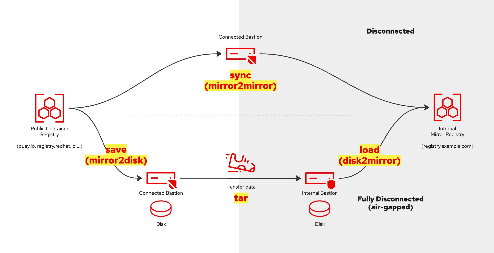

# Aba makes it easier to install OpenShift in your disconnected (air-gapped) environment.

Easily install an OpenShift cluster - "Cluster Zero" - into a fully or partially disconnected environment, either onto bare-metal or VMware (vSphere/ESXi).
Because Aba is based on the [Agent-based installer](https://www.redhat.com/en/blog/meet-the-new-agent-based-openshift-installer-1) there is no need to configure a load balancer, a bootstrap node or even require DHCP.

>> **For Red Hatters:  download curated, ready-made, up-to-date, and tested Aba install bundles — including all images required for fixed use-cases — from: https://red.ht/disco-easy**

## Who should use Aba?

Use Aba to quickly set up OpenShift in a disconnected environment while letting it handle the heavy lifting for you.

1. [Aba Overview](#aba-overview)
1. [About Installing OpenShift in a Disconnected Environment](#about-installing-openshift-in-a-disconnected-environment)
1. [Prerequisites](#prerequisites)
   1. [Fully Disconnected (Air-Gapped) Prerequisites](#fully-disconnected-air-gapped-prerequisites)
   1. [Partially Disconnected Prerequisites](#partially-disconnected-prerequisites)
   1. [Common Requirements for Both Environments](#common-requirements-for-both-environments)
1. [Install Aba](#install-aba)
   1. [Partially disconnected scenario](#partially-disconnected-scenario)
   1. [Fully disconnected (air-gapped) Scenario](#fully-disconnected-air-gapped-scenario)
1. [Installing OpenShift](#installing-openshift)
1. [Creating a custom install bundle](#creating-a-custom-install-bundle)
1. [Aba OpenShift Installation Workflow](#aba-openshift-installation-workflow)
1. [About configuration files](#configuration-files)
1. [How to customize the Agent-based config files](#how-to-customize-the-agent-based-config-files)
1. [Day 2 Operations](#day-2-operations)
1. [Feature Backlog and Ideas](#feature-backlog-and-ideas)
1. [Miscellaneous](#miscellaneous)
1. [Advanced Use](#advanced-use)
1. [Frequently Asked Questions (FAQ)](#frequently-asked-questions-faq)


<!-- [Download Demo Video](./images/aba-bundle-demo-v5-low.mp4) -->
[Download Demo Video](https://github.com/sjbylo/aba/raw/refs/heads/main/images/aba-bundle-demo-v5-low.mp4)


## Aba Overview

Aba helps you with the following and more:

1. Helps install your first OpenShift cluster, e.g. SNO (1-node), Compact (3-nodes), Standard (5+nodes).
1. Installs the `Mirror Registry for Red Hat OpenShift` (Quay) for you or makes use of your existing container registry.
1. Uses the registry's credentials and other inputs to generate the Agent-based configuration files.
1. Triggers the generation of the agent-based boot ISO.
1. Configures NTP during installation to prevent time synchronization issues caused by nodes with incorrect date and time settings
1. Optionally, creates the required VMs in ESXi or vSphere.
1. Monitors the installation progress.
1. Allows for adding more images (e.g. Operators) when synchronizing the mirror registry (day 1 or 2 operation).
1. Configures the OperatorHub integration with the mirror registry.
1. Can create an "install bundle" containing all the files needed to complete a fully disconnected installation.
1. Executes several workarounds, if needed, for some typical issues with disconnected environments.
1. Works with oc-mirror v2 (v1 support has been removed)!
1. Installs and integrates OpenShift Update Service (OSUS) to make upgrades a single-click.
1. Helps configure OpenShift with your NTP servers.
1. Enables graceful cluster shutdown and startup.
1. Allows for the modification of generated configuration files (image set & agent based), if more control is required. 

All Aba commands and actions are idempotent. If something goes wrong, fix it and run the command again — Aba will always try to do the right thing.


## About Installing OpenShift in a Disconnected Environment


The diagram above illustrates two scenarios for installing OpenShift in a disconnected environment.

- **Top Section**: The *Disconnected Scenario* (partial network access, e.g. via a proxy).
- **Bottom Section**: The *Fully Disconnected (Air-Gapped) Scenario* (data transfer only through physical means, such as "sneaker net" into a fully disconnected environment).

Each scenario includes two main network zones:

- **Connected Network**: Located on the left side of the diagram, where external resources are accessible.
- **Private Network**: Located on the right side of the diagram, isolated from direct Internet access.

Linux OS Requirements

- **Workstation**: Use RHEL 8 or 9, Centos Stream 8 or 9 or Fedora for your connected `bastion` or `workstation`.
- **Bastion**: Must be running RHEL 8 or 9 to support OpenShift installation in a disconnected environment.

These configurations ensure that each network zone meets OpenShift’s requirements for _partially disconnected_ or _fully disconnected_ installations.


[Back to top](#who-should-use-aba)


## Prerequisites

### Fully Disconnected (Air-Gapped) Prerequisites

To install OpenShift in a fully disconnected (air-gapped) environment, one workstation or laptop that is connected to the Internet and one disconnected bastion are required. From now on, we will refer to these as _connected workstation_ and _internal bastion_ or just _bastion_.

#### Connected Workstation**
   - An x86 RHEL 8 or 9 or Fedora (e.g. VM) with Internet access, typically on a laptop.
   - Aba requires root access, either directly or via password-less sudo.
   - To install Aba refer to these [instructions](#install-aba).
   - Download and store the Red Hat registry pull secret to `~/.pull-secret.json`.
      - A pull secret can be downloaded from https://console.redhat.com/openshift/install/pull-secret.
   - Install required RPMs listed in `aba/templates/rpms-external.txt`
      - Or, if dnf is configured, let Aba use dnf to install the packages.
   - Optionally, run `sudo dnf update` to ensure all packages are up to date.

#### Internal Bastion**
   - A RHEL 8 or 9 VM or host within your fully disconnected environment.
   - Aba requires root access, either directly or via password-less sudo.
   - Install required RPMs as listed in `aba/templates/rpms-internal.txt` (or, if dnf is configured, let Aba use dnf to install the packages).

### Partially Disconnected Prerequisites

In a partially disconnected environment, the internal bastion has limited (or proxy-based) Internet access, allowing data synchronization directly.

#### Connected Bastion**
   - A single RHEL 8 or 9 VM configured with access to both the Internet and the disconnected environment.
   - Aba requires root access, either directly or via password-less sudo.
   - To install Aba refer to these [instructions](#install-aba).
   - Download and store the Red Hat registry pull secret to `~/.pull-secret.json`.
      - A pull secret can be downloaded from https://console.redhat.com/openshift/install/pull-secret.
   - Install required RPMs listed in `aba/templates/rpms-internal.txt`. Note: This is a different file from the one mentioned above.
      - Or, if dnf is configured, let Aba use dnf to install the packages.
   - Optionally, run `sudo dnf update` to ensure all packages are up to date.

### Common Requirements for Both Environments

#### Registry Storage**
   - An absolute minimum of 30 GB is required (for OpenShift platform release images only), with additional Operators requiring much more space (500 GB or more is recommended).

#### Network Configuration**
   - **DNS**: Configure the following DNS A records which match the intended cluster name and base domain ('ocp1' and 'example.com' in the below example):
      - **OpenShift API**: `api.ocp1.example.com` pointing to a free IP address in the internal subnet where OpenShift will be installed.
      - **OpenShift Ingress**: `*.apps.ocp1.example.com` (wildcard A record) pointing to a free IP address in the internal subnet.
      - **Mirror Registry**: `registry.example.com` pointing to the IP address of your internal mirror registry (or where Aba should install it).
      - *Note*: For Single Node OpenShift (SNO), configure both OpenShift API and Ingress records to point to the *same IP address*.
   - **NTP**: An NTP server is required to ensure time synchronization across all nodes, as OpenShift requires synchronized clocks for installation and proper operation.

#### Platform**
   - For bare-metal installations, you will set `platform=bm` in `aba.conf` and manually boot the nodes using the generated ISO file.
   - **VMware vCenter or ESXi API Access (optional)**: Ensure sufficient privileges for OpenShift installation. Refer to [vCenter account privileges](https://docs.redhat.com/en/documentation/openshift_container_platform/4.19/html/installing_on_vmware_vsphere/installer-provisioned-infrastructure#installation-vsphere-installer-infra-requirements_ipi-vsphere-installation-reqs) for specific permissions, in the [OpenShift documentation](https://docs.openshift.com/container-platform/latest).

#### Registry**
   - If you're using an existing registry, place its credentials (pull secret and root CA) in the `aba/mirror/regcreds` directory:
      - `aba/mirror/regcreds/pull-secret-mirror.json`
      - `aba/mirror/regcreds/rootCA.pem`

After configuring these prerequisites, run `aba` to start the OpenShift installation workflow.

Note: that Aba also works in connected environments without a mirror registry, e.g. by accessing public container registries via a proxy or directly.  To do this, configure the `int_connection` value in `cluster.conf` after creating the `cluster directory` (see section [Installing OpenShift](https://github.com/sjbylo/aba/tree/dev?tab=readme-ov-file#installing-openshift) for more).


[Back to top](#who-should-use-aba)


## Install Aba

### Method 1: Download and install Aba in one command (preferred) 

```
bash -c "$(gitrepo=sjbylo/aba; gitbranch=main; curl -fsSL https://raw.githubusercontent.com/$gitrepo/refs/heads/$gitbranch/install)"
```

```
cd aba
aba          # Let Aba guide you through the OpenShift installation workflow
```

### Method 2: Install Aba using 'git clone'

```
git clone https://github.com/sjbylo/aba.git
cd aba
./install
aba          # Let Aba guide you through the OpenShift installation workflow
```
- clones the repository, installs `aba` and configures some high-level settings, e.g. OpenShift target version, your domain name, machine network CIDR etc (if known).
- If needed, add any required operators to the `aba.conf` file by setting 'op_sets' and/or 'ops' values.
- helps you decide the method of deployment and how you should proceed.

Note that 'aba' will create the `aba.conf` file which contains some values that you *must change*, e.g. your preferred platform, your domain name, your network address (if known) and any operators you will require etc.

Now, continue with either 'Disconnected scenario' or 'Fully disconnected (air-gapped) scenario' below.

<!--
```
aba mirror
```
- configures and connects to your existing container registry OR installs a fresh Mirror Registry for Red Hat OpenShift.

```
aba sync
```
- copies the required images directly to the mirror registry (for partially disconnected environments, e.g. via a proxy).
- Fully disconnected (air-gapped) environments are also supported with `aba save` and `aba load` (see below).

```
aba cluster --name mycluster --type sno [--starting-ip <ip>] [--api-vip <ip>] [--ingress-vip <ip>]
```
- creates a directory `mycluster` and the file `mycluser/cluster.conf`.
- Edit/verify the `mycluster/cluster.conf` file.
- Note that any topology of OpenShift is supported, e.g. sno (1), compact (3), standard (3+n).

```
cd mycluster
aba
```
- creates the Agent-based config files, generates the Agent-based iso file, creates and boots the VMs (if using VMware).
- monitors the installation progress.

```
aba day2
```
- configures OpenShift to access the internal registry ready to install from the Operators Hub.

```
aba help
```
- shows what other commands are available.

-->


[Back to top](#who-should-use-aba)


### Partially disconnected scenario

In this scenario, the connected bastion has access to both the Internet and the internal subnet (but not necessarily at the same time).




```
aba sync
```
This command:
  - triggers `aba mirror` (to configure the mirror registry), if needed.
    - for an existing registry, check the connection is available and working (be sure to set up your registry credentials in `aba/mirror/regcreds/` first! See above for more).
    - or, installs _Mirror Registry for Red Hat OpenShift_ (Quay) on the connected bastion (or remote host) and copies the generated pull secret and certificate into the `aba/mirror/regcreds` directory for later use.
  - pulls images from the Internet and stores them in the registry.

```
aba download
```
  - *Optionally* download the CLI binaries into `aba/cli`. This is only needed if you plan to disconnect from the Internet before installing OpenShift.


Now continue with [Installing OpenShift](#installing-openshift) below.

Note that the above 'disconnected scenario' can be repeated, for example to download and install Operators as a day 2 operation or to upgrade OpenShift, by updating the `sync/imageset-sync.yaml` file and running `aba sync` & `aba day2` again.


[Back to top](#who-should-use-aba)

### Fully disconnected (air-gapped) Scenario

**Please note that it is now recommended to use the above `aba bundle` [link](#creating-a-custom-install-bundle) command to initiate a fully air-gapped installation, which will complete the steps below for you.**

>> **For Red Hatters:  download curated, ready-made, up-to-date, and tested Aba install bundles — including all images required for fixed use-cases — from: https://red.ht/disco-easy**

In this scenario, your connected workstation has access to the Internet but no access to the disconnected environment.
You also require a bastion in a disconnected environment. See the [prerequisites](#prerequisites) above.

```
aba save
```
- pulls the images from the Internet and saves them into the local directory `aba/mirror/save`. Make sure there is enough disk space (30+ GB or much more for Operators)!

Then, using one of `aba inc/tar/tarrepo` (incremental/full or separate copies), copy the whole aba/ repository (including templates, scripts, images, CLIs and other install files) to your disconnected bastion (in your disconnected environment) via a portable storage device, e.g. a thumb drive.

Example:

```
# On the connected workstation:
# Mount your thumb drive and:

aba inc                                          # Write tar archive to /tmp
or
aba inc out=/dev/path/to/thumb-drive/aba.tar     # Write archive 'aba.tar' to the device
                                                  # mounted at /dev/path/to/thumb-drive
or
aba inc out=- | ssh user@host "cat > aba.tar"    # Archive and write to internal host (if possible).

# Copy the file 'aba.tar' to your bastion via your portable storage device.

# Then, on the bastion run:
tar xvf aba.tar                                   # Extract the tar file. Ensure file timestamps are
                                                  # kept the same as on the connected workstation.
cd aba
./install
aba
```

For such cases where it is not possible to write directly to a portable storage device, e.g. due to restrictions or access is not possible, an alternative command can be used.

Example:

```
aba tarrepo out=/dev/path/to/drive/aba.tar
```
- Write archive `aba.tar` to the device mounted at /dev/path/to/drive, EXCEPT for the image set archive tar files under `aba/mirror/save`
- The image set archive tar file(s) in the `aba/mirror/save` directory and the repository tarball `aba.tar` can be copied separately to a storage device, e.g. USB stick, S3 or other.

Copy the `aba.tar` file to the bastion and unpack the archive. Note the directory `aba/mirror/save`.
Copy or move the image archive tar file(s), as is, from the `aba/mirror/save` directory to the connected workstation, into the `aba/mirror/save` directory on the bastion.

```
sudo dnf install make -y     # If dnf does not work in the disconnected environment (i.e. no Satalite), ensure all
                             # required RPMs are pre-installed, e.g. from a DVD drive at the time of installation.
aba load
```
- will (if required) install _Mirror Registry for Red Hat OpenShift_ (Quay) from the install bundle and then load the images into the mirror registry.
- Required RPMs:
  - Note that the bastion will need to install RPMs from a suitable repository (for Aba testing purposes Aba configures `dnf` to use a proxy).
  - If RPMs cannot be installed with "sudo dnf install", then ensure the RPMs are pre-installed, e.g. from a DVD at the time of RHEL installation.
  - If rpms are not available in your disconnected environment, the command `aba rpms` can help by downloading the required rpms, which can then be copied to the bastion and installed with `dnf localinstall rpms/*.rpm`.  Note this will only work if your connected workstation and disconnected bastions are running the exact same version of RHEL (at least, that was the experience when testing!).

Now continue with [Installing OpenShift](#installing-openshift) below.

Note that the above 'air-gapped workflow' can be repeated in the *exact same way*, for example to incrementally install Operators or download new versions of images to upgrade OpenShift.

For example, by:
- editing the `mirror/save/imageset-save.yaml` file on the connected workstation to add more images or to fetch the latest images
- running `aba save`
- running `aba inc` (or aba tar or aba tarrepo) to create an install bundle (see above)
- unpacking the tar archive on the bastion
- running `aba load` to load the images into the internal registry.

Note that generated 'image sets' are sequential and must be pushed to the target mirror registry in order. You can derive the sequence number from the file name of the generated image set archive file in the mirror/save directory.


[Back to top](#who-should-use-aba)


## Installing OpenShift


```
cd aba
aba cluster --name mycluster [--type sno|compact|standard] [--step <step>] [--starting-ip <ip>] [--api-vip <ip>] [--ingress-vip <ip>]
```
- the above, creates and initializes a directory `mycluster` (the same name as your cluster),
- prompts you to run `aba` inside the directory. 
- Note: that the most useful args for _--steps_ are 'agentconf', 'iso' and 'mon'.
- Take a look into the `cluster.conf` file to see what can be configured, e.g. cluster topology, port names, bonding, vlan, int_connection (e.g for _connected_ mode) etc

Aba will guide you through the installation workflow, first generating the agent-based configuration files, then the ISO file and finally monitoring the installation:

Once the nodes have booted from the iso the following command should be run to monitor the progress of the installation. For example:

```
cd <cluster dir>     # e.g. cd mycluster
aba mon
```

Note that depending on the value of `platform` in aba.conf, the installation workflow will be different.  
For `platform=vmw`, the installation is fully automated.  
For `platform=bm`, aba will guide you through the necessary steps to generate the agent-baseed configuraiton files, the ISO file (boot all nodes) and then monitor the installation.

<!--Get help with `aba -h`.-->

After OpenShift has been installed you will see output similar to the following:

```
INFO Install complete!
INFO To access the cluster as the system:admin user when using 'oc', run
INFO     export KUBECONFIG=/home/steve/aba/compact/iso-agent-based/auth/kubeconfig
INFO Access the OpenShift web-console here: https://console-openshift-console.apps.compact.example.com
INFO Login to the console with user: "kubeadmin", and password: "XXYZZ-XXYZZ-XXYZZ-XXYZZ"
Run '. <(aba shell)' to access the cluster using the kubeconfig file (auth cert), or
Run '. <(aba login)' to log into the cluster using the 'kubeadmin' password.                                                                                                                
Run 'aba day2' to connect this cluster's OperatorHub to your mirror registry (run after adding any operators to your mirror).
Run 'aba day2-osus' to configure the OpenShift Update Service.
Run 'aba day2-ntp' to configure NTP on this cluster.
Run 'aba info' to see this information again.
Run 'aba -h' or 'aba help' for more.                                                                                                                                                        
```
You can get access to the cluster using one of the commands:

```
. <(aba shell)
oc whoami
```
- provides access via the kubeconfig file.

```
. <(aba login)
oc whoami
```
- provides access via "oc login".


If needed, you can also run commands against the cluster, e.g. to show the cluster operator progress:

```
watch aba --cmd "get co"
```

If you want to create the agent-based config files, e.g. to make changes to `install-config.yaml` and `agent-config.yaml`, use:

```
cd mycluster
aba agentconf
# then, if needed,  manually edit the 'agent-config.yaml' file to set the appropriate mac addresses matching your bare-metal nodes, change drive and net interface hints etc.
```

If you want to create the agent-based iso file, e.g. to boot bare-metal nodes, use:

```
cd mycluster
aba iso
# boot the bare-metal node(s) with the generated ISO file.
# This can be done using a USB stick or via the server's remote management interfaces (BMC etc).
aba mon
```

If OpenShift fails to install, see the [Troubleshooting](Troubleshooting.md) readme.

Other examples of commands (aba <command>):

cd mycluster     # change to the `cluster directory` with the agent-based install files, using `mycluster` as an example.

| Command | Description |
| :----- | :---------- |
| `aba info`        | Display kubeadmin password and other information. |
| `aba login`       | Display the `oc login` command for the cluster.  Use: . <(aba login)  |
| `aba shell`       | Display the command to access the cluster using the kubeconfig file.  Use: . <(aba shell) |
| `aba day2`        | Integrate the internal mirror into OpenShift. |
| `aba day2-ntp`    | Configure the cluster with NTP. |
| `aba day2-osus`   | Configure the cluster with OpenShift Update Service for easier cluster upgrades. |
| `aba shutdown`    | Gracefully shut down (or hibernate) a cluster. `aba shutdown --wait` wait for power-off |
| `aba startup`     | Gracefully start up a cluster. |
| `aba help`        | Help is available in all Makefiles (in `aba/Makefile`,  `aba/mirror/Makefile`,  `aba/cli/Makefile` and `aba/<mycluster>/Makefile`)  |

Commands for VMs (vCenter or ESXi)

| Command | Description |
| :----- | :---------- |
| `aba ls`          | Show list of cluster VMs and their state. |
| `aba start`       | Power on all cluster VMs. |
| `aba stop`        | Gracefully shut down all cluster VMs (guest shutdown). |
| `aba poweroff `   | Power off all VMs immediately. |
| `aba kill`        | Same as `poweroff` |
| `aba create`      | Create all cluster VMs. |
| `aba refresh`     | Delete, re-create and start the cluster VMs causing the cluster to be re-installed. |
| `aba delete`      | Delete all the cluster VMs.  |
| `aba help`        | Help is available in all Makefiles (in `aba/Makefile`,  `aba/mirror/Makefile`,  `aba/cli/Makefile` and `aba/<mycluster>/Makefile`)  |


[Back to top](#who-should-use-aba)

## Creating a custom install bundle

You can create an install bundle with everything you need to install OpenShift in a fully disconnected (air-gapped) environment

>> **For Red Hatters:  download curated, ready-made, up-to-date, and tested Aba install bundles — including all images required for fixed use-cases — from: https://red.ht/disco-easy**

Do you need to download the necessary images and CLI tools to install OpenShift in a fully disconnected environment for a particular use-case?

To do that, here is how you can use Aba to create an `install bundle` containing just the files and images you require for your use-case!

Store your pull secret in this file:

```
~/.pull-secret.json
```

[Install Aba](#install-aba). Run these commands on a RHEL 8 or 9 or Fedora VM:

```
git clone https://github.com/sjbylo/aba.git
cd aba
./install
```

Connect a large USB media stick (or other device) to your VM and write the `install bundle` to it:

Set the version of OpenShift you want to install:

```
v=4.17.16
```

Note: It is recommended to run `aba bundle` on a fresh install of Aba or use the --force flag to overwrite any pre-existing files that may exist under aba/mirror/save. 

Create the install bundle with a single command, for example:

```
aba bundle \
    --pull-secret "~/.pull-secret.json" \
    --channel stable \
    --version $v \
    --op-sets ocp odf ocpv \
    --ops web-terminal devworkspace-operator \
    --base-domain example.com \
    --machine-network 10.0.0.0/20 \
    --dns 10.0.1.8 \
    --ntp 10.0.1.8 ntp.example.com \
    --platform bm \
    --force \
    --out - | split -b 10G - /path/to/your/large/portable/media/ocp_mycluster_${v}_
```

- This will generate several 10GB archive files named ocp_mycluster_4.17.16_aa|ab|ac... etc.
- The OpenShift version can be automatically set to the most recent 'previous' point version (using '--version p') or to the 'latest' (using --version l).
- If needed, --op-sets refers to predefined sets of operators, as defined in the files `aba/templates/operator-set-*`.
- If needed, add individual operators after "--ops".
- If known, values --domain, --machine-network, --dns and --ntp should be set (otherwise, these values must be set in aba.conf on the internal bastion after unpacking the bundle).
- Set the target --platform, either `bm` (bare-metal) or `vmw` (vSphere or ESXi). 
- Once the `aba bundle` command completes be sure there were no errors and verify the files are complete, e.g. with the command: `cat ocp_mycluster_4.17.16_* | tar tvf -`.
- Generate checksums for the files, e.g. `cksum ocp_mycluster_4.17.16_*`.  It is important to verify the files after copying them into the air-gapped environment!
- Warning: --force will overwrite any existing image set files under aba/mirror/save!


Copy the files to your RHEL 8 or 9 bastion within the disconnected environment.

Verify the integrity of the files by comparing their checksums with the originals:

```
cksum ocp_mycluster_4.17.16_*
```

Extract the install bundle:

```
cat /path/to/ocp_mycluster_4.17.16_* | tar xvf -
cd aba
./install
aba         # Run aba and follow the instructions
```

Note: You will find the large image set tar file under `aba/mirror/save`.

You can now install the _Mirror Registry for Red Hat OpenShift_ (Quay) to localhost and then load it with images using the following command (run: aba load --help or see below for more details):

```
aba mirror -H registry.example.com load --retry 3
```

To install OpenShift run the following command and follow the instructions (run: aba cluster --help or see below for more details):

```
aba cluster --name mycluster --type compact [--starting-ip <ip>] [--api-vip <ip>] [--ingress-vip <ip>]
```

[Back to top](#who-should-use-aba)

## Aba OpenShift Installation Workflow 

This chart explains the flow of Aba and how Aba works, showing the main choices: fully disconnected (air-gapped), partially disconnected, connected and installation on VMW or bare-metal. 


[Back to top](#who-should-use-aba)

## About the Aba configuration files

| Config file | Description |
| :---------- | :---------- |
| `aba/aba.conf`                    | Global configuration file, sets the channel and version of OpenShift, your domain name, internal network address, DNS IP etc |
| `aba/mirror/mirror.conf`          | Describes your internal mirror registry (either existing or to-be-installed)  |
| `aba/`cluster-name`/cluster.conf` | Describes how to build an OpenShift cluster, e.g. number/size of master and worker nodes, ingress IPs, bonding etc |
| `aba/vmware.conf`                 | Optional vCenter/ESXi access configuration using `govc` CLI (optional) |


[Back to top](#who-should-use-aba)

## How to customize the Agent-based config files

Once a cluster configuration directory (e.g. `mycluster`) has been created and the Agent-based configuration initialized, you can modify the configuration files — `install-config.yaml` and `agent-config.yaml` — if needed.  You can then rerun `aba` to generate the ISO (and VMs, if required).  Aba automatically detects and preserves these configuration file changes for future runs.  Common updates such as changing IP or MAC addresses, updating default routes, or adding disk hints all work fine.

<!--
Once a cluster config directory has been created (e.g. `mycluster`) and Agent-based configuration has been created, changes can be made to the Agent-based configuration: `install-config.yaml` and `agent-config.yaml` files if needed. `aba` can be run again to re-create the ISO and the VMs etc (if required).  Aba should detect the changes and preserve them for future use.  Simple changes to the files, e.g. IP/Mac address changes, default route changes, adding disk hints etc work fine.
-->

The workflow might look like this:
```
aba cluster --name mycluser --step agentconf       # Create the cluster dir & generate the initial agent config files.
cd mycluster
```

Now manually edit the generated `install-config.yaml` and `agent-config.yaml` files as needed (for example, to specify bare-metal MAC addresses), then start the cluster installation.

```
aba
```

As an example, you could edit agent-config.yaml to include the following to direct agent-based installer to install RHCOS onto the 2nd disk, e.g. /dev/sdb:

```
    rootDeviceHints:
      deviceName: /dev/sdb
```

The following optional command can be used to extract cluster configuration details from the `agent-config.yaml` files.  
You can run this command to verify that the correct information can be retrieved and used to create the VMs (if required).

Example:

```
cd <cluster dir>
aba verify                       # Optional, example execution to show the cluster configuration extracted from the Agend-based config files.
export CLUSTER_NAME=sno
export BASE_DOMAIN=example.com
export RENDEZVOUSIP=10.0.1.202
export CP_REPLICAS=1
export CP_NAMES="sno2"
export CP_MAC_ADDRS="00:50:56:0d:ac:01"
export PORTS_PER_NODE="1"
export CP_MAC_ADDR1="00:50:56:0d:ac:01"
export CP_IP_ADDRESSES="10.0.1.202"
export WORKER_REPLICAS=0
export ASSETS_DIR=iso-agent-based
```

Run aba again to rebuild the agent-based ISO. You should boot the bare-metal servers with the iso file, e.g.:

```
aba
...
aba iso              # Generate the ISO file
...
aba mon              # After the nodes have been booted from the ISO file, monitor the installation
```

After OpenShift has been installed you will see output similar to the following:

```
INFO Install complete!
INFO To access the cluster as the system:admin user when using 'oc', run
INFO     export KUBECONFIG=/home/steve/aba/compact/iso-agent-based/auth/kubeconfig 
INFO Access the OpenShift web-console here: https://console-openshift-console.apps.compact.example.com
INFO Login to the console with user: "kubeadmin", and password: "XXYZZ-XXYZZ-XXYZZ-XXYZZ"
Run '. <(aba shell)' to access the cluster using the kubeconfig file (auth cert), or
Run '. <(aba login)' to log into the cluster using the 'kubeadmin' password.                                                                                                                
Run 'aba day2' to connect this cluster's OperatorHub to your mirror registry (run after adding any operators to your mirror).
Run 'aba day2-osus' to configure the OpenShift Update Service.
Run 'aba day2-ntp' to configure NTP on this cluster.
Run 'aba info' to see this information again.
Run 'aba -h' or 'aba help' for more.                                                                                                                                                        
```

[Back to top](#who-should-use-aba)


## Day 2 Operations

Once your OpenShift cluster is installed using Aba, there are several recommended "Day 2" tasks to finalize configuration and ensure cluster health.

Start with:
```
aba info
```
- This displays access information for your cluster, including OpenShift Console URL, kubeadmin credentials, and next-step guidance.


### 1. Connect OperatorHub to Internal Mirror Registry

```
aba day2
```

- This configures OpenShift to use your internal mirror registry as the source for OperatorHub content.  
It also ensures that OperatorHub continues to work properly, even when the cluster is in a disconnected environment.  

**Important:**  
Re-run this command whenever new Operators are added or updated in your mirror registry — for example, after running `aba load` or `aba sync` again.  
This step refreshes OpenShift’s OperatorHub configuration so it includes the latest mirrored Operators.


### 2. Synchronize NTP Across Cluster Nodes

```
aba day2-ntp
```
- Ensures all nodes are connected to NTP servers. Note that time drift can cause OpenShift installation or operation to fail.


### 3. Enable OpenShift Update Service (OSUS)

```
aba day2-osus
```
- Configures OpenShift to receive updates via your internal mirror. Useful for enabling controlled cluster upgrades in disconnected setups.

**NOTE:** The `cincinnati-operator` must be available in the mirror for OSUS to work!


### 4. Login and Verify Cluster State

#### Option A: Use kubeadmin credentials
```
aba login
```
- Displays the command used to log into your OpenShift cluster using the `oc` CLI.

Alternatively, you can try
```
. <(aba login)
```
- This executes the output of `aba login` in the shell as if you typed the command yourself.


#### Option B: Use kubeconfig export
```
. <(aba shell)
```
- Sets the `KUBECONFIG` environment variable.
- To confirm cluster status and operator health, you can now run:

```
oc whoami
oc get co
```


[Back to top](#who-should-use-aba)

We need help!  Here are some ideas for new features and enhancements.  

## Feature Backlog and Ideas

- Generally improve the user experience (UX) of Aba.

- Support libvirt (as well as vSphere). 

- Offer PXE boot as alternative to ISO.

- Prompt user to run `aba day2` (or run it automatically), after (new) operators have been pushed to the registry. 

- Finish full testing for arm64, partial testing complete.

- Configure htpasswd login, add users, disable kubeadmin.

- Enable aba to work in a container (this has been partially verified/implemented, see below).

- Keep platform and operator image types separate in the registry and not all under the same path.

- Using oc-mirror v2, fetch all operator dependencies automatically.

- Configure ACM (if installed) to be ready to install clusters from the mirror registry (HostInv).

- ~~Auto-refresh the Operator Catalogs (indexes) after they become stale (e.g. after 1 day).~~

- ~~Enable any number of ports for interface bonding, using `ports` value instead of `port0` and `port1` values in `cluster.conf`.~~

- ~~Support all four operator catalogs (indexes), e.g. "certified-operator", "redhat-marketplace" & "community-operator" and not just "redhat-operator".~~

- ~~Allow to specify the path to a large data volume (and not only the top dir of the Quay registry). Store all large files/cache there.~~

- ~~Assist in adding OpenShift Update Service (OSUS) to the cluster.~~

- ~~Support bonding and vlan.~~

- ~~Make it easier to integrate with vSphere, including storage.~~

- ~~Disable public OperatorHub and configure the internal registry to serve images.~~

- ~~Make it easier to populate the imageset config file with current values, i.e. download the values from the latest catalog and insert them into the image set archive file.~~


[Back to top](#who-should-use-aba)


## Miscellaneous

- oc-mirror v2 is now the only version supported by aba. 
- To change oc-mirror's default cache location (~/.oc-mirror), export the `OC_MIRROR_CACHE` environment variable to a path with sufficient disk space, e.g.:

```
export OC_MIRROR_CACHE=/path/to/big-drive
```
- By default, aba sets the cache location (OC_MIRROR_CACHE) and temporary directory (TMPDIR) under the path defined by `data_dir` in mirror/mirror.conf (default is $HOME). You can override these locations by exporting the environment variables, as shown above.

- You can list the dependent images of operators using this script, for example: `scripts/listopdeps.sh 4.18 odf-operator`

- If you are using `platform=vmw` and want to configure nodes with different CPU or memory sizes — for example, to run Operators such as Ceph, ODF, or ACM on infrastructure nodes — you can adjust the VM resources after OpenShift is installed.  After making the changes, restart the cluster using `aba shutdown --wait` followed by `aba startup` to apply the updated VM configurations.

- Govc is used to create and manage VMs on ESXi or vSphere.
  - https://github.com/vmware/govmomi/tree/main/govc

Be sure to set the correct (govc) values to access vCenter in the `vmware.conf` file.  Note that ESXi is also supported.

Aba uses `make` to define and process all dependencies.  Due to this, Aba will usually know what to do next, so just run `aba` again after making changes to configuration files. 

Why `make` was chosen to build Aba?

The UNIX/Linux command "make" is a utility for automating tasks based on rules specified in a Makefile. It enhances efficiency by managing dependencies,
facilitating streamlined processes. Widely applied beyond software development, "make" proves versatile in system management, ensuring organized
execution of diverse tasks through predefined rules!

- How to clean up and remove aba

Run on the disconnected bastion:
```
cd aba
aba-d mirror uninstall    # uninstall the registry (if needed)
cd ..
rm -rf aba
sudo rm $(which aba)
```

Run on the workstation or laptop:

```
rm -rf aba
sudo rm $(which aba)
# re-install aba
bash -c "$(gitrepo=sjbylo/aba; gitbranch=main; curl -fsSL https://raw.githubusercontent.com/$gitrepo/refs/heads/$gitbranch/install)"
cd aba
aba
```

[Back to top](#who-should-use-aba)


## Advanced Use

- **Aba can run in a container (partial support):**
  - Tested on Mac M1 (`arm64`) with successful results.
  - You can run Aba in a container, for example:
    ```
    docker run -it --rm --name centos9 quay.io/centos/centos:stream9
    # Now install aba:
    bash-5.1# bash -c "$(gitrepo=sjbylo/aba; gitbranch=main; curl -fsSL https://raw.githubusercontent.com/$gitrepo/refs/heads/$gitbranch/install)"
    cd aba
    aba
    ```
  - In the arm64 container, Aba can:
    - Connect to an existing remote registry (installation of a new registry from inside the container is not yet working since the Quay `aba/mirror-registry` installer only seems to run on x86).
    - Access public registries over the Internet (directly or through a proxy).
    - Generate an `arm64` ISO image suitable for OpenShift installation on `arm64` systems.

  - Tested Use Case:
    - An ISO, generated from within the container, was successfully used to install OpenShift on an M1 Mac using VMware Fusion.


- Cluster presets are used mainly to automate the testing of Aba.

>> **This feature is deprecated and will be removed in a future version!**

```
mv .shortcuts.conf shortcuts.conf
<edit> shortcuts.conf to add/adjust any settings
aba sno
```
- This will create a directory `sno` and then install SNO OpenShift using the Agent-based installer (note, *all* preset parameters in `shortcut.conf` must be completed for this to work).  If you are using VMware the VMs will be created for you.
- Be sure to go through *all* the values in `aba/vmware.conf` and `sno/cluster.conf`.
- Be sure your DNS entries have been set up in advance. See above on Prerequisites.
- Aba will show you the installation progress.  To troubleshoot cluster installation, run `aba ssh` to log into the rendezvous node. If there are any issues - e.g. incorrect DNS records - fix them and try again.  All Aba commands and actions are idempotent. If something goes wrong, fix it and run the command again — Aba will always try to do the right thing.

```
aba compact    # for a 3 node cluster topology (note, *all* parameters in 'aba.conf' must be completed for this to work).
aba standard   # for a 3+2 topology (note, *all* parameters in 'aba.conf' must be completed for this to work).
```
- Run this to create a compact cluster (works in a similar way to the above).


### To install aba from the dev branch run the following:

```
bash -c "$(gitrepo=sjbylo/aba; gitbranch=dev; curl -fsSL https://raw.githubusercontent.com/$gitrepo/refs/heads/$gitbranch/install)" -- dev
```

[Back to top](#who-should-use-aba)


## Frequently Asked Questions (FAQ)

**Q: Does Aba know what RPM packages to install beforehand?**  

**Yes.** Aba uses predefined package list files depending on whether you're in a connected or air-gapped environment:
- Connected workstation or laptop: `aba/templates/rpms-external.txt`
- Disconnected bastion: `aba/templates/rpms-internal.txt`  

You can let Aba install them automatically (if `dnf` is configured) or install them manually.

---

**Q: Can Aba run inside a container?**  

**Preferably, run Aba in an x86 RHEL 8 or 9 VM.** (VM or physical). Aba has been tested in a container, see the `Advanced` section. However, there are no hard limitations that prevent you from experimenting with containerized execution. Just be aware of storage, permission, and tool compatibility caveats. For example, installing _Mirror Registry for Red Hat OpenShift_ (Quay) or managing certain system-level dependencies might not work.

---

**Q: Does Aba support ARM?**

**Yes.** Aba is developed and validated for x86_64 architecture, but running on ARM is also supported. You can have a RHEL ARM or Centos Stream Instance as the bastion.  See the `Advanced` section.

---

**Q: How much disk space do I need when using Aba?**  

Running out of disk space is the most likely problem you will encounter when configuring your registry!

**Minimum:** 30GB for OpenShift base images only.  
**Recommended:** 500GB–1TB if you plan to include Operators, additional CLI tools, or create full install bundles.

---

**Q: Can I install Operators from community catalogs (outside Red Hat)?**  

**Yes!** Aba currently supports all four of Red Hat’s official catalogs via `oc-mirror`. 

---

**Q: Where are cluster types (SNO, compact, standard) configured?**  

These are set during cluster creation using:
```
aba cluster --name mycluster --type sno|compact|standard
```
The following parameters and values in cluster.conf are used to determine the cluster topology:
1. num_masters
2. num_workers


[Back to top](#who-should-use-aba)

