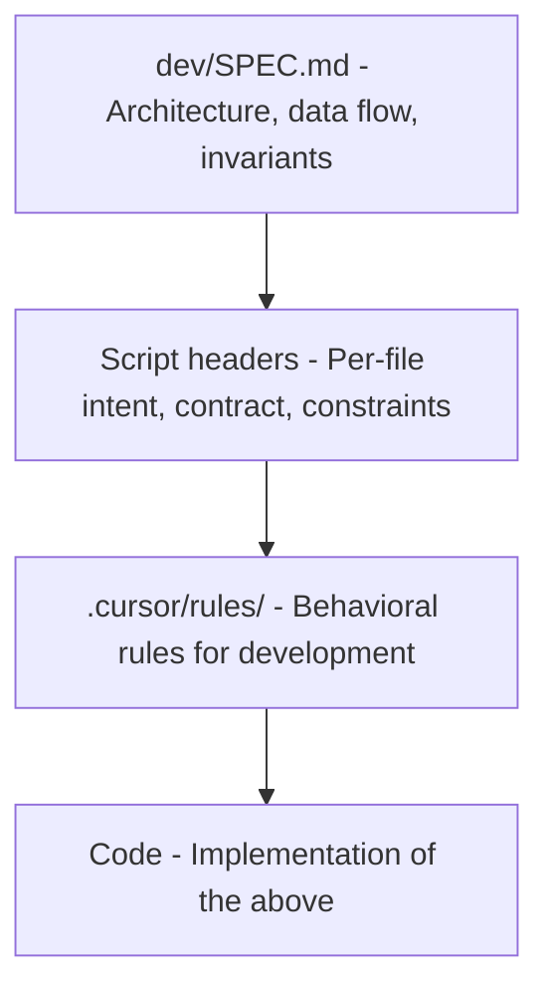
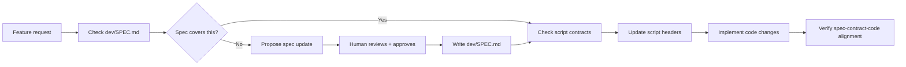

# Spec-Driven Development for ABA

## The Problem

ABA's intent lives in too many places: README, `ai/` notebooks, `.cursor/rules/`, 1,180 Cursor plans, scattered comments, and -- worst -- only in people's heads. When something breaks, the first question is "what was this supposed to do?" and the answer requires archaeology across multiple files. As the codebase grows and AI agents do more work, this gets worse, not better.

## What "Spec" Means for ABA

ABA is a bash project, not a typed language. Traditional API specs (OpenAPI, protobuf) don't apply. For ABA, the spec is:

1. **System-level spec** -- one maintained doc describing the architecture, data flow, and invariants
2. **Script-level contracts** -- structured header blocks in every script declaring intent, inputs, outputs, side effects
3. **Cursor rules** -- the behavioral constraints that AI (and humans) must follow

These three layers form the "single source of truth" pyramid:




All spec artifacts live under `dev/` (new directory). This separates developer-facing specs from user-facing docs (README) and AI working notes (`ai/`).

**Human review required**: ALL changes to files under `dev/` -- including first creation -- must be shown to the user and explicitly approved before being written. The AI must present the full content (or diff for updates) and wait for approval. This will also be enforced via a Cursor rule (`dev-review.mdc`).

## File layout

- `dev/SPEC.md` -- the authoritative system spec, including Non-goals section (Phase 1)
- `dev/WORKFLOW.md` -- how changes flow through the spec-driven process (with worked example)
- `dev/KNOWLEDGE_EXTRACT.md` -- extracted knowledge from plans mining (Phase 0, input to SPEC.md)
- `dev/adr/` -- Architecture Decision Records (numbered, one per decision)
- `AGENTS.md` -- cross-tool AI agent context file (repo root, points to dev/SPEC.md and key rules)
- `dev/ORIGINAL_PLAN.md` -- read-only snapshot of this plan as it was when approved. Never modified.
- Script header contracts live **in the scripts themselves** (not in `dev/`)

## Rule: Human Review Gate for `dev/` (created first, before any files)

A new Cursor rule `.cursor/rules/dev-review.mdc` (always active, glob: `dev/`**) that enforces:

- **NEVER write or modify any file under `dev/` or `AGENTS.md` without explicit human approval**
- `**dev/ORIGINAL_PLAN.md` is READ-ONLY** -- never modify it for any reason. It is a historical snapshot.
- For new files: show the full proposed content, wait for approval, then write
- For edits: show the diff (old vs new), wait for approval, then apply
- "Show me" means display only -- do not write. "Looks good" / "approved" / "yes" means write it.
- This applies to AI agents in all modes (agent, plan, gotest)

This rule is created as the very first step of Phase 0, before any `dev/` files exist.

## Phase 0: Mine Existing Plans for Durable Knowledge

There are **1,180 Cursor plans** in `~/.cursor/plans/`. Many contain deep architectural analysis, root cause investigations, invariants, and design decisions that exist nowhere else. This knowledge is trapped in ephemeral, task-oriented files.

**Process:**

1. Scan all plans, prioritizing recent and high-value ones (identified by name: `audit-exit-codes`, `reliable_vm_delete`, `normalize_conf_set_a_refactor`, `remove-internal-calls-from-suites`, `save-b_load-ab_refactor`, etc.)
2. Also scan `ai/*.md` docs (especially `ARCHITECTURE_VISION.md`, `DECISIONS.md`, `OC-MIRROR-INTERNALS.md`, `CONCURRENCY_PROTECTION.md`, `RUN_ONCE_*.md`)
3. Extract into `dev/KNOWLEDGE_EXTRACT.md`, categorized as:
  - **Invariants** -- things that must always be true (e.g. "scripts must not end with `exit 0`")
  - **Design decisions** -- why X was chosen over Y (e.g. "config-as-truth, not file-presence")
  - **Contracts** -- what each subsystem promises (e.g. "reg-save.sh produces a self-contained archive when OC_MIRROR_SINCE is set")
  - **Gotchas** -- things that broke and must not break again (e.g. "chmod 777 on /root breaks SSH pubkey auth")
  - **Future constraints** -- things the spec should enforce going forward

This is a one-time extraction. Once the knowledge flows into `SPEC.md` and script contracts, the plans remain as historical reference only.

## Phase 1: Create the System Spec (`dev/SPEC.md`)

Synthesized from Phase 0 extract + direct code reading. NOT a copy of README (that's user-facing). This is the **developer-facing blueprint**. Sections:

- **System model**: `aba` CLI -> Make -> scripts -> markers (`.init`, `.available`, `.installed`). One diagram.
- **Data flow**: connected host -> bundle -> disconnected host -> mirror -> cluster. The 3 personas (connected, bundle, disconnected).
- **Config-as-truth**: `aba.conf`, `mirror.conf`, `cluster.conf` are SSOT. CLI flags write to config, scripts read from config. Never infer from file presence.
- **Key abstractions**: `run_once()`, `normalize*()`, `ensure_*()`, marker files, symlinks
- **Script calling rules**: only via Make targets or `aba` CLI, never directly
- **State management**: `~/.aba/` (external state), marker files (in-tree state), `regcreds/` symlink
- **Invariants**: things that must always be true (e.g. "every `mirror load` must be followed by `aba day2`")

Source material: `dev/KNOWLEDGE_EXTRACT.md` (Phase 0), existing `ai/ARCHITECTURE_VISION.md`, `ai/DECISIONS.md`, `.cursor/rules/rules-of-engagement.mdc`, README "Miscellaneous" section, and the code itself.

**Size target**: ~200-300 lines. Concise, not exhaustive. Links to code, not copies of code.

**Non-goals section**: `dev/SPEC.md` must include an explicit **Non-goals** section listing things ABA intentionally does NOT do. This prevents scope creep and AI hallucination. Examples:

- ABA does not manage the lifecycle of the mirror/bastion host OS
- ABA does not support concurrent `aba` commands in the same working directory
- ABA does not provide HA for the mirror registry itself
- ABA does not manage DNS or DHCP (it configures them as prerequisites)
- ABA is not a general-purpose container management tool

## Phase 1b: Architecture Decision Records (`dev/adr/`)

Replace the flat `ai/DECISIONS.md` with numbered ADR files under `dev/adr/`. Each ADR captures ONE architectural decision in a standard format:

```markdown
# ADR-001: Config files as single source of truth

## Status
Accepted

## Context
ABA needs a way to pass configuration between the CLI, Make targets, and
scripts. Options: environment variables, CLI flags threaded through every
call, or config files read at each layer.

## Decision
Config files (aba.conf, mirror.conf, cluster.conf) are the single source of
truth. CLI flags write TO config files. Scripts read FROM config files.
File presence (e.g. vmware.conf existing) must NEVER be used to infer settings.

## Consequences
- Simple: scripts just `source` the config
- Debuggable: `cat mirror.conf` shows current state
- Requires discipline: every new setting must go through normalize*() -> config
- Risk: stale config if user edits config while scripts are running
```

**Rules:**

- One file per decision: `dev/adr/NNN-short-slug.md`
- ADRs are **append-only** -- never edit an accepted ADR. To reverse a decision, create a new ADR that supersedes it (link back to the old one)
- Status values: `Proposed`, `Accepted`, `Superseded by ADR-NNN`, `Deprecated`
- Keep each ADR to one page (~30-60 lines)
- Seed from: existing `ai/DECISIONS.md` entries, knowledge extracted in Phase 0, and key rules from `.cursor/rules/rules-of-engagement.mdc`

**Initial ADRs to create** (from known decisions):

- ADR-001: Config files as single source of truth
- ADR-002: run_once() for all task management
- ADR-003: Scripts called only via Make/aba CLI (never directly)
- ADR-004: Marker files for state tracking
- ADR-005: normalize*() outputs config defaults only (no derived values)
- ADR-006: `aba day2` required after every mirror load/sync

More will emerge from Phase 0 knowledge extraction.

## Phase 1c: AGENTS.md (Cross-Tool AI Context)

Create a lean `AGENTS.md` at the repo root. This is a Linux Foundation standard (60K+ repos, supported by Cursor, Copilot, Codex, Claude Code, and others). Research shows human-written AGENTS.md reduces AI runtime by ~29% and tokens by ~17%.

ABA's `AGENTS.md` is NOT a copy of the Cursor rules. It's a compact (~80-100 lines) briefing for any AI agent, containing:

- Project summary (what ABA does, target users)
- Build/test commands (exact copy-pasteable commands)
- Architecture pointer: "Read `dev/SPEC.md` for the full system spec"
- Key invariants (top 5-10, not all of them)
- Files the agent must never modify without permission
- Coding conventions that differ from bash defaults (tabs, no `(( var++ ))`, etc.)

**AGENTS.md lives at repo root** (not under `dev/`), per the standard. It's also under the human review gate since it controls AI behavior.

## Phase 2: Script-Level Contracts (Header Blocks)

Add a structured header block to every script in `scripts/`. Format:

```bash
#!/bin/bash
# reg-save.sh -- Save (mirror-to-disk) OCP release + operator images
#
# INTENT:    Create a complete or differential archive of mirrored images
#            for transfer to a disconnected environment.
# CALLED BY: Makefile.mirror 'save' target (never directly)
# CWD:       mirror/ directory (set by Makefile)
# REQUIRES:  oc-mirror in ~/bin, imageset-config.yaml in data/,
#            mirror.conf sourced via include_all.sh
# PRODUCES:  oc-mirror archive files in data/ (tar or directory)
# SIDE EFFECTS: Updates .oc-mirror/ working dir (history tracking)
# IDEMPOTENT: Yes (re-running produces same/updated archive)
# ENV:       OC_MIRROR_SINCE (optional), OC_MIRROR_CACHE (optional)
```

This is **the contract**. If the code doesn't match the contract, the contract is authoritative -- fix the code.

**Scope**: ~37 scripts in `scripts/`, 2 Makefiles, `aba.sh`. Start with the 10 most critical scripts, expand over time.

**Priority order for contracts** (highest-traffic, most-misunderstood first):

- `aba.sh` (CLI entry point)
- `include_all.sh` (shared library -- needs a function index at the top)
- `reg-save.sh`, `reg-load.sh`, `reg-sync.sh` (mirror pipeline)
- `reg-install.sh`, `reg-uninstall.sh` (registry lifecycle)
- `day2.sh` (post-mirror cluster config)
- `vmw-create.sh`, `kvm-create.sh` (VM provisioning)
- `setup-cluster.sh`, `create-cluster-conf.sh` (cluster setup)

## Phase 3: Embed Intent in Code (Beyond Headers)

For non-obvious logic inside scripts, add **WHY comments** (not WHAT comments). The rule:

- If a line of code would surprise a competent bash developer, it needs a comment explaining WHY
- If a workaround exists for an upstream bug, cite the bug
- If a value is hardcoded, explain why that value
- If code was intentionally NOT written a certain way, say so (e.g. "Don't use `sort_keys=False` here -- unsupported on Python 3.6")

This is an ongoing discipline, not a one-time task.

## Phase 4: Add Spec Rules to `.cursor/rules/`

Add a new rule `spec-driven.mdc` (always active) that enforces:

- Before changing a script, read its header contract. If the change conflicts with the contract, update the contract FIRST, get approval, then change the code.
- Before adding a new script, write the header contract first. Get approval. Then implement.
- When fixing a bug, check if the spec/contract predicted the correct behavior. If not, the spec needs updating too.
- `dev/SPEC.md` is the authority for architectural questions. If code contradicts `dev/SPEC.md`, `dev/SPEC.md` wins.
- After any architectural change, update `dev/SPEC.md` in the same commit.

## Phase 5: Validation (Longer Term)

- Add a pre-commit check that verifies every `scripts/*.sh` has a header block with required fields (INTENT, CALLED BY, CWD, etc.)
- **Backlog: `make spec-check`** -- a target that verifies machine-checkable invariants from the spec (e.g. every script has `aba_debug` at entry/exit, no script ends with `exit 0`, no direct script-to-script calls, config files have required keys). Deferred past v1.0.0.
- Periodically audit: "does the code still match the contract?"

## Future Phases (Backlog)

### Phase 6: E2E Test Framework Spec

The E2E framework (`run.sh`, `runner.sh`, `lib/framework.sh`, `lib/vm-helpers.sh`, `lib/pool-lifecycle.sh`, suites) is a significant subsystem with its own conventions, lifecycle rules, and gotchas. It deserves the same treatment:

- `dev/E2E_SPEC.md` -- architecture of the test framework (dispatcher, runner, pools, cleanup lifecycle, crash recovery)
- Header contracts for `run.sh`, `runner.sh`, and the `lib/*.sh` files
- ADRs for E2E-specific decisions (e.g. "why registered cleanup files, not trap-based cleanup", "why pools are isolated VMs not containers")
- No timeline yet -- add after core ABA spec is stable

### Phase 7: Bundle v2 Spec

Bundle v2 is in production; v1 is being deprecated and should be removed soon. The bundle subsystem (`make-bundle.sh` and related targets) needs:

- `dev/BUNDLE_SPEC.md` or a section in `dev/SPEC.md` -- bundle creation, transfer, and extraction flow
- Header contract for `make-bundle.sh`
- ADR for the v1 -> v2 migration decision and what changed
- ADR for v1 removal (when it happens)

### Phase 8: `make spec-check` (Machine-Checkable Invariants)

Deferred from Phase 5. A `make spec-check` target that verifies concrete, automatable rules from the spec:

- Every `scripts/*.sh` has `aba_debug` at entry/exit
- No script ends with `exit 0`
- No direct script-to-script calls (only via Make/aba CLI)
- Config files have all required keys
- Every script has a header block with required fields

## What NOT to Do

- **Don't create a massive separate doc tree** -- ABA is ~40 scripts, not a microservices platform. `dev/SPEC.md` + header blocks is proportional.
- **Don't duplicate README content** -- `dev/SPEC.md` is for developers, README is for users. Cross-link, don't copy.
- **Don't spec the E2E framework** in `dev/SPEC.md` -- that's a separate concern with its own docs in `test/e2e/`. (It could get its own `dev/E2E_SPEC.md` later.)
- **Don't try to spec everything at once** -- start with the critical path (mirror pipeline + cluster creation), expand.
- **Don't try to process all 1,180 plans** -- focus on plans referenced from `ai/BACKLOG.md`, plans with architectural keywords in their names, and the most recent ~50. Most plans are completed tasks with no durable knowledge.

## Worked Example: "Add debug logging for every important CLI/command"

This shows the full spec-driven flow for a real feature request. The workflow file lives at `dev/WORKFLOW.md` and is the canonical reference for how changes flow through the system.

### Step 1: Check the spec

AI reads `dev/SPEC.md`. Finds the **Observability** section (or notices it's missing). The spec should define what gets logged, when, and how. Today it might say nothing -- that's the gap.

### Step 2: Propose a spec update (human review required)

AI proposes a diff to `dev/SPEC.md` adding an **Observability / Debug logging** section:

```markdown
## Observability

### Debug logging (`aba_debug`)

When `DEBUG_ABA` is set, every script must log:
- Entry: script name + all arguments (`aba_debug "Starting: $0 $*"`)
- Key decision points: which branch was taken and why
- External commands: the exact command + args before execution
- Exit: script name + exit code

Debug output goes to stderr. Never to stdout (which carries data).
```

AI shows this to the user and waits for approval before writing.

### Step 3: Update affected script contracts

AI reads header contracts for affected scripts. For example, `reg-save.sh` currently has:

```
# ENV: OC_MIRROR_SINCE (optional), OC_MIRROR_CACHE (optional)
```

AI proposes adding to the contract:

```
# DEBUG:   Logs entry args, oc-mirror command lines, exit code (via aba_debug)
```

Script contracts live in the scripts themselves, so these edits follow normal code-change rules (not the `dev/` human-review gate).

### Step 4: Implement the code

Now -- and only now -- AI edits the actual scripts. For each script missing debug logging at entry/exit:

```bash
# At top of script, after sourcing include_all.sh:
aba_debug "Starting: $0 $*"

# Before key external commands:
aba_debug "Running: oc-mirror --config $config_file --dest $dest"

# At exit:
aba_debug "Exiting $0 with code $ret"
```

### Step 5: Verify alignment

AI checks: does every script with a `# DEBUG:` contract line actually have the corresponding `aba_debug` calls? This could be a pre-commit check (Phase 5) or a manual audit.

### What this prevents

Without spec-driven development, the AI would jump straight to Step 4 -- editing 40 scripts to add `aba_debug` calls with inconsistent formats, missing some scripts, and leaving no record of what the logging contract IS. Next time someone asks "should this script log its args?", the answer is archaeology again.

With spec-driven development, the contract is written first, the spec documents the intent, and the code is verifiable against both.

### Flow diagram




## Execution Order

Start with **Phase 0** (mine plans + review gate rule). Then **Phase 1** (`dev/SPEC.md` with non-goals). Then **Phase 1b** (seed ADRs from extracted knowledge). Then **Phase 1c** (`AGENTS.md`). Then **Phase 4** (spec-driven rule) so the discipline is enforced immediately. Then **Phase 2** (script contracts) incrementally, starting with the top 10 scripts. Phases 3 and 5 are ongoing.