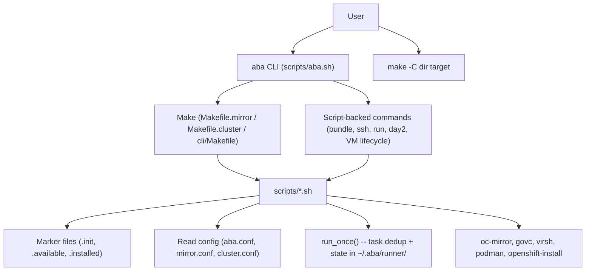
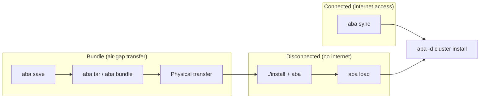

# ABA System Specification

Developer-facing blueprint for ABA.
This is the authoritative reference for architecture, data flow, and invariants.
For user-facing docs, see README.md. For the change process, see dev/02-WORKFLOW.md.

This spec is intentionally concise (~200 lines). It is the map, not the territory.
Detailed "why" lives in ADRs (`dev/adr/`). Per-script detail lives in script
header contracts. If this file grows past ~300 lines, something belongs in one
of those two places instead.

---

## System Model

### Entry points

- **`aba` CLI** (`scripts/aba.sh`): Primary entry. Resolves repo root, sources
  `include_all.sh`, parses flags, then either appends tokens to a `make` command
  or dispatches directly to a script. Requires root or passwordless sudo.
- **`make -C <dir> <target>`**: Every workflow must remain directly invocable via
  Make. The `aba` CLI is convenience; Make is the foundation.
- **TUI** (`tui/abatui.sh`): Interactive wizard. Sources `include_all.sh` but
  must never call `aba_abort` or `exit` from functions (kills the dialog UI).

### Dispatch: Make-backed vs script-backed

Most commands go through Make (`aba sync` -> `make -s sync` in the mirror dir).
A few bypass Make and call scripts directly: `bundle`, `ssh`, `run`, `info`,
`login`, `shell`, `day2`, `day2-ntp`, `day2-osus`, `shutdown`, `startup`,
`rescue`, and VM lifecycle commands (`create`, `ls`, `start`, `stop`, `kill`,
`delete`, `refresh`, `upload`).

---

## Data Flow

Three deployment scenarios, each a superset of the previous:

1. **Connected / partially disconnected**: Bastion has internet. `aba sync`
   mirrors images directly from registries into the local/remote mirror registry.
   Then install clusters.

2. **Bundle (fully air-gapped)**: Connected workstation runs `aba save` (images
   to disk via oc-mirror). `aba tar` or `aba bundle` packages the repo + images
   into a transferable archive. Physically transfer to the disconnected side.

3. **Disconnected**: Extract the bundle, run `./install` + `aba`. `aba load`
   pushes images from disk into the mirror registry. Then install clusters.

### day2 operations

`aba day2` applies IDMS/ITMS/CatalogSources to an **already-installed** cluster.
It is required after `mirror load` or `mirror sync` when the mirror content has
changed and the cluster needs to know about it. It is NOT part of the initial
cluster install flow -- fresh installs are configured correctly at install time.

**Invariant**: After every `mirror load` or `mirror sync` on a cluster that is
already running, run `aba day2`.

---

## Config as Single Source of Truth

Three config files are authoritative. CLI flags write TO config; scripts read
FROM config.

| File | Scope | Key values |
|------|-------|------------|
| `aba.conf` | Global | `ocp_version`, `ocp_channel`, `platform` (vmw/kvm/bm), `op_sets`, `ops`, network defaults, `pull_secret_file`, `ask` |
| `mirror.conf` | Per mirror dir | `reg_host`, `reg_port`, `reg_path`, `reg_vendor` (auto/quay/docker), `reg_user`, `reg_pw`, `data_dir`, `reg_ssh_key`, `reg_ssh_user` |
| `cluster.conf` | Per cluster dir | `cluster_name`, `base_domain`, `api_vip`, `ingress_vip`, `machine_network`, master/worker counts, `vlan`, `int_connection`, `mirror_name` |

**Read the config variable, not the file existence.** Config files created by ABA
contain valid values. But don't use file existence as a boolean proxy for a
setting. For example: `vmware.conf` existing does not mean `platform=vmw` --
read `platform=` from `aba.conf`. The `platform` variable drives conditional
loading of `vmware.conf` / `kvm.conf`.

**`~/.aba/config`**: User-level overrides (e.g. `OC_MIRROR_SINCE`,
`OC_MIRROR_FLAGS`, `ABA_CACHE_TTL`). Sourced by `include_all.sh` at startup.
Re-sourced on each retry iteration during long mirror operations so live edits
take effect.

---

## Key Abstractions

### run_once()

Task deduplication and coordination. State in `~/.aba/runner/<id>/`.

- **Mutual exclusion**: Only one process runs a given task ID at a time (flock).
- **Start early, wait later**: `run_once -s` starts a task in background;
  `run_once -w` blocks until it completes. Used for parallel CLI downloads and
  large catalog index downloads that kick off early and are waited on later.
- **Cached results**: Exit code and stderr are preserved; `run_once -e` retrieves
  errors. Failed tasks cleaned globally on each `aba` start via `run_once -F`.
- **Not a replacement for Make**: Make tracks file dependencies; `run_once` tracks
  non-file task completion. They are complementary.
- **Cleanup**: `run_once -r <id>` removes state for one task. `aba reset` wipes
  all runner state. No automatic cleanup on Ctrl-C.

### normalize*()

Config normalization functions. Output ONLY values that exist in config files
(with defaults). Never output derived/computed values. Callers compute derived
values after sourcing.

- `normalize-aba-conf`, `normalize-mirror-conf`, `normalize-cluster-conf`,
  `normalize-vmware-conf`, `normalize-kvm-conf`

### ensure_*()

Tool presence functions. Download/install CLI tools on demand.

- `ensure_oc`, `ensure_oc_mirror`, `ensure_openshift_install`, `ensure_govc`,
  `ensure_virsh`, `ensure_butane`, `ensure_quay_registry`

### Marker files

Make-owned sentinels that track lifecycle state. Scripts must NOT create or
remove these -- only Makefiles may.

| Marker | Location | Meaning |
|--------|----------|---------|
| `.init` | mirror/, cluster/, cli/ | Directory initialized (symlinks, configs created) |
| `.available` | mirror/ | Mirror registry installed and reachable |
| `.unavailable` | mirror/ | Registry explicitly marked as not present |
| `.install-complete` | cluster/ | Cluster installation finished |
| `.bootstrap-complete` | cluster/ | Bootstrap phase completed |
| `.preflight-done` | cluster/ | Preflight checks passed |
| `.bundle` | repo root | Marks this tree as an extracted bundle (set by `backup.sh`) |

---

## State Management

| Location | Purpose | Managed by |
|----------|---------|------------|
| `~/.aba/config` | User-level config overrides | User / install script |
| `~/.aba/runner/` | run_once task state | run_once() only |
| `~/.aba/mirror/<name>/` | Per-mirror credentials (pull secrets, CA cert) | Mirror Makefile + scripts |
| `~/.aba/ssh.conf` | SSH config for remote commands | Install script |
| `~/.aba/cache/`, `~/.aba/tmp/` | Temporary data | Various scripts; wiped by `aba reset` |
| Marker files (in-tree) | Lifecycle state | Makefiles only |

---

## Makefile Structure

| Makefile | Location | Scope |
|----------|----------|-------|
| Root `Makefile` | repo root | Top-level orchestration, `init`, `tar`, `mirror`, `cluster`, `clean`, `reset` |
| `Makefile.mirror` | `templates/` (symlinked to `mirror/`) | Mirror lifecycle: `install`, `sync`, `save`, `load`, `uninstall`, `verify` |
| `Makefile.cluster` | `templates/` (symlinked to cluster dirs) | Cluster lifecycle: `install-config`, `agent-config`, `preflight`, `install`, `delete` |
| `cli/Makefile` | `cli/` | CLI tool downloads and installation |
| `rpms/Makefile` | `rpms/` | RPM tarball download/install |
| `bundles/v2/Makefile` | `bundles/v2/` | Curated bundle creation pipeline |

---

## Script Calling Rules

1. Scripts under `scripts/` are called ONLY via Make targets or `aba` CLI
2. `$ABA_ROOT` is used only by `aba.sh` and `abatui.sh`; all other scripts use
   relative paths
3. Scripts that `cd` from `$0` must resolve symlinks:
   `SCRIPT_DIR="$(cd "$(dirname "$0")" && pwd -P)"`
4. A runtime guardrail (env var check) is planned to enforce rule 1 (backlog)

---

## Non-goals

Things ABA intentionally does not do (currently):

- **ABA does not manage the mirror/bastion host OS.** The user provisions RHEL;
  ABA installs packages it needs.
- **ABA does not provide HA for the mirror registry.** Single-instance Quay or
  Docker registry.
- **ABA does not currently manage DNS or DHCP.** These are prerequisites the user
  configures; ABA validates them via preflight checks. Optional dnsmasq/chronyd
  deployment is a potential future feature.
- **ABA is not a general-purpose container management tool.** It installs
  OpenShift clusters using a mirror registry workflow.
- **ABA does not manage the TUI as a separate product.** The TUI is a convenience
  wrapper around the same Make/script infrastructure.

---

## Coding Conventions

- Tabs for indentation, never spaces
- Empty lines must be truly empty (no trailing whitespace)
- Never use `(( var++ ))` -- use `var=$(( var + 1 ))` (exit code 1 when var is 0)
- `aba_debug` for debug logging to stderr (never stdout)
- `[ABA]` prefix only on operational messages, not banners
- Prefer `if ! cmd; then` over disabling `set -e` / ERR traps
- Comments explain WHY, not WHAT
