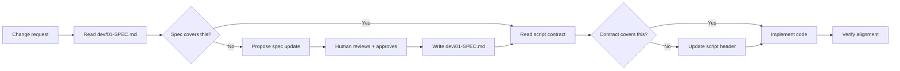

# Spec-Driven Workflow

How changes flow through the spec-driven development process for ABA.
This is the canonical reference for the change process.

---

## The Flow

Every code change follows this path:

1. **Check the spec** -- Read `dev/01-SPEC.md`. Does it cover this area?
2. **Update the spec if needed** -- If the spec is silent or wrong, propose a
   spec update first. Show the diff. Get human approval. Write it.
3. **Check the script contract** -- Read the target script's header block.
   Does the change conflict with the contract?
4. **Update the contract if needed** -- If the contract must change, update
   it first and explain why.
5. **Implement** -- Now edit the code. The spec and contract already define
   what the code should do.
6. **Verify alignment** -- Does the code match both the spec and the contract?

If a change is purely within an existing contract (e.g. fixing a bug that the
contract already says shouldn't happen), skip steps 2 and 4.



## New architectural decisions

When a change introduces a new design decision (why X over Y), create an ADR:

1. Write `dev/adr/NNN-short-slug.md` with Context, Decision, Consequences
2. Get human approval (all `dev/` files require it)
3. Reference the ADR number in the relevant script contract or spec section

ADRs are append-only. To reverse a decision, create a new ADR that supersedes
the old one.

## Human review gates

These files require explicit human approval before any write or modification:

- Everything under `dev/` (spec, ADRs, workflow, knowledge extract)
- `AGENTS.md` at repo root
- `dev/00-ORIGINAL_PLAN.md` is permanently read-only -- never modified

"Show me" = display only. "Yes" / "approved" / "looks good" = write it.

---

## Worked Example: "Add debug logging for every important CLI command"

This walks through the full flow for a real feature request.

### Step 1: Check the spec

AI reads `dev/01-SPEC.md`. Looks for an Observability or Debug Logging section.
Finds nothing -- that's a gap.

### Step 2: Propose a spec update

AI drafts a new section for `dev/01-SPEC.md`:

```markdown
## Observability

### Debug logging (aba_debug)

When DEBUG_ABA is set, every script must log:
- Entry: script name + all arguments (aba_debug "Starting: $0 $*")
- Key decision points: which branch was taken and why
- External commands: the exact command + args before execution
- Exit: script name + exit code

Debug output goes to stderr. Never to stdout (which carries data).
```

AI shows this to the human. Waits for approval. Writes it.

### Step 3: Check script contracts

AI reads the header block of `reg-save.sh`. The existing contract says:

```
# ENV: OC_MIRROR_SINCE (optional), OC_MIRROR_CACHE (optional)
```

No mention of debug logging. The contract needs updating.

### Step 4: Update the contract

AI adds to the header:

```
# OBSERVABILITY: Logs entry args, oc-mirror command lines, exit code via aba_debug
```

This is a normal code edit (script headers are not under `dev/`).

### Step 5: Implement

Now AI edits `reg-save.sh` to add the actual `aba_debug` calls:

```bash
aba_debug "Starting: $0 $*"
# ... script body ...
aba_debug "Running: oc-mirror --v2 --config $config_file file://."
# ... at exit ...
aba_debug "Exiting $0 with code $ret"
```

Repeat for each script that needs debug logging.

### Step 6: Verify alignment

Check: does every script with an `# OBSERVABILITY:` contract line actually
have the corresponding `aba_debug` calls? This could become a `make spec-check`
rule in the future.

### What this prevents

Without the workflow, AI jumps straight to step 5 -- editing 40 scripts with
inconsistent logging formats, missing some scripts, and leaving no record of
what the logging contract is. Next time someone asks "should this script log
its args?", the answer requires archaeology.

With the workflow, the contract is written first, the spec documents the
intent, and the code is verifiable against both.
