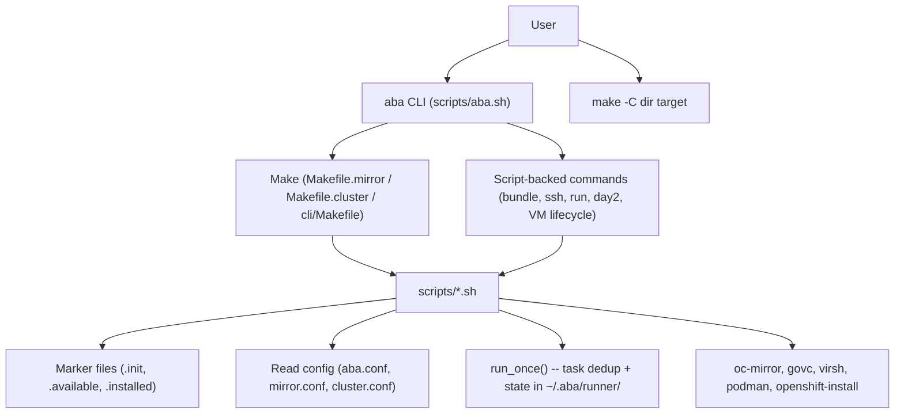
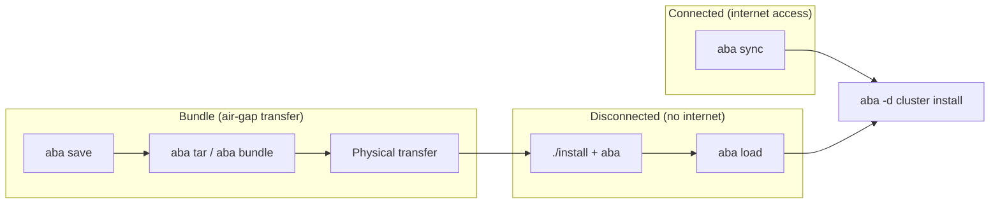

# ABA System Specification

Developer-facing blueprint for ABA.
This is the authoritative reference for architecture, data flow, and invariants.
For user-facing docs, see README.md. For the change process, see devel/02-WORKFLOW.md.

This spec is intentionally concise (~200 lines). It is the map, not the territory.
Detailed "why" lives in ADRs (`devel/adr/`). Per-script detail lives in script
header contracts. If this file grows past ~300 lines, something belongs in one
of those two places instead.

---

## System Model



### Entry points

- **`aba` CLI** (`scripts/aba.sh`): Primary entry. Resolves repo root, sources
  `include_all.sh`, parses flags, then either appends tokens to a `make` command
  or dispatches directly to a script. Requires root or passwordless sudo.
- **`make -C <dir> <target>`**: Every workflow must remain directly invocable via
  Make. The `aba` CLI is convenience; Make is the foundation.
- **TUI** (`tui/abatui.sh`): Interactive wizard. Sources `include_all.sh` but
  must never call `aba_abort` or `exit` from functions (kills the dialog UI).

### Dispatch: Make-backed vs script-backed

Most commands go through Make (`aba sync` -> `make -s sync` in the mirror dir).
A few bypass Make and call scripts directly: `bundle`, `ssh`, `run`, `info`,
`login`, `shell`, `day2`, `day2-ntp`, `day2-osus`, `shutdown`, `startup`,
`rescue`, `upgrade`, and VM lifecycle commands (`create`, `ls`, `start`, `stop`,
`kill`, `delete`, `refresh`, `upload`).

---

## Data Flow

Three deployment scenarios, each a superset of the previous:



1. **Connected / partially disconnected**: Bastion has internet. `aba sync`
   mirrors images directly from registries into the local/remote mirror registry.
   Then install clusters.

2. **Bundle (fully air-gapped)**: Connected workstation runs `aba save` (images
   to disk via oc-mirror). `aba tar` or `aba bundle` packages the repo + images
   into a transferable archive. Physically transfer to the disconnected side.

3. **Disconnected**: Extract the bundle, run `./install` + `aba`. `aba load`
   pushes images from disk into the mirror registry. Then install clusters.

### day2 operations

`aba day2` applies IDMS/ITMS/CatalogSources to an **already-installed** cluster.
It is required after `mirror load` or `mirror sync` when the mirror content has
changed and the cluster needs to know about it. It is NOT part of the initial
cluster install flow -- fresh installs are configured correctly at install time.

**Invariant**: After every `mirror load` or `mirror sync` on a cluster that is
already running, run `aba day2`.

### Cluster upgrade (disconnected)

`aba upgrade` upgrades an already-installed cluster to a target OCP version
using images from the local mirror registry. The workflow:

1. **Connected side**: `aba --target-version <ver>` writes `ocp_version_target`
   to `mirror.conf`. `aba imagesetconf` generates a single-channel ISC with
   `shortestPath: true` spanning `ocp_version` → `ocp_version_target`.
   `aba save` pulls the upgrade images.
2. **Transfer**: Archive + ISC transferred to disconnected side.
3. **Disconnected side**: `aba load` pushes upgrade images into the mirror.
   `aba upgrade --to <ver>` resolves the release digest from the local mirror,
   auto-runs `day2` if IDMS is missing, and triggers `oc adm upgrade --to-image`.

**Invariants**:
- Current cluster version is always queried live (`oc get clusterversion`),
  never cached.
- Target must be strictly higher than current version.
- Release image must exist in the local mirror (verified via `skopeo inspect`).
- The `--force` flag is passed through to `oc adm upgrade` when specified.

### Cluster deletion (`aba delete`)

Destroys cluster VMs and runs `make clean` to remove all generated artifacts
(ISO, configs, stamp files, binaries). Only `cluster.conf` is preserved.
With `--force`: removes the entire cluster directory.

The ISO embeds a specific OCP version and cluster config — cleaning it
ensures the next `aba cluster` regenerates from current settings. Note: The ISO
has no certificate expiry (agent-based installer generates certs at runtime;
see https://access.redhat.com/solutions/7087353).

State backup in `~/.aba/clusters/` is not affected.

### Bundle content rules

`backup.sh` controls what goes into bundles (`aba tar`, `aba bundle`).
`mirror.conf` is excluded from bundles -- each side (connected/disconnected)
maintains its own `mirror.conf` with site-specific registry settings
(`reg_host`, `reg_port`, credentials). Transferring the connected side's
`mirror.conf` would overwrite the disconnected side's registry configuration.

---

## Config as Single Source of Truth

Three config files are authoritative. CLI flags write TO config; scripts read
FROM config.

| File | Scope | Key values |
|------|-------|------------|
| `aba.conf` | Global | `ocp_version`, `ocp_channel`, `platform` (vmw/kvm/bm), `op_sets`, `ops`, network defaults, `pull_secret_file`, `ask` |
| `mirror.conf` | Per mirror dir | `reg_host`, `reg_port`, `reg_path`, `reg_vendor` (auto/quay/docker), `reg_user`, `reg_pw`, `data_dir`, `reg_ssh_key`, `reg_ssh_user`, `ocp_version_target` (upgrade) |
| `cluster.conf` | Per cluster dir | `cluster_name`, `base_domain`, `api_vip`, `ingress_vip`, `starting_ip`, `machine_network`, master/worker counts, `vlan`, `int_connection`, `mirror_name` |

**Read the config variable, not the file existence.** Config files created by ABA
contain valid values. But don't use file existence as a boolean proxy for a
setting. For example: `vmware.conf` existing does not mean `platform=vmw` --
read `platform=` from `aba.conf`. The `platform` variable drives conditional
loading of `vmware.conf` / `kvm.conf`.

**`~/.aba/config`**: User-level overrides (e.g. `OC_MIRROR_SINCE`,
`OC_MIRROR_FLAGS`, `OC_MIRROR_PIN_CATALOGS`, `ABA_CACHE_TTL`). Sourced by
`include_all.sh` at startup. Re-sourced on each retry iteration during long
mirror operations so live edits take effect.

---

## install-config.yaml Platform Selection

The install-config.yaml template (`templates/install-config.yaml.j2`) selects
the `platform:` section based on cluster type, architecture, and hypervisor:

| Priority | Condition | platform: value |
|----------|-----------|-----------------|
| 1 | SNO (1 master, 0 workers) | `none: {}` |
| 2 | ARCH is s390x or ppc64le | `none: {}` |
| 3 | VMware + vCenter (platform=vmw, VC=1) | `vsphere:` (full vCenter block) |
| 4 | Everything else (BM, KVM, ESXi-direct) | `baremetal:` (apiVIPs/ingressVIPs) |

s390x and ppc64le only support `platform: none` because the OpenShift installer
on these architectures does not support the baremetal platform type. Multi-node
clusters on these architectures rely on external load balancing for VIPs (UPI).
The generated install-config.yaml includes a comment reminding the user to
configure an external load balancer for the API and ingress endpoints.

ESXi-direct (`VC` empty) uses the baremetal platform block, same as bare-metal
and KVM. Only vCenter deployments get the full vsphere block with
failureDomains/vcenters.

---

## Catalog Digest Pinning (oc-mirror workaround)

Upstream bug: [OCPBUGS-81712](https://issues.redhat.com/browse/OCPBUGS-81712)

oc-mirror v2 resolves operator catalog tags (e.g. `redhat-operator-index:v4.20`)
at runtime by contacting the upstream registry (`registry.redhat.io`). This
happens even during disk2mirror (load) on disconnected hosts, causing
`no route to host` failures. Pinning catalogs by digest (`@sha256:...`) prevents
this because oc-mirror skips upstream tag resolution for digest references.

### How it works

1. **Capture**: `download-catalog-index.sh` captures the manifest digest via
   `podman image inspect` after pulling each catalog image. Stored in
   `.index/.{catalog}-index-v{ver}.digest`.

2. **Pin at runtime**: `_run_oc_mirror_with_retry()` calls
   `_oc_mirror_pin_catalogs_by_digest()` before invoking oc-mirror. This does a
   single-pass `sed` producing `data/imageset-config-digest.yaml` with tags
   replaced by digests. The user's `imageset-config.yaml` is never modified.

3. **oc-mirror receives**: `--config imageset-config-digest.yaml` instead of the
   original. The digest file persists alongside the original for debugging.

### Invariants

- The user's `imageset-config.yaml` is NEVER modified by the pinning mechanism.
- If no digest files exist (old install, capture failed), the original ISC is
  used as-is -- graceful fallback.
- Works for all three mirror workflows: save (mirror2disk), sync (mirror2mirror), load (disk2mirror).
- User-edited ISCs also benefit (tag substitution is content-based, not
  generation-based).

### Disabling / reverting

Set `OC_MIRROR_PIN_CATALOGS=0` in `~/.aba/config` or environment. Remove the
workaround entirely once oc-mirror fixes upstream tag resolution in air-gap --
track [OCPBUGS-81712](https://issues.redhat.com/browse/OCPBUGS-81712) and
[openshift/oc-mirror#1390](https://github.com/openshift/oc-mirror/pull/1390)
(grep for `OC_MIRROR_PIN_CATALOGS` and `_oc_mirror_pin_catalogs_by_digest`).

---

## Key Abstractions

### run_once()

Task deduplication and coordination. State in `~/.aba/runner/<id>/`.

- **Mutual exclusion**: Only one process runs a given task ID at a time (flock).
- **Start early, wait later**: `run_once -s` starts a task in background;
  `run_once -w` blocks until it completes. Used for parallel CLI downloads and
  large catalog index downloads that kick off early and are waited on later.
- **Cached results**: Exit code and stderr are preserved; `run_once -e` retrieves
  errors. Failed tasks cleaned globally on each `aba` start via `run_once -F`.
- **Failed-task cleanup**: `run_once -F` (called at every `aba` start) removes
  tasks with non-zero exit codes. Also cleans zombie tasks: directories with no
  exit file and no running process (caused by SIGKILL, OOM, or machine crash).
- **Error guidance**: When `run_once -w` returns a non-zero exit code (and not
  in quiet mode), it shows the last lines of stderr and a recovery hint:
  "If this problem persists, re-run './install' from the ABA directory to clear the task cache."
- **Not a replacement for Make**: Make tracks file dependencies; `run_once` tracks
  non-file task completion. They are complementary.
- **Cleanup**: `run_once -r <id>` removes state for one task. `aba reset` wipes
  all runner state. No automatic cleanup on Ctrl-C.
- **Testing**: `test/func/test-run-once-failed-cleanup.sh` covers failed-task
  cleanup, zombie cleanup, error messaging, and quiet-mode suppression.

### run_once usage pattern

1. **Background kick-off is optional** (zero or more times): Downloading can
   happen zero or more times.  It is purely a performance optimization
   (pre-warming).  The install task's Make handles its own download via
   file-target dependencies.  run_once is idempotent -- calling it multiple
   times is safe (starts or returns immediately if already running/done).
   run_once handles backgrounding internally -- no `&` after the call.

2. **`run_once -w` before first use of the artifact** (the only correctness
   requirement): Right before a specific tool is first needed, wait for ONLY
   that tool.  Never "wait for all."  Use `ensure_*()` functions or
   `run_once -w` for the specific task ID.  Wait mode is self-sufficient:
   if the task was never started, wait acquires the lock, reloads the command
   from `cmd.sh` (or uses the command on the CLI), and runs it in the
   foreground.  A prior `run_once -i` (start) is not required for
   correctness -- it only saves time by running the task in the background
   before the wait is reached.  **The wait MUST be quiet when the task is
   already done** -- the `-m` message is only shown when `run_once -w`
   actually has to block (task still running); if the task already completed,
   the wait returns silently with no output.

3. **CRITICAL -- download and install are different task IDs**: They have
   separate flocks and can run concurrently on the same tarball.  Starting
   an install while a download is still writing the tarball corrupts the
   file (Make sees the partial file, runs `tar`, produces a truncated
   binary).  To avoid this, either:
   - Wait for the download task before starting the install task (what
     `ensure_*()` and `cli-install-all.sh` do), **or**
   - Do NOT start a separate download task -- let the install task's Make
     handle the download serially (safe, single process, no race).
   See ADR-008 Finding 5 for details.

4. **run_once wraps Make from outside**: run_once calls live in shell scripts
   (cli-download-all.sh, cli-install-all.sh, ensure_*() functions), never inside
   Makefile recipes. A user running `make oc` directly gets standard serial Make
   behavior -- no bg processes, no races. Make handles file-target dependencies;
   run_once handles cross-process coordination.

5. **No "wait for all" gates**: Do not block on all tools when only one is needed.
   `cli-install-all.sh --wait` (without a filter) and `.cli` are appropriate only
   when ALL tools are genuinely required (e.g., bundling the entire repo).

6. **Bundle downloads include all OS variants**: When creating a bundle
   (`aba tar`, `aba bundle`), all tarballs must be downloaded -- including both
   RHEL 8 and RHEL 9 variants of oc, oc-mirror, etc. The target host's OS
   version is unknown at bundle creation time.

6. **Optional tarballs (govc)**: Always TRY to download govc, but treat download
   failure as fatal only when `platform=vmw`. If `platform!=vmw` and the download
   fails (e.g., GitHub not whitelisted), ignore the failure and continue. This way
   non-vmw users get govc if GitHub is reachable (useful if they switch platforms
   later) but are never blocked by it. Only vmw users are hard-blocked on govc
   download failure.

7. **Shared task IDs between TUI and aba**: TUI and `aba` CLI share task IDs
   by design — a user can stop the TUI and use `aba` (or vice versa) and
   completed tasks carry over.  Commands for a given task ID must be
   semantically equivalent but need not be string-identical.  Centralize
   commands as variables in `include_all.sh` to prevent drift.  Do NOT
   enforce string equality at runtime (a guard that did this caused FATAL
   errors in E2E production due to relative vs absolute paths, `-d` vs
   `--dir`, etc.).

### normalize*()

Config normalization functions. Output ONLY values that exist in config files
(with defaults). Never output derived/computed values. Callers compute derived
values after sourcing.

- `normalize-aba-conf`, `normalize-mirror-conf`, `normalize-cluster-conf`,
  `normalize-vmware-conf`, `normalize-kvm-conf`

### IP math helpers

Utility functions for CIDR arithmetic in `scripts/include_all.sh`:

- `ip_to_int`, `int_to_ip` — dotted-quad ↔ 32-bit integer conversion
- `ip_in_cidr` — test if an IP is within a CIDR
- `cidr_last_ip`, `cidr_host_count` — broadcast address and usable host count
- `suggest_starting_ip` — compute a sensible default node IP (network base + 100, clamped for small CIDRs). Used by `create-cluster-conf.sh` to auto-populate `starting_ip` instead of a placeholder string.

### ensure_*()

Tool presence functions. Download/install CLI tools on demand.

- `ensure_oc`, `ensure_oc_mirror`, `ensure_openshift_install`, `ensure_govc`,
  `ensure_virsh`, `ensure_butane`, `ensure_quay_registry`

### Marker files

Make-owned sentinels that track lifecycle state. Scripts must NOT create or
remove these -- only Makefiles may.

| Marker | Location | Meaning |
|--------|----------|---------|
| `.init` | mirror/, cluster/, cli/ | Directory initialized (symlinks, configs created) |
| `.available` | mirror/ | Mirror registry installed and reachable |
| `.unavailable` | mirror/ | Registry explicitly marked as not present |
| `.install-complete` | cluster/ | Cluster installation finished |
| `.bootstrap-complete` | cluster/ | Bootstrap phase completed |
| `.preflight-done` | cluster/ | Preflight checks passed |
| `.bundle` | repo root | Marks this tree as an extracted bundle (set by `backup.sh`) |

---

## State Management

| Location | Purpose | Managed by |
|----------|---------|------------|
| `~/.aba/config` | User-level config overrides | User / install script |
| `~/.aba/runner/` | run_once task state | run_once() only |
| `~/.aba/mirror/<name>/` | Per-mirror credentials, state, config backups | Mirror Makefile + scripts |
| `~/.aba/clusters/<name>/` | Per-cluster auth, state, config backups | monitor-install.sh (write), aba.sh (recreate) |
| `~/.aba/ssh.conf` | SSH config for remote commands | Install script |
| `~/.aba/cache/`, `~/.aba/tmp/` | Temporary data | Various scripts; wiped by `aba reset` |
| Marker files (in-tree) | Lifecycle state | Makefiles only |

### Externalized state (ADR-007)

Installed-object state lives outside the working dir in `~/.aba/`:

- **Mirror**: `~/.aba/mirror/<name>/state.sh` — registry identity (reg_host, reg_port, reg_vendor, reg_root, reg_user, reg_pw) plus operational state (reg_ssh_key, reg_ssh_user, reg_root_opts, reg_fw_opened)
- **Cluster**: `~/.aba/clusters/<name>/state.sh` — cluster identity (cluster_name, base_domain, starting_ip, cluster_type, machine_network, prefix_length, platform)

State files use lowercase vars matching config file names. Normalize functions
source state.sh after config; immutable fields (locked after install) are
overridden from state.sh with a stderr warning on drift. Mutable fields
(ops, op_sets) remain editable in config files.

Auth files (kubeconfig, kubeadmin-password) and config backups (cluster.conf,
install-config.yaml, agent-config.yaml, macs.conf, mirror.conf) are stored
alongside state.sh. Backups go in a `backup/` subdir and use `cp -p` to
preserve timestamps (critical for Make dependency tracking).

If a cluster working dir is deleted, `aba delete` recreates it from the
state backup (restoring config files, Makefile, symlinks, markers) and
proceeds normally. All dirs under `~/.aba/clusters/` are mode 700.

Helper functions (`cluster_kubeconfig()`, `cluster_state_dir()`,
`cluster_is_installed()`) encapsulate lookups — scripts never hard-code
`~/.aba/` paths. Convenience symlinks (`clusterstate ->`, `regcreds ->`)
exist for human browsing; scripts use helpers directly.

---

## Makefile Structure

| Makefile | Location | Scope |
|----------|----------|-------|
| Root `Makefile` | repo root | Top-level orchestration, `init`, `tar`, `mirror`, `cluster`, `clean`, `reset` |
| `Makefile.mirror` | `templates/` (symlinked to `mirror/`) | Mirror lifecycle: `install`, `sync`, `save`, `load`, `uninstall`, `verify` |
| `Makefile.cluster` | `templates/` (symlinked to cluster dirs) | Cluster lifecycle: `install-config`, `agent-config`, `preflight`, `install`, `delete` |
| `cli/Makefile` | `cli/` | CLI tool downloads and installation |
| `rpms/Makefile` | `rpms/` | RPM tarball download/install |
| `bundles/v2/Makefile` | `bundles/v2/` | Curated bundle creation pipeline |

### Download safety

All Makefiles that download files via `curl` use `.DELETE_ON_ERROR` to ensure
partial/corrupt files are removed when a recipe fails. Without this, Make
considers a partial file "up to date" on the next run and silently skips the
re-download. Affected: `cli/Makefile`, `templates/Makefile.mirror`,
`test/Makefile`.

---

## Script Calling Rules

1. Scripts under `scripts/` are called ONLY via Make targets or `aba` CLI
2. `$ABA_ROOT` is used only by `aba.sh` and `abatui.sh`; all other scripts use
   relative paths
3. Scripts that `cd` from `$0` must resolve symlinks:
   `SCRIPT_DIR="$(cd "$(dirname "$0")" && pwd -P)"`
4. A runtime guardrail (env var check) is planned to enforce rule 1 (backlog)

---

## Non-goals

Things ABA intentionally does not do (currently):

- **ABA does not manage the mirror/bastion host OS.** The user provisions RHEL;
  ABA installs packages it needs.
- **ABA does not provide HA for the mirror registry.** Single-instance Quay or
  Docker registry.
- **ABA does not currently manage DNS or DHCP.** These are prerequisites the user
  configures; ABA validates them via preflight checks. Optional dnsmasq/chronyd
  deployment is a potential future feature.
- **ABA is not a general-purpose container management tool.** It installs
  OpenShift clusters using a mirror registry workflow.
- **ABA does not manage the TUI as a separate product.** The TUI is a convenience
  wrapper around the same Make/script infrastructure.

---

## Observability

### Debug logging (aba_debug)

When `DEBUG_ABA` is set (via `aba --debug` / `aba -D` / `export DEBUG_ABA=1`),
scripts log diagnostic information to stderr via `aba_debug`. Debug output is
invisible to users unless explicitly enabled.

#### What must be logged

**Tier 1 -- every invocation of these external commands must have a preceding
`aba_debug "Running: ..."` call:**

| Command | Why |
|---------|-----|
| `oc-mirror` | Core mirroring engine; failures waste hours. Log full command + flags. |
| `openshift-install` | Cluster installer; expensive failures. Log subcommand + dir. |
| `govc` | VMware VM lifecycle; silent failures leave orphan VMs. Log subcommand + VM name. |
| `virsh` | KVM VM lifecycle; same orphan risk. Log subcommand + domain name. |
| `oc` | Cluster operations (day2, startup, shutdown). Log subcommand + key args. |
| `make` (internal) | Orchestration dispatch; wrong target is subtle. Log target + directory. |

Script entry/exit logging (`aba_debug "Starting: $0 $*"`) is recommended but
not mandatory for every script.

#### Format contract

- **Use `$exec_cmd`** to define the command once, log it, execute it.
  This eliminates drift between what is logged and what runs.
  `exec_cmd` is reserved for this purpose -- never use `$cmd` (already
  used for other purposes in many scripts).

  ```bash
  exec_cmd="govc vm.power -on $vm_name"
  aba_debug "Running: $exec_cmd"
  $exec_cmd
  ```

  For commands needing `eval` (pipes, redirects, embedded quotes):

  ```bash
  exec_cmd="oc get nodes --no-headers"
  aba_debug "Running: $exec_cmd"
  eval $exec_cmd
  ```

  For scripts that already use `$cmd` (e.g. `vmw-create.sh`,
  `reg-uninstall.sh`), add `aba_debug "Running: $cmd"` before the
  existing execution -- do not introduce a second variable.

- Output: always stderr, never stdout (handled by `aba_debug` itself)
- Gate: `DEBUG_ABA` env var (empty = silent, non-empty = active)
- Timestamp: added automatically by `aba_debug`
- **Consecutive dedup**: `aba_debug` suppresses consecutive identical messages
  automatically. This means polling functions (called every N seconds by
  `aba_wait_show`) can and should include `aba_debug` calls -- the first
  invocation is logged, subsequent identical calls are silently suppressed.
  No special exception needed for polling code.
- For commands in heredocs or remote SSH, log what will be sent:
  `aba_debug "Running on $host: <command>"`

#### Non-goals (for now)

- Tier 2/3 commands (podman, ssh, curl, skopeo, firewall-cmd, dnf, tar) --
  future work, tracked in BACKLOG.md
- Structured/JSON logging
- Log levels beyond debug/info

---

## Coding Conventions

- Tabs for indentation, never spaces
- Empty lines must be truly empty (no trailing whitespace)
- Never use `(( var++ ))` -- use `var=$(( var + 1 ))` (exit code 1 when var is 0)
- `aba_debug` for debug logging to stderr (never stdout)
- `[ABA]` prefix only on operational messages, not banners
- Prefer `if ! cmd; then` over disabling `set -e` / ERR traps
- Comments explain WHY, not WHAT
