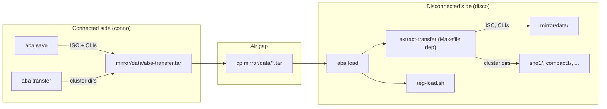

# Transfer Tar Redesign: Carry Primed Cluster Dirs

## The problem

Today `aba-transfer.tar` (created by `reg-save.sh` during `aba save`) carries only ISC files and upgrade CLIs. There's no way to send a new primed cluster dir to an existing disco site without building a full bundle. A user who creates a new cluster on conno and just wants to send the config to disco is stuck.

## Design questions and proposed answers

### Q1: Can we reuse `backup.sh` to create transfer tars?

**No, not directly.** `backup.sh` creates a full repo tar (scripts, templates, cli, mirror, etc.) -- it's the wrong tool for a lightweight "just cluster dirs" transfer. BUT we can **extract the cluster-dir preparation logic** (symlink resolution, `.primed` markers, exclusion list) into a shared function that both `backup.sh` and the new transfer command call.

Specifically, the reusable piece is lines 96-163 of [backup.sh](scripts/backup.sh):

- Walk `*/cluster.conf`, skip `mirror/`
- Resolve `vmware.conf`, `kvm.conf`, `mirror.conf` symlinks to real copies
- Touch `.primed` + `.bm-message` for fully pre-built dirs
- Touch `.init` from `cluster.conf` timestamp
- The EXIT-trap restore logic (parallel arrays for original symlink targets)

**Proposal:** Extract this into a function `_prepare_cluster_dirs_for_transfer()` in [include_all.sh](scripts/include_all.sh) (or a new `scripts/transfer-common.sh` sourced by both). Both `backup.sh` and the new transfer script call it.

### Q2: Should we allow tarring ALL cluster dirs vs. ONE specific dir?

**Yes, both.** Two entry points:

- **All dirs** (repo-level): `aba transfer` or `make transfer` from repo root -- walks all `*/cluster.conf` dirs, creates `mirror/data/aba-transfer.tar`. This is the common "send everything new to disco" workflow.
- **One dir** (cluster-level): `aba -d mycluster transfer` or `make -C mycluster transfer` -- tars just that one cluster dir into `mirror/data/aba-transfer.tar`. Useful when you only want to send a single new cluster.

Both use the same underlying script. The difference is just which dirs to include.

### Q3: Should `aba save` also include cluster dirs?

**No.** Keep `aba save` focused on images. The transfer tar it creates today (ISC + CLIs) is about image metadata. Cluster configs are a separate concern.

However, `aba save` and `aba transfer` both write to `mirror/data/aba-transfer.tar`. If the user runs both, the second overwrites the first. Two options:

- **Option A:** `aba save` includes cluster dirs automatically if any exist (single tar, no conflict). Simple but couples image saves to config transfers.
- **Option B:** Separate files: `aba-transfer.tar` (ISC/CLIs from save) and `aba-transfer-configs.tar` (cluster dirs from transfer). No conflict but the user copies two extra files.
- **Option C (recommended):** `aba save` creates `aba-transfer.tar` as today. `aba transfer` APPENDS cluster dirs to the existing `aba-transfer.tar` (or creates a new one if none exists). If the user runs `aba save` then `aba transfer`, the tar has both. If they only run `aba transfer`, the tar has only configs. On disco, extraction handles whatever is in the tar.

### Q4: Where should extraction live?

**New script `scripts/transfer-extract.sh`** called via a new Makefile target `extract-transfer` that is a dependency of `load`. This:

- Moves the 40-line inline extraction block out of [reg-load.sh](scripts/reg-load.sh) (lines 46-85)
- Adds cluster-dir extraction with smart handling (new dir = extract all, installed dir = only update day2/)
- Can also be run standalone: `aba -d mirror extract-transfer`

### Q5: What files go into the cluster-dir transfer tar?

**Keep it simple: tar the cluster dir as-is, exclude only `iso-agent-based/`.**

The only large file in a cluster dir is the ISO (1GB+), which gets regenerated on disco from the configs anyway. Everything else is tiny:

- Config files: `cluster.conf`, `install-config.yaml`, `agent-config.yaml`, `vmware.conf`, `kvm.conf`, `mirror.conf`, `macs.conf` -- a few KB each
- Symlinks: `scripts/`, `templates/`, `cli/`, `mirror/`, `Makefile`, `aba.conf` -- a few bytes each, and they MUST be included or the cluster dir is broken on disco (Make can't find its Makefile/scripts)
- Markers: `.primed`, `.bm-message`, `.init` -- zero bytes each
- Lifecycle markers (`.install-complete` etc.) -- won't exist on a new cluster being sent to disco; for the update case, extraction handles it
- `day2/` subdirectory -- small YAML manifests

No clever exclusion list to maintain. The resulting tar is a few KB per cluster dir.

---

## Implementation

### Step 1: Extract shared cluster-dir preparation

Create a reusable function (or small script `scripts/prepare-cluster-dirs.sh`) that:

- Accepts a list of cluster dirs (or "all")
- Does the symlink resolution + `.primed` marking
- Returns the file list suitable for tar
- Provides a cleanup/restore function for the EXIT trap

Both `backup.sh` and the new transfer script source/call it.

### Step 2: New `scripts/create-transfer.sh`

- Sources the shared preparation function
- Tars cluster dirs as-is, excluding only `iso-agent-based/` (the sole large artifact)
- No other exclusion list -- symlinks, markers, day2/ all included as-is
- Optionally appends to existing `aba-transfer.tar` (from `aba save`) or creates fresh
- Writes to `mirror/data/aba-transfer.tar`
- Paths relative to aba root so extraction on disco works

### Step 3: New Make targets

In [Makefile](Makefile) (repo root):

```
.PHONY: transfer
transfer:  ## Create transfer tar with primed cluster dirs
    $(SCRIPTS)/create-transfer.sh $(dirs)
```

In [templates/Makefile.cluster](templates/Makefile.cluster):

```
.PHONY: transfer
transfer:  ## Add this cluster dir to the transfer tar
    $(SCRIPTS)/create-transfer.sh $(CURDIR)
```

### Step 4: Wire `aba transfer` in aba.sh

Add `transfer` to the bypass list so it maps to a Make target (or handle it like `bundle` if more arg processing is needed).

### Step 5: New `scripts/transfer-extract.sh`

- Checks for `data/aba-transfer.tar`
- Extracts ISC/CLI files (existing behavior, moved from reg-load.sh)
- Extracts cluster dirs with smart handling:
  - New dir: extract everything
  - Installed dir (`.install-complete`): only update `day2/` manifests
  - Existing but not installed: overwrite with warning
- Deletes the transfer tar after extraction

### Step 6: Wire extraction into Makefile.mirror

In [templates/Makefile.mirror](templates/Makefile.mirror):

```
.PHONY: extract-transfer
extract-transfer:
    $(SCRIPTS)/transfer-extract.sh

load: .init .rpmsint .check-data-dir install extract-transfer
    $(SCRIPTS)/reg-load.sh $(retry)
```

### Step 7: Remove inline extraction from reg-load.sh

Delete lines 46-85 of [reg-load.sh](scripts/reg-load.sh) (the `aba-transfer.tar` extraction block). Now handled by `transfer-extract.sh` via Makefile dependency.

---

## Data flow




## Open question for user

Should `aba transfer` APPEND cluster dirs to an existing `aba-transfer.tar` (Option C above), or should it always create a fresh tar? Appending is elegant (one file to copy) but means the user must run `aba save` before `aba transfer` if they want both images and configs. Creating fresh is simpler but may overwrite the ISC/CLI content from a previous `aba save`.