# ABA Workflow Diagram

This chart shows the complete ABA flow - fully disconnected (air-gapped bundle),
partially disconnected, and connected scenarios, plus the platform choices
(bare-metal vs VMware/KVM automated). Running `aba` in interactive mode follows
this workflow. Command labels map to real targets (`aba bundle`, `aba -d mirror sync`,
`aba -d mirror load`, `aba cluster`, `aba preflight`, `aba iso`, `aba install`, `aba mon`).

```mermaid
flowchart TD
    Start([START HERE]) --> Install["Install aba<br/>cd aba"]
    Install --> RunAba["Run: aba"]
    RunAba --> Q1{Install<br/>Bundle?}

    %% Air-gapped: extracted from a pre-built install bundle
    Q1 -->|Yes| Extracted["aba extracted from<br/>install bundle<br/>(assume air-gapped)"]
    Extracted --> ConfAba["Check / edit aba.conf"]
    ConfAba --> LoadMirror["Run: aba -d mirror load<br/>(images from disk -> registry)"]

    %% No bundle -> must be online
    Q1 -->|No| Q2{Check<br/>online?}
    Q2 -->|No| Abort([Abort: not online])

    Q2 -->|Yes| ConfValues["Check / set values in aba.conf:<br/>- Base domain<br/>- OCP channel &amp; version<br/>- Red Hat pull secret<br/>- Preferred editor<br/>- Operators (optional)"]
    ConfValues --> Q3{Partially<br/>disconnected?}

    %% Partially disconnected: sync directly to mirror
    Q3 -->|Yes| SyncMirror["Run: aba -d mirror sync<br/>(internet -> mirror registry)"]
    SyncMirror --> ConfMirror

    %% Not partial -> fully disconnected?
    Q3 -->|No| Q4{Fully<br/>disconnected?}

    %% Connected: no mirror, nodes pull direct/proxy
    Q4 -->|No| SetIntConn["Set int_connection = direct / proxy<br/>(no mirror registry needed)"]
    SetIntConn --> InstallCluster

    %% Fully disconnected: build bundle on connected side, transfer
    Q4 -->|Yes| CreateBundle["Run: aba bundle - Create Install Bundle:<br/>- generate imageset-config<br/>- download CLIs &amp; artifacts<br/>- save Quay &amp; images<br/>- create bundle archive"]
    CreateBundle --> CopyBundle["Copy bundle to bastion:<br/>- copy install bundle<br/>- copy image-set tar file(s)<br/>- cd aba then ./install"]
    CopyBundle --> Extracted

    LoadMirror --> ConfMirror["Configure mirror registry<br/>(Quay / Docker, images loaded)"]
    ConfMirror --> InstallCluster

    %% Cluster definition (all paths converge)
    InstallCluster["Run: aba cluster --name --type:<br/>- cluster name &amp; base domain<br/>- node names<br/>- masters / workers count<br/>- API &amp; ingress VIPs<br/>- aba preflight"] --> Q5{Use<br/>VMware?}

    %% Bare-metal branch
    Q5 -->|No| BareMetal["Install OCP on bare-metal"]
    BareMetal --> AgentConf["Run: aba iso / agentconf<br/>Edit install-config.yaml &amp;<br/>agent-config.yaml<br/>(add MAC addresses;<br/>optional disk hints / bond mode)"]
    AgentConf --> Boot["Boot server(s) with ISO"]
    Boot --> Mon["Run: aba mon"]

    %% VMware / KVM fully automated branch
    Q5 -->|"Yes (fully automated)"| VmwApi["Configure VMware API (vCenter or ESXi)"]
    VmwApi --> InstallOcp["Run: aba install:<br/>- create VM(s)<br/>- upload ISO<br/>- start VM(s)<br/>- aba mon"]

    Mon --> Done([OpenShift installed<br/>END HERE])
    InstallOcp --> Done
```

