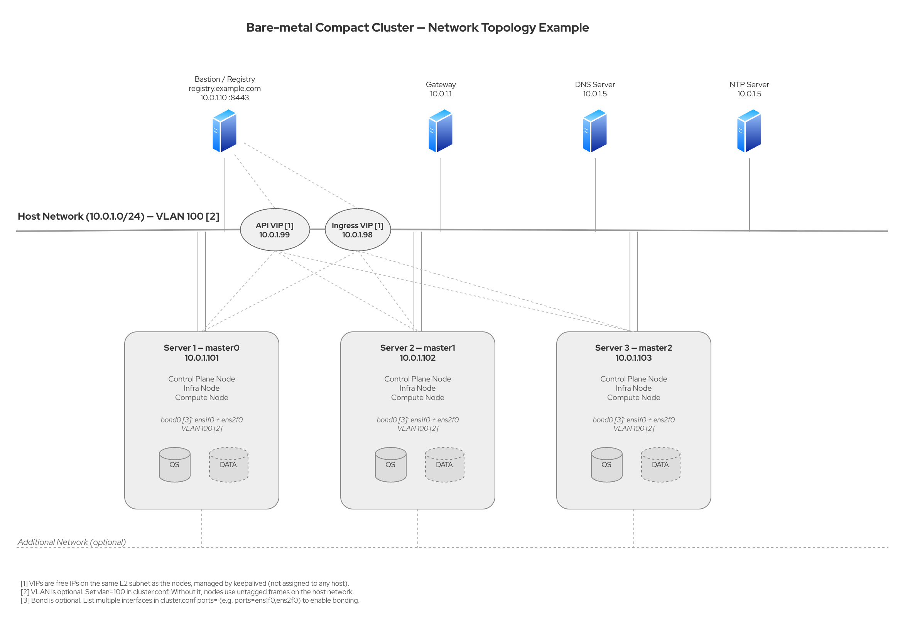

# Example: Bare-metal Compact Cluster

This example shows a 3-node compact cluster with all network values that work together.
For general prerequisites, see the [Network Configuration](../README.md#network-configuration) section in the README.

<!-- Export this diagram from images/bare-metal-network.drawio using draw.io -->
<div align="center">

</div>

## DNS A records required

- `api.mycluster.example.com` &rarr; `10.0.1.99` (API VIP — free IP, managed by the cluster via keepalived)
- `*.apps.mycluster.example.com` &rarr; `10.0.1.98` (Ingress VIP — free IP, managed by the cluster)
- `registry.example.com` &rarr; `10.0.1.10` (bastion / mirror registry)

## Matching `aba.conf` (network settings)

```
domain=example.com
machine_network=10.0.1.0/24
dns_servers=10.0.1.5
next_hop_address=10.0.1.1
ntp_servers=10.0.1.5
platform=bm
```

## Matching `cluster.conf`

```
cluster_name=mycluster
base_domain=example.com
api_vip=10.0.1.99
ingress_vip=10.0.1.98
starting_ip=10.0.1.101        # master0=.101, master1=.102, master2=.103
num_masters=3
num_workers=0
dns_servers=10.0.1.5
next_hop_address=10.0.1.1
ntp_servers=10.0.1.5
ports=ens1f0,ens2f0              # Two interfaces = bonding (optional)
vlan=100                         # VLAN tag (optional)
```

## Matching `mirror.conf` (key fields)

```
reg_host=registry.example.com  # FQDN of the registry (must resolve via DNS)
reg_port=8443                  # Registry port (Quay default)
reg_path=/ocp4/openshift4      # Image path prefix in the registry
reg_vendor=auto                # auto = Quay if available, else Docker
```

## MAC addresses (`macs.conf`, optional)

```
cat > mycluster/macs.conf <<EOF
aa:bb:cc:dd:01:01    # master0 port 1 (ens1f0)
aa:bb:cc:dd:01:02    # master0 port 2 (ens2f0)
aa:bb:cc:dd:02:01    # master1 port 1
aa:bb:cc:dd:02:02    # master1 port 2
aa:bb:cc:dd:03:01    # master2 port 1
aa:bb:cc:dd:03:02    # master2 port 2
EOF
```

With bonding: 2 MACs per node (one per bonded port), grouped by host. Without bonding: 1 MAC per node.

## Firewall (bastion &harr; nodes)

If a firewall exists between cluster nodes, the required inter-node ports (mDNS, etcd, Kubernetes API, etc.) must be open — see [Configuring your firewall](https://docs.redhat.com/en/documentation/openshift_container_platform/4.20/html/installation_configuration/configuring-firewall) for the full list. Between the bastion/registry and the nodes, ensure these ports are open:

- `8443/tcp` — nodes pull images from the mirror registry
- `22/tcp` — SSH access to nodes (for troubleshooting)
- `6443/tcp` — bastion accesses the cluster API (kubectl/oc)
- `443/tcp` — bastion accesses the OpenShift console and ingress routes

## Pre-flight checklist (before `aba install`)

- [ ] DNS: `dig api.mycluster.example.com` resolves to the API VIP (10.0.1.99)
- [ ] DNS: `dig test.apps.mycluster.example.com` resolves to the Ingress VIP (10.0.1.98)
- [ ] NTP: bastion time is synced (`chronyc sources` or `timedatectl`)
- [ ] Registry: `curl -sk https://registry.example.com:8443/v2/` returns OK
- [ ] VIPs: 10.0.1.98 and 10.0.1.99 are not in use (`ping` shows no reply)
- [ ] Network: nodes can reach registry on port 8443

ABA runs pre-flight checks automatically before ISO generation.

## Key rules

- API and Ingress VIPs **must** be on the same L2 subnet as the cluster nodes (`machine_network`). They are managed via keepalived, which requires L2 adjacency.
- `starting_ip` assigns sequential IPs: master0 gets `.101`, master1 gets `.102`, master2 gets `.103`.
- For SNO clusters: `api_vip` and `ingress_vip` are ignored — both DNS records point to the single node IP.
