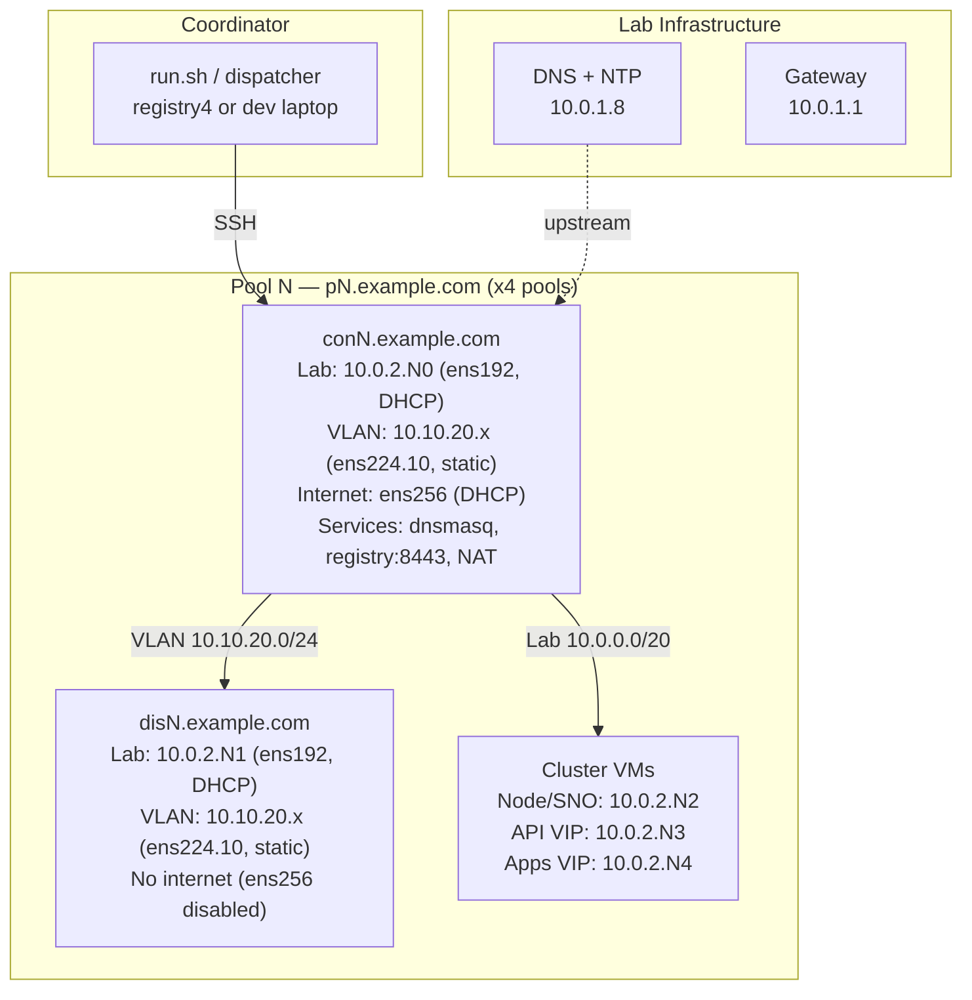

# E2E Test Framework

End-to-end tests for ABA. Tests run across isolated vSphere pools, each
containing a connected bastion (`conN`) and a disconnected bastion (`disN`).

See `ai/HANDOFF_CONTEXT.md` for backlog, rules, and session context.

## Quick Start

### Configuration

All settings live in `config.env` (defaults) and `pools.conf` (per-pool overrides).
CLI flags take highest precedence.

**RHEL version** (rhel8 or rhel9):

```bash
# In config.env (applies to all pools):
INT_BASTION_RHEL_VER=rhel8

# Or per-pool in pools.conf:
pool1  con1  dis1  aba-e2e-template-rhel9  INT_BASTION_RHEL_VER=rhel9  POOL_NUM=1  ...

# Or via CLI (overrides everything):
./run.sh run -a -p 1-4 -o rhel9
```

**vCenter vs ESXi API**:

All current suites use `--platform vmw` which defaults to vCenter.
To test ESXi-direct installs, create a `~/.vmware-esxi.conf` that points at
an ESXi host (e.g. `GOVC_URL=esxi4.lan`, no `VC_FOLDER`, no `GOVC_DATACENTER`).

```bash
# Via CLI (applies to all pools):
./run.sh run -a -p 1-4 -v ~/.vmware-esxi.conf

# Or in config.env:
VMWARE_CONF=~/.vmware-esxi.conf

# Or per-pool in pools.conf:
pool1  con1  dis1  aba-e2e-template-rhel8  VMWARE_CONF=~/.vmware-esxi.conf  POOL_NUM=1  ...
```

**Number of pools** (1 to 4):

```bash
# Always pass -p to tell run.sh which pools are active
./run.sh run -a -p 1-4
./run.sh status -p 1-4
./run.sh stop -p 1-4
```

Enable/disable pools by commenting lines in `pools.conf`:

```
pool1  con1  dis1  aba-e2e-template-rhel8  INT_BASTION_RHEL_VER=rhel8  POOL_NUM=1  VM_DATASTORE=Datastore4-1  VC_FOLDER=/Datacenter/vm/aba-e2e/pool1
pool2  con2  dis2  aba-e2e-template-rhel8  INT_BASTION_RHEL_VER=rhel8  POOL_NUM=2  VM_DATASTORE=Datastore4-2  VC_FOLDER=/Datacenter/vm/aba-e2e/pool2
# pool3  ...  (commented out = inactive)
# pool4  ...
```

**OCP channel and version**:

```bash
# In config.env:
TEST_CHANNEL=stable     # stable | fast | candidate
OCP_VERSION=p           # p = previous minor, l = latest minor, or explicit e.g. 4.17.12
```

**SSH user on conN/disN** (root vs non-root):

```bash
# Quick switch: same user for both conN and disN:
./run.sh run -a -p 1-4 -u root

# Or separately:
./run.sh run -a -p 1-4 --con-user steve --dis-user root

# In config.env (default: steve):
CON_SSH_USER=steve
DIS_SSH_USER=steve

# Per-pool in pools.conf:
pool1  con1  dis1  aba-e2e-template-rhel8  CON_SSH_USER=root  DIS_SSH_USER=root  POOL_NUM=1  ...
```

**Test a specific git branch** (e.g. `main`):

```bash
# In config.env (auto-detected from local checkout by default):
E2E_GIT_BRANCH=main
E2E_GIT_REPO=https://github.com/sjbylo/aba.git

# Or use -d/--dev mode to push your local working tree directly:
./run.sh run -a -p 1-4 -d
```

Without `-d`, suites clone ABA from git on the conN host. With `-d`,
your local source tree is pushed to `~/aba` on conN via rsync.

**Extra disk space on conN/disN**:

```bash
# In config.env (default: 0 = no expansion):
VM_DISK_EXTRA_GB=20     # Add 20GB to each cloned VM disk
```

The golden template includes an `expand-home.service` that automatically
grows `/home` on first boot when the disk is larger than expected.
Per-pool override is possible in `pools.conf`: `VM_DISK_EXTRA_GB=30`.

**Other config.env settings**:

```bash
OC_MIRROR_VER=v2              # v1 (deprecated) | v2
VMWARE_CONF=~/.vmware.conf    # Path to govc configuration file
KVM_CONF=~/.kvm.conf          # Path to KVM/libvirt configuration file
VM_SNAPSHOT=aba-test           # Snapshot name to revert VMs to before cloning
VM_DATASTORE=Datastore4-1     # Target datastore for clones (per-pool in pools.conf)
VC_FOLDER=/Datacenter/vm/aba-e2e  # vCenter folder for test VMs (per-pool in pools.conf)
NOTIFY_CMD=~/bin/notify.sh    # Notification command (e.g. Telegram alerts)
NOTIFY_RELAY_HOST=bastion     # SSH relay for notifications from air-gapped conN
```

### Destroying and Recreating Pool VMs

```bash
# Destroy all pool VMs (deletes conN + disN clones from vSphere):
./run.sh destroy -p 1-4

# Destroy and also clean up any clusters/mirrors left on them:
./run.sh destroy -p 1-4 -c

# Force rebuild golden VM from template, then reclone all pools:
./run.sh run -a -p 1-4 -G -R

# Reclone pool VMs without rebuilding the golden:
./run.sh run -a -p 1-4 -R

# Revert pool VMs to snapshot before running:
./run.sh run -a -p 1-4 -V
```

## run.sh Command Reference

```
Commands:
  run.sh run [-s X] [-p 1,2,3]        Run suites (default: -a/--all)
  run.sh run -p all                    Run all suites across all pools
  run.sh run -s X -p 2 -f -y          Force dispatch onto pool 2
  run.sh run -p 1 -r                   Re-run last suite, skip passed tests
  run.sh run -p all -d                 Push local source to ~/aba, then run
  run.sh run -a -D -p all              Include dummy framework test suites
  run.sh reschedule [-s X]             Re-queue completed suites
  run.sh deploy [-p 2,3]               Push source code + harness to conN
  run.sh restart [-p 2] [-r]           Stop + harness deploy + re-run last suite
  run.sh restart -p 2 -d               Stop + source deploy + harness + re-run
  run.sh restart -s X -p 2             Stop + deploy + run suite X on pool 2
  run.sh stop [-p 2,3] [-c]            Kill runner(s) (-c: delete clusters/mirrors)
  run.sh start [-p 1-4]                Power on pool VMs (conN + disN)
  run.sh status [-p 3]                 Show what's running
  run.sh verify [-p all]               Verify pool VMs (no dispatch)
  run.sh list                          List available suites (shows dummy suites separately)
  run.sh destroy [-p all] [-c]         Destroy pool VMs (-c: delete clusters first)
  run.sh attach conN                   Attach to conN's tmux session
  run.sh live [-p 1-3]                 Interactive multi-pane dashboard
  run.sh dash [-p all] [log]           Read-only summary dashboard

Options:
  -s, --suite X,Y        Select specific suite(s) (comma-separated)
  -a, --all              Select all suites (default for run/reschedule)
  -D, --with-dummy       Include dummy-* framework test suites (excluded from --all)
  -p, --pools SPEC       Pool selection: N, N-M, N,M,O, or "all"
  -f, --force            Override safety checks (dispatch to busy pool, hot-deploy)
  -d, --dev              Push local source to ~/aba on conN (developer mode)
  -r, --resume           Skip previously-passed tests (run, restart)
  -n, --dry-run          Show dispatch plan, don't execute
  -c, --clean            Delete clusters/mirrors before stopping/destroying
  -V, --revert           Revert pool VMs to pool-ready snapshot before running
  -G, --recreate-golden  Force rebuild golden VM from template
  -R, --recreate-vms     Force reclone all conN/disN from golden (scoped to -p)
  -y, --yes              Auto-accept prompts
  -q, --quiet            CI mode: no interactive prompts (implies -y)
  -o, --os RHEL          RHEL version for pool VMs (rhel8|rhel9|rhel10)
  -v, --vmware-conf F    Path to vmware.conf (e.g. ~/.vmware-esxi.conf)
  -u, --user USER        SSH user for both conN and disN
  --con-user USER        SSH user for conN only
  --dis-user USER        SSH user for disN only
  -h, --help             Show usage help
```

### Common Workflows

```bash
# Full test run across all 4 pools:
./run.sh run -a -p 1-4

# Run a single suite on pool 2:
./run.sh run -s cluster-ops -p 2

# Check status of all pools:
./run.sh status

# Attach to pool 1's tmux session (see live output):
./run.sh attach con1

# Live multi-pane dashboard:
./run.sh live

# Stop all pools:
./run.sh stop -p all

# Stop pool 3 and clean up its clusters/mirrors:
./run.sh stop -p 3 -c

# Re-run the last suite on pool 2, skipping passed tests:
./run.sh restart -p 2 -r

# Deploy local code changes to all pools (no suite run):
./run.sh deploy -p 1-4

# Deploy + run with local source (developer mode):
./run.sh run -a -p 1-4 -d

# List available suites:
./run.sh list

# Verify pool VMs are healthy (SSH, networking, etc.):
./run.sh verify -p 1-4

# Run only dummy framework test suites:
./run.sh run -D -p 1

# Include dummy suites alongside real suites:
./run.sh run -a -D -p 1-4
```

### Test Profiles

Switch the test environment with CLI flags. Combine them freely:

```bash
# Default: vCenter API, RHEL 8, non-root user
./run.sh run -a -p 1-4

# ESXi-direct API (bypass vCenter):
./run.sh run -a -p 1-4 -v ~/.vmware-esxi.conf

# RHEL 9 pool VMs:
./run.sh run -a -p 1-4 -o rhel9

# Run as root on all bastions:
./run.sh run -a -p 1-4 -u root

# Full matrix example: ESXi + RHEL 9 + root
./run.sh run -a -p 1-4 -v ~/.vmware-esxi.conf -o rhel9 -u root

# Per-pool profiles in pools.conf (e.g. pool1=vCenter, pool2=ESXi):
#   pool1  con1  dis1  aba-e2e-template-rhel8  POOL_NUM=1  ...
#   pool2  con2  dis2  aba-e2e-template-rhel9  VMWARE_CONF=~/.vmware-esxi.conf  POOL_NUM=2  ...
```

**Prerequisite for ESXi testing**: Create `~/.vmware-esxi.conf` on bastion:

```bash
GOVC_URL=esxi4.lan
GOVC_USERNAME=root
GOVC_PASSWORD='...'
GOVC_DATASTORE=datastore1
GOVC_NETWORK="VM Network"
GOVC_INSECURE=true
# No VC_FOLDER, GOVC_DATACENTER, or GOVC_CLUSTER for ESXi-direct
```

## Available Suites

| Suite | Description |
|-------|-------------|
| `connected-public` | Connected install from public registry |
| `mirror-sync` | Mirror sync + bare-metal flow |
| `airgapped-local-reg` | Airgapped install with local registry on disN |
| `airgapped-existing-reg` | Airgapped install with pre-existing registry |
| `cluster-ops` | Cluster install, day2 operations, operators |
| `vmw-lifecycle` | VMware cluster lifecycle (install, shutdown, startup, delete) |
| `kvm-lifecycle` | KVM cluster lifecycle |
| `network-advanced` | VLAN-based cluster installs |
| `create-bundle-to-disk` | Bundle creation and transfer to disk |
| `negative-paths` | Error handling and edge cases |
| `cli-validation` | CLI argument validation |
| `config-validation` | Config file validation |

## Lab Network Topology



### Network Segments

**Lab / Machine Network — 10.0.0.0/20 (shared L2)**
- All bastions and cluster VMs share this network via ens192
- conN and disN get IPs via DHCP; cluster nodes use static IPs
- Gateway: 10.0.1.1, DNS/NTP upstream: 10.0.1.8

**Pool Subnet — 10.0.2.0/24**
- Each pool gets a "decade" of IPs within this /24:
  - `.x0` = conN bastion (DHCP)
  - `.x1` = disN bastion (DHCP)
  - `.x2` = cluster node / SNO / rendezvous IP
  - `.x3` = API VIP (compact/standard; unused for SNO)
  - `.x4` = Apps VIP (compact/standard; unused for SNO)
  - `.x5-.x9` = additional cluster nodes (compact/standard)

**VLAN — 10.10.20.0/24 (no DHCP, static IPs)**
- Carried on ens224.10 (802.1Q VLAN 10)
- Provides the conN-to-disN link; also used for VLAN-based cluster tests
- conN runs NAT/masquerade so disN can reach the internet through conN

**Internet — ens256 (conN only)**
- conN has a third NIC (ens256) with internet via DHCP
- disN has the NIC but it is disabled — no internet path by design

### Host Roles

**conN (connected bastion)**
- Internet-connected RHEL VM; test runner (`runner.sh` in tmux)
- Runs dnsmasq for cluster DNS (`*.pN.example.com`)
- Pool registry on port 8443
- NAT gateway for disN's VLAN traffic

**disN (disconnected bastion)**
- Air-gapped RHEL VM; no direct internet
- Used for disconnected/airgapped tests (mirrors, bundles, clusters)
- DNS points to conN's VLAN IP

### SSH Connectivity

```
Coordinator (run.sh)
  └── SSH ──> conN.example.com        (deploy, dispatch, status)
                 ├── SSH ──> disN      (via _essh / e2e_run_remote)
                 └── SSH ──> cluster   (via aba ssh)
```

### vSphere Layout

- Folder: `/Datacenter/vm/aba-e2e/poolN`
- Source template: `aba-e2e-template-rhel8` (or `rhel9`)
- Golden VM: `aba-e2e-golden-rhel8` (cloned per pool)
- Snapshot: `aba-test` (reverted before each clone)
- Datastores: `Datastore4-1` through `Datastore4-4` (one per pool)

### Per-Pool IP Reference

```
Pool  conN Lab     conN VLAN    disN Lab     disN VLAN    Node       API VIP    Apps VIP
----  ----------  -----------  ----------  -----------  ----------  ----------  ----------
  1   10.0.2.10   10.10.20.1   10.0.2.11   10.10.20.2   10.0.2.12   10.0.2.13   10.0.2.14
  2   10.0.2.20   10.10.20.3   10.0.2.21   10.10.20.4   10.0.2.22   10.0.2.23   10.0.2.24
  3   10.0.2.30   10.10.20.5   10.0.2.31   10.10.20.6   10.0.2.32   10.0.2.33   10.0.2.34
  4   10.0.2.40   10.10.20.7   10.0.2.41   10.10.20.8   10.0.2.42   10.0.2.43   10.0.2.44
```

VLAN cluster IPs (suite-network-advanced):

```
Pool  VLAN Node      VLAN API VIP   VLAN Apps VIP
----  -------------  -------------  -------------
  1   10.10.20.201   10.10.20.211   10.10.20.221
  2   10.10.20.202   10.10.20.212   10.10.20.222
  3   10.10.20.203   10.10.20.213   10.10.20.223
  4   10.10.20.204   10.10.20.214   10.10.20.224
```

## Directory Structure

```
test/e2e/
├── run.sh              # Coordinator: CLI parsing, deploy, dispatch
├── runner.sh           # Runs on conN: suite execution, cleanup
├── pools.conf          # Pool definitions (poolN = conN + disN)
├── config.env          # Default test parameters, IPs, MACs
├── lib/
│   ├── framework.sh    # Core: e2e_run, suite/test lifecycle, checkpoints
│   ├── remote.sh       # SSH helpers (_essh, e2e_run_remote), VM cloning
│   ├── pool-lifecycle.sh  # VM cloning, network, NTP, firewall, dnsmasq
│   ├── vm-helpers.sh   # govc wrappers, snapshot management
│   ├── config-helpers.sh  # IP/domain/cluster-name helpers per pool
│   ├── constants.sh    # Shared constants (paths, snapshot names, etc.)
│   └── setup.sh        # One-time pool infrastructure setup
└── suites/
    ├── suite-cluster-ops.sh
    ├── suite-mirror-sync.sh
    ├── suite-airgapped-local-reg.sh
    ├── suite-airgapped-existing-reg.sh
    ├── suite-connected-public.sh
    ├── suite-network-advanced.sh
    ├── suite-create-bundle-to-disk.sh
    ├── suite-negative-paths.sh
    ├── suite-cli-validation.sh
    ├── suite-config-validation.sh
    ├── suite-vmw-lifecycle.sh
    └── suite-kvm-lifecycle.sh
```

## Configuration Precedence

Settings can be defined at three levels (highest precedence wins):

1. **CLI flags** (`-o rhel9`, `-p 1-4`, etc.)
2. **Per-pool overrides** in `pools.conf` (`CON_SSH_USER=root`, `VM_DATASTORE=...`)
3. **Defaults** in `config.env`
