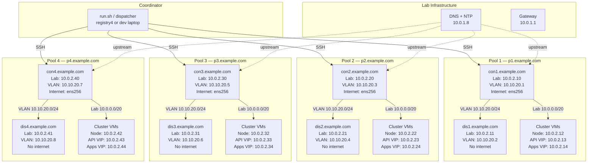

# E2E Test Framework

End-to-end tests for ABA. Tests run across isolated vSphere pools, each
containing a connected bastion (`conN`) and a disconnected bastion (`disN`).

See `ai/HANDOFF_CONTEXT.md` for backlog, rules, and session context.

## Lab Network Topology



### Network Segments

**Lab / Machine Network — 10.0.0.0/20 (shared L2)**
- All bastions and cluster VMs share this network via ens192
- conN and disN get IPs via DHCP; cluster nodes use static IPs
- Gateway: 10.0.1.1, DNS/NTP upstream: 10.0.1.8

**Pool Subnet — 10.0.2.0/24**
- Each pool gets a "decade" of IPs within this /24:
  - `.x0` = conN bastion (DHCP)
  - `.x1` = disN bastion (DHCP)
  - `.x2` = cluster node / SNO / rendezvous IP
  - `.x3` = API VIP (compact/standard; unused for SNO)
  - `.x4` = Apps VIP (compact/standard; unused for SNO)
  - `.x5-.x9` = additional cluster nodes (compact/standard)

**VLAN — 10.10.20.0/24 (no DHCP, static IPs)**
- Carried on ens224.10 (802.1Q VLAN 10)
- Provides the conN-to-disN link; also used for VLAN-based cluster tests
- conN runs NAT/masquerade so disN can reach the internet through conN

**Internet — ens256 (conN only)**
- conN has a third NIC (ens256) with internet via DHCP
- disN has the NIC but it is disabled — no internet path by design

### Host Roles

**conN (connected bastion)**
- Internet-connected RHEL VM; test runner (`runner.sh` in tmux)
- Runs dnsmasq for cluster DNS (`*.pN.example.com`)
- Pool registry on port 8443
- NAT gateway for disN's VLAN traffic

**disN (disconnected bastion)**
- Air-gapped RHEL VM; no direct internet
- Used for disconnected/airgapped tests (mirrors, bundles, clusters)
- DNS points to conN's VLAN IP

### SSH Connectivity

```
Coordinator (run.sh)
  └── SSH ──> conN.example.com        (deploy, dispatch, status)
                 ├── SSH ──> disN      (via _essh / e2e_run_remote)
                 └── SSH ──> cluster   (via aba ssh)
```

### vSphere Layout

- Folder: `/Datacenter/vm/aba-e2e/poolN`
- Source template: `aba-e2e-template-rhel8`
- Golden VM: `aba-e2e-golden-rhel8` (cloned per pool)
- Snapshot: `aba-test` (reverted before each clone)
- Datastores: `Datastore4-1` through `Datastore4-4` (one per pool)

### Per-Pool IP Reference

```
Pool  conN Lab     conN VLAN    disN Lab     disN VLAN    Node       API VIP    Apps VIP
----  ----------  -----------  ----------  -----------  ----------  ----------  ----------
  1   10.0.2.10   10.10.20.1   10.0.2.11   10.10.20.2   10.0.2.12   10.0.2.13   10.0.2.14
  2   10.0.2.20   10.10.20.3   10.0.2.21   10.10.20.4   10.0.2.22   10.0.2.23   10.0.2.24
  3   10.0.2.30   10.10.20.5   10.0.2.31   10.10.20.6   10.0.2.32   10.0.2.33   10.0.2.34
  4   10.0.2.40   10.10.20.7   10.0.2.41   10.10.20.8   10.0.2.42   10.0.2.43   10.0.2.44
```

VLAN cluster IPs (suite-network-advanced):

```
Pool  VLAN Node      VLAN API VIP   VLAN Apps VIP
----  -------------  -------------  -------------
  1   10.10.20.201   10.10.20.211   10.10.20.221
  2   10.10.20.202   10.10.20.212   10.10.20.222
  3   10.10.20.203   10.10.20.213   10.10.20.223
  4   10.10.20.204   10.10.20.214   10.10.20.224
```

## Quick Reference

```
test/e2e/
├── run.sh              # Coordinator: CLI parsing, deploy, dispatch
├── runner.sh           # Runs on conN: suite execution, cleanup
├── pools.conf          # Pool definitions (poolN = conN + disN)
├── config.env          # Default test parameters, IPs, MACs
├── lib/
│   ├── framework.sh    # Core: e2e_run, suite/test lifecycle, checkpoints
│   ├── remote.sh       # SSH helpers (_essh, e2e_run_remote)
│   ├── pool-lifecycle.sh  # VM cloning, network, NTP, firewall, dnsmasq
│   └── config-helpers.sh  # IP/domain/cluster-name helpers per pool
└── suites/
    ├── suite-cluster-ops.sh           # Cluster install, day2, operators
    ├── suite-mirror-sync.sh           # Mirror sync + bare-metal flow
    ├── suite-airgapped-local-reg.sh   # Airgapped with local registry
    ├── suite-airgapped-existing-reg.sh # Airgapped with existing registry
    ├── suite-connected-public.sh      # Connected/proxy cluster installs
    ├── suite-network-advanced.sh      # VLAN-based cluster installs
    ├── suite-create-bundle-to-disk.sh # Bundle creation and transfer
    ├── suite-negative-paths.sh        # Error handling and edge cases
    ├── suite-cli-validation.sh        # CLI argument validation
    └── suite-config-validation.sh     # Config file validation
```

## Running Tests

```bash
cd /home/steve/aba/test/e2e

# Run all suites across 4 pools:
bash run.sh run --all --pools 4

# Run a single suite on a specific pool:
bash run.sh run --suite cluster-ops --pool 1

# Check status:
bash run.sh status

# Attach to a pool's tmux session:
bash run.sh attach con1

# List available suites:
bash run.sh list
```
