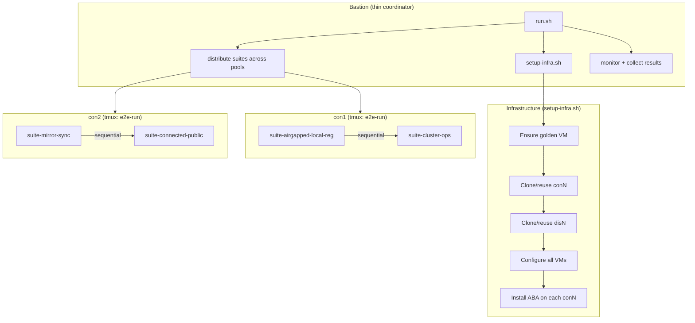

# E2E Test Framework Redesign

## Design Principles

- Keep everything that works well: `e2e_run` with retries/interactive, progress tables, checkpointing, the clone flow (template -> golden -> conN -> disN), VM config commands
- Drop everything that causes pain: per-suite SSH dispatch, `--skip-phase2`, parallel-vs-sequential duplication, `clone-and-check` as a suite, hidden output, coordinator-only special casing
- One code path for 1 pool or N pools
- All test execution happens **on conN**, not from bastion
- Default to reusing existing infrastructure

## New Architecture



## Key Design Decisions

### 1. Infrastructure is a script, not a suite

`clone-and-check` disappears as a suite. Its logic moves into `setup-infra.sh` -- a normal bash script called by `run.sh` before any test execution. This script:
- Ensures the golden VM (reuse if exists + has `golden-ready` snapshot; rebuild only with `--recreate-golden`)
- Ensures conN/disN (reuse if VM exists + SSH works; revert to `pool-ready` snapshot if SSH fails; clone from golden only with `--recreate-vms` or if VM doesn't exist)
- Configures VMs: root user, testy user (with keys + sudo), ABA_TESTING env, firewall, time, etc. (all existing `_vm_*` helpers, they work well)
- Creates `pool-ready` snapshots
- Installs ABA on each conN using `aba install` (the project's own deployment mechanism)

Template VM prerequisites (created by the user, not the framework):
- Default user (configurable via `config.env`) with SSH keys + sudo
- Red Hat registration (for `dnf`)
- RHEL includes open-vm-tools / VMware tools out of the box (required for `govc vm.ip`)

### 2. One tmux session per pool, all suites sequential inside it

Bastion distributes suites across pools (round-robin by default). Each conN gets one tmux session named `e2e-run` that executes its assigned suites sequentially. Interactive mode (`-i`) is **on by default** on every conN -- if a test fails, the tmux session pauses and waits for user input.

### 3. Thin coordinator on bastion

`run.sh` becomes simple orchestration (~100-150 lines of high-level flow):
- Parse args
- Call `setup-infra.sh` (if needed)
- Distribute suites across pools
- Launch one tmux per conN (via SSH)
- Open dashboard (default) or print summary and wait

### 4. Fully interactive dashboard

After launching tmux sessions on all conN, `run.sh` opens a **dashboard**: a tmux session on bastion with one pane per pool. Each pane runs `ssh -t conN tmux attach -t e2e-run` -- a live, fully interactive connection to that pool's test session. The user sees all pools running simultaneously.

The dashboard tmux uses prefix `Ctrl-a` (instead of the default `Ctrl-b`) to avoid conflicts with the conN tmux sessions inside each pane:
- `Ctrl-a + arrow keys` = switch between pool panes (dashboard level)
- `Ctrl-b` = interact with the conN tmux session in the active pane

Workflow when a test fails:
1. User sees the failure prompt appear in one of the panes
2. `Ctrl-a + arrow` to switch to that pane
3. Type `r` to retry (or `s` to skip, `a` to abort)
4. Switch back to other panes to continue monitoring

`run.sh attach conN` is still available as a convenience for a full-screen single-pool view (bypasses the dashboard, connects directly to conN's tmux).

`run.sh dashboard` reopens the dashboard if the user detached from it.

After all pools finish, `run.sh` collects exit codes and prints a final summary.

### 5. Reuse-first VM lifecycle

Default behavior (no flags): reuse everything that already works.

- Golden exists + `golden-ready` snapshot: **reuse**
- Golden exists, no snapshot: rebuild
- Golden missing: clone from template, configure, snapshot
- conN/disN exists + SSH works: **reuse as-is**
- conN/disN exists + SSH fails: revert to `pool-ready` snapshot, power on
- conN/disN missing: clone from golden, configure, snapshot
- `--recreate-golden`: destroy + rebuild golden from template
- `--recreate-vms`: destroy + reclone conN/disN from golden

### 6. Test execution runs entirely on conN

The e2e framework (`framework.sh`, `e2e_run`, etc.) runs on conN. From conN, suites SSH to disN for airgapped tests using `-h` flag. This eliminates:
- Per-suite rsync from bastion
- Per-suite tmux dispatch from bastion
- The `testy_rsa` key propagation problem (keys deployed during infra setup, once)
- The `E2E_ON_BASTION` vs coordinator-only branching

No `--sync` flag. ABA is installed on conN via `aba install` during `setup-infra.sh`. For iterative development, the developer manually updates files on conN (e.g. `git push/pull`, `scp`).

### 7. Transparency by default

- `setup-infra.sh` shows all output on terminal (tee to log)
- `e2e_run` prints the actual command being run (not just the description) when `-v` is active
- `govc` clone/snapshot operations show progress
- Wall-clock duration printed for each `e2e_run` step
- SSH preflight errors shown in full (no `2>/dev/null` on diagnostics)

## New CLI

```
run.sh [--suite X,Y | --all]       # which suites
       [--pools N]                  # how many pools to use (default: 1)
       [--setup]                    # force infra setup even if VMs look ready
       [--recreate-golden]          # destroy + rebuild golden from template
       [--recreate-vms]             # destroy + reclone con/dis from golden
       [-v]                         # verbose (show commands, not just descriptions)
       [--clean]                    # clear checkpoints, start suites from beginning
       [--destroy]                  # destroy all VMs and exit
       [--list]                     # list available suites
       [--dry-run]                  # show plan without executing
       attach conN                  # attach interactively to conN's tmux session
       dashboard                    # reopen the dashboard (if detached)
```

Removed: `--parallel`, `--skip-phase2`, `--create-pools N`, `--sync`, `--resume`, `-i`

- `-i` removed because interactive is **always on** by default on every conN
- `--sync` removed -- developer copies files manually when iterating
- `--resume` removed -- checkpoint files always respected unless `--clean`
- `--parallel` removed -- always distributes across available pools
- `--create-pools` removed -- replaced by `--pools N` + `--setup` / `--recreate-vms`

## New File Structure

```
test/e2e/
  run.sh                    # thin coordinator (~150 lines)
  setup-infra.sh            # VM lifecycle: golden, clone, config, snapshot, install ABA
  config.env                # defaults (unchanged)
  pools.conf                # pool definitions (unchanged)
  lib/
    framework.sh            # e2e_run, progress, checkpoints (mostly unchanged)
    vm-helpers.sh           # _vm_* functions (extracted from pool-lifecycle.sh)
    config-helpers.sh       # pool config, IP resolution (unchanged)
    remote.sh               # SSH/SCP helpers (unchanged)
  suites/
    suite-*.sh              # test suites (unchanged, but no more clone-and-check)
  runner.sh                 # NEW: runs on conN inside tmux -- receives suite list,
                            #   sources framework.sh, executes suites sequentially,
                            #   writes exit code + log to known location
```

Files removed:
- `lib/parallel.sh` -- replaced by simpler distribution logic in `run.sh`
- `lib/pool-lifecycle.sh` -- split into `setup-infra.sh` + `lib/vm-helpers.sh`
- `lib/setup.sh` -- merged into `setup-infra.sh`
- `suites/suite-clone-and-check.sh` -- logic absorbed into `setup-infra.sh`

## User Workflow

```
# First run (from scratch):
run.sh --all --pools 3 --setup

# Re-run (VMs exist, reuse them):
run.sh --all --pools 3

# Run one suite for debugging:
run.sh --suite airgapped-local-reg

# Iterate on suite code:
# 1. Edit suite locally, commit+push
# 2. git pull on con1 (or scp the file)
# 3. run.sh --suite foo

# Dashboard opens automatically -- all panes are fully interactive.
# Switch between panes: Ctrl-a + arrow keys
# Interact with a pool's test session: just type in the active pane (Ctrl-b prefix)

# Full-screen single pool view:
run.sh attach con1

# Reopen the dashboard if detached:
run.sh dashboard

# Nuke everything and start over:
run.sh --destroy
run.sh --all --pools 3 --setup
```

## What Stays the Same

- `framework.sh` core: `e2e_run`, `e2e_run_remote`, `e2e_run_must_fail`, retries, backoff, interactive prompts, progress table, checkpointing, notifications
- `config-helpers.sh`: pool config, IP/domain resolution
- `remote.sh`: `_essh`, `_escp`
- All `suite-*.sh` files (minus clone-and-check)
- `config.env`, `pools.conf` format
- The clone flow: template -> golden -> conN -> disN
- All `_vm_*` helper functions (they work well)

## Migration Path

This is a significant refactor. Suggested approach: build the new framework alongside the old one, validate with a single suite, then migrate all suites.

## Implementation Todos

1. Extract `_vm_*` functions from `pool-lifecycle.sh` into `lib/vm-helpers.sh` (pure helpers, no orchestration)
2. Create `setup-infra.sh`: golden VM lifecycle, clone conN/disN, configure, snapshot, install ABA on conN. Reuse-first logic with `--recreate-golden` and `--recreate-vms` flags
3. Create `runner.sh`: runs on conN inside tmux, receives suite list as args, sources `framework.sh`, runs suites sequentially, writes exit code
4. Rewrite `run.sh` as thin coordinator: parse args, call `setup-infra.sh`, distribute suites, launch one tmux per conN, dashboard, attach command, collect results, print summary
5. Implement dashboard: bastion tmux session with one pane per pool (fully interactive). Implement `run.sh attach conN` for full-screen single-pool view
6. Add `-v` flag to show commands in `e2e_run`, add wall-clock timing, remove unnecessary `2>/dev/null`, tee all infra output
7. Validate all existing suites work under new framework, remove clone-and-check suite, delete old `parallel.sh` and `pool-lifecycle.sh`
8. Update `README.md`, `PLAN.md`, `WORKFLOW.md` to reflect new architecture
