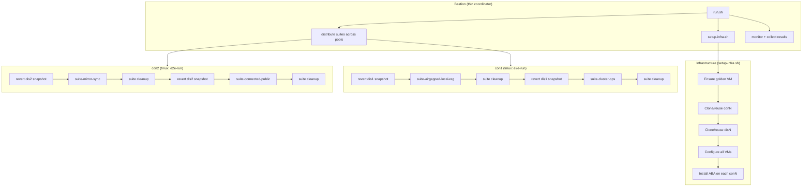

# E2E Test Framework Redesign

## Design Principles

- Keep everything that works well: `e2e_run` with retries/interactive, progress tables, checkpointing, the clone flow (template -> golden -> conN -> disN), VM config commands
- Drop everything that causes pain: per-suite SSH dispatch, `--skip-phase2`, parallel-vs-sequential duplication, `clone-and-check` as a suite, hidden output, coordinator-only special casing
- One code path for 1 pool or N pools
- All test execution happens **on conN**, not from bastion
- Default to reusing existing infrastructure
- Verbose by default -- all commands and output visible
- The user runs the same command every time -- the script figures out what to do

## New Architecture



## Key Design Decisions

### 1. Infrastructure is a script, not a suite

`clone-and-check` disappears as a suite. Its logic moves into `setup-infra.sh` -- a normal bash script called by `run.sh` before any test execution. This script:
- Ensures the golden VM (reuse if exists + has `golden-ready` snapshot; rebuild only with `--recreate-golden`)
- Ensures conN/disN (reuse if VM exists + SSH works; revert to `pool-ready` snapshot if SSH fails; clone from golden only with `--recreate-vms` or if VM doesn't exist)
- Configures VMs: root user, testy user (with keys + sudo), ABA_TESTING env, firewall, time, etc. (all existing `_vm_*` helpers, they work well)
- Creates `pool-ready` snapshots
- Installs ABA on each conN via `git clone + ./install` (clones the repo and runs the installer, which also installs required RPMs)

Template VM prerequisites (created by the user, not the framework):
- RHEL minimal install
- Default user (configurable via `config.env`) with SSH keys + sudo
- Red Hat registration (for `dnf`)
- `~/.vmware.conf` with vCenter credentials (cloned to all VMs automatically)
- RHEL includes VMware tools (open-vm-tools) out of the box (required for `govc vm.ip`)

### 2. One tmux session per pool, all suites sequential inside it

Bastion distributes suites across pools (round-robin by default). Each conN gets one **persistent** tmux session named `e2e-run` that executes its assigned suites sequentially. Interactive mode is **always on** -- if a test fails, the session pauses and waits for user input.

### 3. Persistent tmux sessions on conN

The tmux session `e2e-run` on each conN is created once and **stays open permanently**:
- User attaches once and stays attached across all suite runs
- When `run.sh` launches suites, it sends the runner command into the existing tmux session (via `tmux send-keys`)
- Suites execute, summary prints, and the user is back at a shell prompt in the same session
- User can poke around between runs -- check logs, inspect files, run manual commands
- Next `run.sh` invocation: same session, suites scroll through again
- If runner.sh is already executing, `run.sh` detects this and warns instead of colliding

### 4. Snapshot revert between suites (disN only)

Before each suite, runner.sh **always** reverts **disN** to the `pool-ready` snapshot, powers it on, and waits for SSH. This gives every suite a guaranteed clean disconnected bastion.

**conN cannot be reverted** (the runner.sh tmux session is running on it). Instead, each suite cleans up after itself as its final tests -- removing clusters, configs, containers, etc. This leaves conN in a known state for the next suite.

runner.sh needs `govc` on conN to perform the snapshot revert. govc is installed as a **pre-suite bootstrap step** by runner.sh (not by setup-infra.sh): `aba --dir cli ~/bin/govc`. This runs once before the first suite and is a no-op if govc is already present. vmware.conf is already on conN (inherited from the template).

### 5. ABA install as a suite test step

Each suite installs ABA as one of its first test steps (same as today). The suites run from `~/testing/aba` -- a separate working copy cloned from the repo, so the test doesn't modify the main `~/aba` install. The pattern (following `test/go.sh`):

```
rm -rf ~/testing && mkdir -p ~/testing
cd ~/testing
git clone --depth 1 --branch $branch $repo_url ~/testing/aba
cd ~/testing/aba && ./install
```

This serves dual purpose:
- Tests that `aba install` works (valuable regression test -- `./install` also installs required RPMs)
- Ensures the suite runs against the latest committed code

The main `~/aba` directory (installed by setup-infra.sh) provides the e2e framework, runner.sh, govc, etc. The `~/testing/aba` directory is the test subject.

### 6. Suite self-cleanup

Every suite's last tests must clean up the state it created. This is a contract: after a suite finishes (pass or fail-and-skip), conN should be ready for the next suite. Examples:
- Remove any installed OpenShift clusters
- Clean up generated configs (mirror.conf, cluster dirs, etc.)
- Remove downloaded images/bundles
- Stop/remove containers

disN cleanup is handled automatically by snapshot revert (section 4), so suites only need to clean up conN.

### 7. Interactive failure handling

When a test fails, the prompt is compact and on one line:

```
FAILED: "Verify mirror sync"  [r]etry [s]kip [S]kip-suite [a]bort [cmd]:
```

Options:
- `r` = retry this test
- `s` = skip this test, continue with next test in the suite
- `S` = skip the entire remaining suite, move to the next suite
- `a` = abort all remaining suites on this pool
- Type a replacement command to run instead

### 8. Thin coordinator on bastion

`run.sh` becomes simple orchestration (~100-150 lines of high-level flow):
- Parse args
- Ensure VMs are ready (calls `setup-infra.sh` if VMs don't exist)
- `scp` config files (`pools.conf`, `config.env`) to each conN
- Distribute suites across pools (round-robin)
- Send runner command into each conN's persistent tmux session
- Monitor all pools, collect exit codes when done
- Print final combined summary on the bastion terminal

The script is **idempotent** -- the user always runs the same command. No `--setup` flag needed. The script checks VM state and does whatever is necessary.

### 9. Two viewing modes (no nested tmux)

The only tmux in the system runs on conN (the `e2e-run` session where suites execute). There is no nested tmux anywhere.

**Summary dashboard (read-only, on bastion):** `run.sh` creates a tmux session on bastion with one pane per pool. Each pane runs `ssh conN "tail -f ~/aba/test/e2e/logs/summary.log"` -- plain SSH + tail, NOT tmux attach. This means bastion tmux panes contain no remote tmux, so there is no nesting. Shows test names, commands, PASS/FAIL as they happen.

The user SSHes from Mac to bastion and attaches: `tmux attach -t e2e-dashboard`.

The summary log already exists in the current framework (`E2E_SUMMARY_FILE`). It captures: suite start/end, test names, commands executed, PASS/FAIL/SKIP status, retry attempts, and the progress table -- all with ANSI colors.

**Interactive attach (from separate Mac terminal tab):** The user opens another Mac terminal tab and SSHes directly to conN: `ssh -t conN tmux attach -t e2e-run`. One level of tmux only (on conN). Full interactive control -- respond to failure prompts, inspect state, run manual commands. `Ctrl-b + d` to detach.

Workflow:
1. Mac tab 1: `ssh bastion` then `tmux attach -t e2e-dashboard` -- watch all pools
2. See pool 2 has a failure in the dashboard
3. Mac tab 2: `ssh -t con2 tmux attach -t e2e-run` -- respond to prompt
4. `Ctrl-b + d` to detach, back to watching dashboard

Proven by demo: `test/e2e/ai/demo-dashboards.sh`

Future enhancement: fully interactive multi-pane dashboard where every pane is a live `ssh -t conN tmux attach -t e2e-run` (would require Ctrl-a prefix to avoid nesting conflicts).

### 10. Reuse-first VM lifecycle

Default behavior (no flags): reuse everything that already works. No `--setup` needed.

- Golden exists + `golden-ready` snapshot: **reuse**
- Golden exists, no snapshot: rebuild
- Golden missing: clone from template, configure, snapshot
- conN/disN exists + SSH works: **reuse as-is**
- conN/disN exists + SSH fails: revert to `pool-ready` snapshot, power on
- conN/disN missing: clone from golden, configure, snapshot
- `--recreate-golden`: destroy + rebuild golden from template
- `--recreate-vms`: destroy + reclone conN/disN from golden

### 11. Test execution runs entirely on conN

The e2e framework (`framework.sh`, `e2e_run`, etc.) runs on conN. From conN, suites SSH to disN for airgapped tests using `-h` flag. This eliminates:
- Per-suite rsync from bastion
- Per-suite tmux dispatch from bastion
- The `testy_rsa` key propagation problem (keys deployed during infra setup, once)
- The `E2E_ON_BASTION` vs coordinator-only branching

No `--sync` flag. ABA is installed on conN via `aba install` during infra setup. Config files (`pools.conf`, `config.env`) are pushed via `scp` by `run.sh` before each launch. For iterative development on suite code, the developer manually updates files on conN (e.g. `git push/pull`, `scp`).

### 12. Transparency by default

**Suites** show every command via `e2e_run` (already works this way):
```
  L Verify mirror sync [steve@con1:~/aba]
    aba mirror
```
Both the description and the actual command are printed to terminal and written to the summary log. This stays as-is.

**Infrastructure scripts** (`setup-infra.sh`, `vm-helpers.sh`) use `set -x` for full command tracing. Every govc call, SSH command, and config step is visible.

Other transparency rules:
- All command output visible by default -- no hidden output
- `e2e_run_must_fail` shows output with a clear `[EXPECT-FAIL]` marker
- No `-q` flag on `e2e_run` -- removed entirely
- `govc` clone/snapshot operations show progress
- Wall-clock duration printed for each `e2e_run` step
- SSH preflight errors shown in full (no `2>/dev/null` on diagnostics)
- `-q` flag on `run.sh` available for CI mode (suppress interactive prompts, minimal output)

### 13. Suite distribution

Suites are distributed across pools using round-robin. The order is randomized (shuffled) before distribution so that no pool consistently gets the heavy or light suites. Example with 6 suites and 2 pools (after shuffle):

- con1 gets: suite 4, suite 1, suite 6
- con2 gets: suite 3, suite 5, suite 2

Each conN runs its assigned suites sequentially. Between each suite, disN is reverted to `pool-ready` snapshot for a clean start.

With 1 pool (default), all suites run on con1 sequentially (still shuffled, but order doesn't matter for correctness).

### 14. Per-test retry and backoff settings

Different tests need different retry behavior. A simple `ping` check recovers in seconds; an `oc-mirror` operation may need minutes for a port to be released. The `e2e_run -r RETRIES BACKOFF` mechanism stays, but the defaults and per-test overrides must be realistic.

Design:
- `e2e_run` accepts: `-r RETRIES BACKOFF` (existing), plus new `-d INITIAL_DELAY` and `-m MAX_DELAY`
- Example: `e2e_run -r 5 2.0 -d 30 -m 300 "Wait for oc-mirror port" "curl ..."`
  - 5 retries, 2x backoff, starting at 30s, capped at 300s
- Default if no `-r`: no retries (fail immediately)
- Default if `-r` without `-d`/`-m`: initial delay 5s, max 60s (reasonable for most tests)

Guidelines for estimating values:
- **Quick checks** (ping, file exists, grep): `-r 3 1.5 -d 2 -m 10` (2s, 3s, 4s)
- **Service startup** (SSH ready, API available): `-r 10 2.0 -d 5 -m 60` (5s, 10s, 20s, 40s, 60s...)
- **Heavy operations** (oc-mirror, cluster install): `-r 5 2.0 -d 30 -m 300` (30s, 60s, 120s, 240s, 300s)
- **Port/resource release** (port in use, lock held): `-r 8 1.5 -d 10 -m 120` (10s, 15s, 22s, 33s...)

Actual values will be tuned per test during implementation based on observed recovery times.

### 15. Log collection

After all pools finish, `run.sh` collects logs from each conN back to bastion:
```
scp -r steve@con1:~/aba/test/e2e/logs/* ~/aba/test/e2e/logs/pool-1/
scp -r steve@con2:~/aba/test/e2e/logs/* ~/aba/test/e2e/logs/pool-2/
```
This allows post-mortem analysis, log sharing, and archiving from a single location on bastion.

### 16. Concurrent run protection

runner.sh creates a lock file on conN (e.g. `/tmp/e2e-runner.lock` with PID) on startup and removes it on exit (via `trap`). Before `run.sh` sends a new runner command to a conN, it checks for the lock:
- Lock exists + PID alive: warn the user and refuse to launch ("runner.sh already executing on conN")
- Lock exists + PID dead: stale lock, remove it and proceed
- No lock: proceed normally

### 17. End state / summary

**On each conN** (visible in the persistent tmux session):
```
=== Pool 1 Summary ===
  PASS  suite-airgapped-local-reg    (12m 34s)
  FAIL  suite-mirror-sync            (3m 12s)  [skipped by user]
  PASS  suite-connected-public       (8m 45s)
Result: 2/3 passed
```
The tmux session stays open -- user remains at a shell prompt and can inspect logs, re-run tests, etc.

**On bastion** (where `run.sh` was launched, printed after all pools finish):
```
=== Final Summary ===
  Pool 1 (con1):  2/3 passed   [FAIL: mirror-sync]
  Pool 2 (con2):  3/3 passed
Overall: 5/6 suites passed
Logs: test/e2e/logs/
```
This prints on the normal bastion terminal. `run.sh` exits with 0 if all passed, 1 if any failed.

## New CLI

```
run.sh [--suite X,Y | --all]       # which suites (required)
       [--pools N]                  # how many pools to use (default: 1)
       [--recreate-golden]          # destroy + rebuild golden from template
       [--recreate-vms]             # destroy + reclone con/dis from golden
       [-q]                         # quiet mode (CI: no interactive prompts, minimal output)
       [--clean]                    # clear checkpoints, start suites from beginning
       [--destroy]                  # destroy all VMs and exit
       [--list]                     # list available suites
       [--dry-run]                  # show plan without executing
       attach conN                  # attach to conN's persistent tmux session
```

Removed: `--parallel`, `--skip-phase2`, `--create-pools N`, `--sync`, `--resume`, `-i`, `-v`, `--setup`

- `-i` removed -- interactive is **always on** by default
- `-v` removed -- verbose is **always on** by default (replaced by `-q` for quiet)
- `--setup` removed -- script auto-detects what needs to be done
- `--sync` removed -- `aba install` handles deployment; developer copies changes manually
- `--resume` removed -- checkpoint files always respected unless `--clean`
- `--parallel` removed -- always distributes across available pools
- `--create-pools` removed -- `--pools N` defines pool count; infra created automatically

## New File Structure

```
test/e2e/
  run.sh                    # thin coordinator (~150 lines)
  setup-infra.sh            # VM lifecycle: golden, clone, config, snapshot, install ABA
  config.env                # defaults (unchanged)
  pools.conf                # pool definitions (unchanged)
  lib/
    framework.sh            # e2e_run, progress, checkpoints (mostly unchanged)
    vm-helpers.sh           # _vm_* functions (extracted from pool-lifecycle.sh)
    config-helpers.sh       # pool config, IP resolution (unchanged)
    remote.sh               # SSH/SCP helpers (unchanged)
  suites/
    suite-*.sh              # test suites (unchanged, but no more clone-and-check)
  runner.sh                 # NEW: runs on conN inside tmux -- receives suite list,
                            #   sources framework.sh, reverts disN snapshot before each
                            #   suite, executes suites sequentially, prints summary
```

Files removed:
- `lib/parallel.sh` -- replaced by simpler distribution logic in `run.sh`
- `lib/pool-lifecycle.sh` -- split into `setup-infra.sh` + `lib/vm-helpers.sh`
- `lib/setup.sh` -- merged into `setup-infra.sh`
- `suites/suite-clone-and-check.sh` -- logic absorbed into `setup-infra.sh`

## User Workflow

```
# Run all suites (same command every time -- script figures out what to do):
run.sh --all --pools 3

# Run one suite for debugging:
run.sh --suite airgapped-local-reg

# Attach to a pool (persistent tmux -- stays open across runs):
run.sh attach con1

# Iterate on suite code:
# 1. Edit suite locally, commit+push
# 2. git pull on con1 (or scp the file)
# 3. run.sh --suite foo

# Nuke everything and start over:
run.sh --destroy
run.sh --all --pools 3

# Force rebuild golden VM (e.g. after RHEL update):
run.sh --all --recreate-golden

# Force reclone all con/dis VMs:
run.sh --all --recreate-vms
```

## What Stays the Same

- `framework.sh` core: `e2e_run`, `e2e_run_remote`, retries, backoff, interactive prompts, progress table, checkpointing, notifications
- `config-helpers.sh`: pool config, IP/domain resolution
- `remote.sh`: `_essh`, `_escp`
- All `suite-*.sh` files (minus clone-and-check)
- `config.env`, `pools.conf` format
- The clone flow: template -> golden -> conN -> disN
- All `_vm_*` helper functions (they work well)

## What Changes in framework.sh

- `e2e_run_must_fail`: show output with `[EXPECT-FAIL]` marker instead of hiding it
- Remove `-q` flag from `e2e_run` -- all output visible by default
- Interactive prompt on one line: `FAILED: "desc"  [r]etry [s]kip [S]kip-suite [a]bort [cmd]:`
- Add `S` (skip entire suite) option -- returns a special exit code for runner.sh to catch
- Wall-clock duration on each step

## Migration Path

1. `git mv test/e2e test/e2e-v1` -- archive the current framework
2. Create fresh `test/e2e/` with the new architecture
3. Copy over what we're keeping from `e2e-v1/`:
   - `suites/suite-*.sh` (all suites except clone-and-check)
   - `config.env`, `pools.conf`
   - Parts of `framework.sh` (e2e_run, progress, checkpoints, notifications)
   - `lib/config-helpers.sh`, `lib/remote.sh`
   - `_vm_*` helper functions (extracted into `lib/vm-helpers.sh`)
4. Build the new pieces: `run.sh`, `setup-infra.sh`, `runner.sh`
5. Validate with a single suite, then migrate all suites
6. Once validated, delete `test/e2e-v1/` in a later cleanup commit

The `ai/REDESIGN-PLAN.md` file moves with the rename and stays as reference in both locations.

## Implementation Todos

1. `git mv test/e2e test/e2e-v1` -- archive the v1 framework
2. Create `test/e2e/` directory structure: `lib/`, `suites/`, `ai/`
3. Copy and adapt `framework.sh` from v1: show `e2e_run_must_fail` output with `[EXPECT-FAIL]` marker, remove `-q` flag, one-line interactive prompt with `S` (skip-suite), wall-clock timing, add `-d` (initial delay) and `-m` (max delay) to `e2e_run -r`
4. Copy `lib/config-helpers.sh`, `lib/remote.sh` from v1 (mostly unchanged)
5. Extract `_vm_*` functions from v1's `pool-lifecycle.sh` into `lib/vm-helpers.sh` (pure helpers, no orchestration)
6. Create `setup-infra.sh` with `set -x`: golden VM lifecycle, clone conN/disN, configure, snapshot, install ABA via `git clone + ./install`. Reuse-first logic with `--recreate-golden` and `--recreate-vms` flags
7. Create `runner.sh`: runs on conN inside tmux, bootstrap govc (`aba --dir cli ~/bin/govc`), revert disN snapshot before each suite, lock file for concurrent protection, sources `framework.sh`, runs suites sequentially, prints per-pool summary
8. Create `run.sh` as thin coordinator: parse args, ensure VMs ready, scp config files (`pools.conf`, `config.env`), shuffle + distribute suites round-robin, send runner command to persistent tmux on each conN, open summary dashboard, collect logs + results, print final summary
9. Copy `suites/suite-*.sh` from v1 (all except clone-and-check), adapt for new framework
10. Ensure each suite installs ABA into `~/testing/aba` as a test step (tests install process + ensures latest code)
11. Add suite self-cleanup: each suite's final tests clean up conN state (clusters, configs, containers)
12. Implement summary dashboard: bastion tmux with one pane per pool tailing summary logs (read-only)
13. Implement `run.sh attach conN` for full-screen interactive access to persistent tmux
14. Add log collection: `run.sh` scps logs from each conN to bastion after all pools finish
15. Tune per-test retry/backoff values across all suites based on expected recovery times
16. Validate all suites work under new framework end-to-end
17. Update `README.md` and other docs to reflect new architecture
18. Delete `test/e2e-v1/` once fully validated
19. Future: multi-pane fully interactive dashboard on bastion (Ctrl-a prefix, one pane per pool)
20. Future: dynamic suite dispatch (work queue) -- coordinator dispatches next suite to whichever pool finishes first, for better load balancing when suite durations vary significantly
