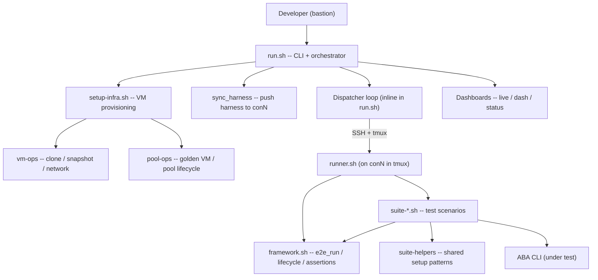
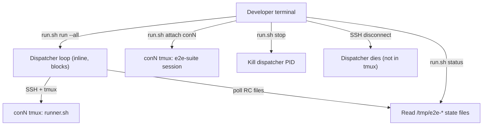
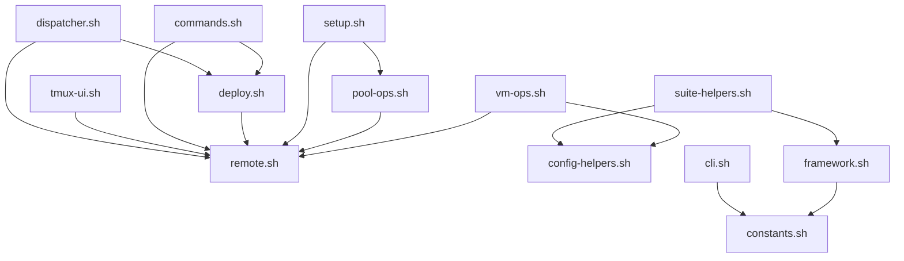

# E2E Test Framework Specification (v2)

Developer-facing blueprint for the ABA E2E test framework.
This is the authoritative reference for architecture, responsibilities, and invariants.
For the ABA core spec, see `dev/01-SPEC.md`.

This spec describes the **implemented state** (v2). All phases are complete.
Sections marked `[current]` describe what the code actually does today.

This spec is the **authority** for v2 development. If a design issue is found
during implementation, STOP coding, update this spec with the user's approval,
then resume. Never silently change the architecture.

---

## Core Design Principle: Suites Are Context-Agnostic

This is the single most important architectural rule in the framework.

**Suites must never know or care about:**

- Which user is running them (root, steve, testy)
- Which OS the VMs are running (rhel8, rhel9, rhel10)
- Which platform is in use (vmw, kvm, bm)
- Which pool they are on (pool 1, pool 2, ..., pool 6)
- The home directory path, SSH keys, or file ownership

**The framework owns all parameterization.** Context flows through environment
variables set by the dispatcher and runner, never hardcoded in suites:


| Variable                | Set by                                | Used by                                   |
| ----------------------- | ------------------------------------- | ----------------------------------------- |
| `CON_SSH_USER`          | dispatcher -> config.env -> runner    | `e2e_run` (who runs commands on conN)     |
| `DIS_SSH_USER`          | dispatcher -> config.env -> runner    | `e2e_run_remote` (who SSHes to disN)      |
| `INT_BASTION_RHEL_VER`  | dispatcher -> config.env -> runner    | infra setup (golden VM selection)         |
| `VMWARE_CONF`           | dispatcher -> config.env -> runner    | suite helpers (VMware credentials)        |
| `POOL_NUM`              | dispatcher -> runner (positional arg) | `pool_*()` functions (IPs, domains, VIPs) |
| `INTERNAL_BASTION`      | runner (computed from POOL_NUM)       | `e2e_run_remote` target host              |
| `CON_HOST` / `DIS_HOST` | runner (computed)                     | framework SSH targets                     |


Suites use `~/aba` (tilde-relative), `e2e_run`, `e2e_run_remote`, and `pool_*()`
functions. These abstractions resolve to the correct user, host, and paths at
runtime.

**Home directory convention:** Root's home is `/root` (NOT `/home/root`).
Regular users live under `/home/<user>`. Code must NEVER hardcode home
directory paths -- always use `~` or `$HOME`:


| User  | `$HOME`       | ABA location      | Data/caches                                                    |
| ----- | ------------- | ----------------- | -------------------------------------------------------------- |
| root  | `/root`       | `/root/aba`       | `/root/.aba/`, `/root/.cache/`, `/root/bin/`                   |
| steve | `/home/steve` | `/home/steve/aba` | `/home/steve/.aba/`, `/home/steve/.cache/`, `/home/steve/bin/` |
| testy | `/home/testy` | `/home/testy/aba` | `/home/testy/.aba/`, `/home/testy/.cache/`, `/home/testy/bin/` |


The runner uses `$HOME/aba` (line 23 of `runner.sh`) which resolves correctly
for any user. Cleanup code that references `~/aba`, `~/bin`, `~/tmp`, `~/.aba`
works because `~` expands to the current user's home. Suites and framework code
must NEVER use absolute paths like `/root/aba` or `/home/steve/aba`.

**If a suite works for `--user steve` but not `--user root`, that is a
framework bug, not a suite bug.**

### Known v1 framework bugs (to be fixed in v2)

1. **File ownership conflicts**: RC files, lock files, cleanup files created by
  one user are unreadable/unwritable by another. Fix: all users have sudo;
   use `sudo` consistently when accessing shared state files.
2. **SSH key assumptions**: Root may not have its own pubkey in authorized_keys
  (self-SSH for cleanup). Fix: ALL users (root, steve, testy) share the SAME
   SSH key pair -- the key is baked into the VMware template and must be used
   everywhere. Golden VM provisioning copies the key to each user's `~/.ssh/`
   and adds it to `authorized_keys` for all users (`_vm_create_test_user_and_key_on_host`).
   No user should ever need a separate key.
   **Status: FIXED in code.** `_vm_setup_ssh_keys` in `vm-ops.sh` now uses
   `grep -qF ... || echo ... >>` (idempotent append) instead of `>` (overwrite).
   This preserves cross-host keys from `_vm_create_test_user_and_key_on_host`.
   **Remaining:** Pool-ready snapshots still contain the old broken state.
   Rebuild golden VM + pool snapshots to pick up the fix permanently.
3. **Hardcoded paths**: References to `/home/root/`, `/home/steve/` in runner.sh
  and cleanup code. Fix: use `~` or `$HOME` consistently.
4. **OS-change cascading**: An OS change on pool 1 forces all pools to reclone.
  Fix: per-pool tracking with `_pools_needing_reclone` (already fixed in v1).
5. **tmux session ownership**: Sessions created by one user are inaccessible to
  another. Fix: dispatcher handles session cleanup regardless of creator.
6. **Stale cross-user state**: Cleanup files from `--user root` block
  `--user steve`. Fix: snapshot revert on user-switch is the primary mechanism;
   `sudo rm` for shared `/tmp` files.
7. ~~**Dashboard hardcoded user**: `live` and `dash` SSHes as `steve@` to read
  `/tmp/e2e-suite-user`.~~ **FIXED:** `live-pane.sh` reads `/tmp/e2e-suite-user`
   and dynamically switches SSH user. `dash` SSHes as the suite user. `status`
   and `stop` use `sudo` for root-owned tmux sessions and log files.

---

## v1 Patterns That Work Well (preserve in v2)

Many v1 patterns are battle-tested and should be carried forward unchanged.
This section is the explicit "do not break" list.

### Test lifecycle (`plan_tests` / `test_begin` / `test_end` / `suite_begin` / `suite_end`)

The structured lifecycle works well: suites declare their test plan up front
with `plan_tests`, each phase is wrapped in `test_begin`/`test_end`, and the
suite finishes with `suite_end`. This gives:

- A **progress table** printed at every state change (shows PENDING/RUNNING/PASS/FAIL/SKIP)
- **Checkpoint/resume** via state files (skip already-passed tests on `--resume`)
- Clean separation between test declaration and execution

### `e2e_run` / `e2e_run_remote` / `e2e_run_must_fail`

The command execution wrappers work well:

- **Automatic retry** with exponential backoff (configurable: `-r`, `-d`, `-m`)
- **Color-coded output**: local steps in bright white, remote steps in bold
yellow, commands in dim gray, OK in green, FAIL in red
- **Ring buffer** of last N commands for failure notifications
- **Per-command output capture** for diagnostic context in notifications
- **Ctrl-C handling**: interrupt goes to interactive prompt, not crash
- **ImagePruner workaround**: automatic OCP bug mitigation between retries
- Seamless local vs remote execution (`-h HOST` routes through SSH)

### Interactive failure menu (`_interactive_prompt`)

The interactive menu on failure is critical and must be preserved exactly:
`[R]etry [s]kip [S]kip-suite [0]restart-suite [c]leanup [a]bort [p]ause [!cmd]`

Key behaviors:

- **[R]etry / Enter**: restart the full retry cycle for the failed command
- **[s]kip**: skip current test, continue to next test in the same suite (NO cleanup -- resources stay for subsequent tests)
- **[S]kip-suite**: abandon the entire suite -- run cleanup (delete clusters, uninstall mirrors), then exit
- **[0]restart-suite**: run cleanup, then re-run the entire suite from test 1
- **[c]leanup**: run cluster+mirror cleanup without stopping (diagnostic, stays in menu)
- **[a]bort**: run cleanup and exit with failure
- **[p]ause**: stop the clock, stay in menu (useful for manual investigation)
- **[!cmd]**: run an arbitrary shell command (e.g. `!oc get co`) without leaving the menu
- **[p]ause**: stop the 24h auto-abort timer (clock stopped)
- **[!cmd]**: run an arbitrary bash command for debugging (if exit 0, treat as pass)
- 24h auto-abort timeout prevents abandoned suites from blocking pools

### Cleanup file registration and removal

The add-to-cleanup and remove-cleanup functions must be preserved in v2:

**Registration (call immediately BEFORE install):**

- `e2e_add_to_cluster_cleanup PATH [remote]` -- register a cluster for cleanup
- `e2e_add_to_mirror_cleanup PATH [remote]` -- register a mirror for cleanup

**De-registration (call after successful explicit cleanup in suite code):**

- `e2e_remove_from_cluster_cleanup PATH` -- remove a cluster entry from `.cleanup`
- `e2e_remove_from_mirror_cleanup PATH` -- remove a mirror entry from `.mirror-cleanup`

**Bulk cleanup (called by explicit cleanup, crash recovery, or interactive menu):**

- `e2e_cleanup_clusters` -- iterate `.cleanup` file, run `aba delete` on each
- `e2e_cleanup_mirrors` -- iterate `.mirror-cleanup` file, run `aba uninstall` on each

How it works:

- Each entry is `user@fqdn /abs/path` -- enables correct host and user targeting
- `local` (default) = cleanup on conN; `remote` = cleanup on disN via SSH
- The interactive failure menu's `[c]leanup` option uses these same functions
- Crash recovery (`_pre_suite_cleanup`) processes leftover files from crashed suites
- After successful cleanup, the `.cleanup` / `.mirror-cleanup` file is removed
- If any cleanup entry fails, the file is kept for investigation

### Pre-suite cleanup in the runner (`_pre_suite_cleanup`)

Before each suite, the runner:

1. Processes leftover `.cleanup` / `.mirror-cleanup` files from crashed suites
2. Verifies no orphan VMs in the pool's vCenter folder (`_verify_no_orphan_vms`)
3. Resets firewall ports to a clean state (`_reset_con_firewall`)
4. Ensures the pool-registry container is running (`_ensure_pool_registry`)
5. Cleans stale ABA artifacts from all users' home directories

This crash-recovery mechanism is essential and works well.

### Notification relay via bastion

Framework runs on conN which may be air-gapped (no internet). Notifications
are relayed via SSH to `NOTIFY_RELAY_HOST` (bastion) which always has internet.
The relay pattern, the `[e2e]` prefix, and the pool/hostname suffix all work
well. First-failure notifications include the last 3 commands and 20 lines of
output for context.

### Log file structure

The log architecture works well:

- **Full log**: `<suite>-<timestamp>.log` with all output
- **Summary log**: `<suite>-<timestamp>-summary.log` with only test names,
commands, PASS/FAIL, and timing (ANSI colors forced on for `tail -f`)
- **Symlinks**: `<suite>-latest.log`, `<suite>-summary.log`, `latest.log`,
`summary.log` always point to the active suite
- Dashboards (`dash`/`live`) tail the summary log

### `config.env` + `pools.conf` configuration

The configuration layering works well:

- `config.env`: baseline defaults (channel, OCP version, SSH users, timeouts,
VMware settings, notifications, VM provisioning: `VM_DEFAULT_USER`,
`TIMEZONE`, `VM_CLONE_MACS`, `VM_BOOT_DELAY`, `VM_DISK_EXTRA_GB`)
- `pools.conf`: per-pool overrides (host, datastore, vCenter folder, POOL_NUM)
- CLI flags override both
- Precedence: CLI flags > pool overrides > config.env defaults

### OCP version selection (`OCP_VERSION`)

The default OCP version can be set to `p` (previous) or `l` (latest) or a
specific version like `4.21.9`. This works well in v1 and carries forward
unchanged. Setting `OCP_VERSION=p` is a good default for testing stability
(avoids hitting bleeding-edge regressions in the latest release).

### IP addressing / MAC / domain naming scheme

The per-pool addressing scheme in `config.env` is clean and collision-free:

- Pool N uses IP decade `10.0.2.(N*10)` through `10.0.2.(N*10+9)`
- MAC addresses follow `00:50:56:ac:NN:XX` (NN=pool, XX=nic)
- Domain names use `pN.example.com` subdomains per pool
- VLAN cluster IPs use the `10.10.20.0/24` high range
- Only one cluster type per pool at a time, so all types share IPs
- This scheme carries forward unchanged into v2 (up to 6 pools)

### Concurrent run protection (lock files)

Runner uses a PID + timestamp lock file with 24h auto-expiry:

- Prevents two runners from executing the same suite simultaneously
- Stale locks (dead PID) are cleaned automatically
- Lock is removed on EXIT trap

### Golden rules and test hygiene comments

The extensive comment block at the top of `framework.sh` (rules 1-15)
documents invariants that prevent common mistakes. These rules are
battle-tested and must be preserved in v2's framework header.

### `e2e_diag` / `e2e_diag_remote` for informational commands

The diagnostic wrappers (exit code ignored, output preserved) work well for
commands whose failure is not a test failure (e.g. `oc get nodes` for context).

### Color scheme

The color assignments are color-blind safe and well-tested:

- Bright white (0;97): local test step descriptions, test names in plan table
- Bold blue (1;34): remote test step descriptions + `[user@host:path]` (whole line same color)
- Green (0;32): OK / PASS (live), local `[user@host:path]` tag; bold green (1;32) in summary
- Red (0;31): FAIL (live); bold red (1;31) in summary
- Yellow (0;33): warnings, SKIP, diagnostic tags
- Cyan (0;36): RUNNING status, retry/restart messages
- Dim gray (0;90): command text (muted, in `e2e_run` output)
- Bold (1): Suite header

### Pool-registry persistence (`_ensure_pool_registry`)

The out-of-band pool registry is managed by `setup-pool-registry.sh`, not
suites. The runner ensures it's running before each suite and restarts it from
existing data if a suite accidentally removed the container. Suites must never
register or uninstall the pool registry.

---

## System Model




### Components

- `**run.sh**`: Bastion-side CLI. Parses arguments, delegates to subcommands.
For `run`, enters the dispatcher loop inline (blocking until completion).
- `**setup-infra.sh**`: Standalone infrastructure provisioner. Manages the golden
VM, clones conN/disN VMs, configures networking/DNS/firewall/users, creates
pool-ready snapshots. **Stable code -- out of scope for v2 refactoring.**
- `**runner.sh`**: Runs on conN inside tmux. Acquires locks, runs pre-suite
cleanup, executes one suite, writes RC files for the dispatcher.
- `**lib/framework.sh`**: Core test harness. Provides `e2e_run`, `e2e_run_remote`,
`e2e_poll`, lifecycle management (suite/test begin/end), resume/checkpoints,
cleanup registration, assertions, notifications, interactive failure menu.
- **Suite files** (`suites/suite-*.sh`): Each file is one test scenario.
Sources framework + helpers, declares a test plan, executes phases.
**Suites do not change between v1 and v2.**

---

## Test Matrix Parameters

The framework runs the same suites across a matrix of parameters. Suites are
unaware of these -- the framework handles everything.


| Parameter     | CLI flag                | Variable               | Values                     | Effect on VMs                             |
| ------------- | ----------------------- | ---------------------- | -------------------------- | ----------------------------------------- |
| User (conN)   | `--user` / `--con-user` | `CON_SSH_USER`         | `steve`, `root`            | Snapshot revert + harness redeploy        |
| User (disN)   | `--user` / `--dis-user` | `DIS_SSH_USER`         | `steve`, `root`            | Snapshot revert + harness redeploy        |
| OS            | `--os`                  | `INT_BASTION_RHEL_VER` | `rhel8`, `rhel9`, `rhel10` | Destroy + reclone from matching golden VM |
| VMware config | `--vmware-conf`         | `VMWARE_CONF`          | Path to vmware.conf        | Pushed to conN/disN on deploy             |


### Parameter lifecycle

- **User change** (e.g. `steve` -> `root`): The dispatcher detects the change
via `/tmp/e2e-suite-user` on conN, runs cleanup as the PREVIOUS user, then
reverts both conN and disN to the `pool-ready` snapshot and redeploys the
harness as the NEW user. This is a clean break -- no leftover state.
- **OS change** (e.g. `rhel8` -> `rhel9`): Per-pool tracking in
`.pool-os/pool-N`. Only the affected pool's VMs are destroyed and recloned
from the matching golden VM (e.g. `aba-e2e-golden-rhel9`). If the golden VM
for that OS doesn't exist, it is built automatically.
- **VMware config change**: The vmware.conf file is pushed fresh to conN/disN
on every harness deploy. No VM revert needed.

---

## CLI Reference

### Commands (quick reference)

```
run.sh run [-s X] [-p 1,2,3]            Run suites (blocks until completion)
run.sh run -p all                        Run all suites across all pools
run.sh run -s X -p 2 -f                 Force dispatch onto pool 2 (even if dispatcher running)
run.sh run -p 1 -r                       Re-run last suite, skip passed tests (mini-menu usually easier)
run.sh run -p all -d                     Push local source to ~/aba, then run
run.sh run -a -D -p all                  Include dummy framework test suites
run.sh reschedule [-s X]                 Re-queue suites to running dispatcher
run.sh deploy [-p 2,3]                   Push source code + harness to conN
run.sh restart [-p 2] [-r]               Stop + harness deploy + re-run last suite
run.sh stop [-p 2,3] [-c]               Kill runners (-c: delete clusters/mirrors)
run.sh start [-p 1-4]                    Power on pool VMs (conN + disN)
run.sh status [-p 3]                     Show what's running
run.sh verify [-p all]                   Verify pool VMs (no dispatch)
run.sh list                              List available suites (shows dummy suites separately)
run.sh destroy [-p all] [-c]             Destroy pool VMs (-c: delete clusters first)
run.sh attach conN                       Attach to conN's runner tmux session
run.sh live [-p 1-3]                     Interactive multi-pane dashboard
run.sh dash [-p all] [log]              Read-only summary dashboard
```

### Command details

#### `run` -- Start suites

Runs the dispatcher loop inline (blocking) in the current terminal. The
dispatcher assigns suites from the work queue to free pools and blocks until
all suites complete. If a dispatcher is already running (from another
terminal), appends new suites to the queue (unless `--force` is used, which
wipes queue state first). To survive SSH disconnects, run inside tmux/screen.

**One-shot force dispatch:** When `-f`/`--force` targets a single pool (`-p N`),
only the first suite in `-s X,Y,Z` is dispatched immediately; remaining
suites are injected into the running dispatcher's queue for later dispatch.

```
run.sh run                               # Run all suites on all pools (default)
run.sh run -s X,Y -p 1,2                # Run specific suites on specific pools
run.sh run -p all -d                     # Push local source, then run
run.sh run -s X -p 2 -f -y              # Force onto pool 2 (even if busy)
run.sh run -p 1 -r                       # Re-run, skip already-passed tests
run.sh run -n                            # Show plan, don't execute
run.sh run -a -D -p 1-4                  # Include dummy suites in the run
```

Applicable options: `-s`/`--suite`, `-a`/`--all`, `-D`/`--with-dummy`, `-p`,
`-f`/`--force`, `-d`/`--dev`, `-r`/`--resume`, `-n`/`--dry-run`,
`-V`/`--revert`, `-G`/`--recreate-golden`, `-R`/`--recreate-vms`, `-y`, `-q`,
`-o`/`--os`, `-v`/`--vmware-conf`, `-u`/`--user`, `--con-user`, `--dis-user`

Auto-detection: VMs are powered on if off, golden VM is built if missing, pool
VMs are cloned if absent. No explicit `--setup` flag needed.

#### `reschedule` -- Re-queue suites to running dispatcher

Adds suites back to the dispatcher's work queue without restarting it. Useful
for re-running failed suites or adding new ones to an active run.

```
run.sh reschedule                        # Re-queue all suites
run.sh reschedule -s X                   # Re-queue specific suite(s)
```

Applicable options: `-s`/`--suite`, `-a`/`--all`, `-D`/`--with-dummy`

#### `deploy` -- Push source code + harness to conN

Pushes the current ABA source tree and test harness from bastion to the target
pool's conN. Does NOT start a suite. Useful for iterating on code without
re-running everything.

```
run.sh deploy -p 2,3                     # Deploy to pools 2 and 3
run.sh deploy -p all --force             # Force deploy (hot-deploy even if running)
```

Applicable options: `-p`, `-f`/`--force`, `-d`/`--dev`

#### `restart` -- Stop + deploy + re-run

Stops the running suite on the target pool(s), deploys the harness fresh, and
re-runs the last suite (or a specified suite). Combines `stop` + `deploy` +
`run` in one step.

```
run.sh restart -p 2                      # Restart last suite on pool 2
run.sh restart -p 2 -r                   # Restart, skip passed tests
run.sh restart -s X -p 1                 # Stop + deploy + run suite X
run.sh restart -p 2 -d                   # Stop + push source + deploy + re-run
```

Applicable options: `-p`, `-s`/`--suite`, `-r`/`--resume`, `-d`/`--dev`,
`-f`/`--force`, `-y`, `-o`/`--os`, `-v`/`--vmware-conf`, `-u`/`--user`,
`--con-user`, `--dis-user`

#### `stop` -- Kill runners

Stops the runner process on the target pool(s). With `-c`/`--clean`, deletes
clusters and mirrors on the pool before stopping (tests `aba delete` /
`aba uninstall`).

```
run.sh stop -p 2,3                       # Stop pools 2 and 3 (dispatcher stays alive)
run.sh stop -p all -c                    # Clean up clusters/mirrors, then stop (kills dispatcher)
```

When stopping a subset of pools (e.g. `-p 2,3`), only the runners on those
pools are killed -- the dispatcher continues serving the remaining pools.
The dispatcher is only killed when stopping ALL configured pools.

**Cross-user:** Uses `sudo tmux kill-session` when the suite user is root
(detected via `/tmp/e2e-suite-user`), since the tmux session is owned by root.

Applicable options: `-p`, `-c`/`--clean`, `-y`

#### `start` -- Power on pool VMs

Powers on conN + disN VMs for the specified pools. No dispatch, no deploy.

```
run.sh start -p 1-4                      # Power on pools 1-4
```

Applicable options: `-p`

#### `status` -- Show what's running

Reads state files from `/tmp/e2e-*` and displays per-pool status: current
suite, test progress, pass/fail counts, timing. Does not require the
dispatcher to be running.

**Cross-user awareness:** Status SSHes as the deploy user (steve) but suites
may run as root. The status command reads `/tmp/e2e-suite-user` and uses
`sudo` for tmux session checks, log reads, and file existence tests when the
suite user is root. This ensures `run.sh status` works correctly regardless
of which user the suite is running as.

```
run.sh status                            # All pools
run.sh status -p 3                       # Pool 3 only
```

Applicable options: `-p`

#### `verify` -- Verify pool VMs

Checks that pool VMs are healthy (powered on, SSH reachable, correct OS,
ABA installed). No dispatch. **Must run ALL checks and report ALL results --
never stop on the first failure.** The output is a checklist showing
pass/fail for each verification item on each pool, so the user can see the
full picture at a glance.

```
run.sh verify -p all                     # Verify all pools
run.sh verify -p 1                       # Verify pool 1
```

Verifies all requested pools -- does NOT stop on the first failure. Reports
all results and returns non-zero only after all pools have been checked.

Applicable options: `-p`

#### `list` -- List available suites

Prints the names of all available test suites (files matching
`suites/suite-*.sh`). No options.

```
run.sh list
```

#### `destroy` -- Destroy pool VMs

Destroys conN + disN VMs for the specified pools. With `-c`/`--clean`, runs
`aba delete` / `aba uninstall` on each pool first to clean up clusters
and mirrors before destroying the VMs.

```
run.sh destroy -p all                    # Destroy all pool VMs
run.sh destroy -p 2 -c                   # Clean clusters, then destroy pool 2
```

Applicable options: `-p`, `-c`/`--clean`, `-y`

#### `attach` -- Attach to runner tmux session

Attaches to a specific conN's runner tmux session (`e2e-suite`). SSHes to
the target host and attaches interactively. Detach with `Ctrl-b d`. Requires
a host argument.

```
run.sh attach con2                       # Attach to pool 2's runner session
run.sh attach con1                       # Attach to pool 1's runner session
```

Note: There is no dispatcher tmux session to attach to (the dispatcher runs
inline). To monitor the dispatcher, use `run.sh status` or run the dispatcher
inside a tmux session manually.

#### `live` -- Interactive multi-pane dashboard

Opens a tmux session on bastion with one interactive pane per pool. Each pane
SSHes to conN and tails the suite output. Includes the interactive failure
mini-menu (see "Interactive Failure Menu" section). Pane titles auto-update
with pool/user/suite/OS info.

```
run.sh live                              # All active pools
run.sh live -p 1-3                       # Pools 1-3 only
```

Applicable options: `-p`

#### `dash` -- Read-only summary dashboard

Opens a read-only tmux dashboard. Each pane tails the summary log for one
pool. Append `log` to tail the full log instead.

```
run.sh dash                              # Summary view, all pools
run.sh dash -p all log                   # Full log view, all pools
run.sh dash -p 2                         # Summary view, pool 2 only
```

Applicable options: `-p`

### Options (full reference)


| Flag                   | Short | Argument | Description                                                                                                                      | Applies to                          |
| ---------------------- | ----- | -------- | -------------------------------------------------------------------------------------------------------------------------------- | ----------------------------------- |
| `--suite` / `--suites` | `-s`  | `X,Y`    | Select specific suite(s), comma-separated                                                                                        | `run`, `reschedule`, `restart`      |
| `--all`                | `-a`  |          | Select all suites (default for `run`/`reschedule`). Excludes `dummy-*` suites unless `-D` is also passed.                        | `run`, `reschedule`                 |
| `--with-dummy`         | `-D`  |          | Include `dummy-*` framework test suites (excluded from `--all` by default)                                                       | `run`, `reschedule`                 |
| `--pools`              | `-p`  | `SPEC`   | Pool selection (see syntax below)                                                                                                | All commands except `list`          |
| `--force`              | `-f`  |          | Override safety checks (dispatch to busy pool, hot-deploy)                                                                       | `run`, `deploy`                     |
| `--dev`                | `-d`  |          | Push local source to `~/aba` on conN instead of git clone                                                                        | `run`, `deploy`, `restart`          |
| `--resume`             | `-r`  |          | Skip previously-passed tests (checkpointed). Rarely needed -- the interactive mini-menu (`[R]etry`, `[s]kip`) is usually easier. | `run`, `restart`                    |
| `--dry-run`            | `-n`  |          | Show dispatch plan, don't execute                                                                                                | `run`                               |
| `--clean`              | `-c`  |          | Delete clusters/mirrors before stopping/destroying                                                                               | `stop`, `destroy`                   |
| `--revert`             | `-V`  |          | Revert pool VMs to pool-ready snapshot before running                                                                            | `run`                               |
| `--recreate-golden`    | `-G`  |          | Force rebuild golden VM from template                                                                                            | `run`                               |
| `--recreate-vms`       | `-R`  |          | Force reclone conN/disN from golden (scoped to `-p`)                                                                             | `run`                               |
| `--yes`                | `-y`  |          | Auto-accept prompts                                                                                                              | `run`, `restart`, `stop`, `destroy` |
| `--quiet`              | `-q`  |          | CI mode: no interactive prompts (implies `-y`)                                                                                   | `run`, `restart`                    |
| `--os`                 | `-o`  | `RHEL`   | RHEL version for pool VMs (`rhel8`, `rhel9`, `rhel10`)                                                                           | `run`, `restart`                    |
| `--vmware-conf`        | `-v`  | `FILE`   | Path to vmware.conf                                                                                                              | `run`, `restart`                    |
| `--user`               | `-u`  | `USER`   | SSH user for both conN and disN                                                                                                  | `run`, `restart`                    |
| `--con-user`           |       | `USER`   | SSH user for conN only                                                                                                           | `run`, `restart`                    |
| `--dis-user`           |       | `USER`   | SSH user for disN only                                                                                                           | `run`, `restart`                    |
| `--help`               | `-h`  |          | Show usage help                                                                                                                  | All                                 |


**Option interaction rules:**

- `--user` / `-u` is shorthand for `--con-user USER --dis-user USER`
- `--con-user` and `--dis-user` override `--user` if both are specified
- `-q` implies `-y` (quiet mode auto-accepts all prompts)
- `--force` / `-f` with `run`: wipes queue state and dispatches even to busy pools
- `--force` / `-f` with `deploy`: hot-deploys to conN even if a suite is running
- `--clean` / `-c` with `stop`: runs `aba delete`/`aba uninstall` before killing runner
- `--clean` / `-c` with `destroy`: runs cleanup before destroying VMs
- `--revert` / `-V` reverts to `pool-ready` snapshot; `--recreate-vms` / `-R` does a full
reclone from golden (both scoped to the pools selected by `-p`);
`--recreate-golden` / `-G` rebuilds golden from template first
- `--os` / `-o` change triggers per-pool reclone (only affected pools, not all)
- `--dev` / `-d` replaces the normal `git clone` flow with `scp` of local source
- `--all` / `-a` excludes `dummy-*` suites by default; add `-D` / `--with-dummy` to include them.
  Dummy suites can always be run explicitly with `--suite dummy-cleanup-happy,...`
- **Implicit `run`**: if no subcommand is specified but `--all`, `--suite`,
`--resume`, or `--with-dummy` is present, the `run` command is implied

### Pool selection syntax

`-p` and `--pools` are interchangeable. The argument SPEC accepts three forms:


| Form                 | Example  | Expands to                                  |
| -------------------- | -------- | ------------------------------------------- |
| Single pool          | `-p 3`   | `3`                                         |
| Comma-separated list | `-p 1,4` | `1, 4`                                      |
| Range (inclusive)    | `-p 1-4` | `1, 2, 3, 4`                                |
| Keyword              | `-p all` | All pools defined in `pools.conf` (up to 6) |


Ranges and lists can be combined in natural ways:

- `-p 1-3` = pools 1, 2, 3
- `-p 3-6` = pools 3, 4, 5, 6
- `-p 1,4` = pools 1 and 4
- `-p all` = every pool in `pools.conf`

**Parsing contract (pseudocode):**

```bash
# Input: SPEC string from -p / --pools
# Output: space-separated list of pool numbers (e.g. "1 2 3")
_parse_pools() {
    local spec="$1"
    if [ "$spec" = "all" ]; then
        # Read pool numbers from pools.conf
        echo "$(_all_pool_numbers)"
        return
    fi
    local result=()
    # Split on commas
    IFS=',' read -ra parts <<< "$spec"
    for part in "${parts[@]}"; do
        if [[ "$part" =~ ^([0-9]+)-([0-9]+)$ ]]; then
            # Range: expand N-M to N N+1 ... M
            for (( i=BASH_REMATCH[1]; i<=BASH_REMATCH[2]; i++ )); do
                result+=("$i")
            done
        else
            # Single number
            result+=("$part")
        fi
    done
    echo "${result[*]}"
}
```

**Validation:**

- Pool numbers must be 1-6
- Ranges must be ascending (e.g. `4-2` is an error)
- Duplicate pool numbers are deduplicated silently
- Non-numeric tokens produce an error
- Note: `_parse_pools` validates syntax only (numeric, 1-6, ascending range).
It does NOT validate that pool numbers exist in `pools.conf` -- that
responsibility falls to the calling code (e.g. infrastructure checks fail
when a pool's `conN` VM doesn't exist).

### Auto-detection when `-p` is omitted

When `-p` / `--pools` is not given, the framework auto-detects which pools
(and user/OS) to use. The behavior depends on the command type:

**Read-only commands** (`status`, `live`, `dash`, `attach`, `verify`, `stop`,
`start`, `deploy`, `reschedule`):

1. Default to **all pools from `pools.conf`** (not last-run pools). This
  ensures `run.sh status` shows every pool with an active suite, even when
   multiple dispatchers target different pool subsets.
2. Load `.e2e-last-run` for **user/OS/vmware.conf context** only (not pools).
3. Unreachable pools are silently skipped in the output.

This means `run.sh status` and `run.sh live` always show the complete
picture without needing `-p`.

**Write commands** (`run`, `restart`):

1. If `-p` is not given, default to all pools in `pools.conf`
2. Save the resolved pools + user/OS/vmware.conf to `.e2e-last-run`

**What `.e2e-last-run` stores:**

```
_SAVED_POOLS="1 2 3 4"
_SAVED_OS="rhel8"
_SAVED_CON_USER="steve"
_SAVED_DIS_USER="steve"
_SAVED_VMWARE_CONF="/home/steve/.vmware.conf"
```

**Note:** `_SAVED_POOLS` is retained in the file for backward compatibility
and for `run`/`restart` to know which pools were last used, but read-only
commands no longer use it for pool selection.

### Changes from v1

- `--pool N` removed -- use `-p N` or `--pools N`
- `-p` added as short form of `--pools` (easier to type)
- `--pools` / `-p` accepts ranges (`1-4`), lists (`1,4`), and `all`
- `--pools` is never a count -- `--pools 2` means "pool 2", not "2 pools"
- `--pools-file` removed from public CLI -- `pools.conf` is the only source
(still used internally when calling `setup-infra.sh`)
- Deprecated flag forms (`--destroy`, `--verify`, `--list`) removed -- subcommand only
- `attach conN` attaches to pool N's runner tmux session on conN
- `run` blocks in the foreground until all suites complete (run inside
tmux/screen for SSH disconnect resilience)
- Up to 6 pools supported

---

## Dispatcher Contract

**[current] The dispatcher runs inline in the `run.sh` process** on bastion.
`run.sh run` blocks until all suites complete (or the user aborts with Ctrl-C).
The dispatcher is NOT in a separate tmux session -- it runs in the foreground
shell that invoked `run.sh`.




**Behavior:**

- `run.sh run --all -p all` enters the dispatcher loop and **blocks** until
all suites complete, then prints a final summary and exits
- The dispatcher streams output to the terminal (visible if run in tmux
manually, e.g. `tmux new-session 'run.sh run --all'`)
- `run.sh status` reads state files -- works independently of the dispatcher
- SSH disconnect **kills the dispatcher** (it is a foreground process, not a
tmux session). To survive disconnects, run `run.sh run` inside a tmux or
screen session.
- `run.sh stop` stops runners on the specified pools; the dispatcher is
only killed when stopping ALL configured pools

**Dispatcher loop:**

1. Poll each pool for suite completion (RC files via SSH)
2. Assign the next suite from the work queue to a free pool
3. On user-switch: cleanup as previous user, revert snapshot, redeploy harness
4. Classify the exit code (see "Framework failure vs suite failure" below)
5. Handle retries for failed suites (internal max, not CLI-exposed)
6. Collect logs from completed pools via `scp`
7. Support runtime injection (`reschedule`, forced dispatch)
8. Write state to files for `run.sh status`

### Framework failure vs suite failure

A **suite failure** means the ABA code under test has a bug -- the test
correctly detected a product defect. A **framework failure** means the test
infrastructure itself broke (SSH timeout to conN, VM crash, harness deploy
error, pre-suite cleanup FATAL, framework bug). These MUST be distinguished:


| Exit code | Meaning                           | Dispatcher action                                                          |
| --------- | --------------------------------- | -------------------------------------------------------------------------- |
| 0         | Suite PASSED                      | Mark pass, dispatch next                                                   |
| 1-2, 5-98 | Suite FAILED (product bug)        | Mark fail, retry up to `_MAX_RETRIES` times, collect logs                  |
| 3         | Suite SKIPPED                     | Mark skip (not counted as pass or fail)                                    |
| 4         | Restart requested (user via menu) | Handled inside `runner.sh` loop -- re-runs suite, never reaches dispatcher |
| 99        | Framework failure                 | Re-queue suite to a different pool (tracks bad pools per suite)            |
| 130       | Ctrl-C / interrupted              | Treated as failure, eligible for retry (same as 1-98)                      |


**Framework failure contract:**

- Exit code **99** is reserved for framework/infrastructure failures -- suites
must never `exit 99`
- The runner sets exit 99 when: pre-suite cleanup FAILs, lock acquisition
fails, harness files are missing, SSH to conN is unreachable, govc
bootstrap fails
- **RC file guarantee:** All early-exit paths in `runner.sh` write the exit
code to `$RC_FILE` before exiting. The dispatcher relies on this file to
detect completion -- a missing RC file means the runner is still running.
- The dispatcher re-queues the suite to the back of the work queue so it can
be dispatched to a **different pool** (the failing pool may be broken)
- If the same suite fails with exit 99 on **all available pools**, mark it as
a framework failure (not a suite failure) in the final report
- Framework failures do NOT count toward suite pass/fail statistics --
they are reported separately as infrastructure issues

**Invariants:**

- Only one dispatcher per bastion (PID file + trap)
- Dispatcher never modifies suite code or ABA code on conN
- Suite assignment is FIFO from the work queue
- Pool OS tracking is per-pool, not global
- Framework failures (exit 99) never count as suite failures

---

## File Distribution Contract

### What lives in the snapshot (infra layer -- do not change)

The golden VM and pool-ready snapshot contain everything needed for a clean
starting state. Managed by `setup-infra.sh` and `vm-ops.sh`. **Out of scope
for v2 refactoring.**

Baked into `golden-ready`:

- All three test users: **root, steve, testy** (all created at golden time)
- SSH keys for all three users -- all share the SAME key pair from the
VMware template (any user can SSH to any user on any host, including localhost)
- `ABA_TESTING=1` for all users in `.bashrc` and `.bash_profile`
- OS packages (make, git, podman, nmcli, dnsmasq, etc.)
- tmux config
- root's pull-secret, vmware.conf, govc (from bastion at golden build time)

Added at `pool-ready` (on top of golden):

- Pool-specific networking (IPs, DNS, firewall, NAT)
- vmware.conf / kvm.conf for the pool
- `git clone` of ABA repo (`~/aba` on conN)
- dnsmasq configuration

### What is pushed fresh on every dispatch

The test harness is pushed from bastion to conN on EVERY suite dispatch via
a single `sync_harness()` function. This ensures the latest code is always
running regardless of what is in the snapshot.


| Files                                                 | Destination on conN                      | Source on bastion                        |
| ----------------------------------------------------- | ---------------------------------------- | ---------------------------------------- |
| runner.sh, lib/*.sh, suites/*.sh, scripts/*.sh        | `~/.e2e-harness/`                        | `test/e2e/`                              |
| config.env (generated, with user/OS/vmware overrides) | `~/.e2e-harness/config.env`              | `test/e2e/.config.env.deploy`            |
| pools.conf                                            | `~/.e2e-harness/pools.conf`              | `test/e2e/pools.conf`                    |
| govc binary                                           | `~/.e2e-harness/bin/govc` + `~/bin/govc` | `~/bin/govc`                             |
| pull-secret (root only)                               | `~/.pull-secret.json`                    | `~/.pull-secret.json`                    |
| vmware.conf (root only)                               | `~/.vmware.conf`                         | `~/.vmware.conf` or `--vmware-conf` path |
| notify.sh (if configured)                             | `~/bin/notify.sh`                        | `~/bin/notify.sh`                        |


All these `scp` operations are consolidated into `sync_harness()` in
`lib/deploy.sh`. Called from `_dispatch_suite` (dispatcher), `cmd_deploy`,
and `cmd_restart`.

### What is NOT pushed (expected from snapshot)

- `~/aba` (ABA repo clone) -- from `pool-ready` snapshot
- OS-level config (network, DNS, firewall) -- from `pool-ready` snapshot
- SSH keys -- from `golden-ready` snapshot
- Exception: `--dev` mode overwrites `~/aba` with a tarball from bastion

### Shared state files on conN

All E2E state files live in `/tmp` and are accessed with `sudo` where needed.
All test users have sudo, so ownership is not a barrier.

**On conN (per-pool):**


| File                         | Purpose                                    | Created by             |
| ---------------------------- | ------------------------------------------ | ---------------------- |
| `/tmp/e2e-suite-{name}.rc`   | Suite exit code                            | runner.sh              |
| `/tmp/e2e-suite-{name}.lock` | Single-runner lock                         | runner.sh              |
| `/tmp/e2e-suite-user`        | Current suite user (user-change detection) | runner.sh              |
| `/tmp/e2e-suite-os`          | Current OS                                 | runner.sh              |
| `/tmp/e2e-suite-vmconf`      | Current vmware.conf path                   | runner.sh              |
| `/tmp/e2e-last-suites`       | Last dispatched suite name                 | runner.sh              |
| `/tmp/e2e-paused-{name}`     | Interactive pause marker                   | framework.sh           |
| `/tmp/e2e-cmd-output.$$.tmp` | Per-command output capture                 | framework.sh (e2e_run) |


**On bastion (global):**


| File                           | Purpose                                     | Created by           |
| ------------------------------ | ------------------------------------------- | -------------------- |
| `/tmp/e2e-dispatcher.pid`      | Dispatcher process PID                      | run.sh               |
| `/tmp/e2e-dispatch-state.txt`  | Current dispatcher state (suites, progress) | run.sh               |
| `/tmp/e2e-inject-queue.txt`    | Inject queue for reschedule/force-dispatch  | run.sh / commands.sh |
| `/tmp/e2e-forced-dispatch.txt` | Force-dispatch tracking                     | run.sh               |
| `/tmp/e2e-live-owner`          | Live dashboard ownership marker             | tmux-ui.sh           |


On user-switch, the snapshot revert wipes the conN VM entirely. Per-pool
files only matter within a single user's run. Bastion files persist across
all pool operations.

---

## Infrastructure Contract

`setup-infra.sh` and `vm-ops.sh` manage the VM layer. **This code is STABLE
and OUT OF SCOPE for v2 refactoring.** The v2 infrastructure contract is
identical to the existing working version -- no changes. It works correctly for
the standard use case and handles golden VM creation, pool cloning, and
snapshotting.

`**run.sh` is the sole entry point for all E2E operations.** Never call
`setup-infra.sh`, `runner.sh`, or any `lib/*.sh` module directly. All
infrastructure management (clone, revert, verify, destroy) is available via
`run.sh` subcommands and flags:

- `run.sh run --recreate-vms -p N` -- reclone pool VMs from golden
- `run.sh run --recreate-golden` -- rebuild golden VM from template
- `run.sh run --revert -p N` -- revert pool VMs to pool-ready snapshot
- `run.sh verify -p N` -- verify pool VM health
- `run.sh start -p N` -- power on pool VMs
- `run.sh destroy -p N` -- destroy pool VMs

If a workflow cannot be accomplished via `run.sh`, that is a missing feature
in `run.sh` -- fix `run.sh`, don't bypass it.

**Invocation from `run.sh`:** `run.sh` calls `setup-infra.sh` once per pool
using `--pool N` (not `--pools COUNT`). For non-contiguous pool selections
(e.g. `-p 1,3,5`), each pool is set up individually:

```bash
for _p in $CLI_POOL_LIST; do
    setup-infra.sh --pool "$_p" --pools-file pools.conf [flags...]
done
```

`--pool N` sets `_POOL_START=N` and `_POOLS=N` inside `setup-infra.sh`, so all
Phase 1/2/3 loops iterate only that single pool. This is critical for
non-contiguous pool sets -- without it, `--pool 3` would iterate pools 1..3
instead of just pool 3.

**Golden VM lifecycle:**

1. Clone from vCenter template -> golden VM
2. Fix MTU to 1500 on all NICs (`_vm_fix_mtu` -- ESXi DHCP hands out MTU 9000)
3. Install packages, configure networking, SSH keys, ABA
4. Snapshot as `golden-ready`
5. All pool VMs are cloned from `golden-ready` snapshot

**Multi-user SSH invariant:** All test users (root, steve, testy) share the
SAME SSH key pair, which is baked into the VMware template. The golden VM
provisioning copies this key to each user's `~/.ssh/` and adds it to every
user's `authorized_keys`. Because the private key and all `authorized_keys`
files are identical, ANY user can SSH to ANY user on ANY host -- including
localhost:

- `ssh root@localhost` works from steve (and vice versa)
- `ssh steve@conN` works from root on conN (self-SSH for pre-suite cleanup)
- `ssh testy@disN` works from any user on conN (cross-host, cross-user)
- `ssh root@bastion` works from any user on conN (notification relay)

This eliminates all "Permission denied (publickey)" issues across user
switches. No per-user key generation is needed. Handled by
`_vm_create_test_user_and_key_on_host` in `vm-ops.sh`.

**Pool VM lifecycle:**

1. `clone_vm()` from golden -> conN + disN (sets MACs, powers on -- see `vm-ops.sh`)
2. Configure: `_configure_con_vm` (wait SSH -> setup keys -> network [incl. MTU 1500] ->
  firewall -> packages -> dnsmasq -> dnf update -> cleanup -> vmware.conf -> test user ->
   aba) and `_configure_dis_vm` (wait SSH -> network [incl. MTU 1500] -> wait NAT ->
   dnf update -> cleanup -> vmware.conf -> disconnect internet)
3. Snapshot as `pool-ready`
4. Between suites: revert to `pool-ready` (fast) or reclone (OS change)

**Naming and addressing conventions:** The domain names, cluster names, and
IP/MAC address formats used in v1 all work well and are carried forward
unchanged into v2. No changes to the naming or addressing scheme.

**OS change handling:**

- Per-pool OS tracking in `.pool-os/pool-N` files on bastion
- When OS changes for a pool, ALL VMs in the pool folder are destroyed and
recloned (not just conN/disN -- also cluster VMs like `e2e-sno2`)
- Before destroying VMs, cleanup files are processed via SSH to properly
`aba delete` clusters and `aba uninstall` mirrors (if conN is reachable)
- `--recreate-vms` also destroys orphaned cluster VMs in pool folders
- `--recreate-vms` flag is scoped to the pools selected by `-p` (not global)
- OS change on pool N must NOT cascade to pool M

---

## Dashboards

### `dash` -- Read-only monitoring dashboard

A tmux session on bastion with one pane per pool. Each pane:

1. SSHes to conN (as the current suite user, detected from `/tmp/e2e-suite-user`)
2. Runs `tail -F` on the summary log (or full log with `dash -p N log`)
3. Sets pane title: `dashboard | Pool N | user | suite-name | OS | vmware.conf`
4. Background monitor checks every 10s if the suite changed (via
  `/tmp/e2e-last-suites`); on change, kills tail and restarts with fresh content
5. When pool is idle, shows "waiting for suite to start"

**Cross-user:** Each pane detects the suite user from `/tmp/e2e-suite-user` on
conN and SSHes as that user. A `steve`-initiated `run.sh dash` correctly
displays `root`-owned suite output without needing `--user root`.

**Layout:**

- 1-2 pools: vertical stack
- 3-4 pools: 2x2 grid
- 5-6 pools: 3x2 grid

### `live` -- Interactive dashboard

A tmux session on bastion with one pane per pool. Each pane:

1. SSHes to conN and **attaches to the suite's tmux session** -- fully interactive
  (you can type, scroll, Ctrl-C)
2. Ownership tracking via `/tmp/e2e-live-owner` prevents two live dashboards
  from fighting over the same suite session
3. Uses `scripts/live-pane.sh` for rich pane behavior:
  - Detects suite user, OS, vmware.conf for pane title
  - When suite finishes (pane dead), shows completion banner with PASS/FAIL
  and preserves scrollback
  - Polls for next suite without clearing the screen
  - Detects user-switch (new suite as different user)
4. Same grid layout as `dash` (up to 6 pools)

**Cross-user:** `live-pane.sh` dynamically detects the suite user by reading
`/tmp/e2e-suite-user` on conN (SSHes as `_DEFAULT_USER` for the initial read,
then switches to the actual suite user for tmux attach). When a new suite
starts as a different user, the pane detects the user-switch and reconnects.
This means `run.sh live` shows output for both `steve` and `root` suites
without any user flags.

**Pane title format:** `live | Pool N | user | suite-name | OS | vmware.conf`

### `status` -- Non-interactive status table

Not a dashboard -- a single command that prints a table and exits:

- Per-pool: state (IDLE/RUNNING/DONE/PAUSED), suite name, since timestamp,
last output line, test plan progress (per-test PASS/FAIL/RUNNING)
- Dispatcher state: running/not running, PID, active/pending/done suites
- Reads state files only -- no SSH required for the table itself

---

## Interactive Failure Menu

When a test step fails and interactive mode is on (not `--quiet`), the framework
presents a menu. **This must be preserved exactly in v2.**

Normal prompt (24h auto-abort timeout):

```
[R]etry [s]kip [S]kip-suite [0]restart-suite [c]leanup [a]bort [p]ause [!cmd] (24h timeout):
```

After `[p]ause` (clock stopped, no timeout):

```
PAUSED [R]etry [s]kip [S]kip-suite [0]restart-suite [c]leanup [a]bort [!cmd]:
```


| Key           | Action                                                                   |
| ------------- | ------------------------------------------------------------------------ |
| **R** / Enter | Retry the failed command                                                 |
| **s**         | Skip this test, continue to the next test in the same suite (NO cleanup) |
| **S**         | Skip the entire suite, clean up, exit suite                              |
| **0**         | Restart the suite from the beginning, clean up first                     |
| **c**         | Run cleanup now (without skipping/aborting), then re-prompt              |
| **a**         | Abort the suite, clean up, exit with error                               |
| **p**         | Pause -- stop the 24h timeout clock, re-prompt with `PAUSED` prefix      |
| **!cmd**      | Run arbitrary shell command (for debugging), then re-prompt              |


**Behavior details:**

- Ctrl-C during a running command sends SIGINT (exit 130), skips retries,
goes straight to the menu
- 24h auto-abort if no input (for unattended runs where someone forgot to detach)
- Writes `/tmp/e2e-paused-{suite}` so `run.sh status` shows "PAUSED" state
- Cleanup runs `e2e_cleanup_clusters` + `e2e_cleanup_mirrors` (registered resources)
- `!cmd` runs in a subshell, output is teed to the log file
- If `!cmd` succeeds, offers to retry the original failed command

---

## Suite Contract

Every suite file must follow this structure:

```bash
#!/usr/bin/env bash
# Suite: human-readable description
set -u

_SUITE_DIR="$(cd "$(dirname "${BASH_SOURCE[0]}")" && pwd)"
source "$_SUITE_DIR/../lib/framework.sh"
source "$_SUITE_DIR/../lib/config-helpers.sh"
# Integration suites also source: remote.sh, pool-lifecycle.sh, setup.sh

e2e_setup
plan_tests \
    "Phase 1 description" \
    "Phase 2 description" \
    ...
suite_begin "suite-name"

# --- Phases ---
test_begin "Phase 1 description"
# ... e2e_run / e2e_run_remote / e2e_run_must_fail ...
test_end 0

# --- Cleanup (MANDATORY for resource-creating suites) ---
test_begin "Cleanup: delete clusters and mirrors"
# ... aba delete / aba uninstall / aba unregister ...
test_end 0

echo "SUCCESS: suite-name.sh"
```

**Rules:**

- **Suites are context-agnostic** -- never hardcode usernames, home dirs, OS
versions, or pool numbers. Use `~/aba`, `e2e_run`, `e2e_run_remote`, and
`pool_*()` functions.
- **Prefer `lib/suite-helpers.sh` over long inline commands** -- common
multi-step operations (e.g. install mirror + verify, create cluster + day2,
load images + deploy app) should be wrapped in helper functions. Suite files
should read like a high-level test plan, not a wall of bash. If a test step
requires more than 2-3 lines of commands, it belongs in a suite helper.
- **Only `aba` commands may delete clusters and mirrors** -- NEVER delete
resources directly with `govc vm.destroy`, `virsh destroy`, `rm -rf`,
`podman rm`, or any other low-level tool. Always use `aba delete` for
clusters and `aba uninstall` for mirrors. Direct deletion bypasses ABA's
cleanup logic (marker files, DNS entries, firewall rules, certificates) and
leaves the system in an inconsistent state. If `aba delete` or
`aba uninstall` fails, that IS the bug -- fix ABA, don't work around it.
- Every suite that creates clusters or mirrors MUST have explicit cleanup at the end
- `plan_tests` names must match `test_begin` descriptions exactly
- Suites must never call ABA-internal functions directly -- use `aba` CLI or `make`
- Suites must never create ABA-internal files directly -- use `aba` commands
- `e2e_run` for local commands, `e2e_run_remote` for commands on disN
- `e2e_run_must_fail` for expected failures (negative testing)
- Never suppress stderr (`2>/dev/null` is forbidden in test code)
- Never use `|| true` on `aba delete` / `aba uninstall` in suite code

---

## Runner Contract

`runner.sh` runs on conN, invoked by the dispatcher via tmux.

**Lifecycle:**

1. Acquire lock (prevent concurrent suites on same pool)
2. Clear previous RC file, write state files (`/tmp/e2e-suite-user`, etc.)
3. Source libs, run `e2e_setup`, load config.env and pools.conf
4. Bootstrap govc (install if missing, verify VMware connectivity)
5. Verify no orphan VMs in pool's vCenter folder (`_verify_no_orphan_vms`)
6. Run `_pre_suite_cleanup` -- process leftover `.cleanup` / `.mirror-cleanup` files
7. Revert disN to `pool-ready` snapshot (or clean disN ABA state)
8. Ensure pool-registry container is running
9. Reset conN firewall to clean state
10. Execute `bash suites/suite-${SUITE}.sh` (in a while loop for restart support)
11. Write exit code to RC file for dispatcher polling
12. Release lock (EXIT trap)

**Exit code convention:**

- **0**: suite passed
- **1-2, 5-98**: suite failed (product bug detected by the test). Dispatcher
retries up to `_MAX_RETRIES` times before marking as final FAIL.
- **3**: suite skipped (dispatcher marks as SKIP, not counted as pass or fail)
- **4**: restart requested by user via interactive menu. Handled entirely
inside `runner.sh`'s while loop -- the suite re-runs without exiting
the runner, so this exit code never reaches the dispatcher.
- **99**: framework/infrastructure failure (NOT a suite failure) -- the runner
sets this when pre-suite cleanup FAILs, lock cannot be acquired, harness
files are missing, govc bootstrap fails, or disN revert fails. The
dispatcher re-queues the suite to a different pool. See "Framework failure
vs suite failure" in the Dispatcher Contract.
- **130**: interrupted (Ctrl-C). Treated as failure by the dispatcher (same
retry behavior as 1-98).

**Pre-suite cleanup rules:**

- If cleanup files exist from a previous suite, attempt cleanup via
`command -v aba && aba -y -d PATH delete || make -C PATH delete` (and
similarly `uninstall` for mirrors). The `make -C` fallback supports
dummy/fake resources that have Makefiles but no `aba` CLI in PATH.
- If cleanup fails, exit with **99** (framework failure) -- do not proceed to the suite
- Cleanup SSHes to the host that installed the resource (may be self) via `_essh`
- Use `sudo` when accessing files that may be owned by a different user

**In-suite cleanup (framework.sh):**

- `e2e_cleanup_clusters()` and `e2e_cleanup_mirrors()` (used by the
interactive menu `[c]`, `[a]`, `[S]`, `[0]` and EXIT trap) also use
the same `command -v aba || make -C` fallback pattern for consistency
with the pre-suite cleanup.

**Invariant:** Root must be able to SSH to itself on conN (pubkey in authorized_keys).
The runner has a startup guard that appends `~/.ssh/id_rsa.pub` to `authorized_keys`
if missing -- handles stale pool-ready snapshots that predate the `_vm_setup_ssh_keys` fix.

---

## Framework Test Plan

### Dummy cleanup suites (part of regular rotation)

The cleanup/pre-suite-cleanup logic is tested using dummy suites that create
lightweight **fake resources** -- directories with minimal Makefiles that support
`delete` / `uninstall` targets. These exercise the REAL cleanup code paths
without needing actual OpenShift clusters or mirror registries.

**Fake resource pattern:**

```bash
mkdir -p ~/aba/e2e-fake-sno
cat > ~/aba/e2e-fake-sno/Makefile <<'EOF'
delete:
	@echo "FAKE: deleting cluster e2e-fake-sno"
	@rm -rf $(CURDIR)
EOF
e2e_add_to_cluster_cleanup "e2e-fake-sno"
```

**Dummy cleanup suites (implemented):**


| Suite                                 | What it tests                                                                                                |
| ------------------------------------- | ------------------------------------------------------------------------------------------------------------ |
| `suites/suite-dummy-cleanup-happy.sh` | Register fake clusters + mirrors, clean up in suite's own cleanup phase. Verify dirs are gone.               |
| `suites/suite-dummy-cleanup-crash.sh` | Register fake clusters + mirrors, then `exit 1`. Next suite's `_pre_suite_cleanup` must process the orphans. |
| `suites/suite-dummy-cleanup-stale.sh` | Create cleanup file referencing non-existent directories. Pre-suite cleanup must handle gracefully.          |


Additional framework test suites:


| Suite                                    | What it tests                                                                                                                  |
| ---------------------------------------- | ------------------------------------------------------------------------------------------------------------------------------ |
| `suites/suite-dummy-interactive-menu.sh` | Interactive menu: deliberate failure triggers menu, tests `[s]kip`, `[S]kip-suite`, `[0]restart`, `[R]etry`, `[a]bort` options |


**Not yet implemented:** `suite-dummy-cleanup-remote.sh` (register fake mirror on
disN, cleanup SSHes to disN). Can be added when cross-host cleanup is tested.

**Test sequences (dispatcher handles ordering naturally):**

```bash
# Basic flow: happy -> crash -> happy (pre-cleanup processes crash's orphans)
run.sh run --suite dummy-cleanup-happy,dummy-cleanup-crash,dummy-cleanup-happy \
    -p 1 --user steve

# Cross-user: run as steve, then same pool as root (tests cross-user cleanup)
run.sh run --suite dummy-cleanup-crash -p 1 --user steve
run.sh run --suite dummy-cleanup-happy -p 1 --user root
```

### Parameter matrix validation

Run dummy suites across the parameter matrix to verify framework mechanics:

```bash
# User switching
run.sh run --suite dummy-cleanup-happy -p 1 --user steve
run.sh run --suite dummy-cleanup-happy -p 1 --user root

# OS switching (triggers reclone)
run.sh run --suite dummy-cleanup-happy -p 1 --os rhel8
run.sh run --suite dummy-cleanup-happy -p 1 --os rhel9

# VMware config switching
run.sh run --suite dummy-cleanup-happy -p 1 --vmware-conf ~/.vmware.conf
run.sh run --suite dummy-cleanup-happy -p 1 --vmware-conf ~/.vmware-esxi.conf

# Multi-pool dispatch
run.sh run --suite dummy-cleanup-happy,dummy-cleanup-crash -p 1,2
```

---

## Architecture: Current vs Target

### `run.sh` [was: 2,643 lines, 1 file -- DONE]

**Problem**: Single file doing 8+ jobs -- CLI parsing, infra management, harness
deploy, tmux UI, one-shot commands, suite selection, dispatcher loop, post-run
summary.

**Split into (implemented):**


| Module              | Lines | Responsibility                                                              |
| ------------------- | ----- | --------------------------------------------------------------------------- |
| `run.sh`            | ~786  | Orchestrator: source libs, route subcommands, infra checks, dispatcher loop |
| `lib/cli.sh`        | ~401  | Argument parsing, `_parse_pools()`, defaults, config.env generation         |
| `lib/deploy.sh`     | ~152  | `sync_harness()`, `sync_source()`, `sync_extras()`, source tarball          |
| `lib/tmux-ui.sh`    | ~256  | Dashboard builder (`dash`), `live` (+ `live-pane.sh`), `attach`             |
| `lib/commands.sh`   | ~574  | One-shot commands: stop, start, status, verify, list, destroy, reschedule   |
| `lib/dispatcher.sh` | ~528  | Dispatcher helpers: dispatch, check, record, cleanup, force-clean, summary  |


**Note:** `run.sh` is ~786 lines (not the ~400 target) because the dispatcher
main loop, state arrays, force-dispatch, and takeover logic remain inline --
they manage top-level flow control (PID file, EXIT trap, `while` loop) that
can't be encapsulated in a single function. The helper functions (14 total)
live in `lib/dispatcher.sh`.

### VM helpers [current: 2,654 lines across 2 files with overlap -- DEFERRED]

**Problem**: `vm-helpers.sh` (1,096 lines) and `pool-lifecycle.sh` (1,558 lines)
have overlapping `_vm_`* functions and duplicate implementations of
`configure_connected_bastion` / `configure_internal_bastion`. "Last sourced wins"
behavior.

**Merged into:**


| Module            | Responsibility                                                                                                                                                                                                                                         |
| ----------------- | ------------------------------------------------------------------------------------------------------------------------------------------------------------------------------------------------------------------------------------------------------ |
| `lib/vm-ops.sh`   | Pure VM operations: clone, destroy, power, snapshot, SSH, network, firewall, packages. Provides `vm_exists()`, `clone_vm()` (full: clone + MAC assignment + disk expand + power-on), and `destroy_vm()` -- used by `setup-infra.sh` and `pool-ops.sh`. |
| `lib/pool-ops.sh` | Pool-level orchestration: golden VM prep, pool creation, bastion configuration                                                                                                                                                                         |


**Status: COMPLETE.** Merged best versions of all shared functions into
`vm-ops.sh` and `pool-ops.sh`. Key merges:
retry logic from vm-helpers + fuller package list from pool-lifecycle,
detached dnf-update, registry DNS entry, cross-host SSH keys.

`**clone_vm()` contract** (ported from v1 `remote.sh`):

1. Destroy existing clone if present (clones are disposable)
2. `govc vm.clone -vm SOURCE -on=false CLONE` (linked clone via `-snapshot` when available)
3. Set MAC addresses on each NIC from `VM_CLONE_MACS[$clone_name]` via `govc vm.network.change`
  (port group auto-detected per NIC via `_get_nic_network` -- works with dvSwitch and standard vSwitch)
4. Optionally expand disk when `VM_DISK_EXTRA_GB > 0`
5. `govc vm.power -on` + `sleep VM_BOOT_DELAY`

This ensures freshly cloned VMs get the correct DHCP IP (matching DNS) before
`_configure_con_vm` / `_configure_dis_vm` attempt SSH by hostname.

**Other `vm-ops.sh` primitives:**

- `vm_exists()` -- `govc vm.info "$vm" | grep -q "Name:"`
- `destroy_vm()` -- power off + destroy (safe if VM doesn't exist)
- `_get_nic_network()` -- resolves port group name (dvSwitch portgroupKey or standard vSwitch Summary)
- `_vm_fix_mtu()` -- forces MTU 1500 on all Ethernet/VLAN connections via `nmcli`.
Called during golden image creation (Phase 0) so clones inherit it.
- `_vm_setup_network_connected()` / `_vm_setup_network_disconnected()` -- configure
NIC roles (ens192=lab, ens224=VLAN, ens256=internet/disabled), VLAN sub-interface,
hostname. Both enforce MTU 1500 as a safety net for clones from older golden images.

**MTU note:** The ESXi DHCP server hands out `interface_mtu=9000` (jumbo frames
from the vSwitch). Without the MTU fix, ens192 gets MTU 9000, which breaks
networking expectations. The fix is applied at three layers: golden image
(`_vm_fix_mtu`), connected network setup, and disconnected network setup.

### Suite duplication [current: ~100-200 lines repeated per integration suite -- DONE]

**Problem**: 7+ integration suites copy-paste the same VMware setup, mirror
wiring, pool registry configuration, operator wait, and cache cleanup blocks.

**Extracted into `lib/suite-helpers.sh` (~181 lines, 14 functions):**

- `suite_configure_aba()` -- non-interactive aba.conf + dns_servers
- `suite_verify_aba_conf()` -- 4-grep verification (ask/platform/channel/version)
- `suite_setup_vmware_env()` -- vmware.conf, VC_FOLDER, verify GOVC_URL
- `suite_setup_ntp()` -- NTP servers via aba CLI
- `suite_setup_operator_set()` -- write operator-set template + apply
- `suite_reapply_config()` -- full re-apply after reset or interactive test
- `suite_cleanup_oc_mirror_cache()` -- find + rm -rf pattern (optional --remote)
- `suite_create_mirror_workdir()` -- mirror.conf + optional data_dir
- `suite_point_mirror_to_pool_registry()` -- reg_host + clear SSH fields
- `suite_ensure_pool_registry()` -- version resolution + setup-pool-registry.sh
- `suite_generate_pool_reg_pull_secret()` -- init:p4ssw0rd JSON for pool registry
- `suite_verify_disk_usage()` -- df threshold assertion
- `suite_reset_and_install()` -- reset + install + cache cleanup
- `suite_full_setup()` -- complete setup sequence (install, configure, vmware, NTP, ops)

Suites call these explicitly -- no automagic. Existing suites continue to work
as-is; gradual adoption when suites are next edited.

---

## Dependency DAG




**Current state:** Phase 4 complete. `vm-ops.sh` and `pool-ops.sh` are the
canonical modules. `vm-helpers.sh` and `pool-lifecycle.sh` are thin compatibility
wrappers (source-forward only) kept for any remaining callers.

**Invariants:**

- No circular dependencies between lib files
- `_essh` defined in `remote.sh` (bastion-side, ConnectTimeout=30) -- the canonical version
for all bastion code. `framework.sh` defines a separate runner-side `_essh` with
ConnectTimeout=15 (for conN-to-conN/disN SSH). `vm-ops.sh` does NOT define its own.
- `config-helpers.sh` must not crash if `framework.sh` is not loaded
(guard: `type _e2e_log &>/dev/null || _e2e_log() { :; }`)
- Source order within a consumer is explicit and documented in that file's header

---

## Color Scheme (terminal output)


| Element                                | Color        | Code              |
| -------------------------------------- | ------------ | ----------------- |
| Local test descriptions                | Bright white | `0;97m`           |
| Remote test descriptions               | Bold blue    | `1;34m`           |
| Local `[user@host:path]` tag           | Green        | `0;32m`           |
| OK / PASS status (live)                | Green        | `0;32m`           |
| OK / PASS status (summary)             | Bold green   | `1;32m`           |
| FAIL status (live)                     | Red          | `0;31m`           |
| FAIL status (summary)                  | Bold red     | `1;31m`           |
| Warnings, SKIP, EXPECT-FAIL            | Yellow       | `0;33m` / `1;33m` |
| Test names (plan table + `test_begin`) | Bright white | `0;97m`           |
| RUNNING status                         | Cyan         | `0;36m` / `1;36m` |
| Commands (in `e2e_run` output)         | Dim gray     | `0;90m`           |
| Suite header                           | Bold default | `1m`              |
| Retry / restart messages               | Cyan         | `0;36m`           |


---

## File Layout [actual as of Phase 6]

```
test/e2e/
  run.sh                    # Orchestrator (~786 lines, sources lib/ modules)
  runner.sh                 # On-conN suite executor (exit 99 for framework failures)
  setup-infra.sh            # VM provisioning (stable, do not change)
  config.env                # Deployable runtime config
  pools.conf                # Pool definitions (up to 6)
  lib/
    constants.sh            # Shared paths, session names, dispatcher file paths (~12 lines)
    cli.sh                  # [new] Argument parsing, defaults (~401 lines)
    deploy.sh               # [new] sync_harness(), sync_source(), sync_extras() (~152 lines)
    tmux-ui.sh              # [new] Dashboard, live, dash, attach (~256 lines)
    commands.sh             # [new] One-shot subcommands (~574 lines)
    dispatcher.sh           # [new] Dispatcher helpers: dispatch, check, cleanup (~528 lines)
    remote.sh               # SSH wrappers, _essh, _escp (~73 lines)
    vm-ops.sh               # [new] VM operations: all _vm_* helpers (~1075 lines)
    pool-ops.sh             # [new] Pool orchestration: bastion config, create/destroy (~496 lines)
    vm-helpers.sh           # Compat wrapper -> vm-ops.sh
    pool-lifecycle.sh       # Compat wrapper -> pool-ops.sh
    framework.sh            # Core harness (e2e_run, lifecycle, interactive menu)
    config-helpers.sh       # Pool address/config generators
    setup.sh                # Runner-side pool setup bridges
    suite-helpers.sh        # [new] Shared suite setup patterns (~181 lines)
  suites/
    suite-*.sh              # Test scenarios (shared between v1 and v2)
    suite-dummy-cleanup-*.sh  # [new] Framework test suites (happy/crash/stale)
    dummy/                  # Quick dev-testing suites (not in standard rotation)
  scripts/
    live-pane.sh            # Live dashboard pane behavior (hardcoded user fixed)
    setup-pool-registry.sh  # Pool Quay registry setup
  logs/                     # Runtime logs (gitignored)
  v2/
    dev/
      SPEC.md               # This file
```

---

## Non-goals

- **The framework is not a general-purpose test runner.** It tests ABA specifically.
- **Suites are not unit tests.** They are end-to-end integration tests that
install real clusters on real VMs. Expect 10-60 minute runtimes.
- **The framework does not manage vCenter/ESXi.** It uses `govc` to manipulate
VMs but does not configure the hypervisor itself.
- **No parallel suites on the same pool.** One suite per conN at a time.
- **No cross-pool suite dependencies.** Each suite is self-contained.
- **Infrastructure code (`setup-infra.sh`, `vm-ops.sh`) is out of scope.**
It works correctly and does not need refactoring.

---

## Development Process

### Implementation strategy: Hybrid (Option C)

Write **new clean modules** where the code is the problem (`run.sh` split into
`cli.sh`, `dispatcher.sh`, `deploy.sh`, `tmux-ui.sh`, `commands.sh`). **Keep
and fix** working code (`framework.sh`, `runner.sh`, `config-helpers.sh`,
infra). **Gradually update** suites to use `suite-helpers.sh` after the
framework is stable. Suites always work at every step.

### Git branch strategy

All v2 work happens on the `**e2e-v2`** branch, created from `dev` before
any changes begin:

```
git checkout dev
git checkout -b e2e-v2
# ... all v2 work + commits happen here ...
# Rollback at any point: git checkout dev
# Complete: merge e2e-v2 into dev
```

**Safety net:** `dev` stays clean and deployable throughout the entire
refactoring. If a phase goes sideways, `git checkout dev` restores the
original state instantly. Individual phase commits on `e2e-v2` allow
rolling back to any earlier phase.

### Phased implementation

Each phase produces a testable state -- real suites run after every phase.

**Phase 1: New foundation modules (written clean from spec) -- DONE**
Wrote new modules from scratch based on this spec -- NOT by extracting
from the old `run.sh`. The old `run.sh` was reference material only.

- `lib/remote.sh` (canonical `_essh`, written clean)
- `lib/cli.sh` (argument parsing, `_parse_pools()` with `-p`/`--pools`)
- `lib/deploy.sh` (`sync_harness()`, `sync_source()`, `sync_extras()`)
- `lib/commands.sh` (stop, start, status, verify, list, destroy, reschedule)
- `lib/tmux-ui.sh` (dash, live, attach)
- `run.sh` rewritten as orchestrator sourcing the above (~778 lines, not ~400
because dispatcher loop and infra management stayed inline)

**Phase 2: Dispatcher extraction -- DONE**

- `lib/dispatcher.sh` -- 14 helper functions extracted from run.sh:
`_dispatch_suite`, `_check_pool`, `_find_free_pool`, `_record_result`,
`_collect_pool_logs`, `_detect_running_and_completed`, `_force_clean_*`,
`_build_work_queue`, `_write_dispatch_state`, `_notify_periodic_status`,
`_print_final_summary`, `_process_pool_cleanup_files`
- Main dispatch loop stays in run.sh (manages PID file, EXIT trap, while loop)
- Exit 99 re-queue: `_record_result` appends to `_work_queue`, tracks bad pools
per suite, final summary reports infra failures separately

**Phase 3: Fix cross-user and runner issues -- DONE**

- `runner.sh` -- framework failures now exit 99 (pre-suite cleanup, govc
bootstrap, disN revert/cleanup, missing suite file)
- `runner.sh` -- all `/tmp/e2e-*` files cleaned with `sudo rm -f` before write
- `scripts/live-pane.sh` -- replaced hardcoded `steve@` with `${_DEFAULT_USER}@`

**Phase 4: Merge vm-helpers.sh + pool-lifecycle.sh -- COMPLETE**
Created `vm-ops.sh` (~~830 lines, all `_vm_*` helpers) and `pool-ops.sh`
(~~370 lines, composition + pool lifecycle). Updated 10 consumers. Old files
kept as thin compatibility wrappers. Tested on pool 2: PASS.
Needs human review of divergence table before proceeding.

**Phase 5: Suite helpers -- DONE**

- `lib/suite-helpers.sh` -- 14 helper functions extracted from repeated patterns
across 7+ integration suites (see "Suite duplication" section above)
- Existing suites continue to work as-is; gradual adoption when next edited

**Phase 6: Dummy cleanup suites -- DONE**

- `suites/suite-dummy-cleanup-happy.sh` -- happy path: create/cleanup/verify
- `suites/suite-dummy-cleanup-crash.sh` -- crash path: exit 1, orphan recovery
- `suites/suite-dummy-cleanup-stale.sh` -- stale references: non-existent dirs
- Suites live flat in `suites/` (not in subdirectory) for runner.sh compatibility

### Spec-driven workflow

1. **Spec is authority.** This file defines the architecture, contracts, and
  invariants. Code implements the spec.
2. **Design issues come back to the user.** If an implementation conflict is
  found, STOP coding, propose a spec change, get approval, update the spec,
   then resume.
3. **Never silently change architecture.** The user must be in the loop for
  all design decisions.

### One module per chat

Each v2 module is written in a **fresh chat** with a focused scope to avoid
context window exhaustion:

- Chat reads: this SPEC + the module's already-written dependencies
- Chat writes: one module (e.g. `lib/cli.sh`, `lib/dispatcher.sh`)
- Chat does NOT need the full 15k lines of v1 -- the spec is the context

**Module order (respects dependency DAG):**

1. `lib/constants.sh` (trivial, mostly unchanged)
2. `lib/remote.sh` (SSH wrappers, canonical `_essh`)
3. `lib/config-helpers.sh` (pool address generators)
4. `lib/cli.sh` (argument parsing, `-p`/`--pools` with range/list/all expansion)
5. `lib/deploy.sh` (SSH helpers, `sync_harness()`)
6. `lib/commands.sh` (one-shot subcommands)
7. `lib/tmux-ui.sh` (dashboards, live, attach)
8. `lib/dispatcher.sh` (tmux dispatcher, state machine)
9. `runner.sh` (on-conN executor -- targeted fixes only)
10. `lib/framework.sh` (core harness -- targeted fixes only, keep v1 logic)
11. `lib/suite-helpers.sh` (shared suite setup patterns)
12. `run.sh` (slim orchestrator, sources everything)
13. Dummy cleanup suites (test plan)

### Testing after each module

After each module is written, run real suites to validate. Suites must always
pass -- every phase ends with `run.sh run -p 1 --suite cli-validation` passing.
Real suites serve as the ultimate regression test.

---

## Coding Conventions

All ABA core coding conventions apply to E2E code. See `.cursor/rules/rules-of-engagement.mdc`
("Coding style" section) for the full list. Key rules repeated here for convenience:

### From ABA core (mandatory everywhere)

- **Tabs** for indentation, never spaces
- Empty lines must be truly empty (no trailing whitespace)
- **Never use `(( var++ ))` or `(( var-- ))`** -- `(( 0 ))` returns exit code 1
under `set -e` or ERR trap. Use `var=$(( var + 1 ))` instead.
- Comments explain non-obvious intent (WHY), not what the code does (WHAT)
- Format bash scripts with proper indentation (pretty print)
- **Prefer `sudo` over running as root** -- SSH as normal user, `sudo` for
privileged operations. Never SSH as root just to avoid typing `sudo`.
- **Config files are the single source of truth** -- never infer settings from
file existence (e.g. `[ -s vmware.conf ]`). Check `$platform` instead.

### E2E-specific conventions

- Never suppress stderr in test code (`2>/dev/null` is forbidden)
- Never use `|| true` on cleanup commands in suite code
- No hardcoded usernames or home directory paths -- use `~`, `$HOME`, or
variables from config
- Function naming:
  - `_e2e_`* -- framework internals (private)
  - `e2e_`* -- framework public API (used by suites)
  - `_vm_*` -- VM operations
  - `suite_*` -- suite helpers
  - `pool_*` -- pool address/config functions
- Only `aba delete` / `aba uninstall` may remove clusters and mirrors --
never `govc vm.destroy`, `virsh destroy`, `rm -rf`, or `podman rm`

