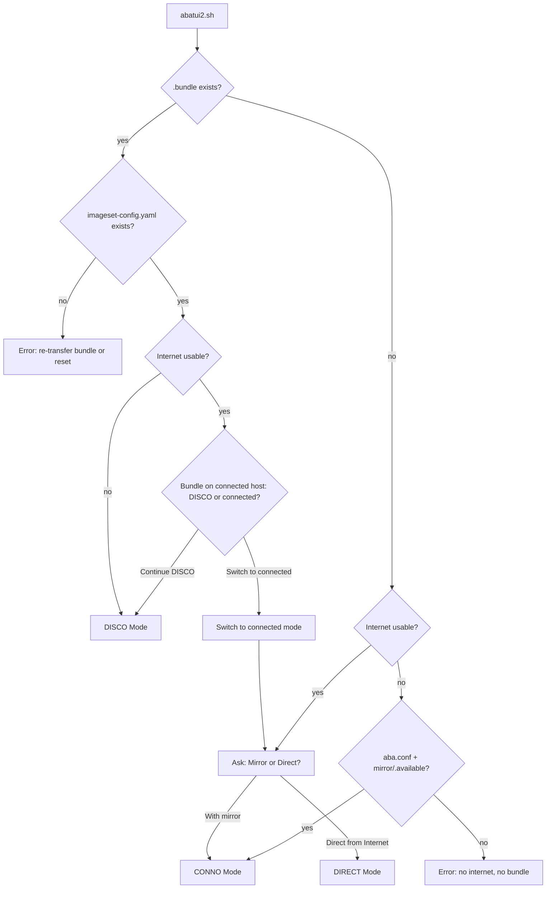

# TUI v2 Specification

## Overview

TUI v2 (`tui/v2/abatui2.sh`) is a **complete replacement for v1**, covering the entire ABA workflow: mirror setup, image save/sync/bundle, cluster configuration/installation, monitoring, and Day-2 operations. It supports three operating modes — DISCO, CONNO, and DIRECT — detected automatically at startup.

**Entry:** `./tui/v2/abatui2.sh` (or symlink)

**Dependencies:** `dialog`, `scripts/include_all.sh`, `tui/v2/tui-lib.sh`, `tui/v2/tui-strings2.sh`

**Relationship to v1:** v2 reuses working v1 code (copied and adapted). The original `tui/abatui.sh` stays untouched as a fallback until v2 is proven stable.

---

## Modes

| Mode   | Detection                                        | Purpose                                             |
|--------|--------------------------------------------------|-----------------------------------------------------|
| DISCO  | `.bundle` exists AND ISC present                 | Disconnected host: install registry, load, cluster  |
| CONNO  | Internet available, user chooses "with mirror"   | Connected host with mirror: full ABA workflow       |
| DIRECT | Internet available, user chooses "direct"        | Connected host, no mirror: install from internet    |

---

## Mode Detection



### Internet Check

"Internet usable" = `check_internet_connectivity "aba"` from `include_all.sh`. Checks `api.openshift.com`, `mirror.openshift.com`, and `registry.redhat.io`. Pre-fetched in background at TUI startup via `run_once`.

### Mirror-vs-Direct Dialog

Always shown when internet is available. Pre-selected default:

- `mirror/.available` exists → highlight "With a mirror registry"
- No mirror configured → still highlight "With a mirror registry" (ABA's primary use case is mirror-based)
- User can always override and pick the other option

### Edge Case: `.bundle` + Internet

Show a decision dialog:

```
This host has an ABA install bundle but also has internet access.
The bundle is intended for disconnected environments.

  • Continue in disconnected (DISCO) mode
  • Switch to connected mode
```

### Dead-End States

| Condition                                     | Message                                                      |
|-----------------------------------------------|--------------------------------------------------------------|
| `.bundle` exists but no ISC                   | "Bundle incomplete. Re-transfer or run `aba reset`."         |
| No `.bundle`, no internet, no `aba.conf`      | "No internet and no bundle. Transfer a bundle first."        |

### Light Bundle Handling

A light bundle (`aba bundle --light`) contains the ISC but no `mirror_*.tar` archive files.

- **Mode detection:** Checks for ISC (not tar files) → enters DISCO mode correctly
- **Within DISCO:** "Load Images" checks for tar files. If missing → show "Light bundle detected. Copy archive files to `mirror/data/` from your transfer media." Blocks until at least one tar file is present (offers "Check again").

---

## Dialog Standards

All screens follow these rules:

### Buttons

| Rule                 | Pattern                                                                    |
|----------------------|----------------------------------------------------------------------------|
| HELP on every screen | `--help-button`; rc=2 → show context-sensitive msgbox, re-display dialog   |
| NEXT/BACK (forms)    | `--ok-label "Next"` + `--extra-button --extra-label "Back"` (Enter=submit=Next) |
| Menu-style pages     | `--ok-label "Select"` + `--cancel-label "Back"` + `"NEXT" ">>> Next >>>"` menu item |
| Cancel (rc=1)        | Go back one level                                                            |
| ESC (rc=255)         | ALWAYS trigger `confirm_quit` dialog — never treat as "Back"                 |

### Execution Modes

Long-running operations (install, load, save, sync) offer both:

- **Terminal mode** — clear screen, live output (user sees full scrolling log)
- **TUI mode** — tailbox/progress within dialog (stays inside TUI chrome)

Same as v1: user picks which mode before execution.

### Unavailable Menu Items

Items that cannot be activated (prerequisites unmet) are **shown but greyed out** with a short reason tag. Example:

```
  Day-2: NTP          [install cluster first]
  Monitor Cluster     [install cluster first]
```

This lets the user see the full workflow at a glance.

### Default Values

Every input field is pre-filled with a sensible default (from `aba.conf`, auto-detect functions, or hardcoded). The user should be able to press Next/Enter through the entire wizard and get a working configuration.

### Toggles

Fields with a small fixed set of values use select-to-cycle (toggle), not free-text:

- Type: sno → compact → standard → sno
- Connection: mirror → proxy → direct → mirror
- Platform: bm → vmw → kvm → bm

### Background Pre-fetch

- Kick off `run_once` tasks early (internet check at startup, versions after channel selection)
- Only show "Please Wait" if the user navigates faster than the background task completes
- Data should typically be ready before the user reaches that screen

---

## DISCO Mode

### Action Menu

Unavailable items shown greyed out:

| #  | Item                     | Availability                                     |
|----|--------------------------|--------------------------------------------------|
| 1  | Install Registry         | Always (local or remote; re-install if needed)   |
| 2  | Load Images              | Greyed until registry installed                  |
| 3  | Install Cluster          | Always (unified: configure → review → install)   |
| 4  | Day-2: NTP / OSUS / Full | Greyed until cluster installed                   |
| 5  | Monitor Cluster          | Greyed until cluster installed                   |
| 7  | View ISC                 | Always (read-only; ISC came from bundle)         |
| 8  | Reset to Connected Mode  | Greyed if no internet available                  |

### UC-D1: Install Registry

1. Ask: Install locally or on remote host?
   - **Local:** confirm, proceed
   - **Remote:** ask for SSH target host
2. Execute: `aba -d mirror install` (terminal/TUI mode)
3. On success: return to action menu

### UC-D2: Load Images

1. If light bundle (no `mirror/data/mirror_*.tar`):
   - Show: "Light bundle detected. Copy archives to `mirror/data/`."
   - Offer: "Check again" / "Back"
   - Block until at least one tar file present
2. Execute: `aba -d mirror load` (terminal/TUI mode)
3. On success: return to action menu

### UC-D3: View ISC

Read-only view of `mirror/data/imageset-config.yaml` via `--textbox`. No editing (ISC came from bundle, modifications belong on the connected host).

### UC-D4: Reset to Connected Mode

1. Pre-check: internet available? If not → greyed, cannot activate.
2. Confirm: "Switch to connected mode? The bundle state will be cleared."
3. Internally remove `.bundle` flag
4. Re-run mode detection → enters Mirror-vs-Direct dialog

---

## CONNO Mode

### Initial Wizard (first entry only)

Entering CONNO mode for the first time runs the **v1 wizard flow**: pull secret → channel → version → platform → operator selection → ISC generation. This is the same wizard as v1 (copied and adapted to v2 dialog standards). Once wizard state is saved (`aba.conf` populated), subsequent entries skip straight to the action menu.

### Action Menu

Unavailable items shown greyed out:

**Mirror operations:**

| #  | Item              | Availability                       |
|----|-------------------|------------------------------------|
| 1  | Install Mirror    | Always (local or remote)           |
| 2  | Save Images       | Greyed until mirror installed      |
| 3  | Sync Images       | Greyed until mirror installed      |
| 4  | View/Edit ISC     | Always                             |
| 5  | Select Operators  | Always (same as v1 checklist)      |
| 6  | Create Bundle     | Always                             |

**Cluster operations:**

| #  | Item              | Availability                       |
|----|-------------------|------------------------------------|
| 7  | Install Cluster      | Always (unified: configure → review → install) |
| 8  | Day-2: Full/NTP/OSUS | Greyed until installed          |
| 9  | Monitor Cluster      | Greyed until installed             |

**Mode switch:**

| #  | Item                  | Availability |
|----|-----------------------|--------------|
| 11 | Switch to DIRECT mode | Always       |

### Mirror Health Warning

Background `aba verify` kicked off at startup. If unhealthy → non-blocking warning in status line: "Warning: mirror may be unreachable (verify failed)".

### UC-C6: Create Bundle

1. Run `_ensure_offline_prereqs()` (download CLI tools + registry installers)
2. Prompt for output path (default `/tmp/ocp-bundle`)
3. Same-device check: if output and `mirror/data` are on the same filesystem, offer Light vs Full bundle choice
4. **Image reuse check:** if `mirror/data/mirror_*.tar` already exists:
   - Present dialog: "Reuse (fast)" vs "Clean Rebuild"
   - **Reuse** (default): incremental — oc-mirror only downloads changed/new images
   - **Clean Rebuild**: passes `--force` — deletes existing data, re-downloads everything
   - Help explains when to use each option
   - If no existing data: skip dialog, run without `--force`
5. Execute: `aba bundle --out <path> [--light] [--force]`

---

## DIRECT Mode

### Minimal Wizard

Same look and feel as v1:

1. **Pull secret** — check `~/.pull-secret.json`, prompt if missing (paste or file path)
2. **Channel** — radio: stable / fast / candidate (HELP, NEXT/BACK)
3. **Version** — pre-fetch via `run_once`, show Latest/Previous/Older/Manual (same as v1)
4. **Platform** — radio: bm / vmw / kvm (default: bm)

Pre-fetch: start fetching version data immediately after channel selection.

### Action Menu

After wizard completes (unavailable items greyed out):

| #  | Item              | Availability                       |
|----|-------------------|------------------------------------|
| 1  | Install Cluster   | Always (unified: configure → review → install) |
| 2  | Day-2: NTP / Full | Greyed until installed             |
| 3  | Monitor Cluster   | Greyed until installed             |

---

## Cluster Configuration (4-page form)

### Page 1: Basics (menu-style, toggle/edit)

```
  1) Cluster name:   ocp           [editable, default "ocp"]
  2) Type:           sno           [toggle: sno → compact → standard → sno]
  3) Worker count:   2             [hidden if sno/compact; editable if standard]
```

- Toggle "Type" auto-adjusts: sno/compact → "Worker count" row disappears; standard → shows with default 2
- Cluster name validated: `[a-z0-9-]+`, max 15 chars

### Page 2: Networking (form-style, pre-filled)

Value precedence: `aba.conf` (if set) → `get_*()` auto-detect → smart guess → empty.

| Field             | Default source                                                                 | Visibility        |
|-------------------|--------------------------------------------------------------------------------|-------------------|
| Machine network   | `get_machine_network()`                                                        | Always            |
| Starting IP       | Smart guess from machine network (e.g., `.100` offset)                         | Always            |
| API VIP           | DNS lookup `api.<cluster>.<base_domain>`; else derive from network             | Hidden if sno     |
| Ingress VIP       | DNS lookup `*.apps.<cluster>.<base_domain>`; else derive from network          | Hidden if sno     |
| DNS servers       | `get_dns_servers()`                                                            | Always            |
| Gateway           | `get_next_hop()`                                                               | Always            |
| NTP servers       | `get_ntp_servers()`                                                            | Always (optional) |

### Page 3: Interfaces (menu-style, toggle/edit)

```
  1) Ports:          ens1f0        [editable]
  2) VLAN:           (none)        [editable, optional]
  3) Connection:     mirror        [toggle: mirror → proxy → direct]
```

- In DIRECT mode: Connection locked to "direct", not toggleable

### Page 4: VM Resources (form-style, only if platform != bm)

| Field             | Visibility                    |
|-------------------|-------------------------------|
| Master CPUs       | Always (when page shown)      |
| Master Memory     | Always                        |
| Worker CPUs       | Only if type=standard         |
| Worker Memory     | Only if type=standard         |
| Data disk GB      | Always                        |
| MAC template      | Always (UI label for `mac_prefix` in config) |

**MAC addresses:**

- If `macs.conf` exists and has entries → show "MACs: from macs.conf" (read-only info line)
- If `macs.conf` is missing/empty → show editable MAC address fields for each node

**Default platform = bm (bare metal).** If user selects vmw or kvm, Page 4 appears; otherwise Page 4 is skipped entirely.

### Output

Assembles and executes: `aba cluster --name <name> --type <type> [flags...]`

Correct CLI flags (from `others/help-cluster.txt`):

| Flag                | Short |
|---------------------|-------|
| `--name`            | `-n`  |
| `--type`            | `-t`  |
| `--starting-ip`     | `-i`  |
| `--api-vip`         | `-A`  |
| `--ingress-vip`     | `-G`  |
| `--machine-network` | `-M`  |
| `--dns`             | `-N`  |
| `--gateway-ip`      | `-g`  |
| `--ntp`             | `-T`  |
| `--int-connection`  | `-I`  |
| `--ports`           |       |
| `--vlan`            |       |
| `--num-workers`     | `-W`  |

**Important:** `--gateway` is WRONG. Always use `--gateway-ip`.

---

## Install + Monitor Behavior

`aba -d <cluster> install` always auto-runs `aba -d <cluster> mon` at the end (built into the install Makefile target). The separate **Monitor Cluster** menu item remains available for:

- Re-monitoring after Day-2 operations
- Checking cluster status at any time
- Resuming monitoring if user previously exited with Ctrl-C

---

## Day-2 Operations

| Operation      | Command                         | Available in       | Pre-check                                  |
|----------------|----------------------------------|--------------------|--------------------------------------------|
| Day-2: Full    | `aba -d <cluster> day2`         | DISCO, CONNO       | None                                       |
| Day-2: NTP     | `aba -d <cluster> day2-ntp`     | ALL modes          | None                                       |
| Day-2: OSUS    | `aba -d <cluster> day2-osus`    | DISCO, CONNO       | Warn if Cincinnati operator not in ISC     |

### Flow

1. List installed clusters (show full `<name>.<base_domain>`)
2. User selects cluster
3. Confirm execution
4. Run in terminal/TUI mode
5. Return to action menu

---

## Platform Config Check

Triggered before cluster install when platform is vmw or kvm:

1. Check for config file (`~/.vmware.conf` or `~/.kvm.conf`)
2. If missing:
   - Show: "VMware/KVM config not found at `~/<file>`"
   - List required fields
   - Ask: "Edit in terminal ($EDITOR)" / "Edit in TUI dialog" / "Skip"
   - If terminal: clear screen, open editor, return
   - If TUI dialog: show `--editbox`
   - Loop until file exists or user cancels
3. For platform=bm: no check needed (proceed directly)

---

## Why Separate "Configure" and "Install"?

- **Configure** creates `cluster.conf` — safe, repeatable, allows review before committing
- **Install** provisions VMs/ISO, bootstraps OpenShift — destructive, long-running, irreversible
- User benefits: configure multiple clusters, review settings, re-configure without re-installing, install at a chosen time
- TUI enforces correct sequencing via greyed-out menu items

---

## CLI-Only (NOT in TUI v2)

- Named mirrors (`aba mirror --name foo`)
- VMware/KVM config file form editors (TUI offers `$EDITOR`, not a full form)
- `aba reset`, `aba upgrade`, `aba bundle --out -` (piping to stdout)
- Multi-cluster management (TUI handles one at a time)
- `aba tar` (low-level archive operations)

---

## Shared Caching (`run_once`)

TUI and CLI share cached operation results via unified `aba:` prefix:

| Operation          | Cache key               |
|--------------------|-------------------------|
| Internet checks    | `aba:check:*`           |
| Catalog prefetch   | `aba:prefetch:catalogs` |
| ISC generation     | `aba:isconf:generate`   |
| OCP versions       | `ocp:${channel}:*`      |

Benefit: if user ran `aba` CLI recently, the TUI instantly uses cached results — zero wait. CLI and TUI are fully interchangeable.

## ISC Background Regeneration

The ImageSet Config (`mirror/data/imageset-config.yaml`) is generated by `aba isconf -d mirror`.
Its inputs are: `ocp_channel`, `ocp_version`, `ops`, `op_sets`, `ARCH`, `excl_platform`, `ocp_version_target`.

**Pattern (same as v1):**
1. **Start ASAP** — after any ISC-input change, kick off `run_once -i "aba:isconf:generate"` in the background (non-blocking `&`)
2. **Wait only when viewing** — `mirror_view_isc()` calls `run_once -p` to check completion, then `run_once -q -w` only if still running

**Triggers (write to aba.conf + background ISC regen):**
- Channel/version saved (`_direct_save_config`)
- Operator basket changed (`_persist_operator_basket`)

This means ISC is usually ready before the user navigates to "View ISC".

---

## Navigation Rules

- **ESC** at any dialog → confirm quit (same as v1)
- **Back** button → previous page/menu
- **Help** (F1 or button) → context-sensitive help msgbox
- Unavailable items visible but greyed — cannot be activated
- After long-running operations: return to action menu automatically
- Cluster lists always show full `<cluster-name>.<base_domain>`

---

## File Layout

```
tui/v2/
  abatui2.sh       — Entry point: mode detection, routing, CONNO menu
  tui-lib.sh       — TUI-only helpers: dialog wrappers, confirm_and_execute
  tui-strings2.sh  — String constants (titles, tags, labels)
  tui-mirror.sh    — Mirror/bundle: save, sync, bundle, operators, ISC (from v1)
  tui-cluster.sh   — Cluster: configure/install/monitor/day2 (NEW)
  tui-disco.sh     — DISCO mode: registry install + load
  tui-direct.sh    — DIRECT mode: minimal wizard, straight to cluster
  SPEC.md          — This file
```

Each `tui-*.sh` is sourceable AND standalone (`BASH_SOURCE` guard for dev/testing).

---

## Design Principles

1. **`aba` CLI first** — TUI calls `aba` commands, never scripts directly
2. **Config files are the SINGLE SOURCE OF TRUTH** — `aba.conf`, `mirror.conf`, `cluster.conf` are authoritative. The TUI must:
   - **Write immediately** — persist user choices to config files as soon as they are made (not deferred to a "save" step or action trigger)
   - **Read on startup** — restore state from config files so TUI reflects reality (e.g. operators previously selected via CLI)
   - **Never rely on in-memory state alone** — in-memory variables (like `OP_BASKET`) are caches of config-file truth, not the other way around
   - **Survive crashes** — because state is persisted immediately, a TUI crash or `kill` loses nothing
   - ABA core always reads from config files; the TUI must ensure those files are current before invoking any `aba` command
3. **ABA core functions first** — use `include_all.sh` functions, never reimplement
4. **Reuse v1 code** — copy working wizard functions, adapt to v2 standards, don't rewrite
5. **Greyed-out menus** — show full workflow, disable items until prerequisites met
6. **Sourceable + standalone** — each `tui-*.sh` has `BASH_SOURCE` guard
7. **Default to bm** — platform default is bare metal; VM pages only shown for vmw/kvm
8. **CLI and TUI interchangeable** — shared `run_once` caches, same config files; user can switch between TUI and CLI mid-workflow
