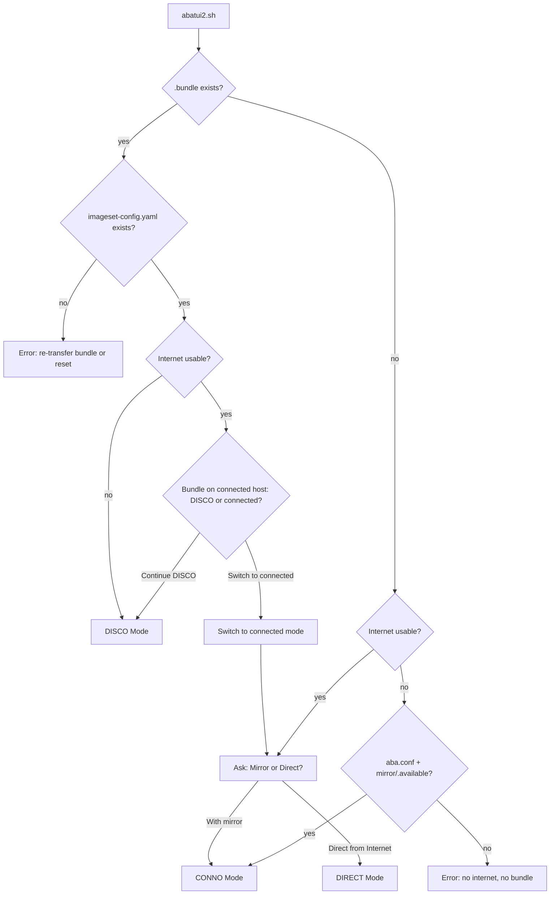

# TUI v2 Specification

## Overview

TUI v2 (`tui/v2/abatui2.sh`) is a **complete replacement for v1**, covering the entire ABA workflow: mirror setup, image save/sync/bundle, cluster configuration/installation, monitoring, and Day-2 operations. It supports three operating modes — DISCO, CONNO, and DIRECT — detected automatically at startup.

**Entry points:**
- `abatui` — installed in `$PATH` (symlink `~/bin/abatui → aba`; `aba.sh` detects `basename == abatui` and exec's the TUI)
- `./abatui` — repo-root symlink → `tui/v2/abatui2.sh`
- `./tui/v2/abatui2.sh` — direct invocation

**Dependencies:** `dialog`, `scripts/include_all.sh`, `tui/v2/tui-lib.sh`, `tui/v2/tui-strings2.sh`

**Relationship to v1:** v2 reuses working v1 code (copied and adapted). v2 is now the primary TUI; the repo-root `abatui` symlink points to v2.

---

## Modes

| Mode   | Detection                                        | Purpose                                             |
|--------|--------------------------------------------------|-----------------------------------------------------|
| DISCO  | `.bundle` exists AND ISC present                 | Disconnected host: install registry, load, cluster  |
| CONNO  | Internet available, user chooses "with mirror"   | Connected host with mirror: full ABA workflow       |
| DIRECT | Internet available, user chooses "direct"        | Connected host, no mirror: install from internet    |

---

## Mode Detection



### Internet Check

"Internet usable" = `check_internet_connectivity "aba"` from `include_all.sh`. Checks `api.openshift.com`, `mirror.openshift.com`, and `registry.redhat.io`. Pre-fetched in background at TUI startup via `run_once`.

### Mirror-vs-Direct Dialog

Always shown when internet is available. Pre-selected default:

- `mirror/.available` exists → highlight "With a mirror registry"
- No mirror configured → still highlight "With a mirror registry" (ABA's primary use case is mirror-based)
- User can always override and pick the other option

### Edge Case: `.bundle` + Internet

Show a decision dialog:

```
This host has an ABA install bundle but also has internet access.
The bundle is intended for disconnected environments.

  • Continue in disconnected (DISCO) mode
  • Switch to connected mode
```

### Dead-End States

| Condition                                     | Message                                                      |
|-----------------------------------------------|--------------------------------------------------------------|
| `.bundle` exists but no ISC                   | "Bundle incomplete. Re-transfer or run `aba reset`."         |
| No `.bundle`, no internet, no `aba.conf`      | "No internet and no bundle. Transfer a bundle first."        |

### Light Bundle Handling

A light bundle (`aba bundle --light`) contains the ISC but no `mirror_*.tar` archive files.

- **Mode detection:** Checks for ISC (not tar files) → enters DISCO mode correctly
- **Within DISCO:** "Load Images" checks for tar files. If missing → show "Light bundle detected. Copy archive files to `mirror/data/` from your transfer media." Blocks until at least one tar file is present (offers "Check again").

---

## Dialog Standards

All screens follow these rules:

### Navigation Hint

The `dlg()` wrapper automatically appends `\n(Navigate: Arrow keys, Tab, ESC)` to the message text of every `--menu`, `--radiolist`, and `--checklist` dialog. This appears above the list, below the prompt text. No manual injection needed — every list-style dialog gets it for free.

### Buttons

| Rule                 | Pattern                                                                    |
|----------------------|----------------------------------------------------------------------------|
| HELP on every screen | `--help-button`; rc=2 → show context-sensitive msgbox, re-display dialog   |
| NEXT/BACK (forms)    | `--ok-label "Next"` + `--extra-button --extra-label "Back"` (Enter=submit=Next) |
| Menu-style pages     | `--ok-label "Select"` + `--extra-button --extra-label "Next"` + `--cancel-label "Back"` + `--help-button` + `--default-button ok` |
| Cancel (rc=1)        | Go back one level                                                            |
| ESC (rc=255)         | Hierarchical: sub-menu/wizard → return to parent; main menu → confirm quit   |

#### Critical: `--help-button` Required on All Menu-style Pages

When a dialog uses `--extra-button` (for "Next"), it MUST also include `--help-button`. Without it, `dialog` can misfire rc=3 (Extra/Next) on the first Enter press from a menu item, instead of rc=0 (Select/OK). This is a known `dialog` quirk — adding `--help-button` stabilizes the internal button handling.

### Execution Modes

Long-running operations (install, load, save, sync) offer both:

- **Terminal mode** — clear screen, live output (user sees full scrolling log)
- **TUI mode** — tailbox/progress within dialog (stays inside TUI chrome)

Same as v1: user picks which mode before execution.

Both modes MUST:
- Display the command being executed at the top (e.g. `Executing: aba -d mirror sync`)
- Return the real exit code to the caller (callers gate on success/failure)

### Post-Execution Dialogs

- **Success (exit 0):** Show output in a textbox with only "Back to Menu" button. No "Exit TUI" — the user just completed an operation and almost always wants to continue.
- **Failure (exit != 0):** Show output with "Back to Menu" and "Retry" buttons.

### Unavailable Menu Items

Items that cannot be activated (prerequisites unmet) are **shown but greyed out** with a short reason tag. Example:

```
  Day-2: NTP          [install cluster first]
  Monitor Cluster     [install cluster first]
```

This lets the user see the full workflow at a glance.

**Cluster installed check:** `cluster_installed()` checks for the `.install-complete` marker file (created by the Makefile on successful install, removed by `aba delete`). Do NOT use `iso-agent-based/auth/kubeconfig` — it persists after deletion and causes deleted clusters to appear as installed.

**ERR trap safety:** `list_installed_clusters()` uses `cluster_installed "$dir" && echo "$dir" || true` — the `|| true` is required because under `set -e` or an ERR trap, a false return from `cluster_installed` would abort the loop.

**Exception:** Operations where the Makefile handles prerequisites (e.g. Sync, Load) are NEVER greyed out — even if the mirror isn't installed. The TUI shows a config review dialog and the single `aba` command handles the install as a dependency.

### Dynamic Menu Titles (Mirror State)

Main menus in CONNO and DISCO modes display the current mirror state in the menu body text:

- CONNO: `"Partially Disconnected Mode (mirror ready):"`
- DISCO: `"Fully Disconnected — Choose an action (mirror ready):"`

Possible states: `no mirror` → `mirror installed` → `mirror ready` (from `mirror_state_label()`).

### Command Display Formatting

Long `aba` commands (more than 3 flags) are displayed in multi-line format with backslash continuations when shown in "Command to execute" dialogs:

```
aba bundle \
    --pull-secret "~/.pull-secret.json" \
    --channel stable \
    --version latest \
    --op-sets ocp odf virt
```

Implemented by `_format_cmd_display()` in `tui-lib.sh`.

### Platform Toggle Alignment

`dialog --menu` sizes columns based on the **raw byte length** of item descriptions, including invisible ANSI color codes (`\Z2\Zb✓\Zn` = ~10 extra bytes). To prevent menu shifting when toggling fields with status indicators:

- Pad descriptions to ensure consistent raw byte length across all options
- Items WITH color codes: pad the text less (color codes already add width)
- Items WITHOUT color codes: pad the text more (compensate for missing invisible bytes)

### Default Values

Every input field is pre-filled with a sensible default (from `aba.conf`, auto-detect functions, or hardcoded). The user should be able to press Next/Enter through the entire wizard and get a working configuration.

### Toggles

Fields with a small fixed set of values use select-to-cycle (toggle), not free-text:

- Type: sno → compact → standard → sno
- Connection: mirror → proxy → direct → mirror
- Platform: bm → vmw → kvm → bm

### Background Pre-fetch

- Kick off `run_once` tasks early (internet check at startup, versions after channel selection)
- Only show "Please Wait" if the user navigates faster than the background task completes
- Data should typically be ready before the user reaches that screen
- Init order: modules → connectivity (background) → packages → config → ready

### Makefile Dependency Principle

The TUI MUST NOT orchestrate multi-step operations as separate commands. Instead:

- Run the user's intended command (e.g. `aba sync`, `aba load`)
- The Makefile dependency chain handles prerequisites automatically (e.g. `sync` depends on `install`)
- One command = one execution = one exit code

**When mirror is not installed and user requests sync/load:**
1. Inform: "Mirror not installed. A mirror will be installed first. Continue?"
2. Show `_mirror_config_review()` — existing `mirror.conf` values for review/editing
3. Run single command (`aba sync` or `aba load`) which handles install as a dependency

This avoids double-confirmation, redundant prompts, and split error handling.

### Config Review Before First-Time Operations

When an operation will trigger a first-time install (mirror or cluster), the TUI MUST:
1. Inform the user that install will happen as part of the operation
2. Show existing config values (from `mirror.conf` or `cluster.conf`) for review/editing
3. If config exists from a prior aborted attempt — load those values, never skip the review
4. Proceed with the single command after user confirms

### Save-on-Edit (Mirror Config)

Mirror config dialogs (`_mirror_config_review`, `_mirror_install_local`, `_mirror_install_remote`) save each field to `mirror.conf` **immediately when the user confirms an edit** — not deferred to a "Continue"/"Next" action. This ensures:

- Values persist even if the user presses Back/Cancel
- Switching between different TUI paths (e.g. "Install Registry" → "Load Images") preserves edits
- Crash safety: no edits are lost

This matches the cluster wizard pattern (which uses `_set_cluster_conf` after each field).

### Focus Preservation

Every menu dialog in a `while :; do` loop MUST pass `--default-item "$default_item"` so focus stays on the last-selected item after an edit or toggle action.

---

## DISCO Mode

### Action Menu

Dynamic title: `"Fully Disconnected — Choose an action (mirror ready):"` (state from `mirror_state_label()`)

Unavailable items shown greyed out:

| #  | Item                     | Availability                                     |
|----|--------------------------|--------------------------------------------------|
| 1  | Install Registry         | Always (local or remote; re-install if needed)   |
| 2  | Load Images (disk2mirror)| Always (if no registry: config review → `aba load` handles install as dep) |
| 3  | Install Cluster          | Always (if no mirror: offers Install & Load; if no images: offers Load Now) |
| 4  | Day-2: NTP / OSUS / Full | Greyed until cluster installed                   |
| 5  | Monitor Cluster          | Greyed until cluster installed                   |
| 7  | View ISC                 | Always (read-only; ISC came from bundle)         |
| 8  | Reset to Connected Mode  | Greyed if no internet available                  |

### UC-D1: Install Registry

1. Ask: Install locally or on remote host?
   - **Local:** confirm, proceed
   - **Remote:** ask for SSH target host
2. Execute: `aba -d mirror install` (terminal/TUI mode)
3. On success: return to action menu

### UC-D2: Load Images

1. If registry not installed:
   - Inform: "Mirror registry is not installed. A mirror will be installed first, then images loaded. Continue?"
   - If Yes: show mirror config review (`_mirror_config_review()`) for confirmation/editing
   - Then proceed (Makefile handles install as dependency of load)
2. If light bundle (no `mirror/data/mirror_*.tar`):
   - Show: "Light bundle detected. Copy archives to `mirror/data/`."
   - Offer: "Check again" / "Back"
   - Block until at least one tar file present
3. Execute: `aba -d mirror load` (terminal/TUI mode) — single command handles install+load
4. On success: return to action menu

### UC-D3: Install Cluster

Parallels CONNO's Install Cluster flow with DISCO-specific adaptations:

1. If mirror not installed:
   - Offer: "Install & Load" / "Back"
   - If Yes: show mirror config review (`_mirror_config_review()`) → `disco_load_images` → `cluster_install_flow`
   - Single `aba -d mirror load` command handles install+load (Makefile deps)
2. If mirror installed but no release images:
   - Offer: "Load Now" / "Back"
   - If Yes: `disco_load_images` → `cluster_install_flow`
3. If mirror ready:
   - Proceed directly to `cluster_install_flow`

### UC-D4: View ISC

Read-only view of `mirror/data/imageset-config.yaml` via `--textbox`. No editing (ISC came from bundle, modifications belong on the connected host).

### UC-D5: Reset to Connected Mode

1. Pre-check: internet available? If not → greyed, cannot activate.
2. Confirm: "Switch to connected mode? The bundle state will be cleared."
3. Internally remove `.bundle` flag
4. Re-run mode detection → enters Mirror-vs-Direct dialog

---

## CONNO Mode

### Initial Wizard (first entry only)

Entering CONNO mode for the first time runs the **v1 wizard flow**: pull secret → channel → version → platform → operator selection → ISC generation. This is the same wizard as v1 (copied and adapted to v2 dialog standards). Once wizard state is saved (`aba.conf` populated), subsequent entries skip straight to the action menu.

### Action Menu

Unavailable items shown greyed out:

**Mirror operations:**

| #  | Item                           | Availability                       |
|----|--------------------------------|------------------------------------|
| 1  | View/Edit ImageSet Config      | Always (shows first — most commonly reviewed) |
| 2  | Select Operators               | Always (same as v1 checklist)      |
| 3  | Install Mirror                 | Always (local or remote)           |
| 4  | Save Images (mirror2disk)      | Always (m2d — only needs internet, no mirror) |
| 5  | Sync Images (mirror2mirror)    | Always (if no mirror: config review → `aba sync` handles install as dep) |
| 6  | Create Bundle                  | Always                             |

Menu label convention: Save/Sync/Load include directional suffixes — `(mirror2disk)`, `(mirror2mirror)`, `(disk2mirror)` — so the user knows the data flow direction at a glance.

**Cluster operations:**

| #  | Item              | Availability                       |
|----|-------------------|------------------------------------|
| 7  | Install Cluster      | Always (unified: configure → review → install) |
| 8  | Day-2: Full/NTP/OSUS | Greyed until installed          |
| 9  | Monitor Cluster      | Greyed until installed             |

**Mode switch:**

| #  | Item                  | Availability |
|----|-----------------------|--------------|
| 11 | Switch to DIRECT mode | Always       |

### Mirror Health Warning

Background `aba verify` kicked off at startup. If unhealthy → non-blocking warning in status line: "Warning: mirror may be unreachable (verify failed)".

### UC-C6: Create Bundle

1. Run `_ensure_offline_prereqs()` (download CLI tools + registry installers)
2. Prompt for output path (default `/tmp/ocp-bundle`)
3. Same-device check: if output and `mirror/data` are on the same filesystem, offer Light vs Full bundle choice
4. **Image reuse check:** if `mirror/data/mirror_*.tar` already exists:
   - Present dialog: "Reuse (fast)" vs "Clean Rebuild"
   - **Reuse** (default): incremental — oc-mirror only downloads changed/new images
   - **Clean Rebuild**: passes `--force` — deletes existing data, re-downloads everything
   - Help explains when to use each option
   - If no existing data: skip dialog, run without `--force`
5. Execute: `aba bundle --out <path> [--light] [--force]`

---

## DIRECT Mode

### Minimal Wizard

Same look and feel as v1:

1. **Pull secret** — check `~/.pull-secret.json`, prompt if missing (paste or file path)
2. **Channel** — radio: stable / fast / candidate (HELP, NEXT/BACK)
3. **Version** — pre-fetch via `run_once`, show Latest/Previous/Older/Manual (same as v1)
4. **Platform** — radio: bm / vmw / kvm (default: bm)

Pre-fetch: start fetching version data immediately after channel selection.

### Action Menu

After wizard completes (unavailable items greyed out):

| #  | Item              | Availability                       |
|----|-------------------|------------------------------------|
| 1  | Install Cluster   | Always (unified: configure → review → install) |
| 2  | Day-2: NTP / Full | Greyed until installed             |
| 3  | Monitor Cluster   | Greyed until installed             |

---

## Cluster Configuration (4-page form)

### Page 1: Basics (menu-style, toggle/edit)

```
  1) Cluster name:   ocp           [editable, default "ocp"]
  2) Type:           sno           [toggle: sno → compact → standard → sno]
  3) Worker count:   2             [hidden if sno/compact; editable if standard]
```

- Toggle "Type" auto-adjusts: sno/compact → "Worker count" row disappears; standard → shows with default 2
- Cluster name validated: `[a-z0-9-]+`, max 15 chars

### Page 2: Networking (form-style, pre-filled)

Value precedence: `aba.conf` (if set) → `get_*()` auto-detect → smart guess → empty.

| Field             | Default source                                                                 | Visibility        |
|-------------------|--------------------------------------------------------------------------------|-------------------|
| Machine network   | `get_machine_network()`                                                        | Always            |
| Starting IP       | Smart guess from machine network (e.g., `.100` offset)                         | Always            |
| API VIP           | DNS lookup `api.<cluster>.<base_domain>`; else derive from network             | Hidden if sno     |
| Ingress VIP       | DNS lookup `*.apps.<cluster>.<base_domain>`; else derive from network          | Hidden if sno     |
| DNS servers       | `get_dns_servers()`                                                            | Always            |
| Gateway           | `get_next_hop()`                                                               | Always            |
| NTP servers       | `get_ntp_servers()`                                                            | Always (optional) |

### Page 3: Interfaces (menu-style, toggle/edit)

```
  1) Ports:          ens1f0        [editable]
  2) VLAN:           (none)        [editable, optional]
  3) Connection:     mirror        [toggle: mirror → proxy → direct]
```

- Uses `--ok-label "Select"` + `--extra-button --extra-label "Next"` + `--cancel-label "Back"` + `--help-button` + `--default-button ok`
- **MUST include `--help-button`** — without it, dialog misfires rc=3 (Next) on first Enter from a menu item instead of rc=0 (Select). This is a confirmed `dialog` quirk.
- In DIRECT mode: Connection toggle cycles direct ↔ proxy only
- **Help text** mentions: multiple port names create a bond (e.g. `ens1f0,ens1f1`). The "MACs" field description is omitted from the generic help — it only applies to bare-metal platforms and is shown contextually.

### Page 4: VM Resources (form-style, only if platform != bm)

| Field             | Visibility                    |
|-------------------|-------------------------------|
| Master CPUs       | Always (when page shown)      |
| Master Memory     | Always                        |
| Worker CPUs       | Only if type=standard         |
| Worker Memory     | Only if type=standard         |
| Data disk GB      | Always                        |
| MAC template      | Always (UI label for `mac_prefix` in config) |

**MAC addresses:**

- If `macs.conf` exists and has entries → show "MACs: from macs.conf" (read-only info line)
- If `macs.conf` is missing/empty → show editable MAC address fields for each node

**Default platform = bm (bare metal).** If user selects vmw or kvm, Page 4 appears; otherwise Page 4 is skipped entirely.

### Output

Assembles and executes: `aba cluster --name <name> --type <type> [flags...]`

Correct CLI flags (from `others/help-cluster.txt`):

| Flag                | Short |
|---------------------|-------|
| `--name`            | `-n`  |
| `--type`            | `-t`  |
| `--starting-ip`     | `-i`  |
| `--api-vip`         | `-A`  |
| `--ingress-vip`     | `-G`  |
| `--machine-network` | `-M`  |
| `--dns`             | `-N`  |
| `--gateway-ip`      | `-g`  |
| `--ntp`             | `-T`  |
| `--int-connection`  | `-I`  |
| `--ports`           |       |
| `--vlan`            |       |
| `--num-workers`     | `-W`  |

**Important:** `--gateway` is WRONG. Always use `--gateway-ip`.

---

## Install + Monitor Behavior

`aba -d <cluster> install` always auto-runs `aba -d <cluster> mon` at the end (built into the install Makefile target). The separate **Monitor Cluster** menu item remains available for:

- Re-monitoring after Day-2 operations
- Checking cluster status at any time
- Resuming monitoring if user previously exited with Ctrl-C

---

## Day-2 Operations

| Operation      | Command                         | Available in       | Pre-check                                  |
|----------------|----------------------------------|--------------------|--------------------------------------------|
| Day-2: Full    | `aba -d <cluster> day2`         | DISCO, CONNO       | None                                       |
| Day-2: NTP     | `aba -d <cluster> day2-ntp`     | ALL modes          | None                                       |
| Day-2: OSUS    | `aba -d <cluster> day2-osus`    | DISCO, CONNO       | Warn if Cincinnati operator not in ISC     |
| Upgrade        | `aba -d <cluster> upgrade --to <ver>` | ALL modes   | Prompts for target version                 |
| Shutdown       | `aba -d <cluster> shutdown --wait`    | ALL modes   | None                                       |
| Startup        | `aba -d <cluster> startup --wait`     | ALL modes   | None                                       |
| Refresh        | `aba -d <cluster> refresh`            | ALL modes   | None                                       |
| Clean          | `aba -d <cluster> clean`              | ALL modes   | None                                       |
| Delete         | `aba -d <cluster> delete`             | ALL modes   | None                                       |

### Flow

1. List installed clusters (show full `<name>.<base_domain>`)
2. User selects cluster
3. Confirm execution
4. Run in terminal/TUI mode
5. Return to action menu

### Upgrade Workflow

The upgrade flow prompts for a target version because `aba upgrade` requires `--to <version>`:

1. `select_installed_cluster` → user picks a cluster
2. Input dialog: "Target version for <cluster>:" with three buttons:
   - **Upgrade** (OK) — validates non-empty input, executes `aba -d <cluster> upgrade --to <version>`
   - **List Available** (extra button) — executes `aba -d <cluster> upgrade --dry-run` to show available versions
   - **Back** (cancel) — returns to Day-2 menu
3. After "List Available", the user returns to the same input dialog to enter the version

### Connected Cluster Messaging

When `day2` or `day2-osus` runs against a cluster with `int_connection` set (connected to internet):
- `day2.sh` prints: "This cluster connects directly to the internet. OperatorHub is already configured to pull from public registries — no mirror integration needed."
- `day2-config-osus.sh` prints: "OpenShift Update Service is not needed — the cluster can reach update channels directly."
These are high-level messages (no internal variable dumps) so the user understands *why* the operation is a no-op.

---

## Platform Config Check

Triggered before cluster install when platform is vmw or kvm:

1. Check for config file (`~/.vmware.conf` or `~/.kvm.conf`)
2. If missing:
   - Show: "VMware/KVM config not found at `~/<file>`"
   - List required fields
   - Ask: "Edit in terminal ($EDITOR)" / "Edit in TUI dialog" / "Skip"
   - If terminal: clear screen, open editor, return
   - If TUI dialog: show `--editbox`
   - Loop until file exists or user cancels
3. For platform=bm: no check needed (proceed directly)

---

## Why Separate "Configure" and "Install"?

- **Configure** creates `cluster.conf` — safe, repeatable, allows review before committing
- **Install** provisions VMs/ISO, bootstraps OpenShift — destructive, long-running, irreversible
- User benefits: configure multiple clusters, review settings, re-configure without re-installing, install at a chosen time
- TUI enforces correct sequencing via greyed-out menu items

---

## CLI-Only (NOT in TUI v2)

- Named mirrors (`aba mirror --name foo`)
- VMware/KVM config file form editors (TUI offers `$EDITOR`, not a full form)
- `aba reset`, `aba bundle --out -` (piping to stdout)
- Multi-cluster management (TUI handles one at a time)
- `aba tar` (low-level archive operations)

---

## Shared Caching (`run_once`)

TUI and CLI share cached operation results via unified `aba:` prefix:

| Operation          | Cache key               | TTL     |
|--------------------|-------------------------|---------|
| Internet checks    | `aba:check:*`           | 5 min   |
| Catalog prefetch   | `aba:prefetch:catalogs` | session |
| ISC generation     | `aba:isconf:generate`   | session |
| OCP versions       | `ocp:${channel}:*`      | session |

Benefit: if user ran `aba` CLI recently, the TUI instantly uses cached results — zero wait. CLI and TUI are fully interchangeable.

**Important:** The internet check cache is intentional for fast TUI startup. Do NOT purge it on every TUI launch. If testing disconnected mode on a host that recently had internet, manually clear the runner entries:

```bash
rm -f ~/.aba/runner/aba:check:internet* ~/.aba/runner/aba:check:api.* ~/.aba/runner/aba:check:mirror.* ~/.aba/runner/aba:check:registry.*
```

## ISC Background Regeneration

The ImageSet Config (`mirror/data/imageset-config.yaml`) is generated by `aba isconf -d mirror`.
Its inputs are: `ocp_channel`, `ocp_version`, `ops`, `op_sets`, `ARCH`, `excl_platform`, `ocp_version_target`.

**Pattern (same as v1):**
1. **Start ASAP** — after any ISC-input change, kick off `run_once -i "aba:isconf:generate"` in the background (non-blocking `&`)
2. **Wait only when viewing** — `mirror_view_isc()` calls `run_once -p` to check completion, then `run_once -q -w` only if still running

**Triggers (write to aba.conf + background ISC regen):**
- **TUI startup** — if `aba.conf` exists, ISC generation is kicked off in the background before the main menu renders (all modes: CONNO, DISCO, DIRECT). This prevents delays when the user first opens "View/Edit ISC".
- Channel/version saved (`_direct_save_config`)
- Operator basket changed (`_persist_operator_basket`)

This means ISC is usually ready before the user navigates to "View ISC".

---

## Navigation Rules

- **ESC** (rc=255) → hierarchical: sub-menu/wizard → return to parent; main menu → confirm quit
- **Back** button (rc=1) → previous page/menu
- **Help** (rc=2) → context-sensitive help msgbox, then re-display same dialog
- **Next** (rc=3, extra button) → advance to next page/step
- Unavailable items visible but greyed — cannot be activated
- After long-running operations: return to action menu automatically
- Cluster lists always show full `<cluster-name>.<base_domain>`

---

## File Layout

```
tui/v2/
  abatui2.sh       — Entry point: mode detection, routing, CONNO menu
  tui-lib.sh       — TUI-only helpers: dialog wrappers, confirm_and_execute
  tui-strings2.sh  — String constants (titles, tags, labels)
  tui-mirror.sh    — Mirror/bundle: save, sync, bundle, operators, ISC (from v1)
  tui-cluster.sh   — Cluster: configure/install/monitor/day2 (NEW)
  tui-disco.sh     — DISCO mode: registry install + load
  tui-direct.sh    — DIRECT mode: minimal wizard, straight to cluster
  SPEC.md          — This file
```

Each `tui-*.sh` is sourceable AND standalone (`BASH_SOURCE` guard for dev/testing).

---

## Design Principles

1. **`aba` CLI first** — TUI calls `aba` commands, never scripts directly
2. **Config files are the SINGLE SOURCE OF TRUTH** — `aba.conf`, `mirror.conf`, `cluster.conf` are authoritative. The TUI must:
   - **Write immediately** — persist user choices to config files as soon as they are made (not deferred to a "save" step or action trigger)
   - **Read on startup** — restore state from config files so TUI reflects reality (e.g. operators previously selected via CLI)
   - **Never rely on in-memory state alone** — in-memory variables (like `OP_BASKET`) are caches of config-file truth, not the other way around
   - **Survive crashes** — because state is persisted immediately, a TUI crash or `kill` loses nothing
   - ABA core always reads from config files; the TUI must ensure those files are current before invoking any `aba` command
3. **ABA core functions first** — use `include_all.sh` functions, never reimplement
4. **Reuse v1 code** — copy working wizard functions, adapt to v2 standards, don't rewrite
5. **Greyed-out menus** — show full workflow, disable items until prerequisites met
6. **Sourceable + standalone** — each `tui-*.sh` has `BASH_SOURCE` guard
7. **Default to bm** — platform default is bare metal; VM pages only shown for vmw/kvm
8. **CLI and TUI interchangeable** — shared `run_once` caches, same config files; user can switch between TUI and CLI mid-workflow
9. **Single-letter menu shortcuts** — every `--menu` item MUST use a single uppercase letter as its tag (e.g. `"P" "Platform: ..."` not `"plat" "Platform: ..."`). This gives users instant keyboard shortcuts. Exception: `--radiolist` items where the tag IS the config value (e.g. `"vmw"`, `"stable"`) keep their semantic names since they are written directly to config files.

## Learnings and Pitfalls

### `dialog` Quirks

1. **`--help-button` stabilizes Extra button:** Without `--help-button`, `dialog` can misfire rc=3 (Extra/Next) on the first Enter press from a menu item. Always include it on menu-style pages.
2. **Column sizing includes invisible bytes:** `dialog --menu` sizes columns based on raw byte length including ANSI color codes (`\Z2\Zb✓\Zn` = ~10 extra bytes). Pad descriptions to keep columns stable across toggled states.
3. **No text between list and buttons:** `dialog` has no native option to place text between the menu list and the button row. The `--hline` option places text in the bottom border but it's visually noisy — prefer the message text area (above the list) for hints.
4. **`\n` in message text:** `dialog --colors` interprets `\\n` for line breaks. Literal newlines in shell strings may not render correctly — use explicit `\\n` escape sequences.
5. **Enter from menu list always triggers OK (rc=0):** Even with `--extra-button`, pressing Enter on a highlighted menu item fires the OK button's return code, not the Extra button's.

### Marker Files

- **`.install-complete`** is the canonical "cluster installed" marker. Created by Makefile on install success, removed by `aba delete`. The TUI's `cluster_installed()` MUST check this file.
- **`iso-agent-based/auth/kubeconfig`** persists after `aba delete` — NEVER use it to determine if a cluster is installed.
- **`.available`** marks a mirror as installed. `.unavailable` marks it as explicitly absent.

### `set -e` / ERR Trap Safety

- `cmd1 && cmd2` returns non-zero if `cmd1` fails, which triggers `set -e` abort. Always use `cmd1 && cmd2 || true` in loops where failure is expected (e.g. `cluster_installed "$dir" && echo "$dir" || true`).
- Never use `(( var++ ))` — when `var` is 0, `(( 0 ))` returns exit code 1. Use `var=$(( var + 1 ))`.

### Entry Point Chain

```
~/bin/abatui → aba (symlink)
  → aba.sh detects basename == "abatui"
  → exec tui/v2/abatui2.sh
```

Also: repo-root `./abatui → tui/v2/abatui2.sh` for convenience.

---

## Testing with tmux (on registry4)

### CRITICAL RULES

- **TUI ONLY!** — use ONLY the TUI for all operations. The ONLY allowed CLI exceptions:
  - `cd ~/aba; aba reset --force` (clean slate)
  - `aba -p vmw vmw` (set platform=vmw in aba.conf + create vmware.conf)
  - `aba -d <cluster> delete` (delete cluster VMs after test)
  - Report any other `aba` CLI commands you were forced to use!
- **Proxy mode ONLY** (for now) — no DNS records for the External Network
  - Source `~/.proxy-set.sh` before launching the TUI
  - Use `GOVC_NETWORK='VM Network'` in `~/aba/vmware.conf`
  - Set `int_connection=proxy` in DIRECT mode, or use mirror modes (CONNO/DISCO)
- **Success criterion**: "Agent alive" message (VM booted, agent running) — no need to wait for full install
- **Deep RCA on any errors** — investigate root cause, report, and fix (TUI or test code only)

### Environment

- **Host**: registry4 (has Internet, can be toggled on/off)
- **Platform**: `platform=vmw` — VMs are created/deleted automatically via `govc`
- **VMware config**: `~/.vmware.conf` (vCenter: vcenter.lan, Datastore: Datastore4-4-ATA, ISO Datastore: NFS-Shared, Folder: /Datacenter/vm/demo)
- **Base domain**: example.com
- **Starting IPs**: 10.0.1.80 and above (lower range OK)

### Network Port Groups (critical!)

- **External Network** — direct internet (for DIRECT mode with `int_connection=direct`)
- **VM Network** — no internet (proxy only) — for CONNO/DISCO and proxy-based DIRECT
- **Private Network** — supports VLAN tagging (need DNS records for this network)

Key rules:
- `GOVC_NETWORK` in `~/aba/vmware.conf` MUST match the mode being tested
- **For now**: always use `GOVC_NETWORK='VM Network'` + proxy settings
- CANNOT use VLAN on "VM Network" or "External Network"!
- For VLAN testing: need `GOVC_NETWORK='Private Network'` (not tested yet)

### Proxy config (source ~/.proxy-set.sh before TUI launch)

```bash
export no_proxy=.lan,.example.com
export http_proxy=http://10.0.1.8:3128
export https_proxy=http://10.0.1.8:3128
```

### Cluster names and IPs (DNS pre-configured)

- **sno.example.com** — type=sno, starting IP: 10.0.1.80+ (single node)
- **compact.example.com** — type=compact, starting IP: 10.0.1.85+, needs API VIP + Ingress VIP
- **standard.example.com** — type=standard, starting IP: 10.0.1.90+, needs API VIP + Ingress VIP + workers

Look up exact IPs via DNS (`dig sno.example.com`). Starting IPs can be lower (10.0.1.80+).

### Test workflows (Docker mirror first, then Quay)

1. **DIRECT mode** (no mirror, `int_connection=proxy` on VM Network)
   - `GOVC_NETWORK='VM Network'` in `~/aba/vmware.conf`
   - Internet UP the whole time (proxy provides connectivity)
   - TUI: Pull secret → channel → version → platform=vmw → cluster wizard
   - Set connection type to `proxy` (not `direct` — no External Network DNS)
   - Install sno first, then compact, then standard (one at a time)
   - Wait for "Agent alive" message
   - Then `aba -d <cluster> delete` and move to next

2. **CONNO mode** (connected + mirror, `int_connection=mirror`)
   - `GOVC_NETWORK='VM Network'` in `~/aba/vmware.conf`
   - Internet UP on registry4 for mirror sync
   - TUI: Install mirror (Docker first) → Sync → Install cluster
   - Test sno/compact/standard
   - Wait for "Agent alive", then delete
   - Repeat all with Quay mirror

3. **DISCO mode** (disconnected / air-gapped)
   - `GOVC_NETWORK='VM Network'` in `~/aba/vmware.conf`
   - **Via bundle**: Internet UP → TUI creates bundle → Internet DOWN → load → install
   - **Via mode switch**: Start in CONNO → switch to DISCO in TUI → load from existing save
   - Test sno install until "Agent alive"
   - `aba -d <cluster> delete` after

### Test procedure

```bash
# On registry4, in a tmux session:
cd ~/aba
aba reset --force                  # Clean slate (allowed CLI)
aba -p vmw vmw                     # Set platform (allowed CLI)
# Check/edit ~/aba/vmware.conf — ensure GOVC_NETWORK='VM Network'

# Source proxy before TUI
source ~/.proxy-set.sh

# Start TUI
./abatui                           # or: tui/v2/abatui2.sh

# Navigate through chosen workflow via TUI menus...
# Wait for "Agent alive" message

# Delete cluster (allowed CLI)
aba -d <cluster> delete

# Toggle internet as needed:
# UP:   sudo nmcli con up "System eth0"
# DOWN: sudo nmcli con down "System eth0"

# Between workflow changes (DIRECT → CONNO → DISCO):
aba reset --force
```

### CLI equivalents (for reference only — do NOT use during TUI testing)

```bash
# DIRECT+proxy mode (GOVC_NETWORK='VM Network')
aba cluster --name sno --type sno --platform vmw --starting-ip 10.0.1.80 --int-connection proxy

# CONNO mode (Docker mirror)
aba -d mirror install --vendor docker
aba -d mirror sync
aba cluster --name sno --type sno --platform vmw --starting-ip 10.0.1.80

# Compact (needs VIPs)
aba cluster --name compact --type compact --platform vmw \
    --starting-ip 10.0.1.85 --api-vip 10.0.1.88 --ingress-vip 10.0.1.89

# Standard (needs VIPs + workers)
aba cluster --name standard --type standard --platform vmw \
    --starting-ip 10.0.1.90 --api-vip 10.0.1.95 --ingress-vip 10.0.1.96
```

### Important notes

- Always `aba -d <cluster> delete` before trying the next cluster (frees VMware resources)
- `aba reset --force` between workflow changes (DIRECT → CONNO → DISCO)
- Docker mirror first (more reliable), Quay mirror second
- No VLAN on "VM Network" — leave vlan empty
- Test passes when "Agent alive" message appears
- Source `~/.proxy-set.sh` before every TUI launch
- Report ANY `aba` CLI commands used outside the allowed exceptions

---

## Testing with tmux — Results (2026-05-10, dev branch @ 2574422a)

### Environment

- **Host**: registry4.example.com (RHEL 9)
- **Branch**: dev (commit 2574422a)
- **Mirror**: Docker at registry4.example.com:8443
- **Platform**: vmw (vCenter, govc 0.54.0)
- **OCP Version**: 4.21.14 (stable)
- **Network**: 10.0.0.0/20, DNS 10.0.1.8, VM Network port group
- **Proxy**: sourced from ~/.proxy-set.sh

### Test Results

| # | Workflow | Result | Notes |
|---|----------|--------|-------|
| 1 | CONNO + Docker local + compact | **SUCCESS** | Agent alive. vSphere folder fix verified. |
| 2 | DIRECT + proxy + SNO | **SUCCESS** | Agent alive. Connection=proxy works. |
| 3 | DISCO (switch from CONNO) + Docker local + SNO | **SUCCESS** | Agent alive. Mode switch works. |
| 4 | DISCO via .bundle + Docker local + SNO | **PASS (flow)** | Bundle detection, dialog, and DISCO menu all work. Agent timeout due to retained VLAN=233 config (known: VM Network doesn't support VLAN). |
| 5 | VMware config from scratch | **PASS** | TUI detects missing vmware.conf, shows template editor. |
| 6 | KVM config from scratch | **PASS** | TUI detects missing kvm.conf, shows template editor. |
| 7 | Quay mirror (vendor toggle) | **PASS (TUI flow)** | Vendor toggle works. Reinstall flow doesn't properly uninstall existing registry first (UX bug logged). |

### Bugs Found and Fixed

1. **`govc network.info` not available in govc 0.54.0** — The pre-flight network check in `scripts/vmw-create.sh` used `govc network.info` which doesn't exist. Fixed by replacing with `govc ls network/ | ... | grep -qx "$GOVC_NETWORK"`.

2. **Mirror sync incomplete** — Registry was marked "installed" (`.available`) but release image wasn't synced. Required explicit mirror sync via TUI before cluster install.

### Observations

- **Dynamic mirror state title** works correctly: shows "no mirror" → "mirror installed" → "mirror ready" based on actual skopeo check.
- **Mode switching** (CONNO → DIRECT → CONNO → DISCO) works fluidly via menu items.
- **Wizard state persistence** carries config across mode switches (useful but can retain stale values like VLAN).
- **"Run in Terminal" mode** requires manual Y/n answers (no -y). "Run in TUI" mode adds -y automatically.
- **Review page** accurately reflects all configured values before install.

### CLI Commands Used (exceptions)

- `aba -d compact delete -y` (allowed: cluster cleanup)
- `aba -d sno delete -y` (allowed: cluster cleanup)
